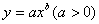
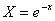
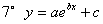
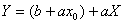
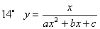

4、可化成线性回归的曲线回归

<b>&nbsp;&nbsp;
</b>如果观测数对在坐标纸上的分布形成曲线，可作适当的变量替换，对两个新的变量作线性回归。然后再还原到原来的变量。

可化直线型的常用曲线类型

<table class=MsoNormalTable border=1 cellspacing=0 cellpadding=0
 style='border-collapse:collapse;border:none'>
 <tr>
  <td width=378 colspan=2 valign=top style='width:100.0mm;border:solid windowtext 1.0pt;
  border-left:none;padding:0mm 5.4pt 0mm 5.4pt'>
  
&nbsp;&nbsp;&nbsp;&nbsp;&nbsp;&nbsp;&nbsp;&nbsp;&nbsp;&nbsp;&nbsp;
  曲&nbsp; 线 类&nbsp; 型

  </td>
  <td width=206 valign=top style='width:154.45pt;border-top:solid windowtext 1.0pt;
  border-left:none;border-bottom:solid windowtext 1.0pt;border-right:none;
  padding:0mm 5.4pt 0mm 5.4pt'>
  
&nbsp; 化直线型的变量替换

  </td>
 </tr>
 <tr>
  <td width=378 colspan=2 valign=top style='width:100.0mm;border-top:none;
  border-left:none;border-bottom:solid windowtext 1.0pt;border-right:solid windowtext 1.0pt;
  padding:0mm 5.4pt 0mm 5.4pt'>
  
1°&nbsp; 

  

  </td>
  <td width=206 valign=top style='width:154.45pt;border:none;border-bottom:
  solid windowtext 1.0pt;padding:0mm 5.4pt 0mm 5.4pt'>
  
设

  
则

  
(<i>x</i>, <i>y</i>)在双对数坐标纸上成一直线

  </td>
 </tr>
 <tr>
  <td width=378 colspan=2 valign=top style='width:100.0mm;border-top:none;
  border-left:none;border-bottom:solid windowtext 1.0pt;border-right:solid windowtext 1.0pt;
  padding:0mm 5.4pt 0mm 5.4pt'>
  

  

  </td>
  <td width=206 valign=top style='width:154.45pt;border:none;border-bottom:
  solid windowtext 1.0pt;padding:0mm 5.4pt 0mm 5.4pt'>
  
设<i>X = x , Y = </i>

  
则

  
(<i>x</i>,<i> y</i>)在单对数坐标纸上成一直线

  </td>
 </tr>
 <tr>
  <td width=378 colspan=2 valign=top style='width:100.0mm;border-top:none;
  border-left:none;border-bottom:solid windowtext 1.0pt;border-right:solid windowtext 1.0pt;
  padding:0mm 5.4pt 0mm 5.4pt'>
  

  

  </td>
  <td width=206 valign=top style='width:154.45pt;border:none;border-bottom:
  solid windowtext 1.0pt;padding:0mm 5.4pt 0mm 5.4pt'>
  
设

  
则

  
(<i>x</i>,<i> y</i>)在单对数坐标纸上成一直线

  </td>
 </tr>
 <tr>
  <td width=378 colspan=2 valign=top style='width:100.0mm;border-top:none;
  border-left:none;border-bottom:solid windowtext 1.0pt;border-right:solid windowtext 1.0pt;
  padding:0mm 5.4pt 0mm 5.4pt'>
  

  

  </td>
  <td width=206 valign=top style='width:154.45pt;border:none;border-bottom:
  solid windowtext 1.0pt;padding:0mm 5.4pt 0mm 5.4pt'>
  
设

  
&nbsp;&nbsp;
  

  
则

  </td>
 </tr>
 <tr>
  <td width=378 colspan=2 valign=top style='width:100.0mm;border-top:none;
  border-left:none;border-bottom:solid windowtext 1.0pt;border-right:solid windowtext 1.0pt;
  padding:0mm 5.4pt 0mm 5.4pt'>
  

  

  </td>
  <td width=206 valign=top style='width:154.45pt;border:none;border-bottom:
  solid windowtext 1.0pt;padding:0mm 5.4pt 0mm 5.4pt'>
  
设

  
&nbsp;&nbsp;
  

  
则

  </td>
 </tr>
 <tr>
  <td width=146 valign=top style='width:109.8pt;border:none;border-bottom:solid windowtext 1.0pt;
  padding:0mm 5.4pt 0mm 5.4pt'>
  
&nbsp; 

  

  </td>
  <td width=232 valign=top style='width:173.7pt;border-top:none;border-left:
  none;border-bottom:solid windowtext 1.0pt;border-right:solid windowtext 1.0pt;
  padding:0mm 5.4pt 0mm 5.4pt'>
  
曲线与类型相同，只是在轴方向上作了移动，首先在给定的曲线上取三点：,,

  
),则

  </td>
  <td width=206 valign=top style='width:154.45pt;border:none;border-bottom:
  solid windowtext 1.0pt;padding:0mm 5.4pt 0mm 5.4pt'>
  
<i>c</i>确定后，设

  
&nbsp;&nbsp;&nbsp;&nbsp;
  

  
则

  </td>
 </tr>
 <tr>
  <td width=146 valign=top style='width:109.8pt;border:none;border-bottom:solid windowtext 1.0pt;
  padding:0mm 5.4pt 0mm 5.4pt'>
  
&nbsp;&nbsp;&nbsp;&nbsp;&nbsp;&nbsp;&nbsp;&nbsp;&nbsp;&nbsp;
  曲 线&nbsp;&nbsp;&nbsp;&nbsp;&nbsp;&nbsp;&nbsp;&nbsp;&nbsp;&nbsp;&nbsp;&nbsp;&nbsp;
  

  </td>
  <td width=232 valign=top style='width:173.7pt;border-top:none;border-left:
  none;border-bottom:solid windowtext 1.0pt;border-right:solid windowtext 1.0pt;
  padding:0mm 5.4pt 0mm 5.4pt'>
  
&nbsp;类 型

  </td>
  <td width=206 valign=top style='width:154.45pt;border:none;border-bottom:
  solid windowtext 1.0pt;padding:0mm 5.4pt 0mm 5.4pt'>
  
&nbsp;&nbsp;
  化直线型的变量替换&nbsp; 

  </td>
 </tr>
 <tr>
  <td width=146 valign=top style='width:109.8pt;border:none;border-bottom:solid windowtext 1.0pt;
  padding:0mm 5.4pt 0mm 5.4pt'>
  
&nbsp;

  

  </td>
  <td width=232 valign=top style='width:173.7pt;border-top:none;border-left:
  none;border-bottom:solid windowtext 1.0pt;border-right:solid windowtext 1.0pt;
  padding:0mm 5.4pt 0mm 5.4pt'>
  
曲线与类型相同，只是在轴方向上作了移动，首先在给定的曲线上取三点： 

  
&nbsp;则

  </td>
  <td width=206 valign=top style='width:154.45pt;border:none;border-bottom:
  solid windowtext 1.0pt;padding:0mm 5.4pt 0mm 5.4pt'>
  
确定后，设

  
&nbsp;&nbsp;&nbsp;&nbsp;&nbsp;&nbsp;&nbsp;&nbsp;&nbsp;
  

  
则

  </td>
 </tr>
 <tr>
  <td width=378 colspan=2 valign=top style='width:100.0mm;border-top:none;
  border-left:none;border-bottom:solid windowtext 1.0pt;border-right:solid windowtext 1.0pt;
  padding:0mm 5.4pt 0mm 5.4pt'>
  

  

  </td>
  <td width=206 valign=top style='width:154.45pt;border:none;border-bottom:
  solid windowtext 1.0pt;padding:0mm 5.4pt 0mm 5.4pt'>
  
设

  
&nbsp;&nbsp;
  

  
则

  </td>
 </tr>
 <tr>
  <td width=378 colspan=2 valign=top style='width:100.0mm;border-top:none;
  border-left:none;border-bottom:solid windowtext 1.0pt;border-right:solid windowtext 1.0pt;
  padding:0mm 5.4pt 0mm 5.4pt'>
  

  

  </td>
  <td width=206 valign=top style='width:154.45pt;border:none;border-bottom:
  solid windowtext 1.0pt;padding:0mm 5.4pt 0mm 5.4pt'>
  
设

  
&nbsp;&nbsp;
  

  
则

  </td>
 </tr>
 <tr>
  <td width=378 colspan=2 valign=top style='width:100.0mm;border-top:none;
  border-left:none;border-bottom:solid windowtext 1.0pt;border-right:solid windowtext 1.0pt;
  padding:0mm 5.4pt 0mm 5.4pt'>
  

  

  </td>
  <td width=206 valign=top style='width:154.45pt;border:none;border-bottom:
  solid windowtext 1.0pt;padding:0mm 5.4pt 0mm 5.4pt'>
  
在曲线上取一点(<i>x</i>0 ,<i> y</i>0)

  
设<i>X = x</i>

  
<i>&nbsp; </i>

  
则

  
用回归直线法，从已给数据可定出<i>A</i>和<i>B</i>

  </td>
 </tr>
 <tr>
  <td width=378 colspan=2 valign=top style='width:100.0mm;border-top:none;
  border-left:none;border-bottom:solid windowtext 1.0pt;border-right:solid windowtext 1.0pt;
  padding:0mm 5.4pt 0mm 5.4pt'>
  

  

  </td>
  <td width=206 valign=top style='width:154.45pt;border:none;border-bottom:
  solid windowtext 1.0pt;padding:0mm 5.4pt 0mm 5.4pt'>
  
在曲线上取一点(<i>x</i>0 ,<i> y</i>0)

  
设<i>X = x</i>

  
<i>&nbsp; </i>

  
则

  </td>
 </tr>
 <tr>
  <td width=378 colspan=2 valign=top style='width:100.0mm;border-top:none;
  border-left:none;border-bottom:solid windowtext 1.0pt;border-right:solid windowtext 1.0pt;
  padding:0mm 5.4pt 0mm 5.4pt'>
  
&nbsp;&nbsp;&nbsp;&nbsp;&nbsp;&nbsp;&nbsp;&nbsp;
  曲&nbsp; 线&nbsp; 类&nbsp; 型

  </td>
  <td width=206 valign=top style='width:154.45pt;border:none;border-bottom:
  solid windowtext 1.0pt;padding:0mm 5.4pt 0mm 5.4pt'>
  
&nbsp;化直线型的变量替换 

  </td>
 </tr>
 <tr>
  <td width=378 colspan=2 valign=top style='width:100.0mm;border-top:none;
  border-left:none;border-bottom:solid windowtext 1.0pt;border-right:solid windowtext 1.0pt;
  padding:0mm 5.4pt 0mm 5.4pt'>
  

  

  </td>
  <td width=206 valign=top style='width:154.45pt;border:none;border-bottom:
  solid windowtext 1.0pt;padding:0mm 5.4pt 0mm 5.4pt'>
  
设<i>X = x</i>

  
&nbsp; 

  
则可化为类型11°

  </td>
 </tr>
 <tr>
  <td width=378 colspan=2 valign=top style='width:100.0mm;border-top:none;
  border-left:none;border-bottom:solid windowtext 1.0pt;border-right:solid windowtext 1.0pt;
  padding:0mm 5.4pt 0mm 5.4pt'>
  

  

  </td>
  <td width=206 valign=top style='width:154.45pt;border:none;border-bottom:
  solid windowtext 1.0pt;padding:0mm 5.4pt 0mm 5.4pt'>
  
设<i>X = x</i>

  
<i>&nbsp; Y = y2</i>

  
则可化为类型11°

  </td>
 </tr>
 <tr>
  <td width=378 colspan=2 valign=top style='width:100.0mm;border-top:none;
  border-left:none;border-bottom:solid windowtext 1.0pt;border-right:solid windowtext 1.0pt;
  padding:0mm 5.4pt 0mm 5.4pt'>
  

  

  </td>
  <td width=206 valign=top style='width:154.45pt;border:none;border-bottom:
  solid windowtext 1.0pt;padding:0mm 5.4pt 0mm 5.4pt'>
  
设<i>X = x</i>

  
&nbsp; 

  
则可化为类型11°

  </td>
 </tr>
 <tr>
  <td width=378 colspan=2 valign=top style='width:100.0mm;border:solid windowtext 1.0pt;
  border-top:none;padding:0mm 5.4pt 0mm 5.4pt'>
  

  

  </td>
  <td width=206 valign=top style='width:154.45pt;border-top:none;border-left:
  none;border-bottom:solid windowtext 1.0pt;border-right:solid windowtext 1.0pt;
  padding:0mm 5.4pt 0mm 5.4pt'>
  
设

  
&nbsp;&nbsp;
  

  
则可化为类型11°

  </td>
 </tr>
 <tr>
  <td width=378 colspan=2 valign=top style='width:100.0mm;border:solid windowtext 1.0pt;
  border-top:none;padding:0mm 5.4pt 0mm 5.4pt'>
  

  

  </td>
  <td width=206 valign=top style='width:154.45pt;border-top:none;border-left:
  none;border-bottom:solid windowtext 1.0pt;border-right:solid windowtext 1.0pt;
  padding:0mm 5.4pt 0mm 5.4pt'>
  
设<i>X = x</i>

  
<i>&nbsp; </i>

  
则

  

  
化为类型11°

  </td>
 </tr>
 <tr>
  <td width=378 colspan=2 valign=top style='width:100.0mm;border:solid windowtext 1.0pt;
  border-top:none;padding:0mm 5.4pt 0mm 5.4pt'>
  

  
&nbsp;

  </td>
  <td width=206 valign=top style='width:154.45pt;border-top:none;border-left:
  none;border-bottom:solid windowtext 1.0pt;border-right:solid windowtext 1.0pt;
  padding:0mm 5.4pt 0mm 5.4pt'>
  
若给定的<i>x</i>值构成以<i>h</i>为公差的等差级数，则设

  

  
（取值）

  

  
（取值）

  
而得直线型

  
&nbsp;

  </td>
 </tr>
 <tr>
  <td width=378 colspan=2 valign=top style='width:100.0mm;border:solid windowtext 1.0pt;
  border-top:none;padding:0mm 5.4pt 0mm 5.4pt'>
  

  

  </td>
  <td width=206 valign=top style='width:154.45pt;border-top:none;border-left:
  none;border-bottom:solid windowtext 1.0pt;border-right:solid windowtext 1.0pt;
  padding:0mm 5.4pt 0mm 5.4pt'>
  
若给定的<i>x</i>值构成以<i>h</i>为公差的等差级数，设<i>u</i>1<i>= x+h , u</i>2<i>= x+</i>2<i>h</i>，其对应的<i>y</i>值为<i>v</i>1 ,<i>v</i>2

  
又设

  
而得

  

  
由此用回归直线法定出 <i>b , d</i>后，再设

  
&nbsp;&nbsp;&nbsp;&nbsp;
  

  
则得 

  </td>
 </tr>
</table>

&nbsp;

