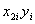
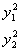
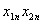
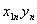

5、二元线回归

[回归方程]&nbsp; 对应自变量<i>x</i>1与<i>x</i>2的值的值为，于是得到<i>n</i>个点，其回归方程为

式中为回归系数，它由下面方程决定：

这里&nbsp;&nbsp;&nbsp;&nbsp; 

而其中是为了简化计算所作的数据变换（不需整数化），即

（1）式中的常数项

[复相关系数和偏项关系数]

称为复相关系数，式中

这里如(2)所示。复相关系数<i>R</i>满足，其意义与一元线性回归分析中的相关系数<i>r</i>类似，用于衡量<i>y</i>与<i>x</i>1 , <i>x</i>2的线性关系的密切程度。

&nbsp;&nbsp;&nbsp; 如果只要表示<i>y</i>与其中某一个变量(<i>x</i>1或<i>x</i>2)的相关关系，那末必须除去另一个变量的影响之后再计算它们的相关系数，这称为偏相关系数。<i>x</i>1,<i>y</i>在除去<i>x</i>2的影响之后的相关系数称为<i>x</i>1,<i>y</i>对<i>x</i>2的偏相关系数，记作，它可用普通的相关系数表示：

同样的，对的偏相关系数表为

[剩余标准差]

称为剩余标准差，其意义同一元线性回归分析中的剩余标准差<i>s</i>类似。

[标准回归系数与偏回归平方和]&nbsp; 在两因素<i>x</i>1 ,<i> x</i>2之间关系不密切的情况下，可用下述方法判断哪个因素是主要的。

1°&nbsp;&nbsp;&nbsp;&nbsp;&nbsp;&nbsp;&nbsp;&nbsp;&nbsp;&nbsp;&nbsp;&nbsp;&nbsp;&nbsp;&nbsp;&nbsp;&nbsp;&nbsp;&nbsp;&nbsp;&nbsp;&nbsp;&nbsp;&nbsp;&nbsp;&nbsp;&nbsp;

&nbsp;&nbsp;&nbsp;&nbsp;&nbsp;&nbsp;&nbsp;&nbsp;&nbsp;&nbsp;&nbsp;&nbsp;&nbsp;&nbsp;&nbsp;&nbsp;&nbsp;&nbsp;&nbsp;&nbsp;&nbsp;&nbsp;&nbsp;&nbsp;&nbsp;&nbsp;&nbsp;&nbsp;&nbsp;&nbsp;&nbsp;&nbsp;&nbsp;&nbsp;&nbsp;&nbsp;&nbsp;&nbsp;&nbsp;&nbsp;&nbsp;&nbsp;&nbsp;&nbsp;&nbsp;&nbsp;&nbsp;&nbsp; &nbsp;&nbsp;&nbsp;&nbsp;

称为标准回归系数，式中<i>b</i>1,<i>b</i>2为回归系数，<i>l</i>11,<i> l</i>22如（2）所示, <i>l</i>00如（4）所示<i>。</i>若，则表明在影响变量的两个因素中，<i>x</i>1是主要因素，<i>x</i>2是次要因素。

&nbsp;&nbsp; 2°&nbsp;&nbsp;&nbsp;&nbsp;&nbsp;&nbsp;&nbsp;&nbsp;&nbsp;&nbsp;&nbsp;&nbsp;&nbsp;&nbsp;&nbsp;&nbsp;&nbsp;&nbsp;&nbsp;&nbsp;&nbsp;&nbsp;&nbsp;

&nbsp;&nbsp;&nbsp;&nbsp;&nbsp;&nbsp;&nbsp;&nbsp;&nbsp;&nbsp;&nbsp;&nbsp;&nbsp;&nbsp;&nbsp;&nbsp;&nbsp;&nbsp;&nbsp;&nbsp;&nbsp;&nbsp;&nbsp;&nbsp;&nbsp;&nbsp;&nbsp;&nbsp;&nbsp;&nbsp;&nbsp;&nbsp;&nbsp;&nbsp;&nbsp;&nbsp;&nbsp;&nbsp;&nbsp;&nbsp;&nbsp;&nbsp;&nbsp;&nbsp;&nbsp;&nbsp;&nbsp;&nbsp; &nbsp;&nbsp;

称为偏回归平方和，式中<i>b</i>1 ,<i>
b</i>2为回归系数，<i>l</i>11,<i>l</i>12,<i>l</i>22如(2)所示。若<i>p</i>1<i>&gt;p</i>2，则表明是x1主要因素，<i>x</i>2是次要因素。

[<i>t</i>值] 

&nbsp;&nbsp; 

分别称为<i>x</i>1 ,<i>
x</i>2的<i>t</i>值，式中<i>s</i>为剩余标准差，<i>p</i>1 ,<i>
p</i>2为偏回归平方和。若<i>t</i>值越大，则表明该因素越重要。根据经验，当 <i>ti&gt;</i>1时，该因素<i>xi</i>对<i>y</i>有一定的影响；当<i>ti&gt;</i>2时，该因素<i>xi</i>看作是重要因素；当<i>ti&lt;</i>1时，则认为该因素<i>xi</i>对<i>y</i>影响不大，可以忽略，不参加回归计算。

[二元线性回归计算表]&nbsp; 表中<i>x k i</i>为简化后的数据。

<table class=MsoNormalTable border=1 cellspacing=0 cellpadding=0
 style='border-collapse:collapse;border:none'>
 <tr>
  <td width=31 valign=top style='width:23.4pt;border:solid windowtext 1.0pt;
  border-left:none;padding:0mm 5.4pt 0mm 5.4pt'>
  
序

  
号

  </td>
  <td width=60 valign=top style='width:45.0pt;border:solid windowtext 1.0pt;
  border-left:none;padding:0mm 5.4pt 0mm 5.4pt'>
  
<i>x</i>1<i>i</i>

  </td>
  <td width=60 valign=top style='width:45.0pt;border:solid windowtext 1.0pt;
  border-left:none;padding:0mm 5.4pt 0mm 5.4pt'>
  
<i></i>

  </td>
  <td width=48 valign=top style='width:36.0pt;border:solid windowtext 1.0pt;
  border-left:none;padding:0mm 5.4pt 0mm 5.4pt'>
  
<i>yi</i>

  </td>
  <td width=60 valign=top style='width:45.0pt;border:solid windowtext 1.0pt;
  border-left:none;padding:0mm 5.4pt 0mm 5.4pt'>
  
<i>x</i>

  </td>
  <td width=60 valign=top style='width:45.0pt;border:solid windowtext 1.0pt;
  border-left:none;padding:0mm 5.4pt 0mm 5.4pt'>
  
<i>x</i>

  </td>
  <td width=59 valign=top style='width:44.25pt;border:solid windowtext 1.0pt;
  border-left:none;padding:0mm 5.4pt 0mm 5.4pt'>
  

  </td>
  <td width=72 valign=top style='width:54.0pt;border:solid windowtext 1.0pt;
  border-left:none;padding:0mm 5.4pt 0mm 5.4pt'>
  

  </td>
  <td width=60 valign=top style='width:45.0pt;border:solid windowtext 1.0pt;
  border-left:none;padding:0mm 5.4pt 0mm 5.4pt'>
  

  </td>
  <td width=72 valign=top style='width:54.0pt;border-top:solid windowtext 1.0pt;
  border-left:none;border-bottom:solid windowtext 1.0pt;border-right:none;
  padding:0mm 5.4pt 0mm 5.4pt'>
  

  </td>
 </tr>
 <tr>
  <td width=31 valign=top style='width:23.4pt;border-top:none;border-left:none;
  border-bottom:solid windowtext 1.0pt;border-right:solid windowtext 1.0pt;
  padding:0mm 5.4pt 0mm 5.4pt'>
  
1

  
2

  

  
<i>n</i>

  </td>
  <td width=60 valign=top style='width:45.0pt;border-top:none;border-left:none;
  border-bottom:solid windowtext 1.0pt;border-right:solid windowtext 1.0pt;
  padding:0mm 5.4pt 0mm 5.4pt'>
  
<i>x</i>11

  
<i>x</i>12

  
<i></i>

  
<i>x</i>1<i>n</i>

  </td>
  <td width=60 valign=top style='width:45.0pt;border-top:none;border-left:none;
  border-bottom:solid windowtext 1.0pt;border-right:solid windowtext 1.0pt;
  padding:0mm 5.4pt 0mm 5.4pt'>
  
<i>x</i>21

  
<i>x</i>22

  
<i></i>

  
<i>x</i>2<i>n</i>

  </td>
  <td width=48 valign=top style='width:36.0pt;border-top:none;border-left:none;
  border-bottom:solid windowtext 1.0pt;border-right:solid windowtext 1.0pt;
  padding:0mm 5.4pt 0mm 5.4pt'>
  
<i>y</i>1

  
<i>y</i>2

  
<i></i>

  
<i>yn</i>

  </td>
  <td width=60 valign=top style='width:45.0pt;border-top:none;border-left:none;
  border-bottom:solid windowtext 1.0pt;border-right:solid windowtext 1.0pt;
  padding:0mm 5.4pt 0mm 5.4pt'>
  

  
&nbsp;

  

  </td>
  <td width=60 valign=top style='width:45.0pt;border-top:none;border-left:none;
  border-bottom:solid windowtext 1.0pt;border-right:solid windowtext 1.0pt;
  padding:0mm 5.4pt 0mm 5.4pt'>
  

  
&nbsp;

  

  </td>
  <td width=59 valign=top style='width:44.25pt;border-top:none;border-left:
  none;border-bottom:solid windowtext 1.0pt;border-right:solid windowtext 1.0pt;
  padding:0mm 5.4pt 0mm 5.4pt'>
  

  
&nbsp;<i></i>

  
<i></i>

  </td>
  <td width=72 valign=top style='width:54.0pt;border-top:none;border-left:none;
  border-bottom:solid windowtext 1.0pt;border-right:solid windowtext 1.0pt;
  padding:0mm 5.4pt 0mm 5.4pt'>
  

  
&nbsp; <i></i>

  
<i></i>

  </td>
  <td width=60 valign=top style='width:45.0pt;border-top:none;border-left:none;
  border-bottom:solid windowtext 1.0pt;border-right:solid windowtext 1.0pt;
  padding:0mm 5.4pt 0mm 5.4pt'>
  

  
&nbsp; <i></i>

  

  </td>
  <td width=72 valign=top style='width:54.0pt;border:none;border-bottom:solid windowtext 1.0pt;
  padding:0mm 5.4pt 0mm 5.4pt'>
  

  

  
&nbsp; <i></i>

  

  </td>
 </tr>
 <tr style='height:73.25pt'>
  <td width=31 valign=top style='width:23.4pt;border-top:none;border-left:none;
  border-bottom:solid windowtext 1.0pt;border-right:solid windowtext 1.0pt;
  padding:0mm 5.4pt 0mm 5.4pt;height:73.25pt'>
  

  </td>
  <td width=60 valign=top style='width:45.0pt;border-top:none;border-left:none;
  border-bottom:solid windowtext 1.0pt;border-right:solid windowtext 1.0pt;
  padding:0mm 5.4pt 0mm 5.4pt;height:73.25pt'>
  

  </td>
  <td width=60 valign=top style='width:45.0pt;border-top:none;border-left:none;
  border-bottom:solid windowtext 1.0pt;border-right:solid windowtext 1.0pt;
  padding:0mm 5.4pt 0mm 5.4pt;height:73.25pt'>
  

  </td>
  <td width=48 valign=top style='width:36.0pt;border-top:none;border-left:none;
  border-bottom:solid windowtext 1.0pt;border-right:solid windowtext 1.0pt;
  padding:0mm 5.4pt 0mm 5.4pt;height:73.25pt'>
  

  </td>
  <td width=60 valign=top style='width:45.0pt;border-top:none;border-left:none;
  border-bottom:solid windowtext 1.0pt;border-right:solid windowtext 1.0pt;
  padding:0mm 5.4pt 0mm 5.4pt;height:73.25pt'>
  

  </td>
  <td width=60 valign=top style='width:45.0pt;border-top:none;border-left:none;
  border-bottom:solid windowtext 1.0pt;border-right:solid windowtext 1.0pt;
  padding:0mm 5.4pt 0mm 5.4pt;height:73.25pt'>
  

  </td>
  <td width=59 valign=top style='width:44.25pt;border-top:none;border-left:
  none;border-bottom:solid windowtext 1.0pt;border-right:solid windowtext 1.0pt;
  padding:0mm 5.4pt 0mm 5.4pt;height:73.25pt'>
  

  </td>
  <td width=72 valign=top style='width:54.0pt;border-top:none;border-left:none;
  border-bottom:solid windowtext 1.0pt;border-right:solid windowtext 1.0pt;
  padding:0mm 5.4pt 0mm 5.4pt;height:73.25pt'>
  

  </td>
  <td width=60 valign=top style='width:45.0pt;border-top:none;border-left:none;
  border-bottom:solid windowtext 1.0pt;border-right:solid windowtext 1.0pt;
  padding:0mm 5.4pt 0mm 5.4pt;height:73.25pt'>
  

  </td>
  <td width=72 valign=top style='width:54.0pt;border:none;border-bottom:solid windowtext 1.0pt;
  padding:0mm 5.4pt 0mm 5.4pt;height:73.25pt'>
  

  </td>
 </tr>
 <tr style='height:73.25pt'>
  <td width=151 colspan=3 valign=top style='width:40.0mm;border:none;
  border-right:solid windowtext 1.0pt;padding:0mm 5.4pt 0mm 5.4pt;height:73.25pt'>
  
&nbsp; 

  </td>
  <td width=48 valign=top style='width:36.0pt;border-top:none;border-left:none;
  border-bottom:solid windowtext 1.0pt;border-right:solid windowtext 1.0pt;
  padding:0mm 5.4pt 0mm 5.4pt;height:73.25pt'>
  
结

  
果

  </td>
  <td width=60 valign=top style='width:45.0pt;border-top:none;border-left:none;
  border-bottom:solid windowtext 1.0pt;border-right:solid windowtext 1.0pt;
  padding:0mm 5.4pt 0mm 5.4pt;height:73.25pt'>
  

  </td>
  <td width=60 valign=top style='width:45.0pt;border-top:none;border-left:none;
  border-bottom:solid windowtext 1.0pt;border-right:solid windowtext 1.0pt;
  padding:0mm 5.4pt 0mm 5.4pt;height:73.25pt'>
  

  </td>
  <td width=59 valign=top style='width:44.25pt;border-top:none;border-left:
  none;border-bottom:solid windowtext 1.0pt;border-right:solid windowtext 1.0pt;
  padding:0mm 5.4pt 0mm 5.4pt;height:73.25pt'>
  

  </td>
  <td width=72 valign=top style='width:54.0pt;border-top:none;border-left:none;
  border-bottom:solid windowtext 1.0pt;border-right:solid windowtext 1.0pt;
  padding:0mm 5.4pt 0mm 5.4pt;height:73.25pt'>
  

  </td>
  <td width=60 valign=top style='width:45.0pt;border-top:none;border-left:none;
  border-bottom:solid windowtext 1.0pt;border-right:solid windowtext 1.0pt;
  padding:0mm 5.4pt 0mm 5.4pt;height:73.25pt'>
  

  </td>
  <td width=72 valign=top style='width:54.0pt;border:none;border-bottom:solid windowtext 1.0pt;
  padding:0mm 5.4pt 0mm 5.4pt;height:73.25pt'>
  

  </td>
 </tr>
</table>

由，根据（2）（3）分别计算出，得到回归方程

&nbsp;&nbsp;&nbsp;&nbsp;&nbsp;&nbsp;&nbsp;&nbsp;&nbsp;&nbsp;&nbsp;&nbsp;&nbsp;&nbsp;&nbsp;&nbsp;&nbsp;&nbsp;&nbsp;&nbsp;&nbsp;&nbsp;&nbsp;

并且继续计算复相关系数<i>R</i>，标准回归系数<i>B</i>1和<i>B</i>2 ,偏回归平方和<i>p</i>1 ,,<i> p</i>2，以及<i>t</i>值<i>t</i>1和<i>t</i>2，根据这些数据进行二元回归的分析。

&nbsp;&nbsp;&nbsp;
关于二元非线性回归问题，可做适当的变量替换，使新变量之间构成线性关系，再作回归分析。

