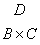
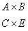
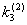
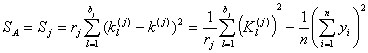
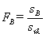
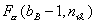

五、正交试验设计

[正交表与正交试验]&nbsp; 正交表是根据组合理论，按照一定规律构造的表格，它在试验设计中有广泛的应用。以正交表为工具安排试验方案和进行结果分析的试验称为正交试验。它适用于多因素、多指标（试验需要考察的结果）、多因素间存在交互作用（因素之间联合起作用）、具有随机误差的试验。通过正交试验，可以分析各因素及其交互作用对试验指标的影响，按其重要程度找出主次关系，并确定对试验指标的最优工艺条件。在正交试验中要求每个所考虑的因素都是可控的。在整个试验中每个因素所取值的个数称为该因素的水平。

正交表的符号为，其中表示正交表；下标是正交表的行数，表示试验次数；是正交表的列数，表示试验至多可以安排的因素个数；是表中不同数字的个数，表示每个因素的水平数。例如,8表示正交表中有8行，即安排试验的次数为8次；7表示正交表中有7列，试验至多可安排7个因素（包括交互作用的因素）；2表示每个因素只有两个水平。这种正交表称为2水平型的正交表。

又如，表示正交表中共有12行，4列，其中有一列是3水平的，有3列是2水平的。它称为混合型的正交表，可用来安排因素水平不同的试验。 

[正交表的交互列]&nbsp; 任意两列分别安排了两个因素之后，这两个因素的交互作用可用表的其他列表示出来，称为交互列。交互列在2水平型正交表中只有一列，在3水平型正交表中有两列，例如，任意两列的交互列是另外两列。通常低水平（水平数为2或3）的正交表有另外专表写出交互列，例如的交互列表，指出第3列与第5列的交互列即是第6列等等。有些正交表，例如，任意两列的交互列都不在表内，对这样的正交表就不能考虑因素间的交互作用了。

&nbsp;&nbsp;&nbsp;
手册后面备有常用正交表。

&nbsp;的交互列表

<table class=MsoNormalTable border=1 cellspacing=0 cellpadding=0
 style='border-collapse:collapse;border:none'>
 <tr>
  <td width=276 valign=top style='width:207.0pt;border:solid windowtext 1.0pt;
  border-left:none;padding:0mm 5.4pt 0mm 5.4pt'>
  
&nbsp;&nbsp; 1&nbsp;&nbsp; 2&nbsp;&nbsp;
  3&nbsp;&nbsp; 4&nbsp;&nbsp; 5&nbsp;&nbsp; 6&nbsp;&nbsp; 7

  </td>
  <td width=130 valign=top style='width:97.5pt;border-top:solid windowtext 1.0pt;
  border-left:none;border-bottom:solid windowtext 1.0pt;border-right:none;
  padding:0mm 5.4pt 0mm 5.4pt'>
  
列号

  </td>
 </tr>
 <tr>
  <td width=276 valign=top style='width:207.0pt;border-top:none;border-left:
  none;border-bottom:solid windowtext 1.0pt;border-right:solid windowtext 1.0pt;
  padding:0mm 5.4pt 0mm 5.4pt'>
  
&nbsp;（1）
  3&nbsp;&nbsp; 2&nbsp;&nbsp; 5&nbsp;&nbsp; 4&nbsp;&nbsp; 7&nbsp;&nbsp; 6

  
&nbsp;&nbsp;&nbsp;&nbsp; （2）
  1&nbsp;&nbsp; 6&nbsp;&nbsp; 7&nbsp;&nbsp; 4&nbsp;&nbsp; 5

  
&nbsp;&nbsp;&nbsp;&nbsp;&nbsp;&nbsp;&nbsp;&nbsp;
  （3） 7&nbsp;&nbsp; 6&nbsp;&nbsp; 5&nbsp;&nbsp; 4

  
&nbsp;&nbsp;&nbsp;&nbsp;&nbsp; &nbsp;&nbsp;&nbsp;&nbsp;&nbsp;&nbsp;&nbsp;（4）
  1&nbsp;&nbsp; 2&nbsp;&nbsp; 3

  
&nbsp;&nbsp;&nbsp;&nbsp;&nbsp;&nbsp;&nbsp;&nbsp;&nbsp;&nbsp;&nbsp;&nbsp;&nbsp;&nbsp;&nbsp;&nbsp;
  （5） 3&nbsp;&nbsp; 2

  
&nbsp;&nbsp;&nbsp;&nbsp;&nbsp;&nbsp;&nbsp;&nbsp;&nbsp;&nbsp;&nbsp;&nbsp;&nbsp;&nbsp;&nbsp;&nbsp;&nbsp;&nbsp;&nbsp;&nbsp;
  （6） 1

  
&nbsp;&nbsp;&nbsp;&nbsp;&nbsp;&nbsp;&nbsp;&nbsp;&nbsp;&nbsp;&nbsp;&nbsp;&nbsp;&nbsp;&nbsp;&nbsp;&nbsp;&nbsp;&nbsp;&nbsp;&nbsp;&nbsp;&nbsp;&nbsp;
  （7）

  </td>
  <td width=130 valign=top style='width:97.5pt;border:none;border-bottom:solid windowtext 1.0pt;
  padding:0mm 5.4pt 0mm 5.4pt'>
  
1

  
2

  
3

  
4

  
5

  
6

  
7

  </td>
 </tr>
</table>

[正交表的正交性]&nbsp; 正交表具有正交性：

&nbsp;&nbsp;&nbsp;
1° 在任意一列中，每个水平的重复次数都相等，例如中每列的每个水平都重复4次。

&nbsp;&nbsp;&nbsp;
2° 任意两列中，同行数字（水平）构成的数对，包含着所有可能（该水平下）的数对,而每个数对重复次数相等。例如在中任意两列构成的数对都包含着3水平下所有可能的数对：（1，1），（1，2），（1，3），（2，1），（2，2），（2，3），（3，1），（3，2），（3，3），而且每个数对重复次数都等于1。

&nbsp;&nbsp;&nbsp; 由于正交性，使得所安排的正交试验，均衡分散，整齐可比。

[试验方案的制定步骤与安排方法]

&nbsp;&nbsp; 1° 步骤

&nbsp;&nbsp;&nbsp; （1） 确定试验中变化因素的个数及每个因素变化的水平。

&nbsp;&nbsp;&nbsp; （2） 根据专业知识或经验，初步分析各因素之间的交互作用，确定哪些是必须考虑的，哪些是暂时可以忽略的。

&nbsp;&nbsp;&nbsp; （3） 根据试验的人力、设备、时间及费用，确定可能进行的大概试验次数。

&nbsp;&nbsp;&nbsp; （4） 选用合适的正交表，安排试验。

&nbsp;&nbsp; 2°&nbsp; 安排方法

&nbsp;&nbsp;&nbsp; （1） 在不考虑交互作用时，把因素逐个安排在正交表的任意列上，那末每次试验（对应于正交表的行）的试验条件（每个因素应取的水平）由安排因素的各列的水平确定。

&nbsp;&nbsp;&nbsp;
例如，在试验用不发芽的大麦造啤酒的过程中，选了四个因素，每个因素三个水平，指标是粉粒状（%）。

因素水平表

<table class=MsoNormalTable border=1 cellspacing=0 cellpadding=0
 style='border-collapse:collapse;border:none'>
 <tr style='height:32.6pt'>
  <td width=84 valign=top style='width:63.0pt;border:solid windowtext 1.0pt;
  border-left:none;padding:0mm 5.4pt 0mm 5.4pt;height:32.6pt'>
  
&nbsp;&nbsp;&nbsp;
  因素

  
水平

  </td>
  <td width=420 valign=top style='width:315.0pt;border-top:solid windowtext 1.0pt;
  border-left:none;border-bottom:solid windowtext 1.0pt;border-right:none;
  padding:0mm 5.4pt 0mm 5.4pt;height:32.6pt'>
  
底水（<i>A</i>） 浸氨时间 (<i>B</i>)&nbsp; 920浓度 (<i>C</i>)&nbsp; 氨水浓度(<i>D</i>)

  </td>
 </tr>
 <tr>
  <td width=84 valign=top style='width:63.0pt;border-top:none;border-left:none;
  border-bottom:solid windowtext 1.0pt;border-right:solid windowtext 1.0pt;
  padding:0mm 5.4pt 0mm 5.4pt'>
  
&nbsp;&nbsp;
  1

  
&nbsp;&nbsp; 2

  
&nbsp;&nbsp; 3

  </td>
  <td width=420 valign=top style='width:315.0pt;border:none;border-bottom:solid windowtext 1.0pt;
  padding:0mm 5.4pt 0mm 5.4pt'>
  
<i>&nbsp;A</i>1(140)&nbsp;&nbsp;&nbsp;&nbsp; <i>B</i>1(180)&nbsp;&nbsp;&nbsp;&nbsp;&nbsp;&nbsp;&nbsp;
  <i>C</i>1(2.5)&nbsp;&nbsp;&nbsp;&nbsp;&nbsp;&nbsp; <i>D</i>1(0.25)

  
<i>&nbsp;A</i>2(136)&nbsp;&nbsp;&nbsp;&nbsp; <i>B</i>2(215)&nbsp;&nbsp;&nbsp;&nbsp;&nbsp;&nbsp;&nbsp;
  <i>C</i>2(3.0)&nbsp;&nbsp;&nbsp;&nbsp;&nbsp;&nbsp; <i>D</i>2(0.26)

  
<i>&nbsp;A</i>3(138)&nbsp;&nbsp;&nbsp;&nbsp; <i>B</i>3(250)&nbsp;&nbsp;&nbsp;&nbsp;&nbsp;&nbsp;&nbsp;
  <i>C</i>3(3.5)&nbsp;&nbsp;&nbsp;&nbsp;&nbsp;&nbsp; <i>D</i>3(0.27)

  </td>
 </tr>
</table>

如果不考虑交互作用，可选用正交表，得试验方案如下：

用安排一个四因素的试验方案

<table class=MsoNormalTable border=1 cellspacing=0 cellpadding=0
 style='border-collapse:collapse;border:none'>
 <tr style='height:47.9pt'>
  <td width=120 valign=top style='width:90.0pt;border:solid windowtext 1.0pt;
  border-left:none;padding:0mm 5.4pt 0mm 5.4pt;height:47.9pt'>
  
&nbsp;&nbsp;&nbsp;&nbsp; 列号（因素）

  
试验号&nbsp;&nbsp;&nbsp;&nbsp;&nbsp;
  

  </td>
  <td width=264 valign=top style='width:198.0pt;border-top:solid windowtext 1.0pt;
  border-left:none;border-bottom:solid windowtext 1.0pt;border-right:none;
  padding:0mm 5.4pt 0mm 5.4pt;height:47.9pt'>
  
&nbsp;&nbsp;
  1(<i>A</i>)&nbsp;&nbsp; 2(<i>B</i>)&nbsp;&nbsp; 3(<i>C</i>)&nbsp;&nbsp;
  4(<i>D</i>)

  </td>
 </tr>
 <tr>
  <td width=120 valign=top style='width:90.0pt;border-top:none;border-left:
  none;border-bottom:solid windowtext 1.0pt;border-right:solid windowtext 1.0pt;
  padding:0mm 5.4pt 0mm 5.4pt'>
  
&nbsp;&nbsp;&nbsp;&nbsp; 1

  
&nbsp;&nbsp;&nbsp;&nbsp; 2

  
&nbsp;&nbsp;&nbsp;&nbsp; 3

  
&nbsp;&nbsp;&nbsp;&nbsp; 4

  
&nbsp;&nbsp;&nbsp;&nbsp; 5

  
&nbsp;&nbsp;&nbsp;&nbsp; 6

  
&nbsp;&nbsp;&nbsp;&nbsp; 7

  
&nbsp;&nbsp;&nbsp;&nbsp; 8

  
&nbsp;&nbsp;&nbsp;&nbsp; 9

  </td>
  <td width=264 valign=top style='width:198.0pt;border:none;border-bottom:solid windowtext 1.0pt;
  padding:0mm 5.4pt 0mm 5.4pt'>
  
&nbsp; 1(<i>A</i>1)&nbsp; 1(<i>B</i>1)&nbsp;&nbsp;
  1(<i>C</i>1)&nbsp; 1(<i>D</i>1)

  
&nbsp; 1(<i>A</i>1)&nbsp; 2(<i>B</i>2)&nbsp;&nbsp;
  2(<i>C</i>2)&nbsp; 2(<i>D</i>2)

  
&nbsp; 1(<i>A</i>1)&nbsp; 3(<i>B</i>3)&nbsp;&nbsp;
  3(<i>C</i>3)&nbsp; 3(<i>D</i>3)

  
&nbsp; 2(<i>A</i>2)&nbsp; 1(<i>B</i>1)&nbsp;&nbsp;
  2(<i>C</i>2)&nbsp; 3(<i>D</i>3)

  
&nbsp; 2(<i>A</i>2)&nbsp; 2(<i>B</i>2)&nbsp;&nbsp;
  3(<i>C</i>3)&nbsp; 1(<i>D</i>1)

  
&nbsp; 2(<i>A</i>2)&nbsp; 3(<i>B3</i>)&nbsp;&nbsp;
  1(<i>C</i>1)&nbsp; 2(<i>D</i>2)

  
&nbsp; 3(<i>A</i>3)&nbsp; 1(<i>B</i>1)&nbsp;&nbsp;
  3(<i>C</i>3)&nbsp; 2(<i>D</i>2)

  
&nbsp; 3(<i>A</i>3)&nbsp; 2(<i>B</i>2)&nbsp;&nbsp;
  1(<i>C</i>1)&nbsp; 3(<i>D</i>3)

  
&nbsp; 3(<i>A</i>3)&nbsp; 3(<i>B</i>3)&nbsp;&nbsp;
  2(<i>C</i>2)&nbsp; 1(<i>D</i>1)

  </td>
 </tr>
</table>

此表指出第1号试验的条件是，第2号试验条件是第9号试验的条件是。

&nbsp;&nbsp; （2） 需要考虑交互作用时，因素不能任意安排，应利用相应的表头设计安排试验。此时要注意不能使不同的因素（包括所考虑的交互作用）同处一列(因为分析时无法将同处一列的不同作用分析出来)，如果做不到这一点，就需要采用更大的正交表。例如安排一个四因素<i>A , B , C , D</i>的试验，必须考虑交互作用，其他交互作用可忽略不计。根据的表头设计：

<table class=MsoNormalTable border=1 cellspacing=0 cellpadding=0
 style='border-collapse:collapse;border:none'>
 <tr>
  <td width=125 valign=top style='width:93.75pt;border:solid windowtext 1.0pt;
  border-left:none;padding:0mm 5.4pt 0mm 5.4pt'>
  
&nbsp;&nbsp;&nbsp;&nbsp; 列号

  
因素个数

  </td>
  <td width=448 valign=top style='width:336.0pt;border-top:solid windowtext 1.0pt;
  border-left:none;border-bottom:solid windowtext 1.0pt;border-right:none;
  padding:0mm 5.4pt 0mm 5.4pt'>
  
&nbsp;&nbsp;&nbsp;
  1&nbsp;&nbsp;&nbsp;&nbsp;&nbsp; 2&nbsp;&nbsp;&nbsp;&nbsp;&nbsp;
  3&nbsp;&nbsp;&nbsp;&nbsp;&nbsp; 4&nbsp;&nbsp;&nbsp;&nbsp;&nbsp;
  5&nbsp;&nbsp;&nbsp;&nbsp;&nbsp; 6&nbsp;&nbsp;&nbsp;&nbsp;&nbsp; 7

  </td>
 </tr>
 <tr style='height:15.75pt'>
  <td width=125 valign=top style='width:93.75pt;border:none;border-right:solid windowtext 1.0pt;
  padding:0mm 5.4pt 0mm 5.4pt;height:15.75pt'>
  
3

  </td>
  <td width=448 valign=top style='width:336.0pt;border:none;padding:0mm 5.4pt 0mm 5.4pt;
  height:15.75pt'>
  
&nbsp;&nbsp; <i>A&nbsp;&nbsp;&nbsp;&nbsp;&nbsp;
  B&nbsp;&nbsp;&nbsp; </i><i>&nbsp;&nbsp;&nbsp;&nbsp;&nbsp;C&nbsp;&nbsp;&nbsp;
  </i><i>&nbsp;&nbsp;&nbsp;</i><i></i>

  </td>
 </tr>
 <tr style='height:31.5pt'>
  <td width=125 valign=top style='width:93.75pt;border:none;border-right:solid windowtext 1.0pt;
  padding:0mm 5.4pt 0mm 5.4pt;height:31.5pt'>
  
4

  </td>
  <td width=448 valign=top style='width:336.0pt;border:none;padding:0mm 5.4pt 0mm 5.4pt;
  height:31.5pt'>
  
<i>&nbsp;&nbsp; A&nbsp;&nbsp;&nbsp;&nbsp;&nbsp;
  B&nbsp;&nbsp;&nbsp; </i><i>&nbsp;&nbsp;&nbsp;&nbsp;&nbsp;C&nbsp;&nbsp;
  </i><i>&nbsp;&nbsp;&nbsp;</i><i>&nbsp;&nbsp;&nbsp;&nbsp;</i><i></i>

  </td>
 </tr>
 <tr style='height:41.25pt'>
  <td width=125 valign=top style='width:93.75pt;border:none;border-right:solid windowtext 1.0pt;
  padding:0mm 5.4pt 0mm 5.4pt;height:41.25pt'>
  
4

  </td>
  <td width=448 valign=top style='width:336.0pt;border:none;padding:0mm 5.4pt 0mm 5.4pt;
  height:41.25pt'>
  
<i>&nbsp;&nbsp; A&nbsp;&nbsp;&nbsp; </i><i>&nbsp;&nbsp;&nbsp;</i><i>&nbsp;&nbsp;</i><i>&nbsp;&nbsp;&nbsp;</i><i>&nbsp;&nbsp;&nbsp;&nbsp;&nbsp;</i><i></i>

  </td>
 </tr>
 <tr style='height:54.75pt'>
  <td width=125 valign=top style='width:93.75pt;border-top:none;border-left:
  none;border-bottom:solid windowtext 1.0pt;border-right:solid windowtext 1.0pt;
  padding:0mm 5.4pt 0mm 5.4pt;height:54.75pt'>
  
5

  </td>
  <td width=448 valign=top style='width:336.0pt;border:none;border-bottom:solid windowtext 1.0pt;
  padding:0mm 5.4pt 0mm 5.4pt;height:54.75pt'>
  
<i>&nbsp;</i><i>&nbsp; </i><i>&nbsp;&nbsp;</i><i>&nbsp;&nbsp;</i><i>&nbsp;&nbsp;&nbsp;</i><i>&nbsp;&nbsp;&nbsp;</i><i>&nbsp;&nbsp;&nbsp;</i><i></i>

  </td>
 </tr>
</table>

因为是四因素试验，所以可将<i>A</i> ,<i> B</i> , <i>C</i> ,<i> D</i>分别安排在第1,2,4,7列上，第3,5列分别表示<i></i>及<i></i>，第6列空着。如果<i>A </i>,<i> B </i>,<i> C</i> ,<i> D</i>四个因素所有的交互作用都要考虑，则不能用，应选用更大的正交表，如。&nbsp; 

[正交表的直观分析]&nbsp; 1° 计算第<i>i</i>水平的水平和<i>Ki</i>与水平均值<i>ki</i>例如用安排的四因素3水平的试验方案，可列出直观分析表如下：

<table class=MsoNormalTable border=1 cellspacing=0 cellpadding=0
 style='border-collapse:collapse;border:none'>
 <tr style='height:38.45pt'>
  <td width=144 valign=top style='width:108.0pt;border:solid windowtext 1.0pt;
  border-left:none;padding:0mm 5.4pt 0mm 5.4pt;height:38.45pt'>
  
&nbsp;&nbsp;&nbsp;&nbsp;
  列号（因素）

  
试验号

  </td>
  <td width=252 valign=top style='width:189.0pt;border:solid windowtext 1.0pt;
  border-left:none;padding:0mm 5.4pt 0mm 5.4pt;height:38.45pt'>
  
&nbsp;&nbsp;
  1(<i>A</i>)&nbsp; 2(<i>B</i>)&nbsp;&nbsp;&nbsp; 3(<i>C</i>)&nbsp;&nbsp;
  4(<i>D</i>)

  </td>
  <td width=108 valign=top style='width:81.0pt;border-top:solid windowtext 1.0pt;
  border-left:none;border-bottom:solid windowtext 1.0pt;border-right:none;
  padding:0mm 5.4pt 0mm 5.4pt;height:38.45pt'>
  
&nbsp;试验指标<i>y</i>

  </td>
 </tr>
 <tr>
  <td width=144 valign=top style='width:108.0pt;border-top:none;border-left:
  none;border-bottom:solid windowtext 1.0pt;border-right:solid windowtext 1.0pt;
  padding:0mm 5.4pt 0mm 5.4pt'>
  
&nbsp;&nbsp;&nbsp;&nbsp;&nbsp;
  1

  
&nbsp;&nbsp;&nbsp;&nbsp;&nbsp;
  2

  
&nbsp;&nbsp;&nbsp;&nbsp;&nbsp;
  3

  
&nbsp;&nbsp;&nbsp;&nbsp;&nbsp;
  4

  
&nbsp;&nbsp;&nbsp;&nbsp;&nbsp;
  5

  
&nbsp;&nbsp;&nbsp;&nbsp;&nbsp;
  6

  
&nbsp;&nbsp;&nbsp;&nbsp;&nbsp;
  7

  
&nbsp;&nbsp;&nbsp;&nbsp;&nbsp;
  8

  
&nbsp;&nbsp;&nbsp;&nbsp;&nbsp;
  9

  </td>
  <td width=252 valign=top style='width:189.0pt;border-top:none;border-left:
  none;border-bottom:solid windowtext 1.0pt;border-right:solid windowtext 1.0pt;
  padding:0mm 5.4pt 0mm 5.4pt'>
  
&nbsp;&nbsp;&nbsp;
  1&nbsp;&nbsp;&nbsp;
  1&nbsp;&nbsp;&nbsp;&nbsp; 1&nbsp;&nbsp;&nbsp;&nbsp; 1

  
&nbsp;&nbsp;&nbsp;
  1&nbsp;&nbsp;&nbsp; 2&nbsp;&nbsp;&nbsp;&nbsp; 2&nbsp;&nbsp;&nbsp;&nbsp; 2

  
&nbsp;&nbsp;&nbsp;
  1&nbsp;&nbsp;&nbsp; 3&nbsp;&nbsp;&nbsp;&nbsp; 3&nbsp;&nbsp;&nbsp;&nbsp; 3

  
&nbsp;&nbsp;&nbsp;
  2&nbsp;&nbsp;&nbsp; 1&nbsp;&nbsp;&nbsp;&nbsp; 2&nbsp;&nbsp;&nbsp;&nbsp; 3

  
&nbsp;&nbsp;&nbsp;
  2&nbsp;&nbsp;&nbsp; 2&nbsp;&nbsp;&nbsp;&nbsp; 3&nbsp;&nbsp;&nbsp;&nbsp; 1

  
&nbsp;&nbsp;&nbsp;
  2&nbsp;&nbsp;&nbsp; 3&nbsp;&nbsp;&nbsp;&nbsp; 1&nbsp;&nbsp;&nbsp;&nbsp; 2

  
&nbsp;&nbsp;&nbsp;
  3&nbsp;&nbsp;&nbsp; 1&nbsp;&nbsp;&nbsp;&nbsp; 3&nbsp;&nbsp;&nbsp;&nbsp; 2

  
&nbsp;&nbsp;&nbsp;
  3&nbsp;&nbsp;&nbsp; 2&nbsp;&nbsp;&nbsp;&nbsp; 1&nbsp;&nbsp;&nbsp;&nbsp; 3

  
&nbsp;&nbsp;&nbsp;
  3&nbsp;&nbsp;&nbsp; 3&nbsp;&nbsp;&nbsp;&nbsp; 2&nbsp;&nbsp;&nbsp;&nbsp; 1

  </td>
  <td width=108 valign=top style='width:81.0pt;border:none;border-bottom:solid windowtext 1.0pt;
  padding:0mm 5.4pt 0mm 5.4pt'>
  
&nbsp; <i>&nbsp;y</i>1

  
<i>&nbsp;&nbsp;
  y</i>2

  
<i>&nbsp;&nbsp;
  y</i>3

  
<i>&nbsp;&nbsp;
  y</i>4

  
<i>&nbsp;&nbsp;
  y</i>5

  
<i>&nbsp;&nbsp;
  y</i>6

  
<i>&nbsp;&nbsp;
  y</i>7

  
<i>&nbsp;&nbsp;
  y</i>8

  
<i>&nbsp;&nbsp;
  y</i>9

  </td>
 </tr>
 <tr style='mso-row-'>
  <td width=144 valign=top style='width:108.0pt;border-top:none;border-left:
  none;border-bottom:solid windowtext 1.0pt;border-right:solid windowtext 1.0pt;
  padding:0mm 5.4pt 0mm 5.4pt'>
  
&nbsp;&nbsp;&nbsp;&nbsp;&nbsp;&nbsp;
  <i>K</i>1

  
<i>&nbsp;&nbsp;&nbsp;&nbsp;
   
  &nbsp;&nbsp;&nbsp;&nbsp;&nbsp;&nbsp; K</i>2

  
<i>&nbsp;&nbsp;&nbsp;&nbsp;&nbsp;&nbsp; K</i>3

  </td>
  <td width=252 valign=top style='width:189.0pt;border-top:none;border-left:
  none;border-bottom:solid windowtext 1.0pt;border-right:solid windowtext 1.0pt;
  padding:0mm 5.4pt 0mm 5.4pt'>
  
&nbsp;&nbsp;&nbsp;
  

  </td>
  <td style='border:none;padding:0mm 0mm 0mm 0mm' width=108>
&nbsp;</td>
 </tr>
 <tr style='mso-row-'>
  <td width=144 valign=top style='width:108.0pt;border-top:none;border-left:
  none;border-bottom:solid windowtext 1.0pt;border-right:solid windowtext 1.0pt;
  padding:0mm 5.4pt 0mm 5.4pt'>
  
&nbsp;&nbsp;&nbsp;&nbsp;&nbsp;&nbsp;
  <i>k</i>1

  
<i>&nbsp;&nbsp;&nbsp;&nbsp;&nbsp;&nbsp; k</i>2

  
<i>&nbsp;&nbsp;&nbsp;&nbsp;&nbsp;&nbsp; k</i>3

  </td>
  <td width=252 valign=top style='width:189.0pt;border-top:none;border-left:
  none;border-bottom:solid windowtext 1.0pt;border-right:solid windowtext 1.0pt;
  padding:0mm 5.4pt 0mm 5.4pt'>
  
&nbsp;&nbsp;&nbsp;&nbsp;
  &nbsp;&nbsp;&nbsp;&nbsp;&nbsp;&nbsp;&nbsp;&nbsp;&nbsp;

  
&nbsp;&nbsp;&nbsp;&nbsp;
  &nbsp;&nbsp;&nbsp;&nbsp;&nbsp;&nbsp;&nbsp;&nbsp;&nbsp;

  
&nbsp;&nbsp;&nbsp;&nbsp;
  &nbsp;&nbsp;&nbsp;&nbsp;&nbsp;&nbsp;&nbsp;&nbsp;&nbsp;

  </td>
  <td style='border:none;padding:0mm 0mm 0mm 0mm' width=108>
&nbsp;</td>
 </tr>
 <tr style='mso-row-'>
  <td width=144 valign=top style='width:108.0pt;border-top:none;border-left:
  none;border-bottom:solid windowtext 1.0pt;border-right:solid windowtext 1.0pt;
  padding:0mm 5.4pt 0mm 5.4pt'>
  
&nbsp;&nbsp;&nbsp;
  极差<i>R</i>

  </td>
  <td width=252 valign=top style='width:189.0pt;border-top:none;border-left:
  none;border-bottom:solid windowtext 1.0pt;border-right:solid windowtext 1.0pt;
  padding:0mm 5.4pt 0mm 5.4pt'>
  
&nbsp;&nbsp;&nbsp;&nbsp;
  <i>R</i>(1)<i>&nbsp;&nbsp;&nbsp; R</i>(2)<i>&nbsp;&nbsp; R</i>(3)<i>&nbsp; &nbsp;&nbsp;R</i>(4)

  </td>
  <td style='border:none;padding:0mm 0mm 0mm 0mm' width=108>
&nbsp;</td>
 </tr>
</table>

其中

&nbsp;&nbsp;&nbsp;
表示第<i>j</i>列的<i>i</i>水平的试验指标和（简称水平和）

&nbsp;&nbsp;&nbsp;
表示第<i>j</i>列的<i>i</i>水平的试验指标均值（简称水平均值）

&nbsp;&nbsp;&nbsp;
表示第<i>j</i>列的的极差

例如

&nbsp; 

&nbsp; 2° 评定因素重要性顺序&nbsp; 依照各因素指标均值的极差的大小排出重要性顺序，极差大的表示该因素重要。

&nbsp; 3° 画出各因素与试验指标的关系图&nbsp; 求出后，对于每个<i>j</i>以水平值<i>i</i>横坐标，以<i>ki</i>为纵坐标描点并画出折线图，称为第<i>j</i>个因素与试验指标的关系图。若<i>ki</i>变化幅度大，则对应的因素的影响就愈大。若图上描出的点很分散，则说明该因素是主要的；若点比较集中，则说明该因素是次要的。

&nbsp;&nbsp;&nbsp;
当需要考虑因素的交互作用时，对应某交互作用的<i>ki</i>列的就表示由于该交互作用的影响而引起的。同样可以画出因素之间的交互作用与试验指标的关系图。

&nbsp;&nbsp;&nbsp;
对于既没有安排因素，也没有安排交互作用的“空列”，可以用来安排试验误差的估计。通过同样的计算得到<i>ki</i>，这可以看作是由于试验误差造成的，<i>ki</i>变化的大小反映了该试验误差的大小。也可以画出实验误差与试验指标的关系图。

&nbsp;&nbsp;4° 选定最优工艺条件（最优搭配方案）&nbsp; 在不考虑交互作用时，只需根据该试验指标的要求（即该指标是高者为优，或是低者为优），从每个因素的关系图中找出最优点（最高点或最低点）的水平，将各因素的最优水平组合起来就是对于该指标的最优工艺条件。

&nbsp; 当需要考虑因素间的交互作用时，经过分析已知某两个因素的交互作用对试验指标影响很大，这时根据试验结果，把对应于该二因素所有不同水平组合的试验指标（若对于同一种组合有多次试验，则应求出其平均值）进行比较，选出该二因素的最优水平组合。最后，结合其他因素或交互作用选出的最优条件综合考虑，以确定最优工艺条件。

&nbsp;&nbsp;&nbsp;
对于多指标的试验，每个指标都可按上述方法进行分析。最优工艺条件应根据各个指标的情况综合考虑才能确定。

[正交表的方差分析]&nbsp; 设在正交表中因素<i>A</i>被安排在第<i>j</i>列，该列的水平数为<i>bj</i>（或<i>bA</i>），每个水平的重复数为<i>rj</i>，试验次数为<i>n</i>（行数）（显然有<i>rjbj=n</i>），则因素<i>A</i>的平方和<i>SA</i>（或称为第<i>j</i>列平方和<i>Sj</i>）为

总平方和为

&nbsp;&nbsp;&nbsp;&nbsp;&nbsp;&nbsp;&nbsp;&nbsp;&nbsp;&nbsp;&nbsp;&nbsp;&nbsp;

&nbsp;&nbsp;&nbsp;
不可忽略的交互作用的平方和<i></i>也按其所在列的平方和计算（公式同因素<i>A</i>的平方和<i>SA</i>的计算公式）。

&nbsp;&nbsp;&nbsp;
误差平方和等于与所有安排有因素或交互作用的列的平方和之差，即 

&nbsp;&nbsp;&nbsp;&nbsp;&nbsp;&nbsp;&nbsp;&nbsp;&nbsp;&nbsp;&nbsp;&nbsp;&nbsp;&nbsp;&nbsp;

正交表的方差分析表

<table class=MsoNormalTable border=1 cellspacing=0 cellpadding=0
 style='border-collapse:collapse;border:none'>
 <tr>
  <td width=49 valign=top style='width:36.75pt;border:solid windowtext 1.0pt;
  border-left:none;padding:0mm 5.4pt 0mm 5.4pt'>
  
离差

  
来源

  </td>
  <td width=42 valign=top style='width:31.5pt;border:solid windowtext 1.0pt;
  border-left:none;padding:0mm 5.4pt 0mm 5.4pt'>
  
平方和

  </td>
  <td width=105 valign=top style='width:78.75pt;border:solid windowtext 1.0pt;
  border-left:none;padding:0mm 5.4pt 0mm 5.4pt'>
  
&nbsp;自 由 度

  </td>
  <td width=108 valign=top style='width:81.0pt;border:solid windowtext 1.0pt;
  border-left:none;padding:0mm 5.4pt 0mm 5.4pt'>
  
&nbsp; 均 方

  </td>
  <td width=84 valign=top style='width:63.0pt;border:solid windowtext 1.0pt;
  border-left:none;padding:0mm 5.4pt 0mm 5.4pt'>
  
统 计 量

  </td>
  <td width=165 valign=top style='width:123.75pt;border:solid windowtext 1.0pt;
  border-left:none;padding:0mm 5.4pt 0mm 5.4pt'>
  
&nbsp;&nbsp;
  置 &nbsp;&nbsp;信&nbsp; 限

  </td>
  <td width=74 valign=top style='width:55.5pt;border-top:solid windowtext 1.0pt;
  border-left:none;border-bottom:solid windowtext 1.0pt;border-right:none;
  padding:0mm 5.4pt 0mm 5.4pt'>
  
统计推断

  </td>
 </tr>
 <tr>
  <td width=49 valign=top style='width:36.75pt;border-top:none;border-left:
  none;border-bottom:solid windowtext 1.0pt;border-right:solid windowtext 1.0pt;
  padding:0mm 5.4pt 0mm 5.4pt'>
  <h1>&nbsp;</h1>
  <h1>&nbsp;</h1>
  <h1>A</h1>
  
<i>&nbsp;B</i>&nbsp; 

  

  
&nbsp; 

  
误差

  </td>
  <td width=42 valign=top style='width:31.5pt;border-top:none;border-left:none;
  border-bottom:solid windowtext 1.0pt;border-right:solid windowtext 1.0pt;
  padding:0mm 5.4pt 0mm 5.4pt'>
  
<i>SA</i>

  
<i>SB</i>

  
<i></i>

  
<i></i>

  </td>
  <td width=105 valign=top style='width:78.75pt;border-top:none;border-left:
  none;border-bottom:solid windowtext 1.0pt;border-right:solid windowtext 1.0pt;
  padding:0mm 5.4pt 0mm 5.4pt'>
  
<i>bA – </i>1

  
<i>bB – </i>1

  
<i></i>

  
<i>n</i>误

  </td>
  <td width=108 valign=top style='width:81.0pt;border-top:none;border-left:
  none;border-bottom:solid windowtext 1.0pt;border-right:solid windowtext 1.0pt;
  padding:0mm 5.4pt 0mm 5.4pt'>
  

  

  

  
&nbsp; 

  </td>
  <td width=84 valign=top style='width:63.0pt;border-top:none;border-left:none;
  border-bottom:solid windowtext 1.0pt;border-right:solid windowtext 1.0pt;
  padding:0mm 5.4pt 0mm 5.4pt'>
  

  

  

  </td>
  <td width=165 valign=top style='width:123.75pt;border-top:none;border-left:
  none;border-bottom:solid windowtext 1.0pt;border-right:solid windowtext 1.0pt;
  padding:0mm 5.4pt 0mm 5.4pt'>
  

  

  

  </td>
  <td width=74 valign=top style='width:55.5pt;border:none;border-bottom:solid windowtext 1.0pt;
  padding:0mm 5.4pt 0mm 5.4pt'>
  
当时，认为相应的因素影响显著；

  
当时，认为相应的影响不显著

  </td>
 </tr>
 <tr>
  <td width=49 valign=top style='width:36.75pt;border-top:none;border-left:
  none;border-bottom:solid windowtext 1.0pt;border-right:solid windowtext 1.0pt;
  padding:0mm 5.4pt 0mm 5.4pt'>
  
总平

  
方和

  </td>
  <td width=42 valign=top style='width:31.5pt;border-top:none;border-left:none;
  border-bottom:solid windowtext 1.0pt;border-right:solid windowtext 1.0pt;
  padding:0mm 5.4pt 0mm 5.4pt'>
  
<i></i>

  </td>
  <td width=105 valign=top style='width:78.75pt;border-top:none;border-left:
  none;border-bottom:solid windowtext 1.0pt;border-right:solid windowtext 1.0pt;
  padding:0mm 5.4pt 0mm 5.4pt'>
  
<i>n</i>

  </td>
  <td width=108 valign=top style='width:81.0pt;border-top:none;border-left:
  none;border-bottom:solid windowtext 1.0pt;border-right:solid windowtext 1.0pt;
  padding:0mm 5.4pt 0mm 5.4pt'>
  
&nbsp; 

  </td>
  <td width=84 valign=top style='width:63.0pt;border-top:none;border-left:none;
  border-bottom:solid windowtext 1.0pt;border-right:solid windowtext 1.0pt;
  padding:0mm 5.4pt 0mm 5.4pt'>
  
&nbsp; 

  </td>
  <td width=165 valign=top style='width:123.75pt;border-top:none;border-left:
  none;border-bottom:solid windowtext 1.0pt;border-right:solid windowtext 1.0pt;
  padding:0mm 5.4pt 0mm 5.4pt'>
  
&nbsp; 

  </td>
  <td width=74 valign=top style='width:55.5pt;border:none;border-bottom:solid windowtext 1.0pt;
  padding:0mm 5.4pt 0mm 5.4pt'>
  
&nbsp; 

  </td>
 </tr>
</table>

&nbsp;&nbsp; 表中

&nbsp;&nbsp;&nbsp;&nbsp;&nbsp;&nbsp;&nbsp;&nbsp;&nbsp;&nbsp;&nbsp;&nbsp;

&nbsp;&nbsp; 对正交表进行方差分析可以定量地给出因素的主次关系，可以判断哪些因素是重要因素，哪些因素是次要因素。此时最优工艺条件的确定只要考虑重要因素，至于那些次要因素的水平，可根据其他条件确定。 

