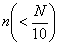
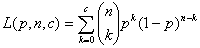
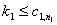

六、抽样检验方法

[抽样验收的第一类错误和第二类错误]&nbsp; 从整批产品中随意抽取<i>n</i>件样品进行质量检查，进而对整批产品作出“接收”或“拒收”的判断时可能出现两种错误：把可接收的整批产品错判为不合格而加以“拒收”，这种错误称为第一类错误，把质量不合要求的整批产品错判为合格而加以“接收”，这种错误称为第二类错误。

&nbsp;&nbsp;&nbsp;
制定抽样检验方案的目的就是合理地确定尽可能小的样本容量<i>n</i>和作为判断的标准区间(<i>L , H</i>)，使得犯第一类错误的概率和犯第二类错误的概率都尽量地小。以下只讨论样本容量<i>n</i>和整批产品的量<i>N</i>（或称批量为<i>N</i>）满足的情况。

[单式抽样检验]&nbsp; 单式抽样的验收方案是指只进行一次抽样，从而对整批产品作“接收”或“拒收”判断的方案。

&nbsp;&nbsp;&nbsp; 1° 单式计件（对产品质量指标的检验只考虑“好品”与“次品”）的验收方案（<i>n , c</i>）。

&nbsp;&nbsp;&nbsp;&nbsp;
根据对产品质量的要求，收付双方协商定出两个小于1的正数<i>p0</i>和，当次品率时，则接收这批产品；当时，则拒收这批产品。和分别叫做“可接收”的质量水平和“批容许废品率”。

&nbsp;&nbsp;&nbsp;
设样本容量为<i>n</i>，其中次品个数为<i>k</i>。<i>k</i>可作为判断批量为<i>N</i>的产品质量的指标。现在是如何合理地选取<i>n</i>和小于<i>n</i>的正整数<i>c</i>，使得按照“”或“”分别决定“接收”或“拒收”该批产品时，犯第一类或第二类错误的概率都不大于预先给定的和。

&nbsp;&nbsp;&nbsp;
对于方案（<i>n , c</i>），从次品率为<i>p</i>的总体（批量为<i>N</i>）中抽取件产品，其次品数的概率为

&nbsp;&nbsp; &nbsp;称为方案（<i>n , c</i>）的示性函数。

&nbsp;&nbsp; 给定和后，是下列方程的解：

记满足

则<i>n</i>当比较大时，（即<i>nH</i>的整数部分）由下式决定：

&nbsp;&nbsp;
2° 单式计量（对产品质量指标要测量出具体数据）验收方案

&nbsp;&nbsp;&nbsp;
假定衡量产品好坏的数量指标是遵从正态分布，其方差为已知。当（或相反）时，认为产品合格；当（或相反）时，认为产品不合格。

&nbsp;&nbsp;&nbsp;
设样本容量为<i>n</i>，样本均值为可作为判断总体质量的指标。现在是如何合理的选取<i>n</i>和<i>L , H</i>，使得按照“<i>L&lt;</i><i>”</i>和“或”分别决定“接收”或“拒收”整批产品时，犯第一或第二类错误的概率都不大于预先给定的和。

&nbsp;&nbsp;&nbsp;
记

其中是正态概率积分

的反函数。&nbsp; 

单式计量验收方案表

<table class=MsoNormalTable border=1 cellspacing=0 cellpadding=0
 style='border-collapse:collapse;border:none'>
 <tr>
  <td width=111 valign=top style='width:83.1pt;border:solid windowtext 1.0pt;
  border-left:none;padding:0mm 5.4pt 0mm 5.4pt'>
  
&nbsp;&nbsp; 条&nbsp; 件

  </td>
  <td width=105 valign=top style='width:78.9pt;border:solid windowtext 1.0pt;
  border-left:none;padding:0mm 5.4pt 0mm 5.4pt'>
  
方案代号

  </td>
  <td width=156 valign=top style='width:117.0pt;border:solid windowtext 1.0pt;
  border-left:none;padding:0mm 5.4pt 0mm 5.4pt'>
  
方案参数满足的

  
&nbsp;&nbsp; 方程组

  </td>
  <td width=144 valign=top style='width:108.0pt;border-top:solid windowtext 1.0pt;
  border-left:none;border-bottom:solid windowtext 1.0pt;border-right:none;
  padding:0mm 5.4pt 0mm 5.4pt'>
  
统计推断

  </td>
 </tr>
 <tr>
  <td width=111 valign=top style='width:83.1pt;border-top:none;border-left:
  none;border-bottom:solid windowtext 1.0pt;border-right:solid windowtext 1.0pt;
  padding:0mm 5.4pt 0mm 5.4pt'>
  
&nbsp;&nbsp; 

  </td>
  <td width=105 valign=top style='width:78.9pt;border-top:none;border-left:
  none;border-bottom:solid windowtext 1.0pt;border-right:solid windowtext 1.0pt;
  padding:0mm 5.4pt 0mm 5.4pt'>
  
&nbsp;

  </td>
  <td width=156 valign=top style='width:117.0pt;border-top:none;border-left:
  none;border-bottom:solid windowtext 1.0pt;border-right:solid windowtext 1.0pt;
  padding:0mm 5.4pt 0mm 5.4pt'>
  

  </td>
  <td width=144 valign=top style='width:108.0pt;border:none;border-bottom:solid windowtext 1.0pt;
  padding:0mm 5.4pt 0mm 5.4pt'>
  
当时，拒收

  
当时，接收

  </td>
 </tr>
 <tr>
  <td width=111 valign=top style='width:83.1pt;border-top:none;border-left:
  none;border-bottom:solid windowtext 1.0pt;border-right:solid windowtext 1.0pt;
  padding:0mm 5.4pt 0mm 5.4pt'>
  
&nbsp; 

  </td>
  <td width=105 valign=top style='width:78.9pt;border-top:none;border-left:
  none;border-bottom:solid windowtext 1.0pt;border-right:solid windowtext 1.0pt;
  padding:0mm 5.4pt 0mm 5.4pt'>
  
&nbsp; 

  </td>
  <td width=156 valign=top style='width:117.0pt;border-top:none;border-left:
  none;border-bottom:solid windowtext 1.0pt;border-right:solid windowtext 1.0pt;
  padding:0mm 5.4pt 0mm 5.4pt'>
  

  </td>
  <td width=144 valign=top style='width:108.0pt;border:none;border-bottom:solid windowtext 1.0pt;
  padding:0mm 5.4pt 0mm 5.4pt'>
  
当时，拒收

  
当时，接收

  </td>
 </tr>
 <tr>
  <td width=111 valign=top style='width:83.1pt;border-top:none;border-left:
  none;border-bottom:solid windowtext 1.0pt;border-right:solid windowtext 1.0pt;
  padding:0mm 5.4pt 0mm 5.4pt'>
  
&nbsp;

  </td>
  <td width=105 valign=top style='width:78.9pt;border-top:none;border-left:
  none;border-bottom:solid windowtext 1.0pt;border-right:solid windowtext 1.0pt;
  padding:0mm 5.4pt 0mm 5.4pt'>
  
&nbsp;&nbsp; 

  </td>
  <td width=156 valign=top style='width:117.0pt;border-top:none;border-left:
  none;border-bottom:solid windowtext 1.0pt;border-right:solid windowtext 1.0pt;
  padding:0mm 5.4pt 0mm 5.4pt'>
  

  </td>
  <td width=144 valign=top style='width:108.0pt;border:none;border-bottom:solid windowtext 1.0pt;
  padding:0mm 5.4pt 0mm 5.4pt'>
  
当或时，拒收

  
当时，接收

  </td>
 </tr>
</table>

[复式计件抽样检验]&nbsp; 单式抽样验收方案为了确保两类错误的相应概率不超过，常常需要抽取容量很大的样本。对于同样的四个数据，复式抽样的平均抽样件数比单式抽样较小。

&nbsp;&nbsp;&nbsp; 复式抽样验收方案的做法是：先抽容量为的样本，设其中的次品为，与事先确定的三个数及相比较作判断：若，则整批接收；若，则整批拒收；若，则继续抽取容量为的样本，记其中的次品数为，将两个样本合在一起，若，则整批接收；若，则整批拒收。其中的决定与单式抽样方案类似，要保证抽样验收方案当整批产品的次品率时，拒收的概率不超过，当时，接收的概率不超过。

记方案（）的示性函数）为

&nbsp;&nbsp;&nbsp;&nbsp;&nbsp;&nbsp;&nbsp;&nbsp;&nbsp;
<b>;</b>） 

&nbsp;&nbsp;&nbsp;&nbsp;&nbsp;&nbsp;&nbsp;&nbsp;&nbsp;&nbsp;&nbsp;&nbsp;&nbsp;&nbsp;&nbsp;&nbsp;&nbsp;&nbsp;&nbsp;&nbsp;

它事实上是抽取第二样本，经检验后，整批接收的概率，即概率（次品率为<i>p</i>）与（次品率为<i>p</i>）之和。

&nbsp;&nbsp;&nbsp; 当已知，满足下列方程

该方程的求解是困难的，且不是唯一的，必须根据实际部门的具体情况提出另外合理的限制（例如令等等），并制定专门的统计表来确定。

[序贯计件抽样检验]&nbsp; 本方法比上面的抽样方案更经济，更能减少检验次数。

&nbsp;&nbsp; 对于给定的，序贯抽样的方法是：

&nbsp;&nbsp;&nbsp; 第一步&nbsp; 先抽取容量为的样本，设其中次品数为，计算

若样本的次品数，则整批接收；若，则整批拒收；若，则不作决定，继续抽样。

&nbsp;&nbsp;&nbsp; 第二步&nbsp; 再抽取容量为的样本，设其中次品数为，计算

若两次抽样的积累样本的次品数，则整批接收；若，则整批拒收；若，则不作决定，继续抽样。

&nbsp;&nbsp;&nbsp; 照此法进行下去一直到作出判断为止。应注意的是，若每次样本的容量为，其中次品数为，则在第<i>m</i>步时，积累样本的容量为，积累次品数为。可以证明，经有限次抽样可以作出判断。

&nbsp;&nbsp;&nbsp; 序贯抽样验收方案可以有两种直观的表示方法：

&nbsp;&nbsp;&nbsp; 1°&nbsp; 序贯计件抽样的图解法&nbsp;
以积累样本的容量为横坐标，以积累次品数为纵坐标，两条平行线

把整个平面划成三个区域：接收区，拒收区和继续抽查区（图16.7）。每检验一件产品后，看它是不是次品，然后在图上画一点(<i>n , k</i>)，如果点落在接收区内，就接收这批产品；如果点落在拒收区内，就拒收这批产品；如果点落在继续抽查区，就继续抽检。经有限次抽查，点(<i>n , k</i>)总会跑出继续抽查区，这时便可作出接收或拒收的判断。

2°&nbsp; 序贯计件抽样的列表法&nbsp;
对给定的不同的和，列出积累样本的个数和所对应的判断标准和的表。当积累次品数越出区间(,)，就可作判断。例如下表列出,的序贯抽样方案。

<table class=MsoNormalTable border=1 cellspacing=0 cellpadding=0
 style='border-collapse:collapse;border:none'>
 <tr>
  <td width=36 valign=top style='width:27.0pt;border:solid windowtext 1.0pt;
  border-left:none;padding:0mm 5.4pt 0mm 5.4pt'>
  
<i>n</i>

  </td>
  <td width=36 valign=top style='width:27.0pt;border:solid windowtext 1.0pt;
  border-left:none;padding:0mm 5.4pt 0mm 5.4pt'>
  

  </td>
  <td width=36 valign=top style='width:27.0pt;border:solid windowtext 1.0pt;
  border-left:none;padding:0mm 5.4pt 0mm 5.4pt'>
  

  </td>
  <td width=36 valign=top style='width:27.0pt;border:solid windowtext 1.0pt;
  border-left:none;padding:0mm 5.4pt 0mm 5.4pt'>
  
<i>n</i>

  </td>
  <td width=36 valign=top style='width:27.0pt;border:solid windowtext 1.0pt;
  border-left:none;padding:0mm 5.4pt 0mm 5.4pt'>
  

  </td>
  <td width=37 valign=top style='width:27.6pt;border:solid windowtext 1.0pt;
  border-left:none;padding:0mm 5.4pt 0mm 5.4pt'>
  

  </td>
  <td width=35 valign=top style='width:26.4pt;border:solid windowtext 1.0pt;
  border-left:none;padding:0mm 5.4pt 0mm 5.4pt'>
  
<i>n</i>

  </td>
  <td width=36 valign=top style='width:27.0pt;border:solid windowtext 1.0pt;
  border-left:none;padding:0mm 5.4pt 0mm 5.4pt'>
  

  </td>
  <td width=36 valign=top style='width:27.0pt;border:solid windowtext 1.0pt;
  border-left:none;padding:0mm 5.4pt 0mm 5.4pt'>
  

  </td>
  <td width=36 valign=top style='width:27.0pt;border:solid windowtext 1.0pt;
  border-left:none;padding:0mm 5.4pt 0mm 5.4pt'>
  
<i>n</i>

  </td>
  <td width=36 valign=top style='width:27.0pt;border:solid windowtext 1.0pt;
  border-left:none;padding:0mm 5.4pt 0mm 5.4pt'>
  

  </td>
  <td width=36 valign=top style='width:27.0pt;border-top:solid windowtext 1.0pt;
  border-left:none;border-bottom:solid windowtext 1.0pt;border-right:none;
  padding:0mm 5.4pt 0mm 5.4pt'>
  

  </td>
 </tr>
 <tr>
  <td width=36 valign=top style='width:27.0pt;border-top:none;border-left:none;
  border-bottom:solid windowtext 1.0pt;border-right:solid windowtext 1.0pt;
  padding:0mm 5.4pt 0mm 5.4pt'>
  
2

  
3

  
4

  
5

  
6

  
7

  
8

  
9

  
10

  
11

  
12

  
13

  
14

  
15

  
16

  
17

  
18

  
19

  </td>
  <td width=36 valign=top style='width:27.0pt;border-top:none;border-left:none;
  border-bottom:solid windowtext 1.0pt;border-right:solid windowtext 1.0pt;
  padding:0mm 5.4pt 0mm 5.4pt'>
  

  

  

  

  

  

  

  

  

  

  

  

  

  

  

  

  

  

  </td>
  <td width=36 valign=top style='width:27.0pt;border-top:none;border-left:none;
  border-bottom:solid windowtext 1.0pt;border-right:solid windowtext 1.0pt;
  padding:0mm 5.4pt 0mm 5.4pt'>
  
2

  
2

  
2

  
2

  
2

  
2

  
2

  
2

  
2

  
2

  
2

  
2

  
2

  
2

  
2

  
2

  
2

  
2

  </td>
  <td width=36 valign=top style='width:27.0pt;border-top:none;border-left:none;
  border-bottom:solid windowtext 1.0pt;border-right:solid windowtext 1.0pt;
  padding:0mm 5.4pt 0mm 5.4pt'>
  
20

  
21

  
22

  
23

  
24

  
25

  
26

  
27

  
28

  
29

  
30

  
31

  
32

  
33

  
34

  
35

  
36

  
37

  </td>
  <td width=36 valign=top style='width:27.0pt;border-top:none;border-left:none;
  border-bottom:solid windowtext 1.0pt;border-right:solid windowtext 1.0pt;
  padding:0mm 5.4pt 0mm 5.4pt'>
  

  

  

  

  

  

  

  

  

  

  

  
0

  
0

  
0

  
0

  
0

  
0

  
0

  </td>
  <td width=37 valign=top style='width:27.6pt;border-top:none;border-left:none;
  border-bottom:solid windowtext 1.0pt;border-right:solid windowtext 1.0pt;
  padding:0mm 5.4pt 0mm 5.4pt'>
  
3

  
3

  
3

  
3

  
3

  
3

  
3

  
3

  
3

  
3

  
3

  
3

  
3

  
3

  
3

  
3

  
3

  
3

  </td>
  <td width=35 valign=top style='width:26.4pt;border-top:none;border-left:none;
  border-bottom:solid windowtext 1.0pt;border-right:solid windowtext 1.0pt;
  padding:0mm 5.4pt 0mm 5.4pt'>
  
38

  
39

  
40

  
41

  
42

  
43

  
44

  
45

  
46

  
47

  
48

  
49

  
50

  
51

  
52

  
53

  
54

  
55

  </td>
  <td width=36 valign=top style='width:27.0pt;border-top:none;border-left:none;
  border-bottom:solid windowtext 1.0pt;border-right:solid windowtext 1.0pt;
  padding:0mm 5.4pt 0mm 5.4pt'>
  
0

  
0

  
0

  
0

  
0

  
0

  
0

  
0

  
0

  
0

  
0

  
0

  
0

  
0

  
0

  
0

  
0

  
0

  </td>
  <td width=36 valign=top style='width:27.0pt;border-top:none;border-left:none;
  border-bottom:solid windowtext 1.0pt;border-right:solid windowtext 1.0pt;
  padding:0mm 5.4pt 0mm 5.4pt'>
  
3

  
3

  
3

  
3

  
3

  
3

  
3

  
3

  
3

  
3

  
3

  
3

  
4

  
4

  
4

  
4

  
4

  
4

  </td>
  <td width=36 valign=top style='width:27.0pt;border-top:none;border-left:none;
  border-bottom:solid windowtext 1.0pt;border-right:solid windowtext 1.0pt;
  padding:0mm 5.4pt 0mm 5.4pt'>
  
56

  
57

  
58

  
59

  
60

  
61

  
62

  
63

  
64

  
65

  
66

  
67

  
68

  
69

  
70

  </td>
  <td width=36 valign=top style='width:27.0pt;border-top:none;border-left:none;
  border-bottom:solid windowtext 1.0pt;border-right:solid windowtext 1.0pt;
  padding:0mm 5.4pt 0mm 5.4pt'>
  
0

  
0

  
0

  
0

  
0

  
1

  
1

  
1

  
1

  
1

  
1

  
1

  
1

  
1

  
1

  </td>
  <td width=36 valign=top style='width:27.0pt;border:none;border-bottom:solid windowtext 1.0pt;
  padding:0mm 5.4pt 0mm 5.4pt'>
  
4

  
4

  
4

  
4

  
4

  
4

  
4

  
4

  
4

  
4

  
4

  
4

  
4

  
4

  
4

  </td>
 </tr>
</table>

表中<i>n</i>：积累样本的个数。

&nbsp;&nbsp; &nbsp;：可以作出接收的最高次品件数。

&nbsp;&nbsp; &nbsp;：可以作出拒收的最低次品件数。

&nbsp;&nbsp; 表示不作决定。

