

七、质量评估（工序控制）方法

&nbsp; 一件产品的制作往往要由好几个工序来完成。每个工序出了问题都会影响产品的质量，因此必须在生产过程的每个工序设有控制图，及时评估生产过程的质量。

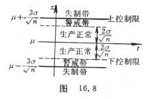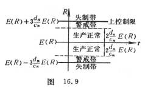[计量评估]&nbsp; 被评估的产品质量是一物理量。设它在正常生产时遵从正态分布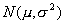。用样本的均值和极差<i>R</i>来评估总体的和是否发生异常，分别称为评估图(图16.8)和评估图(图16.9)。 

图中<i>E</i>(<i>R</i>)表示极差<i>R</i>的数学期望，<i>cn</i> ,<i>dn</i>是与<i>n</i>有关的经验常数。

经验常数<i>cn</i> ,<i>dn</i>数值表

<table class=MsoNormalTable border=1 cellspacing=0 cellpadding=0
 style='border-collapse:collapse;border:none'>
 <tr>
  <td width=48 valign=top style='width:36.2pt;border:solid windowtext 1.0pt;
  border-left:none;padding:0mm 5.4pt 0mm 5.4pt'>
  

  </td>
  <td width=92 valign=top style='width:68.8pt;border:solid windowtext 1.0pt;
  border-left:none;padding:0mm 5.4pt 0mm 5.4pt'>
  
2

  </td>
  <td width=97 valign=top style='width:72.95pt;border:solid windowtext 1.0pt;
  border-left:none;padding:0mm 5.4pt 0mm 5.4pt'>
  
3

  </td>
  <td width=99 valign=top style='width:74.05pt;border:solid windowtext 1.0pt;
  border-left:none;padding:0mm 5.4pt 0mm 5.4pt'>
  
4

  </td>
  <td width=98 valign=top style='width:73.5pt;border:solid windowtext 1.0pt;
  border-left:none;padding:0mm 5.4pt 0mm 5.4pt'>
  
5

  </td>
  <td width=98 valign=top style='width:73.5pt;border:solid windowtext 1.0pt;
  border-left:none;padding:0mm 5.4pt 0mm 5.4pt'>
  
6

  </td>
  <td width=81 valign=top style='width:60.65pt;border-top:solid windowtext 1.0pt;
  border-left:none;border-bottom:solid windowtext 1.0pt;border-right:none;
  padding:0mm 5.4pt 0mm 5.4pt'>
  
&nbsp; 

  </td>
 </tr>
 <tr>
  <td width=48 valign=top style='width:36.2pt;border-top:none;border-left:none;
  border-bottom:solid windowtext 1.0pt;border-right:solid windowtext 1.0pt;
  padding:0mm 5.4pt 0mm 5.4pt'>
  

  </td>
  <td width=92 valign=top style='width:68.8pt;border-top:none;border-left:none;
  border-bottom:solid windowtext 1.0pt;border-right:solid windowtext 1.0pt;
  padding:0mm 5.4pt 0mm 5.4pt'>
  
1.128

  </td>
  <td width=97 valign=top style='width:72.95pt;border-top:none;border-left:
  none;border-bottom:solid windowtext 1.0pt;border-right:solid windowtext 1.0pt;
  padding:0mm 5.4pt 0mm 5.4pt'>
  
1.693

  </td>
  <td width=99 valign=top style='width:74.05pt;border-top:none;border-left:
  none;border-bottom:solid windowtext 1.0pt;border-right:solid windowtext 1.0pt;
  padding:0mm 5.4pt 0mm 5.4pt'>
  
2.059

  </td>
  <td width=98 valign=top style='width:73.5pt;border-top:none;border-left:none;
  border-bottom:solid windowtext 1.0pt;border-right:solid windowtext 1.0pt;
  padding:0mm 5.4pt 0mm 5.4pt'>
  
2.326

  </td>
  <td width=98 valign=top style='width:73.5pt;border-top:none;border-left:none;
  border-bottom:solid windowtext 1.0pt;border-right:solid windowtext 1.0pt;
  padding:0mm 5.4pt 0mm 5.4pt'>
  
2.534

  </td>
  <td width=81 valign=top style='width:60.65pt;border:none;border-bottom:solid windowtext 1.0pt;
  padding:0mm 5.4pt 0mm 5.4pt'>
  
&nbsp; 

  </td>
 </tr>
 <tr>
  <td width=48 valign=top style='width:36.2pt;border-top:none;border-left:none;
  border-bottom:double windowtext 1.5pt;border-right:solid windowtext 1.0pt;
  padding:0mm 5.4pt 0mm 5.4pt'>
  
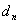

  </td>
  <td width=92 valign=top style='width:68.8pt;border-top:none;border-left:none;
  border-bottom:double windowtext 1.5pt;border-right:solid windowtext 1.0pt;
  padding:0mm 5.4pt 0mm 5.4pt'>
  
0.8525

  </td>
  <td width=97 valign=top style='width:72.95pt;border-top:none;border-left:
  none;border-bottom:double windowtext 1.5pt;border-right:solid windowtext 1.0pt;
  padding:0mm 5.4pt 0mm 5.4pt'>
  
0.8884

  </td>
  <td width=99 valign=top style='width:74.05pt;border-top:none;border-left:
  none;border-bottom:double windowtext 1.5pt;border-right:solid windowtext 1.0pt;
  padding:0mm 5.4pt 0mm 5.4pt'>
  
0.8798

  </td>
  <td width=98 valign=top style='width:73.5pt;border-top:none;border-left:none;
  border-bottom:double windowtext 1.5pt;border-right:solid windowtext 1.0pt;
  padding:0mm 5.4pt 0mm 5.4pt'>
  
0.8641

  </td>
  <td width=98 valign=top style='width:73.5pt;border-top:none;border-left:none;
  border-bottom:double windowtext 1.5pt;border-right:solid windowtext 1.0pt;
  padding:0mm 5.4pt 0mm 5.4pt'>
  
0.8480

  </td>
  <td width=81 valign=top style='width:60.65pt;border:none;border-bottom:double windowtext 1.5pt;
  padding:0mm 5.4pt 0mm 5.4pt'>
  
&nbsp; 

  </td>
 </tr>
 <tr>
  <td width=48 valign=top style='width:36.2pt;border-top:none;border-left:none;
  border-bottom:solid windowtext 1.0pt;border-right:solid windowtext 1.0pt;
  padding:0mm 5.4pt 0mm 5.4pt'>
  

  </td>
  <td width=92 valign=top style='width:68.8pt;border-top:none;border-left:none;
  border-bottom:solid windowtext 1.0pt;border-right:solid windowtext 1.0pt;
  padding:0mm 5.4pt 0mm 5.4pt'>
  
7

  </td>
  <td width=97 valign=top style='width:72.95pt;border-top:none;border-left:
  none;border-bottom:solid windowtext 1.0pt;border-right:solid windowtext 1.0pt;
  padding:0mm 5.4pt 0mm 5.4pt'>
  
8

  </td>
  <td width=99 valign=top style='width:74.05pt;border-top:none;border-left:
  none;border-bottom:solid windowtext 1.0pt;border-right:solid windowtext 1.0pt;
  padding:0mm 5.4pt 0mm 5.4pt'>
  
9

  </td>
  <td width=98 valign=top style='width:73.5pt;border-top:none;border-left:none;
  border-bottom:solid windowtext 1.0pt;border-right:solid windowtext 1.0pt;
  padding:0mm 5.4pt 0mm 5.4pt'>
  
10

  </td>
  <td width=98 valign=top style='width:73.5pt;border-top:none;border-left:none;
  border-bottom:solid windowtext 1.0pt;border-right:solid windowtext 1.0pt;
  padding:0mm 5.4pt 0mm 5.4pt'>
  
11

  </td>
  <td width=81 valign=top style='width:60.65pt;border:none;border-bottom:solid windowtext 1.0pt;
  padding:0mm 5.4pt 0mm 5.4pt'>
  
12

  </td>
 </tr>
 <tr>
  <td width=48 valign=top style='width:36.2pt;border-top:none;border-left:none;
  border-bottom:solid windowtext 1.0pt;border-right:solid windowtext 1.0pt;
  padding:0mm 5.4pt 0mm 5.4pt'>
  

  </td>
  <td width=92 valign=top style='width:68.8pt;border-top:none;border-left:none;
  border-bottom:solid windowtext 1.0pt;border-right:solid windowtext 1.0pt;
  padding:0mm 5.4pt 0mm 5.4pt'>
  
2.704

  </td>
  <td width=97 valign=top style='width:72.95pt;border-top:none;border-left:
  none;border-bottom:solid windowtext 1.0pt;border-right:solid windowtext 1.0pt;
  padding:0mm 5.4pt 0mm 5.4pt'>
  
2.847

  </td>
  <td width=99 valign=top style='width:74.05pt;border-top:none;border-left:
  none;border-bottom:solid windowtext 1.0pt;border-right:solid windowtext 1.0pt;
  padding:0mm 5.4pt 0mm 5.4pt'>
  
2.970

  </td>
  <td width=98 valign=top style='width:73.5pt;border-top:none;border-left:none;
  border-bottom:solid windowtext 1.0pt;border-right:solid windowtext 1.0pt;
  padding:0mm 5.4pt 0mm 5.4pt'>
  
3.078

  </td>
  <td width=98 valign=top style='width:73.5pt;border-top:none;border-left:none;
  border-bottom:solid windowtext 1.0pt;border-right:solid windowtext 1.0pt;
  padding:0mm 5.4pt 0mm 5.4pt'>
  
3.173

  </td>
  <td width=81 valign=top style='width:60.65pt;border:none;border-bottom:solid windowtext 1.0pt;
  padding:0mm 5.4pt 0mm 5.4pt'>
  
3.258

  </td>
 </tr>
 <tr>
  <td width=48 valign=top style='width:36.2pt;border-top:none;border-left:none;
  border-bottom:solid windowtext 1.0pt;border-right:solid windowtext 1.0pt;
  padding:0mm 5.4pt 0mm 5.4pt'>
  

  </td>
  <td width=92 valign=top style='width:68.8pt;border-top:none;border-left:none;
  border-bottom:solid windowtext 1.0pt;border-right:solid windowtext 1.0pt;
  padding:0mm 5.4pt 0mm 5.4pt'>
  
0.8330

  </td>
  <td width=97 valign=top style='width:72.95pt;border-top:none;border-left:
  none;border-bottom:solid windowtext 1.0pt;border-right:solid windowtext 1.0pt;
  padding:0mm 5.4pt 0mm 5.4pt'>
  
0.8200

  </td>
  <td width=99 valign=top style='width:74.05pt;border-top:none;border-left:
  none;border-bottom:solid windowtext 1.0pt;border-right:solid windowtext 1.0pt;
  padding:0mm 5.4pt 0mm 5.4pt'>
  
0.808

  </td>
  <td width=98 valign=top style='width:73.5pt;border-top:none;border-left:none;
  border-bottom:solid windowtext 1.0pt;border-right:solid windowtext 1.0pt;
  padding:0mm 5.4pt 0mm 5.4pt'>
  
0.797

  </td>
  <td width=98 valign=top style='width:73.5pt;border-top:none;border-left:none;
  border-bottom:solid windowtext 1.0pt;border-right:solid windowtext 1.0pt;
  padding:0mm 5.4pt 0mm 5.4pt'>
  
0.787

  </td>
  <td width=81 valign=top style='width:60.65pt;border:none;border-bottom:solid windowtext 1.0pt;
  padding:0mm 5.4pt 0mm 5.4pt'>
  
0.778

  </td>
 </tr>
</table>

如果产品指标规格未知，可从最近正常生产过程中抽取20多个容量为<i>n</i>（<i>n</i>&lt;10,一般<i>n</i>=5或6）的样本，由各样本的均值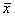和极差<i>R</i>再作平均得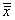和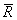，则的控制限为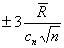，<i>R</i>的控制限为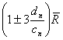。

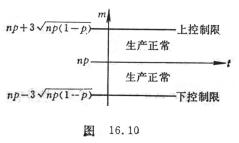&nbsp;&nbsp;&nbsp;
在连续生产的过程中于某时间间隔内抽取一个容量为<i>n</i>的样本，算出和<i>R</i>，然后在评估图上画点，如果在整个生产过程中每次抽样算得的和<i>R</i>都在控制限内，点的变化又是随机的（没有一定规划和趋势），就表示生产正常。

[计件评估] &nbsp;&nbsp;被评估的产品质量是次品率的大小，其方法与计量评估类似。如果工厂里规定产品的次品率为<i>p</i>，在某时间间隔内，抽取容量为<i>n</i>(&gt;50)的样本，作次品个数<i>m</i>的评估图（图16.10）。

&nbsp;&nbsp; 如果产品次品率没有规定，可从近期正常生产过程中抽取20个小样本，用各个样本的次品率的平均值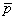作为<i>p</i>。

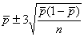

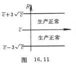[计点评估]&nbsp; 被评估的产品质量是一件（或一组）产品的疵点的个数。如果产品在正常生产时的平均疵点数为（它可通过对20多批产品的抽查，在每批产品中抽查一件或一组，算出每批产品的平均疵点数<i>ci </i>，然后从20多个<i>ci</i>中算出一个平均数），那末作疵点数<i>c</i>的评估图（图16.11）。其控制限为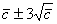。

在连续生产过程中的某个时间内任抽取一件产品，数出其疵点个数<i>c</i>，并用点画在评估图上，当点在控制带内随机变动，则表示生产在正常状态。

