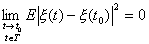
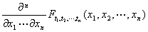

<b>§</b><b>3&nbsp; </b><b>随机过程</b>

一、一、一般随机过程

[随机过程的定义]&nbsp; 对于每个<i>t</i>&Icirc;<i>T</i>(<i>T</i> 是某个固定的实数集),<i>x </i>(<i>t</i>)是个随机变量，就把这样的随机变量族{<i>x </i>(<i>t</i>)，<i>t</i>&Icirc;<i>T</i>}称为随机过程。随机过程一次实验的结果是定义在<i>T</i>上的函数，称为随机过程的一次实现。当参数<i>t</i>的变化范围<i>T</i>是个整数集合，则称

<i>&nbsp;&nbsp;&nbsp;&nbsp;&nbsp;&nbsp;&nbsp;&nbsp;&nbsp;&nbsp;&nbsp;&nbsp;&nbsp;&nbsp;&nbsp;&nbsp;&nbsp;&nbsp;&nbsp;&nbsp;&nbsp;&nbsp;&nbsp;&nbsp;&nbsp;&nbsp;&nbsp;&nbsp;&nbsp;&nbsp;
</i><i>x</i> (<i>t</i>), <i>t</i>=0,±1,±2,L

为随机序列。

当<i>T</i>只包含一个或有限个元素，{<i>x</i> (<i>t</i>)，<i>t</i>&Icirc;<i>T</i>}就是概率论中研究过的随机变量或随机矢量。

[随机过程的有穷维分布函数族]&nbsp; 设{<i>x</i> (<i>t</i>)，<i>t</i>&Icirc;<i>T</i>}是随机过程，对任意的正整数<i>n</i>及任意的<i>t</i>1, <i>t</i>2, L，<i>tn</i>&Icirc;<i>T</i>,随机变量<i>x </i>(<i>t</i>1) ,<i>x</i> (<i>t</i>2) ,L，<i>x </i>(<i>tn</i>)的联合分布函数为

称为随机过程的有穷维分布函数族。它不仅刻划了对应于每一个<i>t</i>的随机变量<i>x</i>(<i>t</i>)的统计规律性，而且也刻划了各个随机变量<i>x</i>(<i>t</i>)之间的关系，从而完整地描述了随机过程的统计规律性。

[随机过程的统计参数]&nbsp; 设{<i>x</i> (<i>t</i>)，<i>t</i>&Icirc;<i>T</i>}是个复值随机过程(指它的实部和虚部都是实的随机过程)。主要的统计参数有：

&nbsp;&nbsp;&nbsp; 1° 均值函数&nbsp; 对每个<i>t</i>&Icirc;<i>T</i>,随机变量<i>x</i>(<i>t</i>)的数学期望（均值）

&nbsp;&nbsp;&nbsp;&nbsp;&nbsp;&nbsp;&nbsp;&nbsp;&nbsp;&nbsp;&nbsp;&nbsp;&nbsp;&nbsp;&nbsp;&nbsp;&nbsp;&nbsp;

称为随机过程的均值函数，式中<i>Ft</i>(<i>x</i>)是<i>x</i>(<i>t</i>)的分布函数。

2° 协方差函数与方差函数&nbsp; 对任意的<i>s</i>, <i>t</i>&Icirc;<i>T</i>,

&nbsp;&nbsp;&nbsp;&nbsp;&nbsp;&nbsp;&nbsp;&nbsp;&nbsp;&nbsp;&nbsp;&nbsp;&nbsp;&nbsp;&nbsp;

称为随机过程的协方差函数(或相关函数)，式中<i>m</i>(<i>t</i>)是均值函数。

特别地，当<i>s</i>=<i>t</i>,则称

&nbsp;&nbsp;&nbsp;&nbsp;&nbsp;&nbsp;&nbsp;&nbsp;&nbsp;&nbsp;&nbsp;&nbsp;&nbsp;&nbsp;&nbsp;&nbsp;&nbsp;&nbsp;&nbsp;&nbsp;

为随机过程的方差函数(或自相关函数)。

3° 高阶矩&nbsp; 若对任意的正整数<i>n</i>，非负整数<i>m</i>1 , <i>m</i>2
,L , <i>mn </i>, <i>m=</i> <i>m</i>1+<i>m</i>2+L+<i>mn</i>及任意实数<i>t</i>1,<i>t</i>2,L,<i>tn</i>，随机变量的数学期望存在，则

称它为<i>x</i> (<i>t</i>)在<i>t</i>1,<i>t</i>2,L,<i>t</i><i> n</i>矩的一个<i>m</i>阶矩。

[随机过程的均方连续性]&nbsp; 设{<i>x </i>(<i>t</i>)，<i>t</i>&Icirc;<i>T</i>}是一随机过程，<i>t</i>0&Icirc;<i>T</i>,如果

&nbsp;&nbsp;&nbsp;&nbsp;&nbsp;&nbsp;&nbsp;&nbsp;&nbsp;&nbsp;&nbsp;&nbsp;&nbsp;&nbsp;&nbsp;&nbsp;&nbsp;&nbsp;&nbsp;&nbsp;&nbsp;&nbsp;&nbsp;&nbsp;&nbsp;&nbsp;

即&nbsp;&nbsp;&nbsp;&nbsp;&nbsp;&nbsp;&nbsp;&nbsp;&nbsp;&nbsp;&nbsp;&nbsp;&nbsp;&nbsp;&nbsp;&nbsp;&nbsp;&nbsp;&nbsp;&nbsp;&nbsp;&nbsp;&nbsp;&nbsp;&nbsp;&nbsp;&nbsp;&nbsp;&nbsp;

则称<i>x</i><i> </i>(<i>t</i>)在<i>t</i>=<i>t</i>0是均方连续的，式中l.i.m.表示均方收敛。如果<i>x</i>(<i>t</i>)对于任意<i>t</i>&Icirc;<i>T</i>都是均方连续，就称<i>x</i> (<i>t</i>)在<i>T</i>上是均方连续的。

随机过程{<i>x</i> (<i>t</i>)，<i>t</i>&Icirc;<i>T</i>}的如下三命题是等价的：

1° 随机过程{<i>x</i> (<i>t</i>)，<i>t</i>&Icirc;<i>T</i>}在<i>T</i>上均方连续；

2° 随机过程{<i>x</i> (<i>t</i>)，<i>t</i>&Icirc;<i>T</i>}的协方差函数<i>R</i>(<i>s</i>,<i>t</i>)(<i>s</i>,<i>t</i>&Icirc;<i>T</i>)关于<i>s</i>,<i>t</i>是连续的；

3° 随机过程{<i>x</i> (<i>t</i>)，<i>t</i>&Icirc;<i>T</i>}的协方差函数<i>R</i>(<i>s</i>,<i>t</i>)(<i>s</i>,<i>t</i>&Icirc;<i>T</i>)在对角线<i>s</i>=<i>t</i>上关于<i>s</i>,<i>t</i>是连续的。

下面介绍几种特殊类型的随机过程：

[独立随机过程]&nbsp; 若对任意的正整数<i>n</i>和任意的<i>t</i>1,<i>t</i>2,L<i>tn</i>&Icirc;<i>T</i>,随机变量<i>x</i>
(<i>t</i>1),<i>x</i>
(<i>t</i>2),L,<i>x</i> (<i>tn</i>)是相互独立的，即

&nbsp;&nbsp;&nbsp;&nbsp;&nbsp;&nbsp;

则称{<i>x</i> (<i>t</i>)，<i>t</i>&Icirc;<i>T</i>}是独立随机过程。

&nbsp;[正态过程]&nbsp; 若对任意的正整数<i>n</i>和任意的<i>t</i>1,<i>t</i>2,L,<i>tn</i>&Icirc;<i>T</i>,随机变量<i>x</i> (<i>t</i>1),<i>x</i> (<i>t</i>2),L,<i>x</i> (<i>tn</i>)的联合分布总是正态的，即

&nbsp;&nbsp;&nbsp;&nbsp;&nbsp;&nbsp;&nbsp;&nbsp;&nbsp;&nbsp;&nbsp;
&nbsp;&nbsp;&nbsp;&nbsp;

则称{<i>x </i>(<i>t</i>)，<i>t</i>&Icirc;<i>T</i>}是正态（或高斯）过程，式中<i>Rjk</i>=<i>R</i>(<i>j</i>,<i>k</i>),(<i>Rjk</i>)称为协方差矩阵;(<i>Rjk</i>)是(<i>Rjk</i>)的逆矩阵。

[马尔科夫过程]&nbsp; 若对任意的<i>n</i>=1,2,L和任意的<i>t</i>0,<i>t</i>1,L,<i>tn</i>&Icirc;<i>T</i>(其中<i>t</i>0&lt;<i>t</i>1&lt;L&lt;<i>tn</i>)以及任意的实数<i>x</i>, <i>y</i>，等式

<i>P</i>{<i>x</i> (<i>tn</i>)≤<i>y</i>|<i>x</i> (<i>tn</i>-1)=<i>x</i>,<i>x </i>(<i>tn-</i>2)=<i>xn-</i>2,L,<i>x</i> (<i>t</i>0)=<i>x</i>0}=<i>P</i>{<i>x </i>(<i>tn</i>)≤<i>y</i>|<i>x</i> (<i>tn-</i>1)=<i>x</i>}

对所有的<i>x </i>(<i>tn-</i>1),L,<i> </i><i>x</i> (<i>t</i>0)成立，则称{<i>x</i> (<i>t</i>)，<i>t</i>&Icirc;<i>T</i>}是马尔科夫过程，简称马氏过程。

[时齐马尔科夫过程]&nbsp; 设{<i>x</i> (<i>t</i>)，<i>t</i>&Icirc;<i>T</i>}是马尔科夫过程，若对任意的<i>t</i>1&Icirc;<i>T</i>,<i>t2</i>&Icirc;<i>T</i>

(<i>t</i>1&lt;<i>t</i>2),条件分布

即条件分布<i>F</i>(<i>t</i>1,<i>x</i>;<i>t</i>2<i>,y</i>)只依赖于<i>t</i>2-<i>t</i>1,<i>x</i>,<i>y</i>,则称{<i>x </i>(<i>t</i>)，<i>t</i>&Icirc;<i>T</i>}是一个时齐(对时间齐次地)的马尔科夫过程。

[具有独立增量的随机过程]&nbsp; 若对及任意一组，其中），随机变量，，&frac14;，是相互独立的，则称是个具有独立增量的随机过程。

[具有平稳增量的随机过程]&nbsp; 若对任意的<i>t</i>1,<i>t</i>2&Icirc;<i>T</i>和任意<i>h</i>(<i>t</i>1+<i>h</i>,<i>t</i>2+<i>h</i>&Icirc;<i>T</i>)，随机变量

<i>&nbsp;&nbsp;&nbsp;&nbsp;&nbsp;&nbsp;&nbsp;&nbsp;&nbsp;&nbsp;&nbsp;&nbsp;&nbsp;&nbsp;
&nbsp;</i><i>x</i> (<i>t</i>2+<i>h</i>)(<i>t</i>1+<i>h</i>)与<i>x</i>(<i>t</i>2)(<i>t</i>1)

遵从相同的概率分布，则称是具有平稳增量的随机过程。

[泊松过程]&nbsp; 设{<i>x </i>(<i>t</i>)，0≤<i>t</i>&lt;∞}是具有平稳独立增量，取非负整数值的随机过程。如果对于任意<i>t </i>(0≤<i>t</i>&lt;∞),关系式

&nbsp;&nbsp;&nbsp; (<i>k</i>=0,1,2,L)

成立(其中<i>λ</i>&gt;0为常数)，则称{<i>x </i>(<i>t</i>)，0≤<i>t</i>&lt;∞}为泊松过程。

[维纳过程]&nbsp; 若随机过程{<i>x</i> (<i>t</i>)，0≤<i>t</i>&lt;∞}满足<i>P</i>(<i>x</i> (0)=0)=1,具有平稳独立增量，并且随机变量<i>x</i> (<i>t</i>)的分布密度函数是

&nbsp;&nbsp;&nbsp;&nbsp;&nbsp;&nbsp;&nbsp;&nbsp;&nbsp;&nbsp;&nbsp;&nbsp;&nbsp;
&nbsp;&nbsp;&nbsp;&nbsp;&nbsp;&nbsp;&nbsp;

则称{<i>x</i> (<i>t</i>)，0≤<i>t</i>&lt;∞}是维纳过程或布郎运动过程。

[平稳过程]&nbsp; 若对于<i>n</i>=1,2,L,任意<i>tm</i>&Icirc;<i>T</i>(<i>m</i>=1,2,L,<i>n</i>)及任意的<i>τ</i>(<i>tm</i>+<i>τ</i>&Icirc;<i>T</i>,<i>m</i>=1,2,L,<i>n</i>)，等式

&nbsp;&nbsp;&nbsp;&nbsp;&nbsp;&nbsp;&nbsp;&nbsp;&nbsp;&nbsp;&nbsp;&nbsp;&nbsp;&nbsp;

成立，则称{<i>x</i> (<i>t</i>)，<i>t</i>&Icirc;<i>T</i>}是平稳过程(狭义的平稳过程)。

