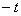

二、马尔科夫过程

1、&nbsp; 1、转移概率

[状态与状态转移概率]&nbsp; 考虑一系列随机试验，其中每次试验的结果如果出现可列个两两互斥事件<i>E</i>1,<i>E</i>2,L中的一个而且仅出现一个，则称这些事件<i>Ei</i>(<i>i</i>=1,2,L)为状态。如果<i>Ei</i>出现，就称系统处在状态<i>Ei</i>。用<i>pij</i>(<i>t</i>,<i>τ</i>)表示“已知在时刻<i>t</i>系统处在状态<i>Ei</i>的条件下，在时刻<i>τ</i>（<i>t</i>&gt;<i>τ</i>）系统处在状态<i>Ej</i>”的条件概率，称<i>pij</i>(<i>t</i>,<i>τ</i>)为转移概率。

[过程的无后效性与时齐性]&nbsp; 无后效性&nbsp; 若在已知时刻<i>t</i>0系统所处状态的条件下，在时刻<i>t</i>0以后系统将到达状态的情况与时刻<i>t</i>0以前系统所处的状态无关，则称过程为无后效的。

时齐性&nbsp; 若转移概率<i>pij</i>(<i>t</i>,<i>τ</i>)只与<i>i</i>,<i>j</i>,<i>τ</i>有关，则称过程为时齐的，简记

<i>&nbsp;&nbsp;&nbsp;&nbsp;&nbsp;&nbsp;&nbsp;&nbsp;&nbsp;&nbsp;&nbsp;&nbsp;&nbsp;&nbsp;&nbsp;
&nbsp;&nbsp;pij</i>(<i>τ</i>)=<i>pij</i>(<i>t</i>,<i>t</i>+<i>τ</i>)

