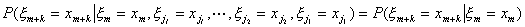

2、马尔科夫链

[马尔科夫链]&nbsp; 马尔科夫链是时间与状态都是离散的马尔科夫过程。

1° 设在一系列随机试验下，系统的可能离散状态为<i>E</i>0,<i>E</i>1,L,如果对于任意二正整数<i>k</i>,<i>m</i>,任意整数0≤<i>j</i>1&lt;<i>j</i>2&lt;L&lt;<i>j</i>l&lt;<i>m</i>,等式

都成立(表示“第<i>m</i>次试验出现<i>Em</i>”的事件)，那末称这一随机试验列为马尔科夫链，简称马氏链。

2° &nbsp;随机变量序列{<i>xn</i>}(<i>n=</i>0,1,L)为马尔科夫链的定义

设{<i>xn</i>}(<i>n=</i>0,1,L)为一随机变量序列，它们中间的每一个都可能取值(相当于所处状态<i>Ei</i>) <i>xi</i>(<i>i</i>=0,1,2,L),如果对于任意正整数<i>k</i>,<i>m</i>,任意正整数0≤<i>j</i>1&lt;<i>j</i>2&lt;L&lt;<i>jl</i>&lt;<i>m</i>,等式

成立，就称{<i>xn</i>}为马尔科夫链，简称马氏链。

通常可取{<i>xi</i>}={1,2,L}。

马氏链所刻划的随机试验序列，可以直观地理解为要验测“将来”所处的状态只要用“现在”已知的状态，而“过去”的状态不起任何作用，这就是无后效性。

马氏链，以至于马尔科夫过程都是具有无后效性的随机过程。

[马尔科夫链的转移概率矩阵]&nbsp; 如果在时刻<i>m</i>系统由状态<i>Ei</i>经过一次转移到达状态<i>Ej</i>的概率和时刻<i>m</i>无关，那末就可用<i>pij</i>表示这个一次转移概率。显然

&nbsp;&nbsp;&nbsp;&nbsp;&nbsp;&nbsp;&nbsp;&nbsp;&nbsp;&nbsp;&nbsp;&nbsp;&nbsp;&nbsp;&nbsp;&nbsp;&nbsp;
&nbsp;&nbsp;&nbsp;&nbsp;&nbsp;&nbsp;（<i>pij</i>≥0,<i>i</i>,<i>j</i>=0,1,2,L）

转移概率<i>pij</i>可排成一个转移概率矩阵

&nbsp;&nbsp;&nbsp;&nbsp;&nbsp;&nbsp;&nbsp;&nbsp;&nbsp;&nbsp;&nbsp;&nbsp;&nbsp;&nbsp;&nbsp;

这是一个每行元素和为1的非负元素的矩阵，称为马氏链的一步转移概率矩阵。

同样用表示系统由状态<i>Ei</i>经过<i>n</i>次转移而到达状态<i>Ej</i>的转移概率，

同样定义马氏链的<i>n</i>步转移概率矩阵：

由无后效性，得

称为切普曼-柯尔莫哥洛夫方程。

由切普曼-柯尔莫哥洛夫方程可以推出

<i>P</i>(<i>n</i>)=<i>Pn</i>

[闭集与状态的分类]&nbsp; 考虑时齐的马氏链。设<i>E</i>为状态空间，<i>E</i>=(<i>E</i>0,<i>E</i>1,<i>E</i>2,L),如果存在正整数<i>n</i>使得，则称<i>Ek</i>可自<i>Ej</i>到达，并记为<i>Ej</i>&THORN;<i>Ek</i>. 。如<i>Ej</i>&THORN;<i>Ek</i>且<i>Ek</i>&THORN;<i>Ej</i>，就说<i>Ej</i>，<i>Ek</i>,互通，记作<i>Ej</i>&Ucirc;<i>Ek</i>。

称<i>E</i>的子集<i>C</i>为闭集，是指<i>C</i>外的任一状态都不能自<i>C</i>内任一状态到达。设<i>E</i>是闭集，若单点集{<i>Ek</i>}成一闭集，就称<i>Ek</i>为吸引状态，若<i>E</i>内不存在真子集是闭集，称这个马氏链是不可分的。

记“系统处在状态<i>Ei</i>的条件下，经<i>n</i>步转移初次到状态<i>Ej</i>”的条件概率为，它可用转移概率表示为

&nbsp;&nbsp;&nbsp;&nbsp;&nbsp;&nbsp;&nbsp;&nbsp;&nbsp;&nbsp;&nbsp;&nbsp;&nbsp;&nbsp;&nbsp;&nbsp;&nbsp;&nbsp;&nbsp;&nbsp;

于是

记

它是“系统在开始处于状态<i>Ei</i>的条件下，经有穷次转移后终于到达状态<i>Ej</i>”的条件概率，并令

如<i>fij</i>=1,则可视<i>mij</i>为从状态<i>Ei</i>出发，初次到达状态<i>Ej</i>转移次数的数学期望

状态分类如下：

1° 如果<i>fjj</i>=1,则称<i>Ej</i>为常返的；如果<i>fjj</i>&lt;1，则称<i>Ej</i>为非常返的；

2° 设<i>Ej</i>是常返状态，若<i>mjj</i>=∞，则称<i>Ej</i>为消极常返的(或零状态)；若<i>μjj</i>&lt;∞,则称<i>Ej</i>为积极常返的(或正状态)。

3° 如果正整数集有最大公约数<i>t</i>，当<i>t</i>&gt;1,称<i>Ej</i>为周期的，或具有周期<i>t</i>;当<i>t</i>=1,则称<i>Ej</i>为非周期的。

4° 如果<i>Ej</i>是常返，非周期正状态，则称<i>Ej</i>为遍历的。

状态分类的判别法

1°&nbsp; <i>Ej</i>为非常返的充分必要条件是。

2°&nbsp; 若<i>Ej</i>是有周期<i>t</i>的常返状态，则。

3°&nbsp; 若<i>Ej</i>是遍历的，则。

4°&nbsp; 若<i>Ej</i>是常返的，则它为零状态的充分必要条件是。

[马尔科夫链的分解定理]&nbsp; 任一系统的状态空间可以分解为下列不交子集<i>D</i>,<i>C</i>1,<i>C</i>2,L之和，其中

1°&nbsp; 任一<i>Cj</i>是由常返状态构成的不可分的闭集，<i>Ci</i>中的状态不能自<i>Cj</i>(<i>i</i>≠<i>j</i>)中的状态到达；

2°&nbsp; <i>Cj</i>中的状态属同类：或者都是零的，或者都是遍历的，或者都是有周期的非零的状态(在任何一种情况下，<i>Cj</i>中各状态都有相同的周期)，而且<i>fik</i>=1(<i>Ei</i>&Icirc;<i>Cj</i>,<i>Ek</i>&Icirc;<i>Cj</i>);

3°&nbsp; <i>D</i>由一切非常返状态构成(<i>Cj</i>中的状态可能自<i>D</i>中的状态到达，反过来不行)。

[马尔科夫链的遍历性定理]&nbsp; 对于不同的类型，有如下的遍历性定理：

1°&nbsp; 若<i>Ek</i>&Icirc;<i>D</i>或<i>Ek</i>为零状态，则对任意的<i>j</i>，有

2°&nbsp; 若<i>Ek</i>是周期为<i>t</i>的正的常返状态，则对任意的<i>j</i>，有

&nbsp;
(1≤<i>r</i>≤<i>t</i>)

其中&nbsp;&nbsp;&nbsp;&nbsp;&nbsp;&nbsp;&nbsp;&nbsp;&nbsp;&nbsp;&nbsp;&nbsp;&nbsp;&nbsp;&nbsp;&nbsp;&nbsp;&nbsp;&nbsp;&nbsp;&nbsp;&nbsp;&nbsp;&nbsp;&nbsp;

表示自<i>Ej</i>出发，在某<i>n</i>步(<i>n</i>≡<i>r</i>(mod<i>t</i>))上初次到达<i>Ek</i>的概率。

3°&nbsp; 对于不可分非周期的马氏链，极限

存在，而且只能有下面两种情况：

（i）所有<i>pj</i>(出现<i>Ej</i>的概率)都大于零，此时{<i>pj</i>}是唯一的平稳分布，即概率分布{<i>pj</i>}满足

&nbsp;&nbsp;&nbsp;
（<i>j</i>=0,1,L）

（ii）所有的<i>pj</i>都等于零，此时不存在平稳分布。

