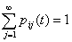
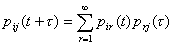
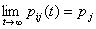
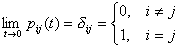
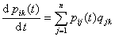
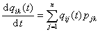
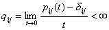

3、时间连续、状态离散的马尔科夫过程

这里只考虑时齐的马尔科夫过程。

[切尔曼-柯尔莫哥洛夫方程]&nbsp; 令<i>pij</i>(<i>t</i>)表示时间间隔为<i>t</i>、系统从状态<i>Ei</i>转移到状态<i>Ej</i>的概率，那末

，&nbsp;
<i>pij</i>(<i>t</i>)≥0

对于<i>t</i>&gt;0,<i>τ</i>&gt;0有切尔曼-柯尔莫哥洛夫方程

它是马尔科夫过程研究的基础。

[遍历性定理]&nbsp; 任何时间连续，状态有限(<i>E</i>1,L，<i>En</i>)的马尔科夫过程，如果存在一个<i>t</i>0，使得对于任何的<i>i</i>,<i>r</i>,<i>pir</i>(<i>t</i>0)&gt;0,那末极限

&nbsp;&nbsp; (0≤<i>j</i>, <i>&nbsp;i</i>≤<i>n</i>)

存在并且与<i>i</i>无关。

[柯尔莫哥洛夫的前进和后退方程]&nbsp; 如果只有有限个状态的马尔科夫过程满足

&nbsp;&nbsp;&nbsp;&nbsp;&nbsp;&nbsp;&nbsp;&nbsp;&nbsp;&nbsp;&nbsp;&nbsp;&nbsp;&nbsp;&nbsp;&nbsp;&nbsp;&nbsp;&nbsp;&nbsp;&nbsp;&nbsp;

就称它是随机连续的马尔科夫过程。

对状态有限的随机连续的马尔科夫过程，有柯尔莫哥洛夫的前进和后退方程：

&nbsp;&nbsp;&nbsp;&nbsp;&nbsp;&nbsp;&nbsp;&nbsp;&nbsp;&nbsp;&nbsp;&nbsp;&nbsp;&nbsp;&nbsp;&nbsp;&nbsp;&nbsp;&nbsp;
&nbsp;&nbsp;(前进方程)

&nbsp;&nbsp;&nbsp;&nbsp;&nbsp;&nbsp;&nbsp;&nbsp;&nbsp;&nbsp;&nbsp;&nbsp;&nbsp;&nbsp;&nbsp;&nbsp;&nbsp;&nbsp;&nbsp;
&nbsp;&nbsp;&nbsp;(后退方程)

其中

