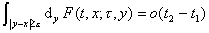
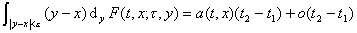
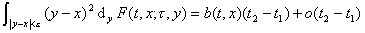
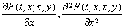
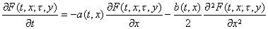
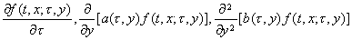
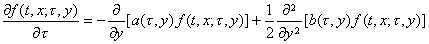

4、&nbsp; 4、扩散过程

[扩散过程的定义]&nbsp; 状态连续的马尔科夫过程{<i>x</i> (<i>t</i>)，0≤<i>t</i>&lt;∞}，如果它的条件

分布函数<i>F</i>(<i>t</i>,<i>x</i>;<i>τ</i>,<i>y</i>)对任何的<i>ε</i>&gt;0及<i>t</i>1&lt;<i>t</i>&lt;<i>t</i>2，<i>t</i>1→<i>t</i>，<i>t</i>2→<i>t</i>，关于<i>x</i>一致地成立下列三个关系：

（i）

（ii）

（iii）

就称马尔科夫过程{<i>x</i> (<i>t</i>)，0≤<i>t</i>&lt;∞}为扩散过程。

[柯尔莫哥洛夫第一方程]&nbsp; 如果扩散过程的条件分布函数<i>F</i>(<i>t,x</i>;<i>τ</i>,<i>y</i>)的偏导数

&nbsp;&nbsp;&nbsp;&nbsp;&nbsp;&nbsp;&nbsp;&nbsp;&nbsp;&nbsp;&nbsp;&nbsp;&nbsp;&nbsp;&nbsp;&nbsp;&nbsp;&nbsp;&nbsp;

存在，且对任何<i>t</i>, <i>x</i>, <i>y</i>和<i>τ</i>(<i>τ</i>&gt;<i>t</i>)连续，那末函数<i>F</i>(<i>t</i>,<i>x</i>;<i>τ</i>,<i>y</i>)满足柯尔莫哥洛夫第一方程

&nbsp;&nbsp;&nbsp;&nbsp;&nbsp;&nbsp;&nbsp;&nbsp; &nbsp;&nbsp;&nbsp;&nbsp;&nbsp;&nbsp;&nbsp;

[柯尔莫哥洛夫第二方程]&nbsp; 如果扩散过程的条件分布函数<i>F</i>(<i>t</i>,<i>x</i>;<i>τ</i>,<i>y</i>)具有分布密度<i>f</i>(<i>t</i>,<i>x</i>;<i>τ</i>,<i>y</i>),并且下面的各个偏导数

&nbsp;&nbsp;&nbsp;&nbsp;&nbsp;&nbsp;&nbsp;&nbsp;&nbsp;&nbsp;

存在且连续，那末<i>f</i>(<i>t</i>,<i>x</i>;<i>τ</i>,<i>y</i>)满足柯尔莫哥洛夫第二方程

&nbsp;&nbsp;&nbsp;&nbsp;&nbsp;&nbsp;&nbsp;&nbsp; 

