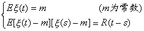
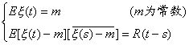
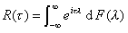
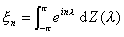

三、平稳随机过程

[弱平稳过程]&nbsp; 如果随机过程{<i>x</i> (<i>t</i>),<i>t</i>&Icirc;<i>T</i>}满足

&nbsp;&nbsp;&nbsp;&nbsp;&nbsp;&nbsp;&nbsp;&nbsp;&nbsp;&nbsp;&nbsp;&nbsp;&nbsp;

就称它是弱平稳过程(或广义的平稳过程)。

广义的平稳过程不一定是狭义的平稳过程；反过来，狭义的平稳过程也不一定是广义的平稳过程，但是如果狭义平稳过程的二阶矩存在，那末它必是广义的平稳过程。

对于正态过程来说，广义平稳性和狭义平稳性是一致的。

在理论研究中，考虑复值随机过程常常更加方便。所谓复值随机变量<i>x</i>是指<i>x =</i><i>η</i>+<i>i</i><i>x</i> ,其中<i>η</i>,<i> </i><i>x</i> 都是随机变量；而复值随机过程就是<i>x</i> (<i>t</i>)=<i>η</i>(<i>t</i>)+<i> i</i><i>x</i> (<i>t</i>),其中<i>η</i>(<i>t</i>),<i>
</i><i>x</i> (<i>t</i>)都是实值随机过程。

复值随机变量<i>x =</i><i>η</i>+<i>i</i><i>x</i> 的均值(或数学期望)定义为

两个复值随机变量<i>x</i> 1，<i>x</i> 2的相关矩定义为

复值随机过程{<i>x</i> (<i>t</i>),<i>t</i>&Icirc;<i>T</i>}的广义平稳性，是指它满足

&nbsp;&nbsp;&nbsp;&nbsp;&nbsp;&nbsp;&nbsp;&nbsp;&nbsp;&nbsp;&nbsp;&nbsp;&nbsp;&nbsp;&nbsp;&nbsp;&nbsp;

下面考虑的都是复值的广义平稳过程。

[相关函数的谱分解]&nbsp; 如果函数<i>R</i>(<i>τ</i>)是某一均方连续平稳过程{<i>x</i> (<i>t</i>),
&lt;<i>t</i>&lt;}的相关函数，那末

&nbsp;&nbsp;&nbsp;&nbsp;&nbsp;&nbsp;&nbsp;&nbsp;&nbsp;&nbsp;&nbsp;&nbsp;&nbsp;&nbsp;&nbsp;&nbsp;&nbsp;&nbsp;
&nbsp;&nbsp;&nbsp;

其中<i>F</i>(<i>λ</i>)是有界不减函数，满足<i></i>,称为平稳过程{<i>x </i>(<i>t</i>),&lt;<i>t</i>&lt;}的谱函数(工程上称为频谱)。

如果<i>F</i>(<i>λ</i>)绝对连续，记，称<i></i>为谱密度(工程上称为频谱密度)，这时

&nbsp;&nbsp;&nbsp;&nbsp;&nbsp;&nbsp;&nbsp;&nbsp;&nbsp;&nbsp;&nbsp;&nbsp;&nbsp;&nbsp;&nbsp;&nbsp;&nbsp;&nbsp;&nbsp;&nbsp;&nbsp;&nbsp;&nbsp;

当{<i>x</i> (<i>t</i>),
&lt;<i>t</i>&lt;}是实值平稳过程时，相关函数<i>R</i>(<i>τ</i>)可以表示成

&nbsp;&nbsp;&nbsp;&nbsp;&nbsp;&nbsp;&nbsp;&nbsp;&nbsp;&nbsp;&nbsp;&nbsp;&nbsp;&nbsp;&nbsp;&nbsp;&nbsp;&nbsp;&nbsp;

或(当谱密度存在时)

&nbsp;&nbsp;&nbsp;&nbsp;&nbsp;&nbsp;&nbsp;&nbsp;&nbsp;&nbsp;&nbsp;&nbsp;&nbsp;&nbsp;&nbsp;&nbsp;&nbsp;&nbsp;&nbsp;&nbsp;&nbsp;&nbsp;&nbsp;

其中<i>F</i>1(<i>λ</i>)=2<i>F</i>(<i>λ</i>)+<i>c</i>(<i>c</i>为常数)，。

特别，对复值平稳序列{<i>x n</i>, <i>n</i>=0,±1,L}有

&nbsp;&nbsp;&nbsp;&nbsp;&nbsp;&nbsp;&nbsp;&nbsp;&nbsp;&nbsp;&nbsp;&nbsp;&nbsp;&nbsp;&nbsp;&nbsp;
&nbsp;&nbsp;&nbsp;&nbsp;(<i>k</i>=0,±1,L)

其中谱函数<i>F</i>(<i>λ</i>)满足

&nbsp;&nbsp;&nbsp;&nbsp;&nbsp;&nbsp;&nbsp;&nbsp;&nbsp;&nbsp;&nbsp;&nbsp;&nbsp;&nbsp;&nbsp;&nbsp;&nbsp;&nbsp;&nbsp;
&nbsp;<i>F</i>()=0,&nbsp;&nbsp;&nbsp; &nbsp;<i>F</i>(<i>p</i>)=<i>R</i>(0)

[遍历性定理]

1°
&nbsp;如果{<i>x</i> (<i>t</i>),-∞&lt;<i>t</i>&lt;∞}是均方连续的平稳过程，那末

&nbsp;&nbsp;&nbsp;&nbsp;&nbsp;&nbsp;&nbsp;&nbsp;&nbsp;&nbsp;&nbsp;&nbsp;&nbsp;&nbsp;&nbsp;&nbsp;&nbsp;&nbsp;&nbsp;

的充分必要条件是：

&nbsp;&nbsp;&nbsp;&nbsp;&nbsp;&nbsp;&nbsp;&nbsp;&nbsp;&nbsp;&nbsp;&nbsp;&nbsp;&nbsp;&nbsp;&nbsp;&nbsp;&nbsp;&nbsp;&nbsp;&nbsp;&nbsp;&nbsp;

2°&nbsp;
如果{<i>x n</i>, <i>n</i>=0,±1,L}是平稳序列，那末

&nbsp;&nbsp;&nbsp;&nbsp;&nbsp;&nbsp;&nbsp;&nbsp;&nbsp;&nbsp;&nbsp;&nbsp;&nbsp;&nbsp;&nbsp;&nbsp;&nbsp;&nbsp;&nbsp;&nbsp;
&nbsp;

的充分必要条件是：

&nbsp;&nbsp;&nbsp;&nbsp;&nbsp;&nbsp;&nbsp;&nbsp;&nbsp;&nbsp;&nbsp;&nbsp;&nbsp;&nbsp;&nbsp;&nbsp;&nbsp;&nbsp;&nbsp;&nbsp;&nbsp;&nbsp;&nbsp;&nbsp;&nbsp;&nbsp;&nbsp;

3°&nbsp; 如果{<i>x</i> (<i>t</i>),-∞&lt;<i>t</i>&lt;∞}是均值为零的均方连续的平稳过程，又对取定的常数&nbsp; <i>t </i>&gt;0,也是均方连续的平稳过程，记其相关函数为<i>R</i><i>t</i> (<i>u</i>),那末

&nbsp;&nbsp;&nbsp;&nbsp;&nbsp;&nbsp;&nbsp;&nbsp;&nbsp;&nbsp;&nbsp;&nbsp;&nbsp;

的充分必要条件是：

&nbsp;&nbsp;&nbsp;&nbsp;&nbsp;&nbsp;&nbsp;&nbsp;&nbsp;&nbsp;&nbsp;&nbsp;&nbsp;&nbsp;&nbsp;&nbsp;&nbsp;&nbsp;&nbsp;&nbsp;&nbsp;&nbsp;&nbsp;&nbsp;&nbsp;&nbsp;&nbsp;&nbsp;

4°&nbsp;
如果{<i></i> <i>n</i>=0,±1,L}是均值为零的平稳序列，又对取定的整数<i>m</i>, <i>n</i>=0,±1,L}也是平稳序列，记其相关函数为<i>Rm</i>(<i>k</i>),那末

&nbsp;&nbsp;&nbsp;&nbsp;&nbsp;&nbsp;&nbsp;&nbsp;&nbsp;&nbsp;&nbsp;&nbsp;&nbsp;&nbsp;&nbsp;&nbsp;&nbsp;&nbsp;&nbsp;&nbsp;&nbsp;&nbsp;&nbsp;

的充分必要条件是：

&nbsp;&nbsp;&nbsp;&nbsp;&nbsp;&nbsp;&nbsp;&nbsp;&nbsp;&nbsp;&nbsp;&nbsp;&nbsp;&nbsp;&nbsp;&nbsp;&nbsp;&nbsp;&nbsp;&nbsp;&nbsp;&nbsp;&nbsp;&nbsp;&nbsp;&nbsp;&nbsp;&nbsp;&nbsp;

遍历性定理表明，对于平稳过程，只要它满足定理的条件(在实际中它们是常常能够满足的)，那末对样本空间的平均(如均值、相关矩等)可以用对时间的平均来代替，更具体地说，只要用平稳过程在足够长时间的一次实现，就可以确定过程的均值和相关函数。这正是遍历性定理在实用上重要的原因。

[平稳过程的谱展式]&nbsp; 如果{<i>x </i>(<i>t</i>),-∞&lt;<i>t</i>&lt;∞}是均值为零的均方连续平稳过程，那末有

&nbsp;&nbsp;&nbsp;&nbsp;&nbsp;&nbsp;&nbsp;&nbsp;&nbsp;&nbsp;&nbsp;&nbsp;&nbsp;&nbsp;&nbsp;&nbsp;&nbsp;&nbsp;&nbsp;&nbsp;&nbsp;&nbsp;&nbsp;

其中&nbsp;&nbsp;&nbsp;&nbsp;&nbsp;&nbsp;&nbsp;&nbsp;&nbsp;&nbsp;&nbsp;&nbsp;&nbsp;&nbsp;&nbsp;&nbsp;&nbsp;
&nbsp;&nbsp;

满足 &nbsp;（i）<i>EZ</i>(l)=0

&nbsp;&nbsp;&nbsp;&nbsp;&nbsp; （ii）当区间与不相重叠时

&nbsp;&nbsp;&nbsp;&nbsp;&nbsp;&nbsp;&nbsp;&nbsp;&nbsp;&nbsp;&nbsp;&nbsp;&nbsp;&nbsp;

(即<i>Z</i>(<i>l</i> )是具正交增量的过程)

&nbsp;&nbsp;&nbsp;&nbsp; &nbsp;（iii）&nbsp;
&nbsp;&nbsp;(<i>F</i>(<i>l</i> )是谱函数)

<i>Z</i>(<i>l</i> )称为<i>x</i> (<i>t</i>)的随机谱函数，<i>x </i>(<i>t</i>)的积分表示式称为<i>x</i> (<i>t</i>)的谱展式。

特别，如果<i>x </i>(<i>t</i>)是实值均方连续平稳过程，那末有

&nbsp;&nbsp;&nbsp;&nbsp;&nbsp;&nbsp;&nbsp;&nbsp;&nbsp;&nbsp;&nbsp;&nbsp;&nbsp;&nbsp;

其中&nbsp;&nbsp;&nbsp;&nbsp;&nbsp;&nbsp;&nbsp;&nbsp;&nbsp;&nbsp;&nbsp;&nbsp;&nbsp;&nbsp;

&nbsp;&nbsp;&nbsp;&nbsp;&nbsp;&nbsp;&nbsp;&nbsp;&nbsp;&nbsp;&nbsp;&nbsp;&nbsp;&nbsp;&nbsp;&nbsp;&nbsp;

满足 （i）<i>EZ</i>1(<i>l</i> )=<i>EZ</i>2(<i>l</i> )=0,

&nbsp;&nbsp;&nbsp; &nbsp;（ii）当区间与不相重叠时

&nbsp;&nbsp;&nbsp;&nbsp;&nbsp;&nbsp;&nbsp; &nbsp;&nbsp;(<i>j</i>,<i>k</i>=1,2)

&nbsp;&nbsp;&nbsp; &nbsp;（iii）

(<i>F</i>(<i>l </i>)是谱函数)

如果{<i>x n</i>, <i>n</i>=0,±1,L}是均值为零的平稳序列，那末有

&nbsp;&nbsp;&nbsp;&nbsp;&nbsp;&nbsp;&nbsp;&nbsp;&nbsp;&nbsp;&nbsp;&nbsp;&nbsp;&nbsp;&nbsp;&nbsp;&nbsp;&nbsp;&nbsp;&nbsp;&nbsp;&nbsp;&nbsp;&nbsp;&nbsp;&nbsp;

其中随机谱函数<i>Z</i>(<i>l</i> )是

&nbsp;&nbsp;&nbsp;&nbsp;&nbsp;&nbsp;&nbsp;&nbsp;&nbsp;&nbsp;&nbsp;&nbsp;
&nbsp;&nbsp;（-<i>p </i>≤<i>λ</i>≤<i>p</i>）

它也满足类似于均方连续平稳过程的随机谱函数的性质（i）~(iii)。

