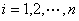
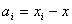

<b>第十七章</b><b>&nbsp;&nbsp; </b><b>误差理论与实验数据处理</b>

在科学实验和生产实际中，为了掌握事物发展的规律性，总是通过各种方法对我们所需要的量观测记录下许多数据，但是由于外界的随机干扰，这些数据实际上是带有随机误差的近似数据，对这些近似数据必须根据需要进行合适的处理。一方面必须估计观测数据的可靠程度，并给以合理的解释；另一方面，还必须将所得数据加以整理归纳，用一定的方式表示出各数值之间的相互关系，或者对带有误差(噪声)的数据(信号)进行分析处理，把干扰“过滤”掉，得出真正需要的量。前者需要误差理论的基础知识(如高斯误差定律、各种平均值的计算法、误差的表示法、误差传递定律和近似计算法则等)，后者则需要处理数据的基本技术(如插值法、曲线拟合的方法、实验曲线的光滑法和滤波方法等)。本章介绍了这些方法的主要内容。&nbsp;&nbsp;&nbsp;&nbsp;&nbsp;&nbsp;&nbsp;&nbsp;&nbsp;&nbsp;&nbsp;&nbsp;&nbsp;&nbsp;&nbsp;&nbsp;&nbsp;&nbsp;&nbsp;&nbsp;&nbsp;&nbsp;&nbsp;&nbsp;&nbsp;&nbsp;&nbsp;&nbsp;&nbsp;&nbsp;&nbsp;&nbsp;&nbsp;&nbsp;&nbsp;&nbsp;&nbsp;

<b>§</b><b>1&nbsp; </b><b>误 差 理 论</b>

一、&nbsp;&nbsp;&nbsp; 一、观测误差

[真值与误差]&nbsp; 观测对象的量是客观存在的，称为真值。每次观测所得数值称为观测值。设观测对象的真值为， 观测值为(),则差数&nbsp;&nbsp;&nbsp;&nbsp;&nbsp;&nbsp;&nbsp;&nbsp;&nbsp;&nbsp;&nbsp;&nbsp;&nbsp;&nbsp;&nbsp;&nbsp;&nbsp;&nbsp;&nbsp;&nbsp;&nbsp;&nbsp;&nbsp;&nbsp;&nbsp;&nbsp;&nbsp;&nbsp;&nbsp;&nbsp;&nbsp;&nbsp;&nbsp;&nbsp;&nbsp;&nbsp;&nbsp;&nbsp;&nbsp;&nbsp;&nbsp;&nbsp;&nbsp;&nbsp;&nbsp;&nbsp;&nbsp;&nbsp;&nbsp;&nbsp;&nbsp;&nbsp;&nbsp;&nbsp;&nbsp;&nbsp;&nbsp;&nbsp;&nbsp;&nbsp;&nbsp;&nbsp;&nbsp;&nbsp;&nbsp;&nbsp;&nbsp;&nbsp;

&nbsp; ()

称为观测误差，简称为误差。

[误差的分类与鉴别]

<table class=MsoNormalTable border=1 cellspacing=0 cellpadding=0
 style='border-collapse:collapse;border:none'>
 <tr>
  <td width=60 valign=top style='width:45.0pt;border:solid windowtext 1.0pt;
  padding:0mm 5.4pt 0mm 5.4pt'>
  
分类

  </td>
  <td width=216 valign=top style='width:162.0pt;border:solid windowtext 1.0pt;
  border-left:none;padding:0mm 5.4pt 0mm 5.4pt'>
  
误差的原因

  </td>
  <td width=348 valign=top style='width:261.0pt;border:solid windowtext 1.0pt;
  border-left:none;padding:0mm 5.4pt 0mm 5.4pt'>
  
误差的鉴别

  </td>
 </tr>
 <tr>
  <td width=60 valign=top style='width:45.0pt;border:solid windowtext 1.0pt;
  border-top:none;padding:0mm 5.4pt 0mm 5.4pt'>
  
系

  
统

  
误

  
差

  </td>
  <td width=216 valign=top style='width:162.0pt;border-top:none;border-left:
  none;border-bottom:solid windowtext 1.0pt;border-right:solid windowtext 1.0pt;
  padding:0mm 5.4pt 0mm 5.4pt'>
  
&nbsp;(i)仪器结构的不良

  
&nbsp;(ii) 周围环境的改变

  </td>
  <td width=348 valign=top style='width:261.0pt;border-top:none;border-left:
  none;border-bottom:solid windowtext 1.0pt;border-right:solid windowtext 1.0pt;
  padding:0mm 5.4pt 0mm 5.4pt'>
  
&nbsp;(i)&nbsp; 观测值总往一个方向偏差

  
&nbsp;(ii) 误差的大小和符号在重复多次观&nbsp;&nbsp; 测中几乎相同

  
&nbsp;(iii) 经过校正和处理可以消除误差

  </td>
 </tr>
 <tr>
  <td width=60 valign=top style='width:45.0pt;border:solid windowtext 1.0pt;
  border-top:none;padding:0mm 5.4pt 0mm 5.4pt'>
  
随

  
机

  
误

  
差

  </td>
  <td width=216 valign=top style='width:162.0pt;border-top:none;border-left:
  none;border-bottom:solid windowtext 1.0pt;border-right:solid windowtext 1.0pt;
  padding:0mm 5.4pt 0mm 5.4pt'>
  
&nbsp;&nbsp;
  某些难以控制的偶然因素造成的

  </td>
  <td width=348 valign=top style='width:261.0pt;border-top:none;border-left:
  none;border-bottom:solid windowtext 1.0pt;border-right:solid windowtext 1.0pt;
  padding:0mm 5.4pt 0mm 5.4pt'>
  
&nbsp;&nbsp;
  观测值变化无常，但在等精度观测下有如下规律(即随机误差服从正态分布，参考本节,四)：

  
&nbsp;(i)&nbsp; 误差绝对值不会超过一定界限

  
&nbsp;(ii) 绝对值小的误差比绝对值大的误差出现的个数要多，近于零的误差出现的个数最多

  
&nbsp;(iii) 绝对值相等的正误差与负误差出现的个数几乎相等

  
&nbsp;(iv) 误差的算术平均值,随着观测次数的增加而趋近于零

  </td>
 </tr>
 <tr>
  <td width=60 valign=top style='width:45.0pt;border:solid windowtext 1.0pt;
  border-top:none;padding:0mm 5.4pt 0mm 5.4pt'>
  
过

  
失

  
误

  
差

  </td>
  <td width=216 valign=top style='width:162.0pt;border-top:none;border-left:
  none;border-bottom:solid windowtext 1.0pt;border-right:solid windowtext 1.0pt;
  padding:0mm 5.4pt 0mm 5.4pt'>
  
&nbsp;&nbsp;
  粗枝大叶造成的观测误差或计算误差

  </td>
  <td width=348 valign=top style='width:261.0pt;border-top:none;border-left:
  none;border-bottom:solid windowtext 1.0pt;border-right:solid windowtext 1.0pt;
  padding:0mm 5.4pt 0mm 5.4pt'>
  
&nbsp;(i) 观测结果与事实不符

  
&nbsp;(ii)认真操作可以消除误差

  </td>
 </tr>
</table>

[观测的准确度与精确度]&nbsp; 如果观测的系统误差小，则称观测的准确度高，可以使用更精确的仪器来提高观测的准确度。如果观测的随机误差小，则称观测的精密度高，可以增加观测次数取其平均值来提高观测的精密度。

本章所指的误差都是随机误差。

