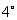
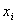
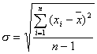
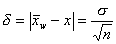
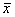

二、平均值及其精密度指标

[常用平均值的求法]&nbsp; 设是某观测对象的一组观测数据。

<table class=MsoNormalTable border=1 cellspacing=0 cellpadding=0
 style='border-collapse:collapse;border:none'>
 <tr>
  <td width=60 valign=top style='width:45.0pt;border:solid windowtext 1.0pt;
  padding:0mm 5.4pt 0mm 5.4pt'>
  
名称

  </td>
  <td width=240 valign=top style='width:180.0pt;border:solid windowtext 1.0pt;
  border-left:none;padding:0mm 5.4pt 0mm 5.4pt'>
  
定义与符号

  </td>
  <td width=324 valign=top style='width:243.0pt;border:solid windowtext 1.0pt;
  border-left:none;padding:0mm 5.4pt 0mm 5.4pt'>
  
用途与说明

  </td>
 </tr>
 <tr>
  <td width=60 valign=top style='width:45.0pt;border:solid windowtext 1.0pt;
  border-top:none;padding:0mm 5.4pt 0mm 5.4pt'>
  
算

  
术

  
平

  
均

  
值

  </td>
  <td width=240 valign=top style='width:180.0pt;border-top:none;border-left:
  none;border-bottom:solid windowtext 1.0pt;border-right:solid windowtext 1.0pt;
  padding:0mm 5.4pt 0mm 5.4pt'>
  
&nbsp;

  
&nbsp;&nbsp;
  

  </td>
  <td width=324 valign=top style='width:243.0pt;border-top:none;border-left:
  none;border-bottom:solid windowtext 1.0pt;border-right:solid windowtext 1.0pt;
  padding:0mm 5.4pt 0mm 5.4pt'>
  
&nbsp; 它在最小二乘法意义下是所求真值的最佳近似,是最常用的一种平均值

  </td>
 </tr>
 <tr>
  <td width=60 valign=top style='width:45.0pt;border:solid windowtext 1.0pt;
  border-top:none;padding:0mm 5.4pt 0mm 5.4pt'>
  
简

  
算

  
平

  
均

  
值

  </td>
  <td width=240 valign=top style='width:180.0pt;border-top:none;border-left:
  none;border-bottom:solid windowtext 1.0pt;border-right:solid windowtext 1.0pt;
  padding:0mm 5.4pt 0mm 5.4pt'>
  
&nbsp;

  
&nbsp;设，则

  
&nbsp;

  
式中是组数, <i>A</i>是常数, <i>c</i>是组距,是第<i>i</i>组的频数，且

  
&nbsp;&nbsp;&nbsp;&nbsp;&nbsp;&nbsp;&nbsp;&nbsp;
  

  
是第<i>i</i>组的组中值（即该组上下限的平均值）

  </td>
  <td width=324 valign=top style='width:243.0pt;border-top:none;border-left:
  none;border-bottom:solid windowtext 1.0pt;border-right:solid windowtext 1.0pt;
  padding:0mm 5.4pt 0mm 5.4pt'>
  
&nbsp;&nbsp;数据较多时,算术平均值常用此法计算

  
&nbsp;&nbsp;组数和组距根据数据的极差

  
适当选取

  
&nbsp;&nbsp;采取等组距c

  
&nbsp;&nbsp;变换中的<i>A</i>常取为处在中间组的组中值

  </td>
 </tr>
 <tr>
  <td width=60 valign=top style='width:45.0pt;border:solid windowtext 1.0pt;
  border-top:none;padding:0mm 5.4pt 0mm 5.4pt'>
  
几

  
何

  
平

  
均

  
值

  </td>
  <td width=240 valign=top style='width:180.0pt;border-top:none;border-left:
  none;border-bottom:solid windowtext 1.0pt;border-right:solid windowtext 1.0pt;
  padding:0mm 5.4pt 0mm 5.4pt'>
  
或

  

  </td>
  <td width=324 valign=top style='width:243.0pt;border-top:none;border-left:
  none;border-bottom:solid windowtext 1.0pt;border-right:solid windowtext 1.0pt;
  padding:0mm 5.4pt 0mm 5.4pt'>
  
&nbsp;当对一组观测值取常用对数所得图形的分布曲线更为对称(同比较)时，常用此法

  </td>
 </tr>
 <tr>
  <td width=60 valign=top style='width:45.0pt;border:solid windowtext 1.0pt;
  border-top:none;padding:0mm 5.4pt 0mm 5.4pt'>
  
加

  
权

  
平

  
均

  
值

  </td>
  <td width=240 valign=top style='width:180.0pt;border-top:none;border-left:
  none;border-bottom:solid windowtext 1.0pt;border-right:solid windowtext 1.0pt;
  padding:0mm 5.4pt 0mm 5.4pt'>
  
&nbsp; 

  
式中是第<i>i</i>个观测值的对应权

  </td>
  <td width=324 valign=top style='width:243.0pt;border-top:none;border-left:
  none;border-bottom:solid windowtext 1.0pt;border-right:solid windowtext 1.0pt;
  padding:0mm 5.4pt 0mm 5.4pt'>
  
&nbsp; 计算用不同方法或不同条件观测同一物理量的均值时，常对不同可靠程度的数据给予不同的“权”

  </td>
 </tr>
 <tr>
  <td width=60 valign=top style='width:45.0pt;border:solid windowtext 1.0pt;
  border-top:none;padding:0mm 5.4pt 0mm 5.4pt'>
  
中

  
位

  
数

  </td>
  <td width=240 valign=top style='width:180.0pt;border-top:none;border-left:
  none;border-bottom:solid windowtext 1.0pt;border-right:solid windowtext 1.0pt;
  padding:0mm 5.4pt 0mm 5.4pt'>
  
&nbsp; 观测值依大小顺序排列后处在中间位置的值。当<i>n</i>为偶数时，取为中间两数的算术平均

  </td>
  <td width=324 valign=top style='width:243.0pt;border-top:none;border-left:
  none;border-bottom:solid windowtext 1.0pt;border-right:solid windowtext 1.0pt;
  padding:0mm 5.4pt 0mm 5.4pt'>
  
&nbsp; 它是一种顺序统计量，能反映匀称观测值的取值中心

  </td>
 </tr>
</table>

&nbsp;&nbsp;&nbsp; [算术平均值与离差]&nbsp; 观测对象的真值<i>x</i>可以用<i>n</i>次观测值的算术平均值.

近似代替，并用离差

代替误差。离差与误差有如下关系

&nbsp;&nbsp;&nbsp;&nbsp;&nbsp;&nbsp;&nbsp;&nbsp;&nbsp;&nbsp;&nbsp;&nbsp;&nbsp;&nbsp;&nbsp;&nbsp;&nbsp;&nbsp;&nbsp;&nbsp;&nbsp;&nbsp;&nbsp;&nbsp;&nbsp;

&nbsp;&nbsp; (当<i>n</i>相当大)

&nbsp;[平均值的精密度指标]

<table class=MsoNormalTable border=1 cellspacing=0 cellpadding=0
 style='border-collapse:collapse;border:none'>
 <tr>
  <td width=96 valign=top style='width:72.0pt;border:solid windowtext 1.0pt;
  padding:0mm 5.4pt 0mm 5.4pt'>
  
&nbsp; 

  </td>
  <td width=216 valign=top style='width:162.0pt;border:solid windowtext 1.0pt;
  border-left:none;padding:0mm 5.4pt 0mm 5.4pt'>
  
相同精密度的观测

  </td>
  <td width=304 valign=top style='width:228.0pt;border:solid windowtext 1.0pt;
  border-left:none;padding:0mm 5.4pt 0mm 5.4pt'>
  
不同精密度的观测

  </td>
 </tr>
 <tr style='height:245.15pt'>
  <td width=96 valign=top style='width:72.0pt;border:solid windowtext 1.0pt;
  border-top:none;padding:0mm 5.4pt 0mm 5.4pt;height:245.15pt'>
  
观测值

  
权

  
平均值

  
标准差

  
真值<i>x</i>对算术平均值的误差

  </td>
  <td width=216 valign=top style='width:162.0pt;border-top:none;border-left:
  none;border-bottom:solid windowtext 1.0pt;border-right:solid windowtext 1.0pt;
  padding:0mm 5.4pt 0mm 5.4pt;height:245.15pt'>
  
&nbsp;
  &nbsp;&nbsp;&nbsp;

  
&nbsp;&nbsp;&nbsp;&nbsp;&nbsp;&nbsp;&nbsp;&nbsp;&nbsp;&nbsp;&nbsp;
  1

  
算术平均值

  
&nbsp;&nbsp;&nbsp;&nbsp;&nbsp;
  

  
&nbsp;&nbsp;&nbsp;
  

  
&nbsp;&nbsp;&nbsp;&nbsp;
  

  
&nbsp;&nbsp;&nbsp;&nbsp;
  

  </td>
  <td width=304 valign=top style='width:228.0pt;border-top:none;border-left:
  none;border-bottom:solid windowtext 1.0pt;border-right:solid windowtext 1.0pt;
  padding:0mm 5.4pt 0mm 5.4pt;height:245.15pt'>
  
&nbsp;&nbsp;&nbsp;&nbsp;
  &nbsp;&nbsp;&nbsp;

  
&nbsp;
  &nbsp;&nbsp;&nbsp;&nbsp;&nbsp;&nbsp;

  
加权平均值

  
&nbsp;&nbsp;&nbsp;&nbsp;
  

  
&nbsp;&nbsp;&nbsp;&nbsp;
  

  
&nbsp;&nbsp;&nbsp;&nbsp;&nbsp;&nbsp;
  

  
&nbsp;&nbsp;&nbsp;&nbsp;&nbsp;&nbsp;
  

  </td>
 </tr>
</table>

&nbsp;的值愈小，表明观测值的平均值(或)与真值<i>x</i>的偏差愈小，精密度愈高，即平均值可信赖的程度愈高。

