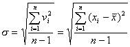

三、误差的表示法

设是某观测对象的一组观测数据。其算术平均值

&nbsp;&nbsp;&nbsp;&nbsp;&nbsp;&nbsp;&nbsp;&nbsp;&nbsp;&nbsp;&nbsp;&nbsp;&nbsp;&nbsp;&nbsp;&nbsp;&nbsp;&nbsp;&nbsp;&nbsp;&nbsp;&nbsp;

误差，离差，真值对平均值的误差。

<table class=MsoNormalTable border=1 cellspacing=0 cellpadding=0
 style='border-collapse:collapse;border:none'>
 <tr>
  <td width=96 valign=top style='width:72.0pt;border:solid windowtext 1.0pt;
  padding:0mm 5.4pt 0mm 5.4pt'>
  
名称与记号

  </td>
  <td width=216 valign=top style='width:162.0pt;border:solid windowtext 1.0pt;
  border-left:none;padding:0mm 5.4pt 0mm 5.4pt'>
  
定义与表示法

  </td>
  <td width=304 valign=top style='width:228.0pt;border:solid windowtext 1.0pt;
  border-left:none;padding:0mm 5.4pt 0mm 5.4pt'>
  
特&nbsp;&nbsp;&nbsp;&nbsp; 点

  </td>
 </tr>
 <tr>
  <td width=96 valign=top style='width:72.0pt;border:solid windowtext 1.0pt;
  border-top:none;padding:0mm 5.4pt 0mm 5.4pt'>
  
[标准误差]

  
(中误差或均方误差)

  

  </td>
  <td width=216 valign=top style='width:162.0pt;border-top:none;border-left:
  none;border-bottom:solid windowtext 1.0pt;border-right:solid windowtext 1.0pt;
  padding:0mm 5.4pt 0mm 5.4pt'>
  
&nbsp;&nbsp;
  各个误差平方和的平均值的平方根，即

  

  
&nbsp; 当观测次数较大时

  

  
显然

  </td>
  <td width=304 valign=top style='width:228.0pt;border-top:none;border-left:
  none;border-bottom:solid windowtext 1.0pt;border-right:solid windowtext 1.0pt;
  padding:0mm 5.4pt 0mm 5.4pt'>
  
&nbsp;&nbsp;
  不取决于观测中个别误差的符号，对观测值中的较大误差或较小误差感觉比较灵敏，是表示精密度的较好方法

  </td>
 </tr>
 <tr>
  <td width=96 valign=top style='width:72.0pt;border:solid windowtext 1.0pt;
  border-top:none;padding:0mm 5.4pt 0mm 5.4pt'>
  
[平均误差]

  

  </td>
  <td width=216 valign=top style='width:162.0pt;border-top:none;border-left:
  none;border-bottom:solid windowtext 1.0pt;border-right:solid windowtext 1.0pt;
  padding:0mm 5.4pt 0mm 5.4pt'>
  
离差的绝对值的算术平均值

  

  </td>
  <td width=304 valign=top style='width:228.0pt;border-top:none;border-left:
  none;border-bottom:solid windowtext 1.0pt;border-right:solid windowtext 1.0pt;
  padding:0mm 5.4pt 0mm 5.4pt'>
  
&nbsp; 优点是计算简单，缺点是无法表示出各次观测间彼此符合的情况。例如一组观测中偏差彼此接近，而另一组观测中偏差有大中小三种。但在这两组不同的观测中所得平均误差可能相同。所以只有当<i>n</i>很大时才较可靠

  </td>
 </tr>
 <tr>
  <td width=96 valign=top style='width:72.0pt;border:solid windowtext 1.0pt;
  border-top:none;padding:0mm 5.4pt 0mm 5.4pt'>
  
[概率误差]

  

  </td>
  <td width=216 valign=top style='width:162.0pt;border-top:none;border-left:
  none;border-bottom:solid windowtext 1.0pt;border-right:solid windowtext 1.0pt;
  padding:0mm 5.4pt 0mm 5.4pt'>
  
&nbsp; 它是这样一个数，绝对值比它大的误差和绝对值比它小的误差出现的可能性一样大，即

  

  </td>
  <td width=304 valign=top style='width:228.0pt;border-top:none;border-left:
  none;border-bottom:solid windowtext 1.0pt;border-right:solid windowtext 1.0pt;
  padding:0mm 5.4pt 0mm 5.4pt'>
  
&nbsp; 将误差按绝对值的大小顺序排列后，序列的中位数就是概率误差。

  
&nbsp; 按排列方式来求概率误差，在工作上比较困难，同时只有当<i>n</i>的值很大时才较可靠。

  </td>
 </tr>
</table>

&nbsp;&nbsp; [标准误差、平均误差、概率误差三者关系]

