

四、高斯误差定律

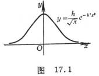[高斯误差方程]&nbsp; 随机误差的分布密度函数为正态分布密度函数&nbsp;&nbsp;&nbsp;&nbsp;&nbsp;&nbsp;&nbsp;&nbsp;&nbsp;&nbsp;&nbsp;&nbsp;&nbsp;&nbsp;&nbsp;&nbsp;&nbsp;

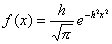

<pre>&nbsp; 它称为高斯误差方程，其图形称为误差曲线</pre><pre>&nbsp; (图17.1)，式中</pre><pre>&nbsp; 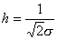&nbsp;&nbsp;&nbsp;&nbsp;(是标准误差)</pre><pre>&nbsp; 称为精密度指数。</pre><pre>&nbsp; 误差曲线是一条连续曲线，当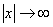时，</pre><pre>&nbsp; 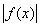递降趋于零。</pre>

&nbsp; 根据实际情况选取的一个值作为界限，<i>x</i>超过这个界限的值非常小，被认为等于零。就被认为是正负误差的极大值，而一般误差值就是介于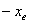与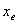之间的任何值，它们的概率就是这个区间上的值。

&nbsp;&nbsp;&nbsp; &nbsp;绝对值相等的正负误差，出现的概率相等。

&nbsp;&nbsp;&nbsp; &nbsp;绝对值小的误差比绝对值大的误差，概率较大。

<pre>&nbsp;&nbsp; [误差概率表及其用途]&nbsp; 令表示误差，表示标准误差，对于不同的<i>t,</i>概率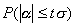的取值如下表。</pre>

&nbsp;&nbsp;&nbsp;&nbsp;&nbsp;&nbsp;&nbsp;&nbsp;&nbsp;&nbsp;&nbsp;&nbsp;&nbsp;&nbsp;&nbsp;&nbsp;&nbsp;&nbsp;&nbsp;&nbsp;&nbsp;&nbsp;
误&nbsp; 差&nbsp; 概&nbsp; 率&nbsp; 表

<table class=MsoNormalTable border=1 cellspacing=0 cellpadding=0
 style='border-collapse:collapse;border:none'>
 <tr style='height:29.3pt'>
  <td width=110 style='width:82.8pt;border:solid windowtext 1.0pt;padding:0mm 5.4pt 0mm 5.4pt;
  height:29.3pt'>
  
误差限

  </td>
  <td width=110 style='width:82.8pt;border:solid windowtext 1.0pt;border-left:
  none;padding:0mm 5.4pt 0mm 5.4pt;height:29.3pt'>
  
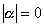

  </td>
  <td width=110 style='width:82.8pt;border:solid windowtext 1.0pt;border-left:
  none;padding:0mm 5.4pt 0mm 5.4pt;height:29.3pt'>
  
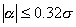

  </td>
  <td width=110 style='width:82.8pt;border:solid windowtext 1.0pt;border-left:
  none;padding:0mm 5.4pt 0mm 5.4pt;height:29.3pt'>
  
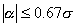

  </td>
  <td width=110 style='width:82.8pt;border:solid windowtext 1.0pt;border-left:
  none;padding:0mm 5.4pt 0mm 5.4pt;height:29.3pt'>
  
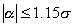

  </td>
 </tr>
 <tr style='height:25.5pt'>
  <td width=110 style='width:82.8pt;border:solid windowtext 1.0pt;border-top:
  none;padding:0mm 5.4pt 0mm 5.4pt;height:25.5pt'>
  
概率

  </td>
  <td width=110 style='width:82.8pt;border-top:none;border-left:none;
  border-bottom:solid windowtext 1.0pt;border-right:solid windowtext 1.0pt;
  padding:0mm 5.4pt 0mm 5.4pt;height:25.5pt'>
  
0.00

  </td>
  <td width=110 style='width:82.8pt;border-top:none;border-left:none;
  border-bottom:solid windowtext 1.0pt;border-right:solid windowtext 1.0pt;
  padding:0mm 5.4pt 0mm 5.4pt;height:25.5pt'>
  
25%

  </td>
  <td width=110 style='width:82.8pt;border-top:none;border-left:none;
  border-bottom:solid windowtext 1.0pt;border-right:solid windowtext 1.0pt;
  padding:0mm 5.4pt 0mm 5.4pt;height:25.5pt'>
  
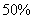

  </td>
  <td width=110 style='width:82.8pt;border-top:none;border-left:none;
  border-bottom:solid windowtext 1.0pt;border-right:solid windowtext 1.0pt;
  padding:0mm 5.4pt 0mm 5.4pt;height:25.5pt'>
  
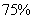

  </td>
 </tr>
 <tr style='height:25.15pt'>
  <td width=110 style='width:82.8pt;border:solid windowtext 1.0pt;border-top:
  none;padding:0mm 5.4pt 0mm 5.4pt;height:25.15pt'>
  
误差限

  </td>
  <td width=110 style='width:82.8pt;border-top:none;border-left:none;
  border-bottom:solid windowtext 1.0pt;border-right:solid windowtext 1.0pt;
  padding:0mm 5.4pt 0mm 5.4pt;height:25.15pt'>
  
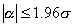

  </td>
  <td width=110 style='width:82.8pt;border-top:none;border-left:none;
  border-bottom:solid windowtext 1.0pt;border-right:solid windowtext 1.0pt;
  padding:0mm 5.4pt 0mm 5.4pt;height:25.15pt'>
  
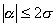

  </td>
  <td width=110 style='width:82.8pt;border-top:none;border-left:none;
  border-bottom:solid windowtext 1.0pt;border-right:solid windowtext 1.0pt;
  padding:0mm 5.4pt 0mm 5.4pt;height:25.15pt'>
  
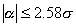

  </td>
  <td width=110 style='width:82.8pt;border-top:none;border-left:none;
  border-bottom:solid windowtext 1.0pt;border-right:solid windowtext 1.0pt;
  padding:0mm 5.4pt 0mm 5.4pt;height:25.15pt'>
  
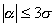

  </td>
 </tr>
 <tr style='height:21.25pt'>
  <td width=110 style='width:82.8pt;border:solid windowtext 1.0pt;border-top:
  none;padding:0mm 5.4pt 0mm 5.4pt;height:21.25pt'>
  
概率

  </td>
  <td width=110 style='width:82.8pt;border-top:none;border-left:none;
  border-bottom:solid windowtext 1.0pt;border-right:solid windowtext 1.0pt;
  padding:0mm 5.4pt 0mm 5.4pt;height:21.25pt'>
  
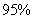

  </td>
  <td width=110 style='width:82.8pt;border-top:none;border-left:none;
  border-bottom:solid windowtext 1.0pt;border-right:solid windowtext 1.0pt;
  padding:0mm 5.4pt 0mm 5.4pt;height:21.25pt'>
  

  </td>
  <td width=110 style='width:82.8pt;border-top:none;border-left:none;
  border-bottom:solid windowtext 1.0pt;border-right:solid windowtext 1.0pt;
  padding:0mm 5.4pt 0mm 5.4pt;height:21.25pt'>
  
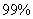

  </td>
  <td width=110 style='width:82.8pt;border-top:none;border-left:none;
  border-bottom:solid windowtext 1.0pt;border-right:solid windowtext 1.0pt;
  padding:0mm 5.4pt 0mm 5.4pt;height:21.25pt'>
  
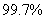

  </td>
 </tr>
</table>

&nbsp;&nbsp;&nbsp;
主要用途

<pre>&nbsp;&nbsp; (1) 决定某一给定误差介于某一范围内的概率的大小，从而判断误差属于系统误差随机误差。例如当误差的绝对值大于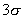时(其可能性只有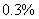)，则不能相信是随机误差。</pre><pre>&nbsp; (2) 用各种不同方法去观测同一物理量时，判断所得结果彼此是否符合。</pre>
