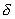
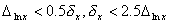
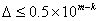

五、误差与有效数字

[绝对误差与相对误差]&nbsp; <i>x</i>为观测对象的真值，其近似值为。

<table class=MsoNormalTable border=1 cellspacing=0 cellpadding=0
 style='border-collapse:collapse;border:none'>
 <tr style='height:24.05pt'>
  <td width=184 valign=top style='width:138.0pt;border:solid windowtext 1.0pt;
  padding:0mm 5.4pt 0mm 5.4pt;height:24.05pt'>
  
误差名称

  </td>
  <td width=408 valign=top style='width:306.0pt;border:solid windowtext 1.0pt;
  border-left:none;padding:0mm 5.4pt 0mm 5.4pt;height:24.05pt'>
  
定义和计算公式

  </td>
 </tr>
 <tr>
  <td width=184 valign=top style='width:138.0pt;border:solid windowtext 1.0pt;
  border-top:none;padding:0mm 5.4pt 0mm 5.4pt'>
  
绝对误差

  
最大绝对误差

  
相对误差

  
最大相对误差

  </td>
  <td width=408 valign=top style='width:306.0pt;border-top:none;border-left:
  none;border-bottom:solid windowtext 1.0pt;border-right:solid windowtext 1.0pt;
  padding:0mm 5.4pt 0mm 5.4pt'>
  

  
使不等式成立的最小的量

  

  
使不等式成立的最小的量

  </td>
 </tr>
</table>

[误差传递的一般公式]

&nbsp;设表示<i>m</i>个自变量的函数，若自变量的最大绝对误差分别为，则函数<i>y</i>的最大绝对误差和最大相对误差分别为

&nbsp;&nbsp;&nbsp;&nbsp;&nbsp;&nbsp;&nbsp;&nbsp;&nbsp;&nbsp;&nbsp;&nbsp;&nbsp;&nbsp;&nbsp;&nbsp;&nbsp;&nbsp;&nbsp;&nbsp;&nbsp;&nbsp;

&nbsp;&nbsp;&nbsp;&nbsp;&nbsp;&nbsp;&nbsp;&nbsp;&nbsp;&nbsp;&nbsp;&nbsp;&nbsp;&nbsp;&nbsp;&nbsp;&nbsp;&nbsp;&nbsp;&nbsp;&nbsp;&nbsp;

&nbsp;近似值的简单运算的误差估计

&nbsp;&nbsp;&nbsp;&nbsp;&nbsp;&nbsp;&nbsp;&nbsp;&nbsp;&nbsp;&nbsp;

&nbsp;&nbsp;&nbsp;&nbsp;&nbsp;&nbsp;&nbsp;&nbsp;&nbsp;&nbsp;&nbsp;

&nbsp;&nbsp;&nbsp;&nbsp;&nbsp;&nbsp;&nbsp;&nbsp;&nbsp;&nbsp;&nbsp;
&nbsp;&nbsp;&nbsp;&nbsp;(<i>p</i>为任意实数)

&nbsp;&nbsp;&nbsp;&nbsp;&nbsp;&nbsp;&nbsp;&nbsp;&nbsp;&nbsp;&nbsp;

&nbsp;设看成随机变量的函数，并用和分别表示的标准误差和概率误差，则其误差传递公式为

&nbsp;&nbsp;&nbsp;&nbsp;&nbsp;&nbsp;&nbsp;&nbsp;

&nbsp;&nbsp;&nbsp;&nbsp;&nbsp;&nbsp;&nbsp;&nbsp;

&nbsp;&nbsp;&nbsp;
[有效数字与可疑数字]&nbsp; 任何一个近似值都可用十进小数表示成

&nbsp;&nbsp;&nbsp;&nbsp;&nbsp;&nbsp;&nbsp;&nbsp;&nbsp;&nbsp;&nbsp;&nbsp;&nbsp;

式中都是正整数，<i>m</i>为近似值的整数部分的位数，或表示成

&nbsp;&nbsp;&nbsp;&nbsp;&nbsp;&nbsp;&nbsp;&nbsp;&nbsp;&nbsp;
&nbsp;&nbsp;&nbsp;&nbsp;&nbsp;

如果近似值的最大绝对误差不超过左起第<i>k</i>位(从左边第一个非零数字算起)的半个单位，即

&nbsp;&nbsp;&nbsp;&nbsp;&nbsp;&nbsp;&nbsp;&nbsp;&nbsp;&nbsp;&nbsp;&nbsp;&nbsp;&nbsp;

则称为有效数字。特别，当<i>k=n</i>时，称为具有<i>n</i>位有效数字的近似值。

如果近似值的最大绝对误差不超过左起第<i>k</i>位的一个单位，即

&nbsp;&nbsp;&nbsp;&nbsp;&nbsp;&nbsp;&nbsp;&nbsp;&nbsp;&nbsp;

则称为可靠数字。特别，当<i>k=n</i>时，称为具有<i>n</i>位可靠数字的近似值。

由此看出，有效数字比可靠数字精确。一般都采用有效数字的概念。

如果近似值有<i>k</i>位有效数字(或可靠数字)，则左起第<i>k</i>位数字称为可疑数字。

&nbsp;&nbsp;&nbsp; [记数法则]

&nbsp;记录观测数据时，只保留一位可疑数字。

&nbsp;除另有规定外，可疑数字表示末位上有个单位(或个单位)的误差。

&nbsp;表示精确度时，大多数情况下只取一位有效数字，最多取两位有效数字。

&nbsp;在数据计算中，当有效数字的位数确定之后，其余数字应一律舍去(按四舍五入法):

&nbsp; (i)&nbsp; 被舍去的第一位小于或等于4。

&nbsp; (ii) 被舍去的第一位大于5，或被舍去的第一位等于5且第二位大于零，则被保留的末位上增加1。

(iii) 被舍去的第一位等于5且第二位等于零，则有两种情况∶被保留的末位是奇数时应增加1；被保留的末位是偶数时不变。

[近似计算法则]

&nbsp; &nbsp;不超过十个近似值相加减时，要把小数位数较多的数四舍五入，使比小数位数最位的数多一位小数；计算结果保留的小数位数要与原近似值中小数位数最少者相同。

&nbsp; &nbsp;近似值相乘除时，各因子保留的位数应比有效数字位数最少者的位数大1，所得积(或商)的可靠数字的位数与原近似值中有效数字位数最少者的位数相等。

&nbsp;近似值乘方或开方时，原近似值有几位有效数字，计算结果就可以保留几位数字。

&nbsp;所取对数的位数应与真数有效数字的位数相等。

注意，&nbsp;
在进行计算的过程中，中间结果应比上述各法则所指示的位数多取一位；但在进入最后一次计算时，这一位“后备数字”仍要舍入。

&nbsp;&nbsp;&nbsp;&nbsp;&nbsp;&nbsp;&nbsp;&nbsp;&nbsp;
&nbsp;&nbsp;两个相差不多的数相减或用近似于零的数作除数，常常是使计&nbsp;&nbsp;&nbsp;&nbsp;&nbsp; 算结果产生较大相对误差的原因。所以如有可能，应把计算程序组织好，尽量避免它。比如，一元二次方程的两个根是

&nbsp;&nbsp;&nbsp;&nbsp;&nbsp; 

当<i>b</i>&gt;0，且时，用上式求会得到错误的结果。应将的公式变形，改用公式

进行计算。

[预定精确度的计位法则]

&nbsp; &nbsp;如果计算结果是由加减法求得的，那末原始数据的小数位数应比结果所要求的多一位。

&nbsp;&nbsp;&nbsp; &nbsp;如果计算结果是由乘、除、乘方、开方求得的，那末原始数据的有效数字位数应比结果所要求的数字位数多一位。

&nbsp;&nbsp;&nbsp; &nbsp;四个或四个以上的近似值的算术平均值的有效数字的位数可增加一位。

