

三、拉格朗日插值多项式

&nbsp; [拉格朗日插值公式]&nbsp;
已知单变量函数的<i>n+</i>1个节点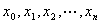及其对应的函数值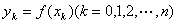，对于插值区间内任一点<i>x</i>，可用下面拉格朗日插值多项式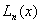计算函数值∶

&nbsp;&nbsp;&nbsp;&nbsp;&nbsp;&nbsp;&nbsp;&nbsp;&nbsp;&nbsp;&nbsp;
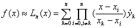

这里&nbsp;&nbsp;&nbsp;&nbsp;&nbsp;&nbsp;&nbsp; 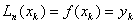&nbsp;&nbsp;&nbsp;&nbsp;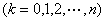

特别对于等距节点，有

&nbsp;&nbsp;&nbsp;&nbsp;&nbsp; 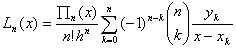

式中&nbsp;&nbsp;&nbsp;&nbsp;&nbsp;&nbsp;&nbsp;&nbsp;&nbsp;
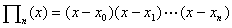

&nbsp;&nbsp; [埃特金逐步计算法]&nbsp; 已知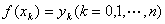，求插值区间内任一点<i>a</i>的拉格朗日多项式的数值，可按下表从左到右逐列进行计算。

<table class=MsoNormalTable border=1 cellspacing=0 cellpadding=0
 style='border-collapse:collapse;border:none'>
 <tr>
  <td width=36 valign=top style='width:27.0pt;border:solid windowtext 1.0pt;
  padding:0mm 5.4pt 0mm 5.4pt'>
  

  </td>
  <td width=108 valign=top style='width:81.0pt;border:solid windowtext 1.0pt;
  border-left:none;padding:0mm 5.4pt 0mm 5.4pt'>
  
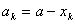

  </td>
  <td width=72 valign=top style='width:54.0pt;border:solid windowtext 1.0pt;
  border-left:none;padding:0mm 5.4pt 0mm 5.4pt'>
  
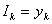

  </td>
  <td width=48 valign=top style='width:36.0pt;border:solid windowtext 1.0pt;
  border-left:none;padding:0mm 5.4pt 0mm 5.4pt'>
  
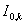

  </td>
  <td width=48 valign=top style='width:36.0pt;border:solid windowtext 1.0pt;
  border-left:none;padding:0mm 5.4pt 0mm 5.4pt'>
  
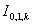

  </td>
  <td width=60 valign=top style='width:45.0pt;border:solid windowtext 1.0pt;
  border-left:none;padding:0mm 5.4pt 0mm 5.4pt'>
  
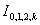

  </td>
  <td width=36 valign=top style='width:27.0pt;border:solid windowtext 1.0pt;
  border-left:none;padding:0mm 5.4pt 0mm 5.4pt'>
  
…

  </td>
  <td width=84 valign=top style='width:63.0pt;border:solid windowtext 1.0pt;
  border-left:none;padding:0mm 5.4pt 0mm 5.4pt'>
  
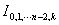

  </td>
  <td width=60 valign=top style='width:45.0pt;border:solid windowtext 1.0pt;
  border-left:none;padding:0mm 5.4pt 0mm 5.4pt'>
  

  </td>
 </tr>
 <tr style='height:127.65pt'>
  <td width=36 valign=top style='width:27.0pt;border:solid windowtext 1.0pt;
  border-top:none;padding:0mm 5.4pt 0mm 5.4pt;height:127.65pt'>
  
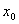

  

  

  
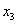

  

  
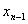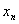

  </td>
  <td width=108 valign=top style='width:81.0pt;border-top:none;border-left:
  none;border-bottom:solid windowtext 1.0pt;border-right:solid windowtext 1.0pt;
  padding:0mm 5.4pt 0mm 5.4pt;height:127.65pt'>
  
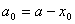

  
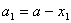

  
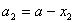

  
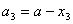

  

  
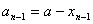

  
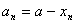

  </td>
  <td width=72 valign=top style='width:54.0pt;border-top:none;border-left:none;
  border-bottom:solid windowtext 1.0pt;border-right:solid windowtext 1.0pt;
  padding:0mm 5.4pt 0mm 5.4pt;height:127.65pt'>
  
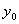

  

  

  
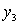

  

  
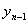

  
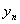

  </td>
  <td width=48 valign=top style='width:36.0pt;border-top:none;border-left:none;
  border-bottom:solid windowtext 1.0pt;border-right:solid windowtext 1.0pt;
  padding:0mm 5.4pt 0mm 5.4pt;height:127.65pt'>
  
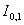

  
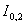

  
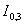

  

  
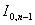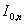

  </td>
  <td width=48 valign=top style='width:36.0pt;border-top:none;border-left:none;
  border-bottom:solid windowtext 1.0pt;border-right:solid windowtext 1.0pt;
  padding:0mm 5.4pt 0mm 5.4pt;height:127.65pt'>
  

  
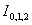

  
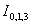

  

  
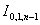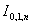

  </td>
  <td width=60 valign=top style='width:45.0pt;border-top:none;border-left:none;
  border-bottom:solid windowtext 1.0pt;border-right:solid windowtext 1.0pt;
  padding:0mm 5.4pt 0mm 5.4pt;height:127.65pt'>
  

  

  
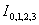

  

  
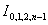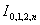

  </td>
  <td width=36 valign=top style='width:27.0pt;border-top:none;border-left:none;
  border-bottom:solid windowtext 1.0pt;border-right:solid windowtext 1.0pt;
  padding:0mm 5.4pt 0mm 5.4pt;height:127.65pt'>
  
…

  </td>
  <td width=84 valign=top style='width:63.0pt;border-top:none;border-left:none;
  border-bottom:solid windowtext 1.0pt;border-right:solid windowtext 1.0pt;
  padding:0mm 5.4pt 0mm 5.4pt;height:127.65pt'>
  

  

  

  
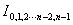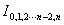

  </td>
  <td width=60 valign=top style='width:45.0pt;border-top:none;border-left:none;
  border-bottom:solid windowtext 1.0pt;border-right:solid windowtext 1.0pt;
  padding:0mm 5.4pt 0mm 5.4pt;height:127.65pt'>
  
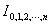

  </td>
 </tr>
</table>

表中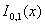表示用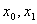作节点的一次插值多项式；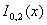表示节点为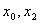的一次插值多项式；一般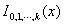表示节点为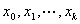的<i>k</i>次插值多项式。表中左起第四列以后的各列都是对应的插值多项式在<i>a</i>点的数值，它们之间有下面的关系:

&nbsp;&nbsp;&nbsp;&nbsp;&nbsp;&nbsp; &nbsp;&nbsp;&nbsp;&nbsp;&nbsp;&nbsp;&nbsp;&nbsp;&nbsp;&nbsp;&nbsp;

&nbsp;&nbsp;&nbsp;&nbsp;&nbsp;&nbsp; &nbsp;&nbsp;&nbsp;&nbsp;&nbsp;&nbsp;&nbsp;&nbsp;&nbsp;

&nbsp;&nbsp;&nbsp;&nbsp;&nbsp;&nbsp; ………………………………………………………

&nbsp;&nbsp;&nbsp;&nbsp;&nbsp;&nbsp;&nbsp;

&nbsp;&nbsp;&nbsp; 利用拉格朗日插值多项式计算某一点<i>a</i>的数值时每增加一个节点，必须按公式重新计算，而埃特金逐步计算法避免了这个缺点。

