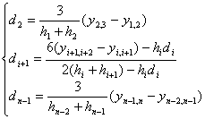

四 三次样条(Spline)内插公式

样条函数是逼近函数的一种方法。

[三次样条函数]&nbsp; 已知平面上的<i>n</i>个点，这些点称为型值点，其中称为节点。

如果函数<i>S(x)</i>满足以下三个条件:

(i);

(ii)<i>S(x)</i>在每个区间上是一个三次多项式；

(iii)<i>S(x)</i>在整个区间上有连续的一阶及二阶导数；

则称<i>S(x)</i>为过<i>n</i>个点的三次样条函数。

如果函数<i>S(x)</i>满足下面的任一边界条件(在两端点处附加的条件)，那末三次样条函数<i>S(x)</i>存在而且唯一∶

(<i>a</i>) 函数在区间两端点的一阶导数(单边导数)已知，即和为已知数。

(<i>b</i>) 函数在区间两端点的二阶导数为零，即。

(<i>c</i>) 函数为周期的，且满足。

[三次样条函数的表达形式]

&nbsp;以二阶导数为参数的形式&nbsp;&nbsp; <i>S(x)</i>在每个区间上表为

&nbsp;&nbsp;&nbsp;&nbsp;&nbsp;&nbsp;&nbsp;&nbsp;&nbsp;&nbsp;&nbsp;&nbsp;&nbsp;&nbsp;&nbsp;&nbsp;&nbsp;&nbsp;&nbsp;&nbsp;&nbsp;&nbsp;&nbsp;&nbsp;&nbsp;&nbsp;&nbsp;&nbsp;&nbsp;&nbsp;&nbsp;&nbsp;&nbsp;&nbsp;&nbsp;&nbsp;&nbsp;

式中为待定参数，而是的一阶差商，是的一阶差商，即

&nbsp;&nbsp;&nbsp;&nbsp;&nbsp;&nbsp;&nbsp;&nbsp;&nbsp;&nbsp;&nbsp;&nbsp;&nbsp;&nbsp;&nbsp;&nbsp;&nbsp;&nbsp;&nbsp;
&nbsp;&nbsp;&nbsp;&nbsp;&nbsp;&nbsp;&nbsp;&nbsp;&nbsp;&nbsp;&nbsp;

&nbsp;&nbsp;&nbsp;&nbsp;&nbsp;&nbsp;&nbsp;&nbsp;&nbsp;&nbsp;&nbsp;&nbsp;&nbsp;&nbsp;&nbsp;&nbsp;&nbsp;&nbsp;&nbsp;
&nbsp;&nbsp;&nbsp;&nbsp;&nbsp;&nbsp;&nbsp;&nbsp;&nbsp;&nbsp;

&nbsp;这样定义的函数<i>S(x)</i>在区间上满足条件(i)，(ii)。如果选择使得<i>S(x)</i>在上有一阶连续导数，那末<i>S(x)</i>在上就有二阶连续导数，而且

&nbsp;&nbsp;&nbsp;&nbsp;&nbsp;&nbsp;&nbsp;&nbsp;&nbsp;&nbsp;&nbsp;&nbsp;&nbsp;&nbsp;&nbsp;&nbsp;&nbsp;&nbsp;&nbsp;&nbsp;
&nbsp;&nbsp;&nbsp;&nbsp;&nbsp;&nbsp;&nbsp;&nbsp;&nbsp;&nbsp;&nbsp;&nbsp;&nbsp;&nbsp;

利用<i>S(x)</i>一阶导数的连续性及边界条件可以给出确定的代数方程组。

(1)&nbsp;&nbsp;&nbsp;&nbsp;
(1)边界条件为(<i>a</i>)的情况

在条件(<i>a</i>)下，由下面方程组解出

&nbsp;

式中为一阶差商(同前)，和为给定的边界条件。

用矩阵表示就是

式中&nbsp;&nbsp;&nbsp; &nbsp;&nbsp;&nbsp;&nbsp;&nbsp;&nbsp;&nbsp;&nbsp;&nbsp;&nbsp;&nbsp;&nbsp;&nbsp;&nbsp;&nbsp;&nbsp;&nbsp;&nbsp;&nbsp;&nbsp;&nbsp;&nbsp;&nbsp;

&nbsp;&nbsp;&nbsp;&nbsp;&nbsp; &nbsp;&nbsp;&nbsp;&nbsp;&nbsp;&nbsp;&nbsp;&nbsp;&nbsp;&nbsp;

当时，解出为

&nbsp;&nbsp;&nbsp;&nbsp;&nbsp; 

(2)&nbsp;&nbsp;&nbsp;&nbsp;
(2)边界条件为(<i>b</i>)的情况

在条件(<i>b</i>)下，由下面方程组解出：

&nbsp; &nbsp;&nbsp;&nbsp;&nbsp;&nbsp;&nbsp;&nbsp;&nbsp;&nbsp;

&nbsp;&nbsp;&nbsp;&nbsp;&nbsp;&nbsp;&nbsp;&nbsp;&nbsp;&nbsp;&nbsp;&nbsp;&nbsp;&nbsp;&nbsp;&nbsp;&nbsp;&nbsp;&nbsp;&nbsp;&nbsp;&nbsp;&nbsp;&nbsp;&nbsp;&nbsp;&nbsp;&nbsp;&nbsp;&nbsp;&nbsp;&nbsp;&nbsp;&nbsp;&nbsp;&nbsp;

用矩阵表示就是

式中

&nbsp;&nbsp;&nbsp;&nbsp; &nbsp;&nbsp;&nbsp;&nbsp;&nbsp;&nbsp;&nbsp;&nbsp;&nbsp;&nbsp;&nbsp;&nbsp;&nbsp;&nbsp;&nbsp;&nbsp;

&nbsp;&nbsp;&nbsp;&nbsp; &nbsp;&nbsp;&nbsp;&nbsp;&nbsp;&nbsp;&nbsp;&nbsp;&nbsp;

当时，解出为

&nbsp;&nbsp;&nbsp;&nbsp; &nbsp;&nbsp;&nbsp;&nbsp;&nbsp;&nbsp;&nbsp;&nbsp;

&nbsp;
以一阶导数为参数的形式<i>S(x)</i>在每个区间上表为

&nbsp;&nbsp;&nbsp;&nbsp;&nbsp;&nbsp; 

式中是待定参数。这样定义的函数<i>S(x)</i>在区间上满足三次样条函数的条件(i)和(ii)，而且<i>S(x)</i>在上有连续的一阶导数，同时

&nbsp;&nbsp;&nbsp;&nbsp;&nbsp;&nbsp;&nbsp;&nbsp;&nbsp;&nbsp;&nbsp;&nbsp;&nbsp;&nbsp;&nbsp;&nbsp;&nbsp; &nbsp;&nbsp;&nbsp;&nbsp;&nbsp;&nbsp;&nbsp;&nbsp;&nbsp;&nbsp;&nbsp;&nbsp;&nbsp;&nbsp;&nbsp;

&nbsp;&nbsp;&nbsp; 有时表成下式∶

&nbsp;&nbsp;&nbsp;&nbsp;&nbsp;&nbsp;&nbsp;

式中,而与定义同前。

根据在上有连续二阶导数及边界条件可以给出确定的代数方程组。

(1)&nbsp;&nbsp;&nbsp;
(1)&nbsp; 边界条件为的情况

在条件下，满足下面方程组

&nbsp;&nbsp;&nbsp;&nbsp;&nbsp;&nbsp;&nbsp;&nbsp;
&nbsp;&nbsp;&nbsp;&nbsp;

记 ，得

&nbsp;&nbsp;&nbsp;&nbsp;&nbsp;&nbsp;&nbsp;&nbsp;
&nbsp;&nbsp;

它可以改写为

&nbsp;&nbsp;&nbsp;&nbsp;&nbsp;&nbsp;&nbsp;&nbsp;
&nbsp;&nbsp;&nbsp;&nbsp;&nbsp;&nbsp;&nbsp;&nbsp;&nbsp;

其中

&nbsp;&nbsp;&nbsp;&nbsp;&nbsp;&nbsp;&nbsp;&nbsp;&nbsp;

由此得&nbsp;&nbsp;&nbsp; 

&nbsp;&nbsp;&nbsp;&nbsp;&nbsp;&nbsp;&nbsp;&nbsp;
&nbsp;&nbsp;&nbsp;&nbsp;&nbsp;&nbsp;&nbsp;&nbsp;&nbsp;&nbsp;&nbsp;&nbsp;&nbsp;&nbsp;&nbsp;&nbsp;&nbsp;&nbsp;&nbsp;&nbsp;&nbsp;&nbsp;

(2)边界条件为(<i>b</i>)的情况

在条件(<i>b</i>)下，满足下面方程组

&nbsp;&nbsp;&nbsp;&nbsp;&nbsp;&nbsp;&nbsp;
&nbsp;&nbsp;&nbsp;&nbsp;&nbsp;&nbsp;&nbsp;

式中 为的一阶差商。

当且&nbsp;&nbsp;
时,

&nbsp;&nbsp;&nbsp;&nbsp;&nbsp;&nbsp;&nbsp;
&nbsp;&nbsp;&nbsp;&nbsp;&nbsp;&nbsp;&nbsp;&nbsp;&nbsp;&nbsp;&nbsp;&nbsp;&nbsp;&nbsp;

其中，而由下述公式递归求得

&nbsp;&nbsp;&nbsp; 

&nbsp;&nbsp;&nbsp; &nbsp;&nbsp;&nbsp;&nbsp;&nbsp;&nbsp;&nbsp;&nbsp;&nbsp;&nbsp;&nbsp;&nbsp;

&nbsp;&nbsp;&nbsp; 

&nbsp;&nbsp;&nbsp; &nbsp;&nbsp;&nbsp;&nbsp;&nbsp;

(3)边界条件为(<i>c</i>)的情况

在条件(<i>c</i>)下，满足下面方程组: 

&nbsp;&nbsp; &nbsp;&nbsp;&nbsp;&nbsp;&nbsp;&nbsp;&nbsp;&nbsp;&nbsp;&nbsp;&nbsp;

