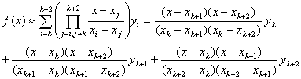
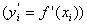

五、其他插值公式

[一元三点插值公式]&nbsp; 已知单变量函数<i>y=f(x)</i>在<i>n</i>个节点上的值，对于插值区间内任一点<i>x</i>,可按下面公式近似计算函数值

&nbsp;

式中为最靠近<i>x</i>的三个已知节点。

[二元插值公式]&nbsp; 已知双变量函数的第一个自变量的节点为，第二个自变量的节点为,其对应节点上的函数值为。那末对于不是节点的变元值，可按下面公式近似计算函数值

<pre style='text-align:right;line-height:12.0pt;layout-grid-mode:char'
align=right>&nbsp;&nbsp;&nbsp;&nbsp;&nbsp; &nbsp;&nbsp;&nbsp;&nbsp;&nbsp;&nbsp;&nbsp;&nbsp;&nbsp;&nbsp;&nbsp;&nbsp;&nbsp;&nbsp;&nbsp;&nbsp;&nbsp;&nbsp;&nbsp;&nbsp;&nbsp;&nbsp;&nbsp;&nbsp;&nbsp;&nbsp;(1)</pre><pre
style='text-align:right;line-height:12.0pt;layout-grid-mode:char' align=right>&nbsp;&nbsp;&nbsp;&nbsp;&nbsp; &nbsp;&nbsp;&nbsp;&nbsp;&nbsp;&nbsp;&nbsp;&nbsp;&nbsp;&nbsp;&nbsp;&nbsp;&nbsp;&nbsp;&nbsp;&nbsp;&nbsp;&nbsp;&nbsp;&nbsp;&nbsp;&nbsp;&nbsp;&nbsp;&nbsp;(2)</pre>

(2)中是第一个变元最靠近<i>x</i>的三个节点，是第二个变元最靠近<i>y</i>的三个节点。

[带导数的埃尔米特插值公式]&nbsp; 已知函数<i>y=f(x)</i>及其导数在<i>n</i>个节点上的值为及，那末对于插值区间内任一点<i>x</i>，可按下式计算函数值

&nbsp; 

式中

&nbsp;&nbsp;&nbsp;&nbsp;&nbsp; 

&nbsp;&nbsp;&nbsp;&nbsp;&nbsp; 

余项

&nbsp;&nbsp;&nbsp;&nbsp;&nbsp; 

其中是包含全体节点的某区间[<i>a,b</i>]内的一点。

易知，式中的是次数不超过且满足, 的多项式。

