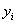
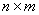
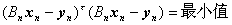
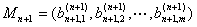
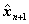
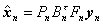

<b>§</b><b>5</b><b>&nbsp;&nbsp; </b><b>滤</b><b>&nbsp;&nbsp; </b><b>波</b>

从包含着误差(意味着干扰、噪声)的数据(或信号)中提取需要的信息，这种数据处理方法称为滤波。下面仅介绍几种最小二乘(或最小方差)滤波。

一、最小二乘滤波

&nbsp;&nbsp; [增长记忆的最小二乘滤波]

&nbsp;&nbsp; 滤波的最小二乘准则

&nbsp;给定离散观测系统

&nbsp;&nbsp;&nbsp;&nbsp; &nbsp;&nbsp;&nbsp;&nbsp;&nbsp;&nbsp;&nbsp;&nbsp;&nbsp;&nbsp;

式中

&nbsp;&nbsp;&nbsp;&nbsp;&nbsp;&nbsp;&nbsp;&nbsp;&nbsp;&nbsp;&nbsp;&nbsp;&nbsp;&nbsp;

&nbsp;&nbsp;&nbsp;&nbsp;&nbsp;&nbsp;&nbsp;&nbsp;&nbsp;&nbsp;&nbsp;&nbsp;&nbsp;&nbsp;

&nbsp;&nbsp;&nbsp;&nbsp;&nbsp;&nbsp;&nbsp;&nbsp;&nbsp;&nbsp;&nbsp;&nbsp;&nbsp;&nbsp;

&nbsp;&nbsp;&nbsp;&nbsp;&nbsp;&nbsp;&nbsp;&nbsp;&nbsp;&nbsp;&nbsp;&nbsp;

式中表示转置，是在时刻的观测值，是由形成的<i>n</i>维列矢量，称为观测矢量；是的矩阵，其中<i>m</i>是常数；是<i>n</i>维列矢量，它的分量是时的误差；是状态矢量(<i>m</i>维)。假设状态满足方程

&nbsp;&nbsp;&nbsp;&nbsp;&nbsp;&nbsp;&nbsp;&nbsp;&nbsp;&nbsp;&nbsp;&nbsp;&nbsp;&nbsp;&nbsp;&nbsp;&nbsp;

其中为<i>m</i>阶方阵，其元素均为常数，又设可逆，记。

如果当时

&nbsp;&nbsp;&nbsp;&nbsp;&nbsp;&nbsp;&nbsp;&nbsp;&nbsp;&nbsp;&nbsp;&nbsp;

则称是的在最小二乘意义下的最优估值。

假设可逆，记，于是可以推出

&nbsp;&nbsp;&nbsp;&nbsp;&nbsp;&nbsp;&nbsp;&nbsp;&nbsp;&nbsp;&nbsp;&nbsp;&nbsp;&nbsp;&nbsp;&nbsp;&nbsp;&nbsp;&nbsp;&nbsp;

&nbsp; 滤波的递推公式

&nbsp;&nbsp;&nbsp; 上述求的最优估值的公式在电子计算机上并不实用，通常在计算机上用递推公式。可以推出

&nbsp;&nbsp;&nbsp;&nbsp;&nbsp;&nbsp;&nbsp;
&nbsp;&nbsp;&nbsp;&nbsp;&nbsp;

其中

&nbsp;&nbsp;&nbsp;&nbsp;&nbsp;&nbsp;&nbsp;

是<i>m</i>维行矢量

&nbsp;&nbsp;&nbsp;&nbsp;&nbsp;&nbsp;&nbsp;&nbsp;&nbsp;&nbsp;&nbsp;&nbsp;&nbsp;&nbsp;&nbsp;&nbsp;&nbsp;

满足。

从以上公式来看，为求，实际上用到了全部历史观测值，随着<i>n</i>增大，用到的个数增多，故这种滤波递推公式称为增长记忆的。

[加权最小二乘滤波]&nbsp; 当<i>n</i>充分大时，较早的历史数据用在估计中往往起不利的作用，通过加权处理，可以使“过老”数据的作用逐渐消失。下面举加“指数下降”权的例。

选取，引进对角线矩阵序列

&nbsp;&nbsp;&nbsp; &nbsp;&nbsp;&nbsp;&nbsp;&nbsp;&nbsp;&nbsp;

同前，设观测系统与状态方程分别为

&nbsp;&nbsp;&nbsp;&nbsp;&nbsp;&nbsp;&nbsp;&nbsp;&nbsp;&nbsp;&nbsp;&nbsp;&nbsp;&nbsp;&nbsp;&nbsp;&nbsp;&nbsp;&nbsp;

&nbsp;&nbsp;&nbsp;&nbsp;&nbsp;&nbsp;&nbsp;&nbsp;&nbsp;&nbsp;&nbsp;&nbsp;&nbsp;&nbsp;&nbsp;&nbsp;&nbsp;&nbsp;&nbsp;&nbsp;&nbsp;&nbsp;

如果时

&nbsp;&nbsp;&nbsp;&nbsp;&nbsp;&nbsp;&nbsp;&nbsp;&nbsp;

则称是在加“指数下降”权最小二乘意义下的最优估值。

可以证明

&nbsp;&nbsp;&nbsp;&nbsp;&nbsp;&nbsp;&nbsp;&nbsp;&nbsp;&nbsp;&nbsp;

其中

&nbsp;&nbsp;&nbsp;&nbsp;&nbsp;&nbsp;&nbsp;&nbsp;&nbsp;&nbsp;&nbsp;&nbsp;&nbsp;&nbsp;&nbsp;

&nbsp;&nbsp;&nbsp; 并且有计算的递推公式

&nbsp;&nbsp;&nbsp;&nbsp;&nbsp;&nbsp;&nbsp;&nbsp;&nbsp;&nbsp;&nbsp;&nbsp;&nbsp;&nbsp;

其中

&nbsp;&nbsp;&nbsp;&nbsp;&nbsp; 

是<i>m</i>维行矢量，定义同前面一样。

