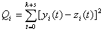
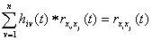

二、维纳滤波

维纳滤波与卡尔曼滤波都是最小平方偏差滤波，但它们依据的已知条件、计算方法及适用范围等都有所不同。

[维纳滤波准则]&nbsp; 假设希望得到序列<i>z</i>(<i>t</i>)(<i>t</i>只取某些整数值)，而实际得到的是序列<i>x</i>(<i>t</i>)。于是设计一个脉冲响应为<i>h</i>(<i>t</i>)的线性定常系统，使得它的输入量为<i>x</i>(<i>t</i>)，而输出量

&nbsp;&nbsp;&nbsp;&nbsp;&nbsp;&nbsp;&nbsp;

与<i>z</i>(<i>t</i>)的偏差在某种准则下尽可能地小。

所谓维纳滤波问题，就是适当地取<i>h</i>(<i>t</i>)，使得

&nbsp;&nbsp;&nbsp;&nbsp;&nbsp;&nbsp;&nbsp;&nbsp;&nbsp;&nbsp;&nbsp;&nbsp;&nbsp;&nbsp;&nbsp;&nbsp;&nbsp;&nbsp;

当<i>x</i>(<i>t</i>)是确定序列时，

&nbsp;&nbsp;&nbsp;&nbsp;&nbsp;&nbsp;&nbsp;&nbsp;&nbsp;&nbsp;&nbsp;&nbsp;&nbsp;&nbsp;&nbsp;&nbsp;

当<i>x</i>(<i>t</i>)是随机序列时，

&nbsp;&nbsp;&nbsp;&nbsp;&nbsp;&nbsp;&nbsp;&nbsp;&nbsp;&nbsp;&nbsp;&nbsp;&nbsp;&nbsp;&nbsp;&nbsp;

[单路最小平方滤波]&nbsp; 假设滤波因子<i>h</i>(<i>t</i>)是由<i>s</i>+1个等跨距的系数组成的序列，如

&nbsp;&nbsp;&nbsp;&nbsp;&nbsp;&nbsp; &nbsp;&nbsp;&nbsp;&nbsp;&nbsp;&nbsp;

<i>s</i>+1称为滤波因子的长度，则最小平方滤波因子<i>h</i>(<i>t</i>)满足

&nbsp;&nbsp;&nbsp;&nbsp;&nbsp;&nbsp;&nbsp;&nbsp;&nbsp;
&nbsp;&nbsp;&nbsp;&nbsp;&nbsp;&nbsp;&nbsp;&nbsp;&nbsp;

或用褶积表示为

&nbsp;&nbsp;&nbsp;&nbsp;&nbsp;&nbsp;&nbsp;&nbsp;&nbsp;&nbsp;
&nbsp;&nbsp;&nbsp;&nbsp;&nbsp;&nbsp;&nbsp;&nbsp;&nbsp;&nbsp;

其中

&nbsp;&nbsp;&nbsp;&nbsp;&nbsp;&nbsp;&nbsp;&nbsp;&nbsp;&nbsp;&nbsp;&nbsp;&nbsp;&nbsp;

称为输入<i>x</i>(<i>t</i>)的自相关函数(第十六章§3)，

&nbsp;&nbsp;&nbsp;&nbsp;&nbsp;&nbsp;&nbsp;&nbsp;&nbsp;&nbsp;&nbsp;&nbsp;&nbsp;&nbsp;

称为<i>z</i>(<i>t</i>)与<i>x</i>(<i>t</i>)的互相关函数。

滤波输出与希望输出的符合程度可用标准化均方误差:

&nbsp;&nbsp;&nbsp;&nbsp;&nbsp;&nbsp;&nbsp;&nbsp;&nbsp;&nbsp;&nbsp;&nbsp;

来度量，其中

&nbsp;&nbsp;&nbsp;&nbsp;&nbsp;&nbsp;&nbsp;&nbsp;&nbsp;&nbsp;&nbsp;&nbsp;&nbsp;&nbsp;&nbsp;&nbsp;

显然。当时，滤波作用最好；当时，滤波作用最差。

当滤波因子的长度是无限的时候，可以得到类似的结果。用，，分别表示<i>h</i>(<i>t</i>)，的频率谱*，则根据两个函数的褶积相当于其谱的乘积，可得到其频率特征

&nbsp;&nbsp;&nbsp;&nbsp;&nbsp;&nbsp;&nbsp;&nbsp;&nbsp;&nbsp;&nbsp;&nbsp;&nbsp;&nbsp;

它表明用互相关函数与自相关函数的频率谱可以决定滤波因子的频率谱。

[多路最小平方滤波]&nbsp; 多路最小平方滤波方法是利用多路讯号的重复性，从而提供更多的有益讯息。

设为<i>n</i>路输入，为<i>m</i>路希望输出，写成矩阵分别为

&nbsp;&nbsp;&nbsp;&nbsp;&nbsp;&nbsp;&nbsp;&nbsp;&nbsp;&nbsp;&nbsp;

&nbsp;&nbsp;&nbsp;&nbsp;&nbsp;&nbsp;&nbsp;&nbsp;&nbsp;&nbsp;&nbsp;&nbsp;&nbsp;&nbsp;&nbsp;

为多路滤波因子，写成矩阵为

&nbsp;&nbsp; &nbsp;&nbsp;&nbsp;&nbsp;&nbsp;&nbsp;&nbsp;&nbsp;&nbsp;&nbsp;&nbsp;

-------------------------------

&nbsp; 离散时间序列的频率谱定义为

&nbsp;

&nbsp;&nbsp;&nbsp;&nbsp;&nbsp;&nbsp;&nbsp;&nbsp;&nbsp;&nbsp;&nbsp;&nbsp;&nbsp;&nbsp;&nbsp;&nbsp;&nbsp;&nbsp;

&nbsp;&nbsp;&nbsp;&nbsp;&nbsp;&nbsp;&nbsp;
其中&nbsp;&nbsp;&nbsp;&nbsp;&nbsp;&nbsp;&nbsp;&nbsp;&nbsp;&nbsp;&nbsp;&nbsp;&nbsp;&nbsp;

当离散时间序列只有有限项时，可把它补上许多0，成为无穷序列而用上述定义。

是<i>m</i>路滤波输出，写成矩阵为

&nbsp;&nbsp;&nbsp;&nbsp;&nbsp;&nbsp;&nbsp;&nbsp;&nbsp;&nbsp;&nbsp;&nbsp;&nbsp;

&nbsp;若每路输入的长度为<i>k</i>+1，所有的滤波因子的长度为<i>s</i>+1，则每路的滤波输出的长度为<i>k</i>+<i>s</i>+1。

&nbsp;所谓多路最小平方滤波，就是适当选取多路滤波因子(矩阵)<i>H</i>(<i>t</i>)使总均方差

&nbsp;&nbsp;&nbsp;&nbsp;&nbsp;&nbsp;&nbsp;&nbsp;&nbsp;&nbsp;&nbsp;&nbsp;&nbsp;

当是确定序列时，

&nbsp;&nbsp;&nbsp;&nbsp;&nbsp;&nbsp;&nbsp;&nbsp;&nbsp;&nbsp;&nbsp;&nbsp;&nbsp;&nbsp;&nbsp;
&nbsp;&nbsp;&nbsp;&nbsp;&nbsp;&nbsp;&nbsp;&nbsp;&nbsp;&nbsp;&nbsp;

当是随机序列时，

&nbsp;&nbsp;&nbsp;&nbsp;&nbsp;&nbsp;&nbsp;&nbsp;&nbsp;&nbsp;&nbsp;&nbsp;&nbsp;&nbsp;&nbsp;
&nbsp;&nbsp;&nbsp;&nbsp;&nbsp;&nbsp;&nbsp;&nbsp;&nbsp;&nbsp;&nbsp;&nbsp;

多路最小平方滤波因子满足下列方程

&nbsp;&nbsp;&nbsp;&nbsp;&nbsp;&nbsp;&nbsp;&nbsp;

&nbsp;&nbsp;&nbsp;&nbsp;&nbsp;&nbsp;&nbsp;&nbsp;&nbsp;&nbsp;&nbsp;&nbsp;&nbsp;&nbsp;&nbsp;&nbsp;&nbsp;
&nbsp;&nbsp;&nbsp;&nbsp;&nbsp;&nbsp;&nbsp;&nbsp;&nbsp;&nbsp;&nbsp;&nbsp;&nbsp;&nbsp;&nbsp;&nbsp;（1）

其中

&nbsp;&nbsp;&nbsp;&nbsp;&nbsp;&nbsp; &nbsp;&nbsp;&nbsp;&nbsp;&nbsp;&nbsp;&nbsp;&nbsp;&nbsp;&nbsp;&nbsp;

是多路最小平方滤波因子，是矩阵，

&nbsp;&nbsp;&nbsp;&nbsp;&nbsp;&nbsp; &nbsp;&nbsp;&nbsp;&nbsp;&nbsp;&nbsp;

为输入的自相关函数方阵，称为多路自相关矩阵，的转置矩阵，

&nbsp;&nbsp;&nbsp;&nbsp;&nbsp;&nbsp; &nbsp;&nbsp;&nbsp;&nbsp;&nbsp;&nbsp;&nbsp;&nbsp;&nbsp;&nbsp;

为希望输出和输入的互相关函数的矩阵。

&nbsp;&nbsp;&nbsp; 方程(1)是以滤波因子&nbsp;&nbsp;&nbsp;&nbsp;&nbsp;&nbsp;&nbsp;&nbsp;&nbsp;&nbsp;
为未知数的<i>mn</i>(<i>s</i>+1)个线性联立方程。它的解即所求的多路最小平方滤波因子。

滤波输出与希望输出之间的符合程度，可用标准化均方误差

&nbsp;&nbsp;&nbsp; 

来度量，显然，。当时，多路最小平方滤波输出与希望输出符合得最好；当时，符合的程度最差。

当滤波因子的长度是无限时，最小平方滤波因子满足下列方程

&nbsp;&nbsp;&nbsp;&nbsp;&nbsp;&nbsp;&nbsp;&nbsp;&nbsp;
&nbsp;&nbsp;&nbsp;&nbsp;&nbsp;

用频率谱表示，则有

&nbsp;&nbsp;&nbsp;&nbsp;&nbsp; 

&nbsp;&nbsp;&nbsp;&nbsp;&nbsp;&nbsp;&nbsp;&nbsp;&nbsp;&nbsp;&nbsp;&nbsp;&nbsp;&nbsp;&nbsp;&nbsp;&nbsp;&nbsp;&nbsp;&nbsp;&nbsp;&nbsp;&nbsp;&nbsp;&nbsp;
=

上述方程的解就是所求的多路最小平方滤波因子。

