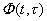
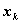
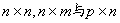
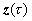
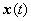

三、卡尔曼滤波

[线性离散系统的卡尔曼滤波] 

&nbsp;
动态模型&nbsp; 设一<i>n</i>维线性动态系统与<i>p</i>维线性观测系统分别由下面的差分方程描述:

&nbsp;&nbsp;&nbsp;&nbsp;&nbsp;&nbsp;&nbsp;&nbsp;&nbsp;&nbsp;&nbsp;&nbsp;&nbsp;&nbsp;&nbsp;

&nbsp;&nbsp;&nbsp;&nbsp;&nbsp;&nbsp;&nbsp;&nbsp;&nbsp;&nbsp;&nbsp;&nbsp;&nbsp;&nbsp;&nbsp;&nbsp;&nbsp;&nbsp;&nbsp;&nbsp;
&nbsp;&nbsp;&nbsp;&nbsp;&nbsp;&nbsp;&nbsp;&nbsp;

或引入相应的符号简单地记作

&nbsp;&nbsp;&nbsp;&nbsp;&nbsp;&nbsp;&nbsp;&nbsp;&nbsp;&nbsp;&nbsp;&nbsp;&nbsp;&nbsp;&nbsp;
&nbsp;&nbsp;&nbsp;&nbsp;&nbsp;&nbsp;&nbsp;&nbsp;&nbsp;&nbsp;&nbsp;&nbsp;&nbsp;&nbsp;&nbsp;&nbsp;&nbsp;&nbsp;&nbsp;&nbsp;&nbsp;&nbsp;&nbsp;&nbsp;&nbsp;&nbsp;&nbsp;&nbsp;&nbsp;&nbsp;&nbsp;&nbsp;&nbsp;&nbsp;&nbsp;&nbsp;&nbsp;&nbsp;&nbsp;&nbsp;(1)

&nbsp;&nbsp;&nbsp;&nbsp;&nbsp;&nbsp;&nbsp;&nbsp;&nbsp;&nbsp;&nbsp;&nbsp;&nbsp;&nbsp;&nbsp;
&nbsp;&nbsp;&nbsp;&nbsp;&nbsp;&nbsp;&nbsp;&nbsp;&nbsp;&nbsp;&nbsp;&nbsp;&nbsp;&nbsp;&nbsp;&nbsp;&nbsp;&nbsp;&nbsp;&nbsp;&nbsp;&nbsp;&nbsp;&nbsp;&nbsp;&nbsp;&nbsp;&nbsp;&nbsp;&nbsp;&nbsp;&nbsp;&nbsp;&nbsp;&nbsp;&nbsp;&nbsp;&nbsp;&nbsp;&nbsp;&nbsp;&nbsp;&nbsp;(2)

其中(<i>k</i>为整数)满足

&nbsp;&nbsp;&nbsp;&nbsp; &nbsp;&nbsp;&nbsp;&nbsp;&nbsp;&nbsp;&nbsp;&nbsp;&nbsp;&nbsp;

<b><i>x</i></b>(<i>t</i>)是<i>n</i>维状态矢量，<i></i>(<i>t</i>)是<i>m</i>维动态噪声矢量，<b><i>z</i></b>(<i>t</i>)是<i>p</i>维()观测矢量，<b><i>v</i></b>(<i>t</i>)是<i>p</i>维()观测噪声矢量；矩阵，称为动态噪声矩阵，<i>H</i>(<i>t</i>)是矩阵，称为观测矩阵，是非奇异矩阵，称为系统的转移矩阵，具有下列性质∶

(i)&nbsp; &nbsp;&nbsp;(对于一切<i>t</i>，其中<i>I</i>为单位矩阵)

&nbsp;&nbsp; (ii)&nbsp; &nbsp;(对于任意的)

&nbsp;&nbsp;&nbsp;&nbsp;&nbsp;&nbsp;&nbsp;&nbsp;&nbsp;&nbsp;&nbsp;
(iii)&nbsp; &nbsp;&nbsp;

&nbsp;&nbsp; &nbsp;&nbsp;线性最小方差估计&nbsp; 如果从动态模型确定在时刻系统的状态的估值时，满足下述条件:

&nbsp;(i)&nbsp; 估值是观测值的线性函数；

&nbsp;&nbsp;&nbsp; (ii)&nbsp; =最小值，其中是估计误差;那末这个估值称为线性最小方差估计。

设通过<i>p</i>维线性观测系统(2)，从第1时刻到第<i>k</i>时刻，对<i>n</i>维线性动态系统(1)的状态作了<i>k</i>次观测，根据这<i>k</i>个观测数据，对第<i>j</i>时刻的状态进行的估计为 ，估计误差为，把估计的均方误差记作。当时，称为预报或外推，当时，称为内插。特别当<i>j</i>=<i>k</i>时称为滤波，并简记。

&nbsp;&nbsp;&nbsp; &nbsp;&nbsp;卡尔曼滤波公式&nbsp; 设在上述动态模型中，动态噪声与观测噪声是互不相关的零均值白噪声序列；即对所有<i>k,j</i>

均值 ，均方差&nbsp; 

&nbsp;&nbsp;&nbsp;&nbsp; &nbsp;,&nbsp;&nbsp;&nbsp;&nbsp;&nbsp;&nbsp;&nbsp;&nbsp;

&nbsp;&nbsp;&nbsp;&nbsp;&nbsp;&nbsp;&nbsp;&nbsp;&nbsp;&nbsp;&nbsp;&nbsp;&nbsp;&nbsp;&nbsp;&nbsp;&nbsp;&nbsp;&nbsp;&nbsp;&nbsp;&nbsp;

又设初始状态的统计特征为

&nbsp;&nbsp;&nbsp;&nbsp;&nbsp;&nbsp;&nbsp;&nbsp;&nbsp;&nbsp;&nbsp;&nbsp;&nbsp;

且与都不相关，即

&nbsp;&nbsp;&nbsp;&nbsp;&nbsp;&nbsp;&nbsp;&nbsp;&nbsp;&nbsp;&nbsp;&nbsp;&nbsp;

那末的最优线性滤波可由下式递推计算

&nbsp;&nbsp;&nbsp;&nbsp;&nbsp;&nbsp;&nbsp;&nbsp;&nbsp;&nbsp;&nbsp;&nbsp;

其初值；又其中

&nbsp;&nbsp;&nbsp;&nbsp;&nbsp;&nbsp;&nbsp;&nbsp;

&nbsp;&nbsp;&nbsp;&nbsp;&nbsp; &nbsp;&nbsp;&nbsp;

&nbsp;&nbsp;&nbsp;&nbsp;&nbsp; 

称为加权矩阵或增益矩阵，为最优估值误差的协方差矩阵，括号中的<i>I</i>表示单位矩阵，最后一个方程称为协方差更新方程。

&nbsp;&nbsp; 这时最优线性预报(外推)估值为

&nbsp;&nbsp;&nbsp;&nbsp;&nbsp;&nbsp;&nbsp;&nbsp;&nbsp;&nbsp;&nbsp;&nbsp;&nbsp;&nbsp;&nbsp;&nbsp;&nbsp;&nbsp;&nbsp;
&nbsp;&nbsp;&nbsp;&nbsp;&nbsp;&nbsp;(<i>j</i>&gt;<i>k</i>)

&nbsp;&nbsp; [连续时间系统的卡尔曼滤波]

&nbsp;
动态模型设状态方程是

&nbsp;&nbsp;&nbsp;&nbsp;&nbsp;&nbsp;&nbsp;&nbsp;&nbsp;
&nbsp;&nbsp;&nbsp;&nbsp;&nbsp;&nbsp;&nbsp;&nbsp;&nbsp;&nbsp;&nbsp;&nbsp;&nbsp;&nbsp;&nbsp;&nbsp;&nbsp;&nbsp;&nbsp;&nbsp;&nbsp;&nbsp;&nbsp;&nbsp;&nbsp;&nbsp;&nbsp;&nbsp;&nbsp;&nbsp;&nbsp;&nbsp;&nbsp;&nbsp;&nbsp;&nbsp;&nbsp;&nbsp;&nbsp;&nbsp;&nbsp;&nbsp;&nbsp;&nbsp;&nbsp;&nbsp;(1)

观测方程是

&nbsp;&nbsp;&nbsp;&nbsp;&nbsp;&nbsp;&nbsp;&nbsp;&nbsp;&nbsp;

式中是<i>n</i>维矢量型的随机过程，是<i>p</i>维矢量型的随机过程。，分别是<i>m</i>维()和<i>p</i>维矢量型的、均值为零的互不相关的白噪声过程，即

&nbsp;&nbsp;&nbsp;&nbsp;&nbsp;&nbsp;&nbsp;&nbsp;&nbsp;&nbsp;&nbsp;&nbsp;&nbsp;&nbsp;&nbsp;&nbsp;

&nbsp;&nbsp;&nbsp;&nbsp;&nbsp;&nbsp;&nbsp;&nbsp;&nbsp;&nbsp;&nbsp;&nbsp;&nbsp;&nbsp;&nbsp;&nbsp;

&nbsp;&nbsp;&nbsp;&nbsp;&nbsp;&nbsp;&nbsp;&nbsp;&nbsp;&nbsp;&nbsp;&nbsp;&nbsp;&nbsp;&nbsp;&nbsp;

&nbsp;&nbsp;&nbsp;&nbsp;&nbsp;&nbsp;&nbsp;&nbsp;&nbsp;&nbsp;&nbsp;&nbsp;&nbsp;&nbsp;&nbsp;&nbsp;

式中<i>Q</i>(<i>t</i>)，<i>R</i>(<i>t</i>)都是对时间<i>t</i>连续可微的、对称和非负定矩阵；是狄拉克函数。又<i>F</i>(<i>t</i>)，<i>G</i>(<i>t</i>)与<i>H</i>(<i>t</i>)分别是矩阵，其元素为<i>t</i>的非随机函数或常数。

&nbsp;&nbsp;&nbsp; &nbsp;&nbsp;线性最小方差估计&nbsp; 设已知(由观测得到)的值()，求由公式

&nbsp;&nbsp;&nbsp;&nbsp;&nbsp;&nbsp;&nbsp;&nbsp;&nbsp;&nbsp;&nbsp;
&nbsp;&nbsp;

所表示的的线性估值，使得

&nbsp;&nbsp;&nbsp; =最小值

这样的估值称为线性最小方差估计，其中滤波因子矩阵，它的每个元素对两个自变量都是连续可微的。

&nbsp;
卡尔曼滤波方程&nbsp; 假设上述动态模型满足下列条件:

&nbsp;&nbsp;&nbsp; (i)&nbsp; 矩阵<i>R</i>(<i>t</i>)对于一切<i>t</i>是正定的;

(ii) 在<b><i>u</i></b>(<i>t</i>)的作用下，动态系统(1)达到稳定状态，即<b><i>x</i></b>(<i>t</i>)是由

&nbsp;&nbsp;&nbsp;&nbsp;&nbsp;&nbsp;&nbsp;&nbsp;&nbsp;&nbsp;
&nbsp;&nbsp;&nbsp;

确定的随机函数；

(iii) 在某个确定的时刻，被测量和在时刻的方差是&nbsp;&nbsp;&nbsp;&nbsp;&nbsp;&nbsp;&nbsp;&nbsp;&nbsp;&nbsp;&nbsp;&nbsp;
已知的；

那末动态模型的最优滤波方程是

&nbsp;&nbsp;&nbsp;&nbsp;&nbsp;&nbsp;&nbsp;&nbsp;&nbsp;&nbsp;

式中

&nbsp;&nbsp;&nbsp;&nbsp;&nbsp;&nbsp;&nbsp;&nbsp;&nbsp;&nbsp;&nbsp;
&nbsp;&nbsp;&nbsp;&nbsp;(加权矩阵方程)

&nbsp;&nbsp;&nbsp;&nbsp;&nbsp;&nbsp;&nbsp;&nbsp;
&nbsp;&nbsp;&nbsp;&nbsp;&nbsp;&nbsp;&nbsp;&nbsp;&nbsp;&nbsp;&nbsp;&nbsp;&nbsp;&nbsp;&nbsp;&nbsp;&nbsp;&nbsp;(2)

&nbsp;&nbsp;&nbsp;&nbsp;&nbsp;&nbsp;&nbsp;&nbsp;&nbsp;&nbsp;&nbsp;&nbsp;&nbsp;&nbsp;&nbsp;&nbsp;&nbsp;&nbsp;&nbsp;&nbsp;&nbsp;&nbsp;&nbsp;&nbsp;&nbsp;&nbsp;&nbsp;&nbsp;&nbsp;&nbsp;&nbsp;&nbsp;&nbsp;&nbsp;&nbsp;&nbsp;&nbsp;&nbsp;&nbsp;&nbsp;&nbsp;&nbsp;&nbsp;&nbsp;&nbsp;&nbsp;&nbsp;&nbsp;&nbsp;&nbsp;&nbsp;&nbsp;&nbsp;
(黎卡提方程(见第十三章§1))

初始条件为

&nbsp;&nbsp;&nbsp;&nbsp;&nbsp;&nbsp;&nbsp;&nbsp;&nbsp;&nbsp;&nbsp;&nbsp;&nbsp;&nbsp;&nbsp;&nbsp;&nbsp;&nbsp;&nbsp;&nbsp;&nbsp;&nbsp;&nbsp;&nbsp;

&nbsp;&nbsp;&nbsp;&nbsp;&nbsp;&nbsp;&nbsp;&nbsp;&nbsp;&nbsp;&nbsp;&nbsp;&nbsp;&nbsp;&nbsp;&nbsp;&nbsp;&nbsp;&nbsp;&nbsp;&nbsp;&nbsp;

上式中称为加权矩阵，为最优估值误差的协方差矩阵。

&nbsp;&nbsp;&nbsp; 特别，当为矢量型的平稳随机过程时，可在(2)中令，解出。

