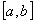
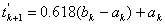
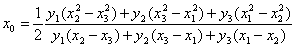
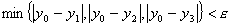
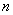

第十八章&nbsp;&nbsp;&nbsp;&nbsp;&nbsp;&nbsp;&nbsp;&nbsp;&nbsp;&nbsp;&nbsp;&nbsp;&nbsp;&nbsp;&nbsp;&nbsp;&nbsp;&nbsp;
<b>第十八章</b><b>&nbsp;&nbsp;&nbsp;&nbsp;&nbsp;&nbsp;&nbsp;&nbsp;&nbsp;&nbsp;&nbsp;&nbsp;&nbsp;&nbsp;&nbsp;&nbsp;
</b><b>最优化方法</b>

实际问题中所提出的最优化问题大体有两类，一类是求函数的极值，另一类是求泛函的极值。如果目标函数(函数或泛函)有明显的表达式，一般可以用微分法、变分法、最大(小)值原理或动态规划方法等分析方法来求解(间接求优)；如果目标函数的表达式过于复杂甚至根本没有明显的表达式，则可用数值方法或“试验最优化”等直接方法来求解(直接求优)。第五章已经介绍了用微分法求函数极值的方法，本章介绍当目标函数无明显表达式时的单变量和多变量函数的直接方法或试验最优化方法，多变量函数的无条件和条件极值问题的数值方法，求泛函数极值的变分法，最大(小)值原理和动态规划(动态规划方法还可以用来求普通函数的极值)。

求函数极值的数值方法或试验最优化方法有时称为数学规划。数学规划除了线性规划外统称为非线性规划。数学规划所处理的一般是静态问题，变分法、最大(小)值原理和动态规划所处理的一般是动态问题，但两者并无截然的界限。

<b>§</b><b>1&nbsp; </b><b>单变量函数极值问题解法</b><b>(</b><b>直接法</b><b>)</b>

本节讨论求目标函数

在区间上的最优解的直接方法(或试验最优化方法)，由于极小和极大只是目标函数相差一符号，因此这里只讨论求

的最优解，即在上求一点使得

这时,称为最优解(最优点)。

[单峰函数]&nbsp; 如果函数在区间上只有一个极值点(因而就是最大点或最小点)，那末称为单峰函数.单峰函数也可用分析方法定义如下：设是区间上函数的最小点，则有

&nbsp;当

&nbsp;当

同样可以定义当是区间上函数的最大点的情形。

如果函数在区间上有多个极值点，则称为多峰函数.只要适当划分区间，可以使函数在每一个子区间上都是单峰的，所以本节限于讨论单峰函数。

[分数法]&nbsp; 由递推关系

定义的费波那奇序列产生分数序列：

如果要在函数的定义区间上限定做次试验找出最优点，可以将区间等分，第一个试验点取在处，以后的试验点采用找对称点(关于区间中点对称)的方法(图18.1)，共做次试验，

便可找到中的个等分点中的最好点，其

精密度(即这个最好点与实际极小点的最大可能距

离)为。

分数法的框图如下(图18.2)：

其中为第次搜索区间()，最小的上界可以由下式估计 

式中为预先给定的允许误差.

分数法是限定试验次数并且每次只做一个试验的最优方法.

[0.618法]&nbsp; 在分数法中可以证明

因此可以近似地取

修改框图如下(图18.3)：

试验点的选取也可以用下列公式计算：&nbsp; 

注意，这里是指中间已经做过的试验点，而不是中点，缩短搜索区间的办法和分数法一样。

0.618法也称为黄金分割法，它是批数不限定，每批做一个试验的最优方法.

[抛物线法]&nbsp; 设在三点的试验结果分别为。通过平面上的三点作二次抛物线(图18.4) 

近似目标函数，再用抛物线的最小点

近似目标函数的最优点，对预先给定的目标函数的允许误差，若

则取为近似解，否则，再用和与它相近的两点构造新的二次抛物线，以其最小点近似最优点。 

这个方法在中间低、两头高的情形，即当而时，效果较好.

若由上式算出的与相等，必须作些修改，例如当且时，取，即取在较长一段的中点。

[分批试验法]&nbsp; 分批试验法根据要求有好几种方法，这里只介绍均分分批试验法。

例如一批做次试验(为正整数)，先将试验范围均分为份，在个分点上做次试验，将所得结果在同一条件下进行检验分析.如果最好(就是这点的函数值最小)，则保留()部分，丢去其余部分，然后仍将()均分为份，再按上述方法处理,这样继续做下去,就可以得到满意的结果。

