

<b>§</b><b>2</b><b>多变量函数极值问题解法</b><b>(</b><b>直接法</b><b>)</b>

本节讨论求目标函数

在定义区域上的最优解的直接方法(或试验最优化方法)，其中

&nbsp; (表示矢量的转置)

表示自变量组成的列矢量，由于极小和极大只是目标函数相差一符号，因此这里只讨论求维列矢量使得

这时，称为最优解(最优点)。

[单峰函数]&nbsp; 如果函数在所讨论的区域上只有一个极值点(最大点或最小点)，那末称这个函数为多变量单峰函数。

多变量单峰函数也可用分析定义。例如，设函数定义在区域上，由于区域上的任一路线都可用一参数方程

&nbsp;&nbsp;&nbsp;

表示，所以函数沿这条路线也可用参数表示为

&nbsp;&nbsp;&nbsp;
设&nbsp;&nbsp;&nbsp;&nbsp;&nbsp;&nbsp;&nbsp;&nbsp;&nbsp;&nbsp;&nbsp;&nbsp;&nbsp;&nbsp;&nbsp;&nbsp;&nbsp;&nbsp;&nbsp;&nbsp;&nbsp;&nbsp;&nbsp;

又设&nbsp;&nbsp;&nbsp;&nbsp;&nbsp;&nbsp;&nbsp;&nbsp;&nbsp;&nbsp;&nbsp;&nbsp;&nbsp;&nbsp;&nbsp;&nbsp;&nbsp;&nbsp;&nbsp;&nbsp;&nbsp;&nbsp;&nbsp;&nbsp;&nbsp;
&nbsp;&nbsp;

如果&nbsp;&nbsp;&nbsp;&nbsp;&nbsp;&nbsp;&nbsp;&nbsp;&nbsp;&nbsp;&nbsp;&nbsp;&nbsp;&nbsp;&nbsp;&nbsp;&nbsp;&nbsp;&nbsp;
,当

,当

那末称函数在区域上从点和点的路线上是单峰的，式中

&nbsp;&nbsp;&nbsp;
设&nbsp;&nbsp;&nbsp;&nbsp;&nbsp;&nbsp;&nbsp;&nbsp;&nbsp;&nbsp;&nbsp;&nbsp;&nbsp;
&nbsp;

如果对区域上的任一对点和，都存在一条从经过到的路线，在其上函数是单峰的，那末称函数在区域上为单峰的.

[因素交替法]&nbsp; 这个方法是轮流按坐标轴方向探索最优点.设为第<i>i</i>个坐标轴的单位矢量，即

&nbsp;&nbsp; 

并且预先给定允许误差那末，迭代程序如下：

(1)&nbsp; 选取初始点.

(2)&nbsp; 由初始点出发，先沿第一个坐标轴方向进行优选(用§1的单因素方法)，得到好点，即

式中为实参数.然后以为起点沿第二个坐标轴方向进行优选，得到好点，即

如此等等，一直到个方向全部优选完毕，得到，它满足

(3)&nbsp; 再以为新的初始点，重复步骤(2)。

(4)&nbsp; 以上步骤一直进行到从某一初始点出发，经过个方向搜索后得不到新点，或与前个初始点之间的距离都小于预先给定的允许误差为止。这时即为最优点的近似解。

[平行线法]&nbsp; 如果处理的双因素问题中，有一个因素难于调整，而另一个因素却容易变动，这时用双因素交替法就不太方便，应改用下面的平行线法：

把难于调整的因素放在纵轴上(图18.5)，设其可调范围为[0,]，把容易变动的因素放在横轴上，设其可调范围为[0，].先把因素固定在点处，在过这点而平行于横轴的直线上对因素在[0，]上优选，好点为①；再把固定在点处，在过这点而平行于横轴的直线上对因素在[0，]上优选，好点为②；比较①与②两点的好坏，如果②比①好，就去掉直线的上半部(如果①比②好，就去掉直线的下半部)，然后把因素固定在可调范围的处，在过这点而平行于横轴的直线上对因素在[0，]上优选，好点为③；比较②与③两点的好坏，如果②比③好，就去掉直线的下半部如此继续做下去把优选范围不断缩小，就可以找到最优点的近似解。

对因素的选择也可采用分数法。

[瞎子爬山法]&nbsp; 迭代过程如下：

(1)&nbsp;&nbsp;&nbsp;&nbsp;&nbsp;&nbsp;&nbsp;&nbsp;&nbsp;&nbsp;
(1)&nbsp;&nbsp;&nbsp;&nbsp;&nbsp; 选取初始点(基点)的步长，命。

(2)&nbsp;&nbsp;&nbsp;&nbsp;&nbsp;&nbsp;&nbsp;&nbsp;&nbsp;&nbsp;
(2)&nbsp;&nbsp;&nbsp;&nbsp;&nbsp; 进行第<i>k</i>阶段的第<i>l</i>次方向(即轴方向)的局部探索

其中为第<i>l</i>个坐标轴的单位矢量，首先沿正方向探索

<a href="#None"
name="_ftnref1" title="">V</a>

如果，则探索成功，就把这点作为下一次沿第<i>l</i>+1个坐标轴方向探索的起点，并命；否则就沿反方向搜索

如果，则探索成功，就把这点作为下一次沿第<i>l</i>+1个坐标轴方向探索的起点，并命；如果正反方向探索都失败就退回原处，即命

并命。

当沿各个坐标轴方向的局部探索都轮流进行后，这个阶段的局部探索也就完成了，这时得到第<i>k</i>阶段的最好点。

(3)&nbsp;&nbsp;&nbsp;&nbsp;&nbsp;&nbsp;&nbsp;&nbsp;&nbsp;&nbsp;
(3)&nbsp;&nbsp;&nbsp;&nbsp;&nbsp; 命，以为新基点，重复步骤(2),如果不能得到更好的点，就缩小步长再进行局部探索，直到步长缩小到规定的精度为止，这时所得最好点即为最优点的近似解。

瞎子爬山法(也称探索爬山法)虽然没有前面几个方法快，但它特别适用于因素不能大幅度调动，或是在大生产中如果出一次废品就造成很大损失的情况。

[陡度法与对角线法]

1°&nbsp; 陡度和陡度法&nbsp; 设在,两点已经做试验，其目标函数值分别为(图18.6)，而且，那末

&nbsp;&nbsp;&nbsp;&nbsp;&nbsp;&nbsp;

称为从上升到的陡度.对维空间有类似的定义。

陡度大的方向目标函数显然上升得快一些.所谓陡度法，就是利用已得的试验结果，算出各点间的陡度，然后沿陡度最大的方向(有利方向)再取点做试验。

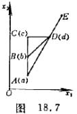2°&nbsp; 联合法(瞎子爬山法与陡度法联合使用)&nbsp; 例如用瞎子爬山法从点出发，沿轴方向调动因素得到点,效果较好，仍沿轴方向调动因

素得到点(图18.7)，效果还是好的，然后沿轴方向

调动因素得到点，效果也好，接下去就不一定从出

发再沿纵横方向去探索了。这时可以分别算出目标函数由

上升到的陡度，由上升到的陡度，由上升到

的陡度，从中选出一个陡度最大的方向，例如，那末

下一次就可以沿的方向往上爬了，这时可以从点出

发沿线段的延长线用瞎子爬山法往上爬，也可以在

上应用单因素的方法优选，一般总可以找出一个比好的点.

3°&nbsp; 对角线法&nbsp; 以上我们通过比较，从通过点的三个方向的陡度挑出一个较陡的方向来，例如是,但并

不一定过点的最陡方向，其实只要利用过点的二个方向的陡

度就可以找出过点的更陡的方向来。

如图18.8,在过垂直于的方向上取一点，使

的长等于到的陡度，且和分别在的两侧；再在

过垂直于的方向上取一点，使的长等于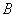到

的陡度，且和分别在的两侧，以，为边

作平行四边形，其对角线的方向就是在点的陡度最大

的方向。

&nbsp;&nbsp;&nbsp; [步长加速法] 步长加速法实际上是瞎子爬山法和沿有利方向加速相结合的方法.其迭代程序如下：

(1)&nbsp;&nbsp;&nbsp;&nbsp;&nbsp;&nbsp;&nbsp;&nbsp;&nbsp;&nbsp;&nbsp;&nbsp;&nbsp;&nbsp;
(1)&nbsp;&nbsp;&nbsp;&nbsp; 选取初始点(基点)和步长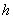，命。

(2)&nbsp;&nbsp;&nbsp;&nbsp;&nbsp;&nbsp;&nbsp;&nbsp;&nbsp;&nbsp;&nbsp;&nbsp;&nbsp;&nbsp;
(2)&nbsp;&nbsp;&nbsp;&nbsp; 瞎子爬山(程序见瞎子爬山法)。

&nbsp;&nbsp;&nbsp; 当沿各个坐标轴方向的局部探索都轮流进行后，这个阶段的局部探索也就完成了，下一步就可沿有利方向进行加速。

(3)&nbsp;&nbsp;&nbsp;&nbsp;&nbsp;&nbsp;&nbsp;&nbsp;&nbsp;&nbsp;&nbsp;&nbsp;&nbsp;&nbsp;
(3)&nbsp;&nbsp;&nbsp;&nbsp; 加速爬山。命。若，那末移到新的位置进行加速试探，

在此

&nbsp;&nbsp;&nbsp; 有两种情形可能产生：

&nbsp;&nbsp;&nbsp; 1°&nbsp; 如果的数值有改进，那末命,应用步骤(2)的方法开始新的探索。

&nbsp;&nbsp;&nbsp; 2°&nbsp; 如果的数值没有改进，那末取消这个加速，将基点放在上次发现的最好点，即。命，象步骤(2)一样开始一个新的局部探索。

&nbsp;&nbsp;&nbsp; 如果经过一个阶段后发现不能加速移动，那末就缩小步长重复步骤(2)。如果逐次缩小步长都不能加速移动，这点便是最优点的近似解。

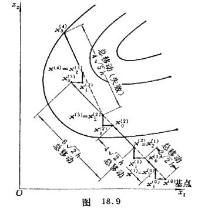&nbsp;&nbsp;&nbsp;
步长加速法在二维的情形如图18。9所示。 

&nbsp;&nbsp;&nbsp; [方向加速法(共轭方向法)]&nbsp; 迭代程序如下：

&nbsp;&nbsp;&nbsp; (1)&nbsp; 从前面的最好数值位置(可以是前一次迭代最后所确定的点或用其他方法所得的好点)和一组线性独立的探索方向(可以取坐标轴的方向)出发。首先寻找过点平行于的直线上的最好点设为，再找过点平行于的直线上的最好点设为，继续这个过程直到所有<i>n</i>个探索方向都已试探过，最后所得点为。

&nbsp;&nbsp;&nbsp; (2)&nbsp; 寻找特殊点，这个点使目标函数的数值同前一点相比改进最大，即点给出个移动的最大改变量，其中。此外决定矢量。

&nbsp;&nbsp;&nbsp; (3)&nbsp; 计算

&nbsp;&nbsp;&nbsp; (4)&nbsp; 记如果

<pre style='text-align:right' align=right>&nbsp;&nbsp;&nbsp;&nbsp;&nbsp;&nbsp;&nbsp;&nbsp;&nbsp;&nbsp;&nbsp;&nbsp;&nbsp;&nbsp;&nbsp;&nbsp;&nbsp;&nbsp;&nbsp;&nbsp;&nbsp;&nbsp;&nbsp;&nbsp;&nbsp;&nbsp;&nbsp;&nbsp;&nbsp;&nbsp;&nbsp;&nbsp;&nbsp;&nbsp;&nbsp;&nbsp;&nbsp; (1)</pre>

或

<pre style='text-align:right' align=right>&nbsp;&nbsp;&nbsp;&nbsp;&nbsp;&nbsp;&nbsp;&nbsp;&nbsp;&nbsp;&nbsp; (2)</pre>

那末不是探索中的好方向，则应重新开始探索，从最后一点出发并用同样的方法，即和，重复步骤(1)。如果不等式(1),(2)都不满足，那末沿方向探索直到找到极小点。将这个点定义为，而<i>k</i>+1阶段的新探索方向为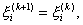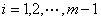;;又。然后从步骤(1)出发重复整个过程，直到,其中为预先给定的允许误差。

<b>&nbsp;&nbsp;&nbsp; </b>例&nbsp;
应用方向加速法找出目标函数

的极小点。

&nbsp;&nbsp;&nbsp; 解&nbsp;
应用导数的方法容易求出目标函数的绝对极小点为。下面用方向加速法来求出这个极小点。

&nbsp;&nbsp;&nbsp; 从点开始探索，探索方向用和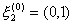。

&nbsp;&nbsp;&nbsp; 第一阶段&nbsp; 从基点出发，沿方向进行一维探索，移动距离由使

到达极小，得到，因此，而目标函数值由减少到。再沿方向用同样的方法探索，得到，同时。

为决定下一阶段是否用方向，应检验不等式(1)，计算点,而,由于 ，所以下一阶段不用方向。

第二阶段&nbsp; 本阶段的方向和前一阶段的一样(因为不采用)。相继探索得到，而又，而。再计算点。在此，由于，不等式(1)不满足。再检验不等式(2)，计算

式中是目标函数在给定方向的最大改变量，即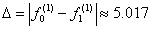。不等式(2)的右端是

因此不等式(2)不满足，即下一阶段可以采用方向

，沿方向探索得到第三阶段的基点为，并且。

第三阶段&nbsp; 本阶段的探索方向为和。沿这两个方向探索将发现不能再前进，因为事实上前一阶段已经找到绝对极小点。当然，这是不足为奇的，因为目标函数是二次的。

[方向步长双加速法]&nbsp; 迭代程序如下：

考虑第<i>k</i>阶段

(1)&nbsp;&nbsp;&nbsp;&nbsp;
(1)&nbsp;&nbsp;&nbsp;&nbsp;&nbsp;&nbsp;&nbsp;&nbsp;&nbsp;&nbsp; 选择一初始点(基点)，一组步长和一组方向，其中，上指标表示第个阶段，下指标表示第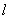个方向。当时，一般选择探索方向平行于坐标轴方向。

(2)&nbsp;&nbsp;&nbsp;&nbsp;
(2)&nbsp;&nbsp;&nbsp;&nbsp;&nbsp;&nbsp;&nbsp;&nbsp;&nbsp;&nbsp; 依次平行于<i>n</i>个方向的每一个进行相继探索，若移动是成功的，则采用新点，若移动不成功则保留基点。若在一给定方向的移动是成功的，则下一次再在这个方向上探索时，步长将增大为倍；若失败，则缩小为倍，负号表示在反方向探索。一般取。

(3)&nbsp;&nbsp;&nbsp;&nbsp;
(3)&nbsp;&nbsp;&nbsp;&nbsp;&nbsp;&nbsp;&nbsp;&nbsp;&nbsp;&nbsp; 直到在每一个方向上都至少有一次成功，一次失败，这时沿该方向的探索就告结束。依次沿平行于<i>n</i>个方向的探索完毕后最后一次成功的点为新的基点。下一阶段(即第阶段)的探索方向，由下列方程计算得到：

首先定义矢量

其中是在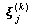方向的所有成功移动的代数和，

然后方向由下式给出

其中

特别，其中主要方向

它的各个分量为

(4)&nbsp;&nbsp;&nbsp;&nbsp;
(4)&nbsp;&nbsp;&nbsp;&nbsp;&nbsp;&nbsp;&nbsp;&nbsp;&nbsp;&nbsp; 以上步骤一直进行到(为预先给定的允许误差)为止，所得最后的基点就近似于最优点。

方向步长双加速法在二维的情况如图18.10所示。 

[单纯形调优法]&nbsp; 迭代程序如下：

(1)&nbsp;&nbsp;&nbsp;&nbsp;
(1)&nbsp;&nbsp;&nbsp;&nbsp;&nbsp;&nbsp;&nbsp;&nbsp;&nbsp;&nbsp; 命<i>n</i>维空间的单纯形的<i>n+</i>1个顶点为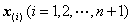，计算函数值，比较大小，并确定

(2)&nbsp;&nbsp;&nbsp;&nbsp;
(2)&nbsp;&nbsp;&nbsp;&nbsp;&nbsp;&nbsp;&nbsp;&nbsp;&nbsp;&nbsp; 求出最坏点的对称点

式中&nbsp;&nbsp;&nbsp;&nbsp;&nbsp;&nbsp;&nbsp;&nbsp;&nbsp;&nbsp;&nbsp;&nbsp;&nbsp;&nbsp;&nbsp;&nbsp;&nbsp;&nbsp;&nbsp;&nbsp;&nbsp;&nbsp;&nbsp;&nbsp;&nbsp;&nbsp;

(3)&nbsp;&nbsp;&nbsp;&nbsp;
(3)&nbsp;&nbsp;&nbsp;&nbsp;&nbsp;&nbsp;&nbsp;&nbsp;&nbsp;&nbsp; 若，则将缩小为，由下式定义：

这里要求，是避免的情形发生。

如果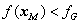，那末，并重复以上步骤。

如果，那末，并重新开始迭代。

(4)&nbsp;&nbsp;&nbsp;&nbsp;
(4)&nbsp;&nbsp;&nbsp;&nbsp;&nbsp;&nbsp;&nbsp;&nbsp;&nbsp;&nbsp; 若，则将扩大为，由下式定义：

扩大的条件也可以换成

或&nbsp;&nbsp;&nbsp;&nbsp;&nbsp;&nbsp;&nbsp;&nbsp;&nbsp;&nbsp;&nbsp;&nbsp;&nbsp;&nbsp;&nbsp;&nbsp;&nbsp;&nbsp;&nbsp;&nbsp;&nbsp;

如果上述条件满足，并且

那末&nbsp;&nbsp;&nbsp;&nbsp;&nbsp;&nbsp;&nbsp;&nbsp;&nbsp;&nbsp;&nbsp;&nbsp;&nbsp;&nbsp;&nbsp;&nbsp;&nbsp;&nbsp;&nbsp;&nbsp;&nbsp;&nbsp;&nbsp;&nbsp;&nbsp;&nbsp;&nbsp;&nbsp;&nbsp;&nbsp;

否则&nbsp;&nbsp;&nbsp;&nbsp;&nbsp;&nbsp;&nbsp;&nbsp;&nbsp;&nbsp;&nbsp;&nbsp;&nbsp;&nbsp;&nbsp;&nbsp;&nbsp;&nbsp;&nbsp;&nbsp;&nbsp;&nbsp;&nbsp;&nbsp;&nbsp;&nbsp;&nbsp;&nbsp;&nbsp;&nbsp;

并重复以上步骤。

上述过程一直继续到

或&nbsp;&nbsp;&nbsp;&nbsp;&nbsp;&nbsp;&nbsp;&nbsp;&nbsp;&nbsp;&nbsp;&nbsp;&nbsp;&nbsp;&nbsp;&nbsp;&nbsp;&nbsp;&nbsp;&nbsp;&nbsp;&nbsp;&nbsp;&nbsp;&nbsp;&nbsp;&nbsp;&nbsp;&nbsp;&nbsp;&nbsp;

为止，其中是预先给定的正数。

 

 

<a href="#None" name="_ftn1" title="">V</a>
在此采用矢量记号

它代表维空间的一点.上标<i>k</i>表示搜索的第<i>k</i>个阶段，下标<i>l</i>表示第<i>k</i>个阶段搜索中的第<i>l</i>次循环.若表示搜索中的基点序列,则当接近最优点时，有

