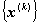
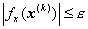
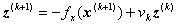
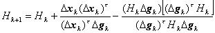

<b>§</b><b>3 </b><b>无条件极值问题解法</b>

本节讨论目标函数

的极小值问题。设

[最速下降法]&nbsp; 迭代程序如下:

(1)&nbsp;&nbsp;&nbsp;&nbsp;&nbsp;&nbsp;&nbsp;&nbsp;&nbsp;&nbsp;&nbsp;&nbsp;&nbsp;&nbsp;&nbsp;&nbsp;
(1)&nbsp;&nbsp;&nbsp;&nbsp;&nbsp;&nbsp; 选取初始点及判别收敛的正数。

(2)&nbsp;&nbsp;&nbsp;&nbsp;&nbsp;&nbsp;&nbsp;&nbsp;&nbsp;&nbsp;&nbsp;&nbsp;&nbsp;&nbsp;&nbsp;&nbsp;
(2)&nbsp;&nbsp;&nbsp;&nbsp;&nbsp;&nbsp; 命

(3)&nbsp;&nbsp;&nbsp;&nbsp;&nbsp;&nbsp;&nbsp;&nbsp;&nbsp;&nbsp;&nbsp;&nbsp;&nbsp;&nbsp;&nbsp;&nbsp;
(3)&nbsp;&nbsp;&nbsp;&nbsp;&nbsp;&nbsp; 计算

(4)&nbsp;&nbsp;&nbsp;&nbsp;&nbsp;&nbsp;&nbsp;&nbsp;&nbsp;&nbsp;&nbsp;&nbsp;&nbsp;&nbsp;&nbsp;&nbsp;
(4)&nbsp;&nbsp;&nbsp;&nbsp;&nbsp;&nbsp; 命,若,则迭代停止,即为所求;否则进行(5)。

(5)&nbsp;&nbsp;&nbsp;&nbsp;&nbsp;&nbsp;&nbsp;&nbsp;&nbsp;&nbsp;&nbsp;&nbsp;&nbsp;&nbsp;&nbsp;&nbsp;
(5)&nbsp;&nbsp;&nbsp;&nbsp;&nbsp;&nbsp; 求,使

(6)&nbsp;&nbsp;&nbsp;&nbsp;&nbsp;&nbsp;&nbsp;&nbsp;&nbsp;&nbsp;&nbsp;&nbsp;&nbsp;&nbsp;&nbsp;&nbsp;
(6)&nbsp;&nbsp;&nbsp;&nbsp;&nbsp;&nbsp; 命;命,进行(3)。

这个方法虽然很简单，但点列收敛于最优解的速度较慢。

[牛顿法]&nbsp; 迭代程序如下：

(1)&nbsp;&nbsp;&nbsp;&nbsp;&nbsp;&nbsp;&nbsp;&nbsp;&nbsp;&nbsp;&nbsp;&nbsp;&nbsp;&nbsp;&nbsp;&nbsp;
(1)&nbsp;&nbsp;&nbsp;&nbsp;&nbsp;&nbsp; 选取初始点及判别收敛的正数。

(2)&nbsp;&nbsp;&nbsp;&nbsp;&nbsp;&nbsp;&nbsp;&nbsp;&nbsp;&nbsp;&nbsp;&nbsp;&nbsp;&nbsp;&nbsp;&nbsp;
(2)&nbsp;&nbsp;&nbsp;&nbsp;&nbsp;&nbsp; 命

(3)&nbsp;&nbsp;&nbsp;&nbsp;&nbsp;&nbsp;&nbsp;&nbsp;&nbsp;&nbsp;&nbsp;&nbsp;&nbsp;&nbsp;&nbsp;&nbsp;
(3)&nbsp;&nbsp;&nbsp;&nbsp;&nbsp;&nbsp; 计算。

(4)&nbsp;&nbsp;&nbsp;&nbsp;&nbsp;&nbsp;&nbsp;&nbsp;&nbsp;&nbsp;&nbsp;&nbsp;&nbsp;&nbsp;&nbsp;&nbsp;
(4)&nbsp;&nbsp;&nbsp;&nbsp;&nbsp;&nbsp; 命

若则迭代停止,即为所求;否则进行(5)。

(5)&nbsp; 求使

(6)&nbsp; 命;命,进行(3)。

牛顿法虽然可以很快地收敛于最优解,但往往计算逆矩阵很困难。为了避免此困难,产生了收敛速度介于最速下降法与牛顿法之间的共轭梯度法。

[共轭梯度法]

1o&nbsp;
目标函数是二次函数

的情形,其迭代程序如下:

(1) &nbsp;选取初始点及判别收敛的正数,若,则迭代停止;否则进行(2)。

(2)&nbsp;&nbsp; (2)&nbsp;&nbsp;&nbsp;&nbsp;&nbsp;&nbsp; 命,

(3)&nbsp;&nbsp; (3)&nbsp;&nbsp;&nbsp;&nbsp;&nbsp;&nbsp; 算出

(4)&nbsp;&nbsp; (4)&nbsp;&nbsp;&nbsp;&nbsp;&nbsp;&nbsp; 命

(5)&nbsp;&nbsp; (5)&nbsp;&nbsp;&nbsp;&nbsp;&nbsp;&nbsp; 若,则迭代停止;否则命

命,进行(3)。

对二次函数只要有限步就可到达最优点。

2o&nbsp;
目标函数是一般函数的情形,其迭代程序如下:

(1)&nbsp; 选取初始点及判别收敛的正数。若,则迭代停止;否则进行(2)。

(2)&nbsp; 命,。

(3)&nbsp; 求使 

(4)&nbsp; 命

(5)&nbsp; 若,则迭代停止;否则,若,则,进行(1),若,则算出

命&nbsp;&nbsp;&nbsp;&nbsp;&nbsp;&nbsp;&nbsp;&nbsp;&nbsp;&nbsp;&nbsp;&nbsp;&nbsp;&nbsp;&nbsp;&nbsp;&nbsp;&nbsp;&nbsp;&nbsp;&nbsp;&nbsp;&nbsp;&nbsp;&nbsp;&nbsp;

命,进行(3)。

这个方法的程序较简单,存储量较小,但当较小时,计算可能引起因舍入误差较大而不稳定的情况。

对一般(非二次)函数,这个方法不一定是有限步到达最优解。

[变尺度方法]

1°&nbsp; 目标函数是二次正定函数

的情形,其迭代程序如下:

(1)&nbsp;&nbsp;&nbsp;&nbsp;&nbsp;&nbsp;&nbsp;&nbsp;&nbsp;&nbsp;&nbsp;&nbsp;&nbsp;&nbsp;
(1)&nbsp;&nbsp;&nbsp;&nbsp;&nbsp;&nbsp; 选取初始点及判别收敛的正数。若,则迭代停止;否则进行(2)。

(2)&nbsp;&nbsp;&nbsp;&nbsp;&nbsp;&nbsp;&nbsp;&nbsp;&nbsp;&nbsp;&nbsp;&nbsp;&nbsp;&nbsp;
(2)&nbsp;&nbsp;&nbsp;&nbsp;&nbsp;&nbsp; 命,(阶单位矩阵),。

(3)&nbsp;&nbsp;&nbsp;&nbsp;&nbsp;&nbsp;&nbsp;&nbsp;&nbsp;&nbsp;&nbsp;&nbsp;&nbsp;&nbsp;
(3)&nbsp;&nbsp;&nbsp;&nbsp;&nbsp;&nbsp; 命。

(4)&nbsp;&nbsp;&nbsp;&nbsp;&nbsp;&nbsp;&nbsp;&nbsp;&nbsp;&nbsp;&nbsp;&nbsp;&nbsp;&nbsp;
(4)&nbsp;&nbsp;&nbsp;&nbsp;&nbsp;&nbsp; 算出

(5)&nbsp;&nbsp;&nbsp;&nbsp;&nbsp;&nbsp;&nbsp;&nbsp;&nbsp;&nbsp;&nbsp;&nbsp;&nbsp;&nbsp;
(5)&nbsp;&nbsp;&nbsp;&nbsp;&nbsp;&nbsp; 命

(6)&nbsp;&nbsp;&nbsp;&nbsp;&nbsp;&nbsp;&nbsp;&nbsp;&nbsp;&nbsp;&nbsp;&nbsp;&nbsp;&nbsp;
(6)&nbsp;&nbsp;&nbsp;&nbsp;&nbsp;&nbsp; 若,则迭代停止;否则,命

算出

再进行(7)。

(7)&nbsp;&nbsp;&nbsp;&nbsp;&nbsp;&nbsp;&nbsp;&nbsp;&nbsp;&nbsp;&nbsp;&nbsp;&nbsp;&nbsp;
(7)&nbsp;&nbsp;&nbsp;&nbsp;&nbsp;&nbsp; 命进行(3)。

对二次函数只要有限步就可到达最优点。

2°&nbsp; 目标函数是一般函数的情形,其迭代程序如下:

(1)&nbsp;&nbsp;&nbsp;&nbsp;&nbsp;&nbsp;&nbsp;&nbsp;&nbsp;&nbsp;&nbsp;&nbsp;&nbsp;&nbsp;
(1)&nbsp;&nbsp;&nbsp;&nbsp;&nbsp;&nbsp; 选取初始点及判别收敛的正数。若,则迭代停止;否则进行(2)。

(2)&nbsp;&nbsp;&nbsp;&nbsp;&nbsp;&nbsp;&nbsp;&nbsp;&nbsp;&nbsp;&nbsp;&nbsp;&nbsp;&nbsp;
(2)&nbsp;&nbsp;&nbsp;&nbsp;&nbsp;&nbsp; 命,,(阶单位矩阵)。

(3)&nbsp;&nbsp;&nbsp;&nbsp;&nbsp;&nbsp;&nbsp;&nbsp;&nbsp;&nbsp;&nbsp;&nbsp;&nbsp;&nbsp;
(3)&nbsp;&nbsp;&nbsp;&nbsp;&nbsp;&nbsp; 命。

(4)&nbsp;&nbsp;&nbsp;&nbsp;&nbsp;&nbsp;&nbsp;&nbsp;&nbsp;&nbsp;&nbsp;&nbsp;&nbsp;&nbsp;
(4)&nbsp;&nbsp;&nbsp;&nbsp;&nbsp;&nbsp; 求,使。

(5)&nbsp;&nbsp;&nbsp;&nbsp;&nbsp;&nbsp;&nbsp;&nbsp;&nbsp;&nbsp;&nbsp;&nbsp;&nbsp;&nbsp;
(5)&nbsp;&nbsp;&nbsp;&nbsp;&nbsp; 命。

(6)&nbsp;&nbsp;&nbsp;&nbsp;&nbsp;&nbsp;&nbsp;&nbsp;&nbsp;&nbsp;&nbsp;&nbsp;&nbsp;&nbsp;
(6)&nbsp;&nbsp;&nbsp;&nbsp;&nbsp; 若,则迭代停止;否则,若,则,进行(1),若,则算出

,,

命,进行(3)。

对一般(非二次)函数,这个方法不一定是有限步到达最优解。

变尺度法是共轭梯度法的改进,它的收敛速度较快。

[高斯-牛顿最小二乘法]&nbsp; 假设目标函数是平方和的形式

&nbsp;&nbsp;&nbsp; 

式中为维列矢量。

这是数据处理中最常见的一种函数形式。

显然,如果的极小点满足 (是预先给定的精度),那末可以认为是方程组

&nbsp;

的解。所以最小二乘法也可用来求非线性方程组的解。

函数一般是非线性的,假设有连续的一阶偏导数:

&nbsp;&nbsp; 

迭代程序如下:

(1)&nbsp;&nbsp;&nbsp;&nbsp;&nbsp;&nbsp;&nbsp;&nbsp;&nbsp;&nbsp;&nbsp;&nbsp;&nbsp;&nbsp;
(1)&nbsp;&nbsp;&nbsp;&nbsp;&nbsp;&nbsp; 选择一初始点。

(2)&nbsp;&nbsp;&nbsp;&nbsp;&nbsp;&nbsp;&nbsp;&nbsp;&nbsp;&nbsp;&nbsp;&nbsp;&nbsp;&nbsp;
(2)&nbsp;&nbsp;&nbsp;&nbsp;&nbsp;&nbsp; 算出

式中

称为对初始值的校正量;又

<pre>&nbsp;&nbsp;&nbsp;&nbsp;&nbsp;&nbsp;&nbsp;&nbsp;&nbsp;&nbsp;&nbsp;&nbsp;&nbsp;&nbsp;&nbsp;&nbsp;&nbsp;&nbsp;&nbsp;&nbsp;&nbsp;&nbsp;&nbsp;&nbsp;&nbsp;&nbsp;&nbsp;&nbsp;&nbsp;&nbsp;&nbsp;&nbsp;&nbsp; </pre>

假设矩阵的列矢量为线性独立的,因此逆矩阵存在。

(3)&nbsp;&nbsp;&nbsp;&nbsp;&nbsp;&nbsp;&nbsp;&nbsp;&nbsp;&nbsp;&nbsp;&nbsp;&nbsp;&nbsp;
(3)&nbsp;&nbsp;&nbsp;&nbsp;&nbsp;&nbsp; 命

则为函数的极小点的首次近似。

(4)&nbsp;&nbsp;&nbsp;&nbsp;&nbsp;&nbsp;&nbsp;&nbsp;&nbsp;&nbsp;&nbsp;&nbsp;&nbsp;&nbsp;
(4)&nbsp;&nbsp;&nbsp;&nbsp;&nbsp;&nbsp; 以代替前面的,代替,重复上述计算过程,直到

或

为止,在此和为预先指定的表示对精确度要求的两个正数。

[改进的高斯-牛顿最小二乘法]&nbsp; 上述高斯-牛顿最小二乘法利用了目标函数为平方和的特点,用近似代替牛顿法中的二阶导数矩阵,大大节省了计算量,但是它对初始点的要求比较严格,如果初始点与极小点相距太远,这个算法往往失败。其原因可以从两个方面来看,其一是上述算法基于线性逼近,但在远离极小点时,这种线性逼近无效;其二是的最大特征值与最小特征值的比很大,以致使解变得无意义。为此采取下述改进的办法。

在求出的校正量后,不把作为第次近似,而将作为下一步的搜索方向,这时求使

极小值

然后令

<b></b>

以代替重复上述过程,直到

<b></b>

或&nbsp;&nbsp;&nbsp;&nbsp;&nbsp;&nbsp;&nbsp;&nbsp;&nbsp;&nbsp;&nbsp;&nbsp;&nbsp;&nbsp;&nbsp;&nbsp;&nbsp;&nbsp;&nbsp;&nbsp;&nbsp;&nbsp;&nbsp;&nbsp;&nbsp;&nbsp;&nbsp;&nbsp;&nbsp;&nbsp;&nbsp;&nbsp;

时为止,这时极小点和极小值分别为

,

称为第步的最优步长因子。

