

<b>§</b><b>4&nbsp; </b><b>条件极值问题解法</b>

本节讨论目标函数

在一组不等式

&nbsp; (或)

或等式

约束条件下的极值问题解法.这种问题称为条件极值问题，当目标函数和约束条件关于自变量都是线性时，称为线性规划问题，否则称为非线性规划问题.

条件极值问题就是要求在维欧氏空间的一个由不等式约束条件所限定的区域：

上求一点，使得目标函数达到极小值（或极大值），即

其中,是定义在的某一开集上的具有一阶连续偏导数的实值函数.

因为在同样的约束条件下，极小和极大只是目标函数相差一符号，以后限于讨论极小的情况.

若某一，有

则称为的内点，若，存在一个 使

则称为的边界点.

[线性规划问题的可行解与极小可行解]&nbsp; 线性规划问题就是求目标函数

<pre style='text-align:right;line-height:16.0pt' align=right>&nbsp;&nbsp;&nbsp;&nbsp;&nbsp; &nbsp;&nbsp;&nbsp;&nbsp;&nbsp;&nbsp;&nbsp;&nbsp;&nbsp;&nbsp;&nbsp;&nbsp;&nbsp;&nbsp;&nbsp;&nbsp;&nbsp;&nbsp;&nbsp;&nbsp;&nbsp;&nbsp;&nbsp;&nbsp;&nbsp;&nbsp;&nbsp;&nbsp;&nbsp;&nbsp;&nbsp;(1)</pre>

在约束条件

<pre style='text-align:right;line-height:16.0pt' align=right>&nbsp;&nbsp;&nbsp;&nbsp;&nbsp;&nbsp; ()&nbsp;&nbsp;&nbsp;&nbsp;&nbsp;&nbsp;&nbsp;&nbsp;&nbsp;&nbsp;&nbsp;&nbsp;&nbsp;&nbsp;&nbsp;&nbsp;&nbsp;&nbsp;&nbsp;&nbsp;&nbsp;&nbsp;&nbsp;&nbsp;&nbsp;&nbsp; ()</pre><pre style='text-align:right;
line-height:16.0pt' align=right>&nbsp;&nbsp;&nbsp;&nbsp;&nbsp;&nbsp; &nbsp;&nbsp;&nbsp;&nbsp; ()&nbsp;&nbsp;&nbsp;&nbsp;&nbsp;&nbsp;&nbsp;&nbsp;&nbsp;&nbsp;&nbsp;&nbsp;&nbsp;&nbsp;&nbsp;&nbsp;&nbsp;&nbsp;&nbsp;&nbsp;&nbsp;&nbsp;&nbsp;&nbsp;&nbsp;&nbsp;&nbsp;&nbsp; ()</pre><pre style='text-align:right;
line-height:16.0pt' align=right>&nbsp;&nbsp;&nbsp;&nbsp;&nbsp;&nbsp;&nbsp; ()&nbsp;&nbsp;&nbsp;&nbsp;&nbsp;&nbsp;&nbsp;&nbsp;&nbsp;&nbsp;&nbsp;&nbsp;&nbsp;&nbsp;&nbsp;&nbsp;&nbsp;&nbsp;&nbsp;&nbsp; ()</pre><pre
style='text-align:right;line-height:16.0pt' align=right> &nbsp;&nbsp;&nbsp;&nbsp;&nbsp;&nbsp;&nbsp;&nbsp;&nbsp;&nbsp;&nbsp;&nbsp;&nbsp;&nbsp;&nbsp;&nbsp;&nbsp;&nbsp;&nbsp;&nbsp;&nbsp;()</pre>

下的极小值，其中有个等式约束条件，其余是不等式约束条件.假定.

对形如()的约束条件，则引进松驰变量，把它变为等式

&nbsp;&nbsp;&nbsp; 

对形如()的约束条件，则引进松驰变量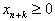，把它变为等式

&nbsp;&nbsp; ()

松驰变量并不出现在目标函数(1)中，它的引进并不影响问题的最优解，它把所有约束条件（除了外)化成统一的等式形式

<pre style='text-align:right;line-height:16.0pt' align=right>&nbsp;&nbsp;&nbsp;&nbsp;&nbsp;&nbsp;&nbsp;&nbsp;&nbsp;&nbsp;&nbsp;&nbsp;&nbsp;&nbsp;&nbsp;&nbsp;&nbsp;&nbsp;&nbsp;&nbsp;&nbsp;&nbsp;&nbsp;&nbsp;&nbsp;&nbsp;&nbsp;&nbsp;&nbsp;&nbsp;&nbsp;&nbsp;&nbsp;&nbsp;&nbsp;&nbsp; (3)</pre>

式中是维矢量，它包含所有原来的变量和松驰变量，是维常数矢量，而是矩阵，因此(3)表示个未知量的个方程的线性方程组.

所以线性规划问题可以表述为如下三种等价形式：

&nbsp; 求目标函数

<pre style='text-align:right;line-height:16.0pt' align=right>&nbsp;&nbsp;&nbsp;&nbsp;&nbsp;&nbsp;&nbsp;&nbsp;&nbsp;&nbsp;&nbsp;&nbsp;&nbsp;&nbsp;&nbsp;&nbsp;&nbsp;&nbsp;&nbsp;&nbsp;&nbsp;&nbsp;&nbsp;&nbsp;&nbsp;&nbsp;&nbsp;&nbsp;&nbsp;&nbsp;&nbsp;&nbsp;&nbsp; ()</pre>

在约束条件

<pre style='text-align:right;line-height:16.0pt' align=right>&nbsp;&nbsp;&nbsp;&nbsp;&nbsp;&nbsp;&nbsp; &nbsp;&nbsp;&nbsp;&nbsp;&nbsp;&nbsp;&nbsp;&nbsp;&nbsp;&nbsp;&nbsp;&nbsp;&nbsp;&nbsp;&nbsp;&nbsp;&nbsp;&nbsp;&nbsp;&nbsp;&nbsp;&nbsp;()</pre><pre
style='text-align:right;line-height:16.0pt' align=right>&nbsp;&nbsp;&nbsp;&nbsp;&nbsp;&nbsp;&nbsp;&nbsp;&nbsp;&nbsp; ()&nbsp;&nbsp;&nbsp;&nbsp;&nbsp;&nbsp;&nbsp;&nbsp;&nbsp;&nbsp;&nbsp;&nbsp;&nbsp;&nbsp;&nbsp;&nbsp;&nbsp;&nbsp;&nbsp;&nbsp;&nbsp;&nbsp;&nbsp;&nbsp;&nbsp;&nbsp; (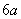)</pre>

下的极小值，假定&nbsp; ().

&nbsp; 求目标函数

<pre style='text-align:right;line-height:16.0pt' align=right>&nbsp;&nbsp;&nbsp;&nbsp;&nbsp;&nbsp;&nbsp;&nbsp;&nbsp;&nbsp;&nbsp;&nbsp;&nbsp;&nbsp;&nbsp;&nbsp;&nbsp;&nbsp;&nbsp;&nbsp;&nbsp;&nbsp;&nbsp;&nbsp;&nbsp;&nbsp;&nbsp;&nbsp;&nbsp;&nbsp;&nbsp;&nbsp;&nbsp;&nbsp;&nbsp; (4b)</pre>

在约束条件

<pre style='text-align:right;line-height:16.0pt' align=right>&nbsp;&nbsp;&nbsp;&nbsp;&nbsp;&nbsp;&nbsp;&nbsp;&nbsp;&nbsp;&nbsp;&nbsp;&nbsp;&nbsp;&nbsp;&nbsp;&nbsp;&nbsp;&nbsp;&nbsp;&nbsp;&nbsp;&nbsp;&nbsp;&nbsp;&nbsp;&nbsp;&nbsp;&nbsp;&nbsp;&nbsp;&nbsp;&nbsp;&nbsp;&nbsp; (5b)</pre><pre
style='text-align:right;line-height:16.0pt' align=right>&nbsp;&nbsp;&nbsp;&nbsp;&nbsp;&nbsp;&nbsp;&nbsp;&nbsp; &nbsp;&nbsp;&nbsp;&nbsp;&nbsp;&nbsp;&nbsp;&nbsp;&nbsp;&nbsp;&nbsp;&nbsp;&nbsp;&nbsp;&nbsp;(6b)</pre>

下的极小值，其中是一行矢量，是一列矢量，为矩阵（），是一列矢量，假定.

&nbsp; 求目标函数

<pre style='text-align:right;line-height:16.0pt' align=right>&nbsp;&nbsp;&nbsp;&nbsp;&nbsp;&nbsp;&nbsp;&nbsp;&nbsp;&nbsp;&nbsp;&nbsp;&nbsp;&nbsp;&nbsp;&nbsp;&nbsp;&nbsp;&nbsp;&nbsp;&nbsp;&nbsp;&nbsp;&nbsp;&nbsp;&nbsp;&nbsp;&nbsp;&nbsp;&nbsp;&nbsp;&nbsp;&nbsp;&nbsp;&nbsp; (4c)</pre>

在约束条件

<pre style='text-align:right;line-height:16.0pt' align=right>&nbsp;&nbsp;&nbsp;&nbsp;&nbsp;&nbsp;&nbsp;&nbsp;&nbsp;&nbsp;&nbsp;&nbsp;&nbsp;&nbsp;&nbsp;&nbsp;&nbsp;&nbsp;&nbsp;&nbsp;&nbsp;&nbsp;&nbsp; (5c)</pre><pre
style='text-align:right;line-height:16.0pt' align=right>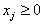&nbsp;&nbsp;&nbsp;&nbsp;&nbsp;&nbsp; 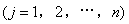&nbsp;&nbsp;&nbsp;&nbsp;&nbsp;&nbsp;&nbsp;&nbsp;&nbsp;&nbsp;&nbsp;&nbsp;&nbsp;&nbsp;&nbsp;&nbsp;&nbsp;&nbsp;(6c)</pre>

下的极小值，其中是矩阵<i>A</i>的第列矢量

，假定&nbsp;&nbsp; 

称为目标函数(4)的价格系数.

定义1&nbsp; 满足条件(5)和(6)的矢量称为线性规划问题的可行解.

定义2&nbsp; 若可行解的分量中至多有个，则称为基本可行解.

定义3&nbsp; 若一个基本可行解恰有个分量，则称为非退化的基本可行解.

定义4&nbsp; 使目标函数(4)达到极小值的可行解称为极小可行解（简称极小解）.

集合&nbsp;&nbsp;&nbsp;&nbsp;&nbsp;&nbsp;&nbsp;

是一凸集，它有有限个顶点，若线性规划中目标函数(4)有极小值，则必可在其凸集上某一顶点达到.

假设线性规划问题是可行的，每一基本可行解都是非退化的，并且给定一基本可行解和与它关联的一组线性无关矢量则有

式是所有，为目标函数的价格系数，为目标函数相应于给定解的数值.由于 是线性无关的，存在满足

&nbsp;&nbsp;&nbsp; ()

并且定义

&nbsp;&nbsp;&nbsp; ()

式中为相应于的价格系数.

定 理 1&nbsp; 如果对任一固定的，条件成立，那末可以构造一组可行解使得对组中的任一可行解都有，其中的下限或者是有限的或者是无限的（是目标函数相应于可行解组中某一可行解的数值.）

定理2&nbsp; 如果对任一基本可行解，条件对所有成立，那末是一极小可行解.

[单纯形法]&nbsp; 根据以上两个定理解线性规划问题的单纯形法就是从已知的某一基本可行解（它是满足约束条件的一切点即可行解所组成的凸集的一个顶点）出发,确定这点是否使目标函数达到极小值.如果不是，依次构造新的基本可行解（它们是凸集的相邻顶点），其相应的目标函数值小于或等于前面的数值.经过有限步（通常在和之间）就可得到极小解.所以单纯形法实际是凸集顶点的一个迭代方法.下面分两种情形叙述.

&nbsp; 假设矩阵的个列矢量包含个单位矢量并集中在一起组成一个阶单位矩阵，不妨设这些列矢量，命

&nbsp; （为阶单位矩阵）

称为容许基底.由于，而且的所有元素都是非负的，因此有初始基本可行解

式中&nbsp;&nbsp;&nbsp;&nbsp;&nbsp;&nbsp;&nbsp;&nbsp;&nbsp;&nbsp;&nbsp;&nbsp;&nbsp;&nbsp;&nbsp;&nbsp;&nbsp;&nbsp;&nbsp;&nbsp;&nbsp;&nbsp;&nbsp;&nbsp;&nbsp;&nbsp;&nbsp;

列表如下：

表&nbsp;&nbsp;&nbsp;&nbsp;
1

<table class=MsoNormalTable border=1 cellspacing=0 cellpadding=0
 style='border-collapse:collapse;border:none'>
 <tr>
  <td width=52 valign=top style='width:39.05pt;border-top:solid windowtext 1.5pt;
  border-left:none;border-bottom:none;border-right:solid windowtext 1.0pt;
  padding:0mm 1.4pt 0mm 1.4pt'>
  
<i>i</i>

  </td>
  <td width=41 valign=top style='width:30.55pt;border-top:solid windowtext 1.5pt;
  border-left:none;border-bottom:none;border-right:solid windowtext 1.0pt;
  padding:0mm 1.4pt 0mm 1.4pt'>
  
基底

  </td>
  <td width=34 valign=top style='width:25.75pt;border:none;border-top:solid windowtext 1.5pt;
  padding:0mm 1.4pt 0mm 1.4pt'>
  

  </td>
  <td width=43 valign=top style='width:32.3pt;border-top:solid 1.5pt;
  border-left:double 2.25pt;border-bottom:solid 1.0pt;border-right:solid 1.0pt;
  border-color:windowtext;padding:0mm 1.4pt 0mm 1.4pt'>
  
&nbsp;
  

  </td>
  <td width=36 valign=top style='width:26.8pt;border-top:solid windowtext 1.5pt;
  border-left:none;border-bottom:solid windowtext 1.0pt;border-right:solid windowtext 1.0pt;
  padding:0mm 1.4pt 0mm 1.4pt'>
  

  </td>
  <td width=37 valign=top style='width:27.8pt;border-top:solid windowtext 1.5pt;
  border-left:none;border-bottom:solid windowtext 1.0pt;border-right:solid windowtext 1.0pt;
  padding:0mm 1.4pt 0mm 1.4pt'>
  

  </td>
  <td width=28 valign=top style='width:20.8pt;border-top:solid windowtext 1.5pt;
  border-left:none;border-bottom:solid windowtext 1.0pt;border-right:solid windowtext 1.0pt;
  padding:0mm 1.4pt 0mm 1.4pt'>
  
…

  </td>
  <td width=36 valign=top style='width:26.8pt;border-top:solid windowtext 1.5pt;
  border-left:none;border-bottom:solid windowtext 1.0pt;border-right:solid windowtext 1.0pt;
  padding:0mm 1.4pt 0mm 1.4pt'>
  

  </td>
  <td width=28 valign=top style='width:20.8pt;border-top:solid windowtext 1.5pt;
  border-left:none;border-bottom:solid windowtext 1.0pt;border-right:solid windowtext 1.0pt;
  padding:0mm 1.4pt 0mm 1.4pt'>
  
…

  </td>
  <td width=38 valign=top style='width:28.8pt;border-top:solid windowtext 1.5pt;
  border-left:none;border-bottom:solid windowtext 1.0pt;border-right:solid windowtext 1.0pt;
  padding:0mm 1.4pt 0mm 1.4pt'>
  

  </td>
  <td width=60 valign=top style='width:44.8pt;border-top:solid windowtext 1.5pt;
  border-left:none;border-bottom:solid windowtext 1.0pt;border-right:solid windowtext 1.0pt;
  padding:0mm 1.4pt 0mm 1.4pt'>
  

  </td>
  <td width=28 valign=top style='width:20.8pt;border-top:solid windowtext 1.5pt;
  border-left:none;border-bottom:solid windowtext 1.0pt;border-right:solid windowtext 1.0pt;
  padding:0mm 1.4pt 0mm 1.4pt'>
  
…

  </td>
  <td width=42 valign=top style='width:31.8pt;border-top:solid windowtext 1.5pt;
  border-left:none;border-bottom:solid windowtext 1.0pt;border-right:solid windowtext 1.0pt;
  padding:0mm 1.4pt 0mm 1.4pt'>
  

  </td>
  <td width=28 valign=top style='width:20.8pt;border-top:solid windowtext 1.5pt;
  border-left:none;border-bottom:solid windowtext 1.0pt;border-right:solid windowtext 1.0pt;
  padding:0mm 1.4pt 0mm 1.4pt'>
  
…

  </td>
  <td width=42 valign=top style='width:31.8pt;border-top:solid windowtext 1.5pt;
  border-left:none;border-bottom:solid windowtext 1.0pt;border-right:solid windowtext 1.0pt;
  padding:0mm 1.4pt 0mm 1.4pt'>
  

  </td>
  <td width=28 valign=top style='width:20.8pt;border-top:solid windowtext 1.5pt;
  border-left:none;border-bottom:solid windowtext 1.0pt;border-right:solid windowtext 1.0pt;
  padding:0mm 1.4pt 0mm 1.4pt'>
  
…

  </td>
  <td width=42 valign=top style='width:31.8pt;border-top:solid windowtext 1.5pt;
  border-left:none;border-bottom:solid windowtext 1.0pt;border-right:none;
  padding:0mm 1.4pt 0mm 1.4pt'>
  

  </td>
 </tr>
 <tr style='mso-row-'>
  <td style='border:none;border-bottom:solid windowtext 1.0pt' width=52>
&nbsp;</td>
  <td width=41 valign=top style='width:30.55pt;border-top:none;border-left:
  solid windowtext 1.5pt;border-bottom:solid windowtext 1.0pt;border-right:
  solid windowtext 1.0pt;padding:0mm 1.4pt 0mm 1.4pt'>
  
&nbsp;
  

  </td>
  <td width=34 valign=top style='width:25.75pt;border:none;border-bottom:solid windowtext 1.0pt;
  padding:0mm 1.4pt 0mm 1.4pt'>
  
&nbsp;
  

  </td>
  <td width=43 valign=top style='width:32.3pt;border-top:none;border-left:double windowtext 2.25pt;
  border-bottom:solid windowtext 1.0pt;border-right:solid windowtext 1.0pt;
  padding:0mm 1.4pt 0mm 1.4pt'>
  

  </td>
  <td width=36 valign=top style='width:26.8pt;border-top:none;border-left:none;
  border-bottom:solid windowtext 1.0pt;border-right:solid windowtext 1.0pt;
  padding:0mm 1.4pt 0mm 1.4pt'>
  

  </td>
  <td width=37 valign=top style='width:27.8pt;border-top:none;border-left:none;
  border-bottom:solid windowtext 1.0pt;border-right:solid windowtext 1.0pt;
  padding:0mm 1.4pt 0mm 1.4pt'>
  

  </td>
  <td width=28 valign=top style='width:20.8pt;border-top:none;border-left:none;
  border-bottom:solid windowtext 1.0pt;border-right:solid windowtext 1.0pt;
  padding:0mm 1.4pt 0mm 1.4pt'>
  
…

  </td>
  <td width=36 valign=top style='width:26.8pt;border-top:none;border-left:none;
  border-bottom:solid windowtext 1.0pt;border-right:solid windowtext 1.0pt;
  padding:0mm 1.4pt 0mm 1.4pt'>
  

  </td>
  <td width=28 valign=top style='width:20.8pt;border-top:none;border-left:none;
  border-bottom:solid windowtext 1.0pt;border-right:solid windowtext 1.0pt;
  padding:0mm 1.4pt 0mm 1.4pt'>
  
…

  </td>
  <td width=38 valign=top style='width:28.8pt;border-top:none;border-left:none;
  border-bottom:solid windowtext 1.0pt;border-right:solid windowtext 1.0pt;
  padding:0mm 1.4pt 0mm 1.4pt'>
  

  </td>
  <td width=60 valign=top style='width:44.8pt;border-top:none;border-left:none;
  border-bottom:solid windowtext 1.0pt;border-right:solid windowtext 1.0pt;
  padding:0mm 1.4pt 0mm 1.4pt'>
  

  </td>
  <td width=28 valign=top style='width:20.8pt;border-top:none;border-left:none;
  border-bottom:solid windowtext 1.0pt;border-right:solid windowtext 1.0pt;
  padding:0mm 1.4pt 0mm 1.4pt'>
  
…

  </td>
  <td width=42 valign=top style='width:31.8pt;border-top:none;border-left:none;
  border-bottom:solid windowtext 1.0pt;border-right:solid windowtext 1.0pt;
  padding:0mm 1.4pt 0mm 1.4pt'>
  

  </td>
  <td width=28 valign=top style='width:20.8pt;border-top:none;border-left:none;
  border-bottom:solid windowtext 1.0pt;border-right:solid windowtext 1.0pt;
  padding:0mm 1.4pt 0mm 1.4pt'>
  
…

  </td>
  <td width=42 valign=top style='width:31.8pt;border-top:none;border-left:none;
  border-bottom:solid windowtext 1.0pt;border-right:solid windowtext 1.0pt;
  padding:0mm 1.4pt 0mm 1.4pt'>
  

  </td>
  <td width=28 valign=top style='width:20.8pt;border-top:none;border-left:none;
  border-bottom:solid windowtext 1.0pt;border-right:solid windowtext 1.0pt;
  padding:0mm 1.4pt 0mm 1.4pt'>
  
…

  </td>
  <td width=42 valign=top style='width:31.8pt;border:none;border-bottom:solid windowtext 1.0pt;
  padding:0mm 1.4pt 0mm 1.4pt'>
  

  </td>
 </tr>
 <tr>
  <td width=52 valign=top style='width:39.05pt;border:none;border-right:solid windowtext 1.0pt;
  padding:0mm 1.4pt 0mm 1.4pt'>
  
1

  </td>
  <td width=41 valign=top style='width:30.55pt;border:none;border-right:solid windowtext 1.0pt;
  padding:0mm 1.4pt 0mm 1.4pt'>
  

  </td>
  <td width=34 valign=top style='width:25.75pt;border:none;padding:0mm 1.4pt 0mm 1.4pt'>
  

  </td>
  <td width=43 valign=top style='width:32.3pt;border-top:none;border-left:double windowtext 2.25pt;
  border-bottom:none;border-right:solid windowtext 1.0pt;padding:0mm 1.4pt 0mm 1.4pt'>
  

  </td>
  <td width=36 valign=top style='width:26.8pt;border:none;border-right:solid windowtext 1.0pt;
  padding:0mm 1.4pt 0mm 1.4pt'>
  
1

  </td>
  <td width=37 valign=top style='width:27.8pt;border:none;border-right:solid windowtext 1.0pt;
  padding:0mm 1.4pt 0mm 1.4pt'>
  
0

  </td>
  <td width=28 valign=top style='width:20.8pt;border:none;border-right:solid windowtext 1.0pt;
  padding:0mm 1.4pt 0mm 1.4pt'>
  
…

  </td>
  <td width=36 valign=top style='width:26.8pt;border:none;border-right:solid windowtext 1.0pt;
  padding:0mm 1.4pt 0mm 1.4pt'>
  
0

  </td>
  <td width=28 valign=top style='width:20.8pt;border:none;border-right:solid windowtext 1.0pt;
  padding:0mm 1.4pt 0mm 1.4pt'>
  
…

  </td>
  <td width=38 valign=top style='width:28.8pt;border:none;border-right:solid windowtext 1.0pt;
  padding:0mm 1.4pt 0mm 1.4pt'>
  
0

  </td>
  <td width=60 valign=top style='width:44.8pt;border:none;border-right:solid windowtext 1.0pt;
  padding:0mm 1.4pt 0mm 1.4pt'>
  

  </td>
  <td width=28 valign=top style='width:20.8pt;border:none;border-right:solid windowtext 1.0pt;
  padding:0mm 1.4pt 0mm 1.4pt'>
  
…

  </td>
  <td width=42 valign=top style='width:31.8pt;border:none;border-right:solid windowtext 1.0pt;
  padding:0mm 1.4pt 0mm 1.4pt'>
  

  </td>
  <td width=28 valign=top style='width:20.8pt;border:none;border-right:solid windowtext 1.0pt;
  padding:0mm 1.4pt 0mm 1.4pt'>
  
…

  </td>
  <td width=42 valign=top style='width:31.8pt;border:none;border-right:solid windowtext 1.0pt;
  padding:0mm 1.4pt 0mm 1.4pt'>
  

  </td>
  <td width=28 valign=top style='width:20.8pt;border:none;border-right:solid windowtext 1.0pt;
  padding:0mm 1.4pt 0mm 1.4pt'>
  
…

  </td>
  <td width=42 valign=top style='width:31.8pt;border:none;padding:0mm 1.4pt 0mm 1.4pt'>
  

  </td>
 </tr>
 <tr>
  <td width=52 valign=top style='width:39.05pt;border:none;border-right:solid windowtext 1.0pt;
  padding:0mm 1.4pt 0mm 1.4pt'>
  
2

  </td>
  <td width=41 valign=top style='width:30.55pt;border:none;border-right:solid windowtext 1.0pt;
  padding:0mm 1.4pt 0mm 1.4pt'>
  

  </td>
  <td width=34 valign=top style='width:25.75pt;border:none;padding:0mm 1.4pt 0mm 1.4pt'>
  

  </td>
  <td width=43 valign=top style='width:32.3pt;border-top:none;border-left:double windowtext 2.25pt;
  border-bottom:none;border-right:solid windowtext 1.0pt;padding:0mm 1.4pt 0mm 1.4pt'>
  

  </td>
  <td width=36 valign=top style='width:26.8pt;border:none;border-right:solid windowtext 1.0pt;
  padding:0mm 1.4pt 0mm 1.4pt'>
  
0

  </td>
  <td width=37 valign=top style='width:27.8pt;border:none;border-right:solid windowtext 1.0pt;
  padding:0mm 1.4pt 0mm 1.4pt'>
  
1

  </td>
  <td width=28 valign=top style='width:20.8pt;border:none;border-right:solid windowtext 1.0pt;
  padding:0mm 1.4pt 0mm 1.4pt'>
  
…

  </td>
  <td width=36 valign=top style='width:26.8pt;border:none;border-right:solid windowtext 1.0pt;
  padding:0mm 1.4pt 0mm 1.4pt'>
  
0

  </td>
  <td width=28 valign=top style='width:20.8pt;border:none;border-right:solid windowtext 1.0pt;
  padding:0mm 1.4pt 0mm 1.4pt'>
  
…

  </td>
  <td width=38 valign=top style='width:28.8pt;border:none;border-right:solid windowtext 1.0pt;
  padding:0mm 1.4pt 0mm 1.4pt'>
  
0

  </td>
  <td width=60 valign=top style='width:44.8pt;border:none;border-right:solid windowtext 1.0pt;
  padding:0mm 1.4pt 0mm 1.4pt'>
  

  </td>
  <td width=28 valign=top style='width:20.8pt;border:none;border-right:solid windowtext 1.0pt;
  padding:0mm 1.4pt 0mm 1.4pt'>
  
…

  </td>
  <td width=42 valign=top style='width:31.8pt;border:none;border-right:solid windowtext 1.0pt;
  padding:0mm 1.4pt 0mm 1.4pt'>
  

  </td>
  <td width=28 valign=top style='width:20.8pt;border:none;border-right:solid windowtext 1.0pt;
  padding:0mm 1.4pt 0mm 1.4pt'>
  
…

  </td>
  <td width=42 valign=top style='width:31.8pt;border:none;border-right:solid windowtext 1.0pt;
  padding:0mm 1.4pt 0mm 1.4pt'>
  

  </td>
  <td width=28 valign=top style='width:20.8pt;border:none;border-right:solid windowtext 1.0pt;
  padding:0mm 1.4pt 0mm 1.4pt'>
  
…

  </td>
  <td width=42 valign=top style='width:31.8pt;border:none;padding:0mm 1.4pt 0mm 1.4pt'>
  

  </td>
 </tr>
 <tr>
  <td width=52 valign=top style='width:39.05pt;border:none;border-right:solid windowtext 1.0pt;
  padding:0mm 1.4pt 0mm 1.4pt'>
  

  </td>
  <td width=41 valign=top style='width:30.55pt;border:none;border-right:solid windowtext 1.0pt;
  padding:0mm 1.4pt 0mm 1.4pt'>
  

  </td>
  <td width=34 valign=top style='width:25.75pt;border:none;padding:0mm 1.4pt 0mm 1.4pt'>
  

  </td>
  <td width=43 valign=top style='width:32.3pt;border-top:none;border-left:double windowtext 2.25pt;
  border-bottom:none;border-right:solid windowtext 1.0pt;padding:0mm 1.4pt 0mm 1.4pt'>
  

  </td>
  <td width=36 valign=top style='width:26.8pt;border:none;border-right:solid windowtext 1.0pt;
  padding:0mm 1.4pt 0mm 1.4pt'>
  

  </td>
  <td width=37 valign=top style='width:27.8pt;border:none;border-right:solid windowtext 1.0pt;
  padding:0mm 1.4pt 0mm 1.4pt'>
  

  </td>
  <td width=28 valign=top style='width:20.8pt;border:none;border-right:solid windowtext 1.0pt;
  padding:0mm 1.4pt 0mm 1.4pt'>
  

  </td>
  <td width=36 valign=top style='width:26.8pt;border:none;border-right:solid windowtext 1.0pt;
  padding:0mm 1.4pt 0mm 1.4pt'>
  

  </td>
  <td width=28 valign=top style='width:20.8pt;border:none;border-right:solid windowtext 1.0pt;
  padding:0mm 1.4pt 0mm 1.4pt'>
  

  </td>
  <td width=38 valign=top style='width:28.8pt;border:none;border-right:solid windowtext 1.0pt;
  padding:0mm 1.4pt 0mm 1.4pt'>
  

  </td>
  <td width=60 valign=top style='width:44.8pt;border:none;border-right:solid windowtext 1.0pt;
  padding:0mm 1.4pt 0mm 1.4pt'>
  

  </td>
  <td width=28 valign=top style='width:20.8pt;border:none;border-right:solid windowtext 1.0pt;
  padding:0mm 1.4pt 0mm 1.4pt'>
  

  </td>
  <td width=42 valign=top style='width:31.8pt;border:none;border-right:solid windowtext 1.0pt;
  padding:0mm 1.4pt 0mm 1.4pt'>
  

  </td>
  <td width=28 valign=top style='width:20.8pt;border:none;border-right:solid windowtext 1.0pt;
  padding:0mm 1.4pt 0mm 1.4pt'>
  

  </td>
  <td width=42 valign=top style='width:31.8pt;border:none;border-right:solid windowtext 1.0pt;
  padding:0mm 1.4pt 0mm 1.4pt'>
  

  </td>
  <td width=28 valign=top style='width:20.8pt;border:none;border-right:solid windowtext 1.0pt;
  padding:0mm 1.4pt 0mm 1.4pt'>
  

  </td>
  <td width=42 valign=top style='width:31.8pt;border:none;padding:0mm 1.4pt 0mm 1.4pt'>
  

  </td>
 </tr>
 <tr>
  <td width=52 valign=top style='width:39.05pt;border:none;border-right:solid windowtext 1.0pt;
  padding:0mm 1.4pt 0mm 1.4pt'>
  

  </td>
  <td width=41 valign=top style='width:30.55pt;border:none;border-right:solid windowtext 1.0pt;
  padding:0mm 1.4pt 0mm 1.4pt'>
  

  </td>
  <td width=34 valign=top style='width:25.75pt;border:none;padding:0mm 1.4pt 0mm 1.4pt'>
  

  </td>
  <td width=43 valign=top style='width:32.3pt;border-top:none;border-left:double windowtext 2.25pt;
  border-bottom:none;border-right:solid windowtext 1.0pt;padding:0mm 1.4pt 0mm 1.4pt'>
  

  </td>
  <td width=36 valign=top style='width:26.8pt;border:none;border-right:solid windowtext 1.0pt;
  padding:0mm 1.4pt 0mm 1.4pt'>
  
0

  </td>
  <td width=37 valign=top style='width:27.8pt;border:none;border-right:solid windowtext 1.0pt;
  padding:0mm 1.4pt 0mm 1.4pt'>
  
0

  </td>
  <td width=28 valign=top style='width:20.8pt;border:none;border-right:solid windowtext 1.0pt;
  padding:0mm 1.4pt 0mm 1.4pt'>
  
…

  </td>
  <td width=36 valign=top style='width:26.8pt;border:none;border-right:solid windowtext 1.0pt;
  padding:0mm 1.4pt 0mm 1.4pt'>
  
1

  </td>
  <td width=28 valign=top style='width:20.8pt;border:none;border-right:solid windowtext 1.0pt;
  padding:0mm 1.4pt 0mm 1.4pt'>
  
…

  </td>
  <td width=38 valign=top style='width:28.8pt;border:none;border-right:solid windowtext 1.0pt;
  padding:0mm 1.4pt 0mm 1.4pt'>
  
0

  </td>
  <td width=60 valign=top style='width:44.8pt;border:none;border-right:solid windowtext 1.0pt;
  padding:0mm 1.4pt 0mm 1.4pt'>
  

  </td>
  <td width=28 valign=top style='width:20.8pt;border:none;border-right:solid windowtext 1.0pt;
  padding:0mm 1.4pt 0mm 1.4pt'>
  
…

  </td>
  <td width=42 valign=top style='width:31.8pt;border:none;border-right:solid windowtext 1.0pt;
  padding:0mm 1.4pt 0mm 1.4pt'>
  

  </td>
  <td width=28 valign=top style='width:20.8pt;border:none;border-right:solid windowtext 1.0pt;
  padding:0mm 1.4pt 0mm 1.4pt'>
  
…

  </td>
  <td width=42 valign=top style='width:31.8pt;border:none;border-right:solid windowtext 1.0pt;
  padding:0mm 1.4pt 0mm 1.4pt'>
  

  </td>
  <td width=28 valign=top style='width:20.8pt;border:none;border-right:solid windowtext 1.0pt;
  padding:0mm 1.4pt 0mm 1.4pt'>
  
…

  </td>
  <td width=42 valign=top style='width:31.8pt;border:none;padding:0mm 1.4pt 0mm 1.4pt'>
  

  </td>
 </tr>
 <tr>
  <td width=52 valign=top style='width:39.05pt;border:none;border-right:solid windowtext 1.0pt;
  padding:0mm 1.4pt 0mm 1.4pt'>
  

  </td>
  <td width=41 valign=top style='width:30.55pt;border:none;border-right:solid windowtext 1.0pt;
  padding:0mm 1.4pt 0mm 1.4pt'>
  

  </td>
  <td width=34 valign=top style='width:25.75pt;border:none;padding:0mm 1.4pt 0mm 1.4pt'>
  

  </td>
  <td width=43 valign=top style='width:32.3pt;border-top:none;border-left:double windowtext 2.25pt;
  border-bottom:none;border-right:solid windowtext 1.0pt;padding:0mm 1.4pt 0mm 1.4pt'>
  

  </td>
  <td width=36 valign=top style='width:26.8pt;border:none;border-right:solid windowtext 1.0pt;
  padding:0mm 1.4pt 0mm 1.4pt'>
  

  </td>
  <td width=37 valign=top style='width:27.8pt;border:none;border-right:solid windowtext 1.0pt;
  padding:0mm 1.4pt 0mm 1.4pt'>
  

  </td>
  <td width=28 valign=top style='width:20.8pt;border:none;border-right:solid windowtext 1.0pt;
  padding:0mm 1.4pt 0mm 1.4pt'>
  

  </td>
  <td width=36 valign=top style='width:26.8pt;border:none;border-right:solid windowtext 1.0pt;
  padding:0mm 1.4pt 0mm 1.4pt'>
  

  </td>
  <td width=28 valign=top style='width:20.8pt;border:none;border-right:solid windowtext 1.0pt;
  padding:0mm 1.4pt 0mm 1.4pt'>
  

  </td>
  <td width=38 valign=top style='width:28.8pt;border:none;border-right:solid windowtext 1.0pt;
  padding:0mm 1.4pt 0mm 1.4pt'>
  

  </td>
  <td width=60 valign=top style='width:44.8pt;border:none;border-right:solid windowtext 1.0pt;
  padding:0mm 1.4pt 0mm 1.4pt'>
  

  </td>
  <td width=28 valign=top style='width:20.8pt;border:none;border-right:solid windowtext 1.0pt;
  padding:0mm 1.4pt 0mm 1.4pt'>
  

  </td>
  <td width=42 valign=top style='width:31.8pt;border:none;border-right:solid windowtext 1.0pt;
  padding:0mm 1.4pt 0mm 1.4pt'>
  

  </td>
  <td width=28 valign=top style='width:20.8pt;border:none;border-right:solid windowtext 1.0pt;
  padding:0mm 1.4pt 0mm 1.4pt'>
  

  </td>
  <td width=42 valign=top style='width:31.8pt;border:none;border-right:solid windowtext 1.0pt;
  padding:0mm 1.4pt 0mm 1.4pt'>
  

  </td>
  <td width=28 valign=top style='width:20.8pt;border:none;border-right:solid windowtext 1.0pt;
  padding:0mm 1.4pt 0mm 1.4pt'>
  

  </td>
  <td width=42 valign=top style='width:31.8pt;border:none;padding:0mm 1.4pt 0mm 1.4pt'>
  

  </td>
 </tr>
 <tr>
  <td width=52 valign=top style='width:39.05pt;border-top:none;border-left:
  none;border-bottom:solid windowtext 1.0pt;border-right:solid windowtext 1.0pt;
  padding:0mm 1.4pt 0mm 1.4pt'>
  

  </td>
  <td width=41 valign=top style='width:30.55pt;border-top:none;border-left:
  none;border-bottom:solid windowtext 1.0pt;border-right:solid windowtext 1.0pt;
  padding:0mm 1.4pt 0mm 1.4pt'>
  

  </td>
  <td width=34 valign=top style='width:25.75pt;border:none;border-bottom:solid windowtext 1.0pt;
  padding:0mm 1.4pt 0mm 1.4pt'>
  

  </td>
  <td width=43 valign=top style='width:32.3pt;border-top:none;border-left:double windowtext 2.25pt;
  border-bottom:solid windowtext 1.0pt;border-right:solid windowtext 1.0pt;
  padding:0mm 1.4pt 0mm 1.4pt'>
  

  </td>
  <td width=36 valign=top style='width:26.8pt;border-top:none;border-left:none;
  border-bottom:solid windowtext 1.0pt;border-right:solid windowtext 1.0pt;
  padding:0mm 1.4pt 0mm 1.4pt'>
  
0

  </td>
  <td width=37 valign=top style='width:27.8pt;border-top:none;border-left:none;
  border-bottom:solid windowtext 1.0pt;border-right:solid windowtext 1.0pt;
  padding:0mm 1.4pt 0mm 1.4pt'>
  
0

  </td>
  <td width=28 valign=top style='width:20.8pt;border-top:none;border-left:none;
  border-bottom:solid windowtext 1.0pt;border-right:solid windowtext 1.0pt;
  padding:0mm 1.4pt 0mm 1.4pt'>
  
…

  </td>
  <td width=36 valign=top style='width:26.8pt;border-top:none;border-left:none;
  border-bottom:solid windowtext 1.0pt;border-right:solid windowtext 1.0pt;
  padding:0mm 1.4pt 0mm 1.4pt'>
  
0

  </td>
  <td width=28 valign=top style='width:20.8pt;border-top:none;border-left:none;
  border-bottom:solid windowtext 1.0pt;border-right:solid windowtext 1.0pt;
  padding:0mm 1.4pt 0mm 1.4pt'>
  
…

  </td>
  <td width=38 valign=top style='width:28.8pt;border-top:none;border-left:none;
  border-bottom:solid windowtext 1.0pt;border-right:solid windowtext 1.0pt;
  padding:0mm 1.4pt 0mm 1.4pt'>
  
1

  </td>
  <td width=60 valign=top style='width:44.8pt;border-top:none;border-left:none;
  border-bottom:solid windowtext 1.0pt;border-right:solid windowtext 1.0pt;
  padding:0mm 1.4pt 0mm 1.4pt'>
  

  </td>
  <td width=28 valign=top style='width:20.8pt;border-top:none;border-left:none;
  border-bottom:solid windowtext 1.0pt;border-right:solid windowtext 1.0pt;
  padding:0mm 1.4pt 0mm 1.4pt'>
  
…

  </td>
  <td width=42 valign=top style='width:31.8pt;border-top:none;border-left:none;
  border-bottom:solid windowtext 1.0pt;border-right:solid windowtext 1.0pt;
  padding:0mm 1.4pt 0mm 1.4pt'>
  

  </td>
  <td width=28 valign=top style='width:20.8pt;border-top:none;border-left:none;
  border-bottom:solid windowtext 1.0pt;border-right:solid windowtext 1.0pt;
  padding:0mm 1.4pt 0mm 1.4pt'>
  
…

  </td>
  <td width=42 valign=top style='width:31.8pt;border-top:none;border-left:none;
  border-bottom:solid windowtext 1.0pt;border-right:solid windowtext 1.0pt;
  padding:0mm 1.4pt 0mm 1.4pt'>
  

  </td>
  <td width=28 valign=top style='width:20.8pt;border-top:none;border-left:none;
  border-bottom:solid windowtext 1.0pt;border-right:solid windowtext 1.0pt;
  padding:0mm 1.4pt 0mm 1.4pt'>
  
…

  </td>
  <td width=42 valign=top style='width:31.8pt;border:none;border-bottom:solid windowtext 1.0pt;
  padding:0mm 1.4pt 0mm 1.4pt'>
  

  </td>
 </tr>
 <tr>
  <td width=52 valign=top style='width:39.05pt;border-top:none;border-left:
  none;border-bottom:solid windowtext 1.5pt;border-right:solid windowtext 1.0pt;
  padding:0mm 1.4pt 0mm 1.4pt'>
  

  </td>
  <td width=41 valign=top style='width:30.55pt;border-top:none;border-left:
  none;border-bottom:solid windowtext 1.5pt;border-right:solid windowtext 1.0pt;
  padding:0mm 1.4pt 0mm 1.4pt'>
  
&nbsp;
  

  </td>
  <td width=34 valign=top style='width:25.75pt;border:none;border-bottom:solid windowtext 1.5pt;
  padding:0mm 1.4pt 0mm 1.4pt'>
  
&nbsp;
  

  </td>
  <td width=43 valign=top style='width:32.3pt;border-top:none;border-left:double windowtext 2.25pt;
  border-bottom:solid windowtext 1.5pt;border-right:solid windowtext 1.0pt;
  padding:0mm 1.4pt 0mm 1.4pt'>
  

  </td>
  <td width=36 valign=top style='width:26.8pt;border-top:none;border-left:none;
  border-bottom:solid windowtext 1.5pt;border-right:solid windowtext 1.0pt;
  padding:0mm 1.4pt 0mm 1.4pt'>
  
0

  </td>
  <td width=37 valign=top style='width:27.8pt;border-top:none;border-left:none;
  border-bottom:solid windowtext 1.5pt;border-right:solid windowtext 1.0pt;
  padding:0mm 1.4pt 0mm 1.4pt'>
  
0

  </td>
  <td width=28 valign=top style='width:20.8pt;border-top:none;border-left:none;
  border-bottom:solid windowtext 1.5pt;border-right:solid windowtext 1.0pt;
  padding:0mm 1.4pt 0mm 1.4pt'>
  
…

  </td>
  <td width=36 valign=top style='width:26.8pt;border-top:none;border-left:none;
  border-bottom:solid windowtext 1.5pt;border-right:solid windowtext 1.0pt;
  padding:0mm 1.4pt 0mm 1.4pt'>
  
0

  </td>
  <td width=28 valign=top style='width:20.8pt;border-top:none;border-left:none;
  border-bottom:solid windowtext 1.5pt;border-right:solid windowtext 1.0pt;
  padding:0mm 1.4pt 0mm 1.4pt'>
  
…

  </td>
  <td width=38 valign=top style='width:28.8pt;border-top:none;border-left:none;
  border-bottom:solid windowtext 1.5pt;border-right:solid windowtext 1.0pt;
  padding:0mm 1.4pt 0mm 1.4pt'>
  
0

  </td>
  <td width=60 valign=top style='width:44.8pt;border-top:none;border-left:none;
  border-bottom:solid windowtext 1.5pt;border-right:solid windowtext 1.0pt;
  padding:0mm 1.4pt 0mm 1.4pt'>
  

  </td>
  <td width=28 valign=top style='width:20.8pt;border-top:none;border-left:none;
  border-bottom:solid windowtext 1.5pt;border-right:solid windowtext 1.0pt;
  padding:0mm 1.4pt 0mm 1.4pt'>
  
…

  </td>
  <td width=42 valign=top style='width:31.8pt;border-top:none;border-left:none;
  border-bottom:solid windowtext 1.5pt;border-right:solid windowtext 1.0pt;
  padding:0mm 1.4pt 0mm 1.4pt'>
  

  </td>
  <td width=28 valign=top style='width:20.8pt;border-top:none;border-left:none;
  border-bottom:solid windowtext 1.5pt;border-right:solid windowtext 1.0pt;
  padding:0mm 1.4pt 0mm 1.4pt'>
  
…

  </td>
  <td width=42 valign=top style='width:31.8pt;border-top:none;border-left:none;
  border-bottom:solid windowtext 1.5pt;border-right:solid windowtext 1.0pt;
  padding:0mm 1.4pt 0mm 1.4pt'>
  

  </td>
  <td width=28 valign=top style='width:20.8pt;border-top:none;border-left:none;
  border-bottom:solid windowtext 1.5pt;border-right:solid windowtext 1.0pt;
  padding:0mm 1.4pt 0mm 1.4pt'>
  
…

  </td>
  <td width=42 valign=top style='width:31.8pt;border:none;border-bottom:solid windowtext 1.5pt;
  padding:0mm 1.4pt 0mm 1.4pt'>
  

  </td>
 </tr>
</table>

由于，因此表中.表中

元素和在它们所在列的第行出现.对基底矢量总是等于零.有了表1后就可对它进行如下的单纯形法迭代：

(1)&nbsp; 检验是否所有的.如果所有，那末是极小解，相应的目标函数值为.

(2)&nbsp; 如果某个，则选择对应于

的矢量进入基底.

(3)&nbsp; 把对应于

&nbsp;&nbsp; 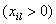

的矢量从基底中消去.如果所有的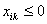，那末目标函数值无界.

(4)&nbsp; 为了得到新解，新矢量和相应的，对表1中行和列的每一元素用下面的主元素（）消去法公式进行变换

&nbsp;&nbsp;&nbsp;&nbsp; &nbsp;&nbsp;&nbsp;&nbsp;&nbsp;&nbsp;&nbsp;&nbsp;&nbsp;&nbsp;&nbsp;&nbsp;&nbsp;&nbsp;&nbsp;

其中

&nbsp;&nbsp;&nbsp;&nbsp;&nbsp;&nbsp;&nbsp;&nbsp;&nbsp;&nbsp;&nbsp;&nbsp;&nbsp;&nbsp;&nbsp;&nbsp;&nbsp;&nbsp;&nbsp;

每迭代一次就得到一新的基本可行解，重复步骤(1)～(4)直到求得极小解或者确定一无界解.

对表1进行上述迭代一次后就得到下表：

表&nbsp;&nbsp; 2

<table class=MsoNormalTable border=1 cellspacing=0 cellpadding=0
 style='border-collapse:collapse;border:none'>
 <tr>
  <td width=35 valign=top style='width:26.5pt;border-top:solid windowtext 1.5pt;
  border-left:none;border-bottom:none;border-right:solid windowtext 1.0pt;
  padding:0mm 1.4pt 0mm 1.4pt'>
  

  </td>
  <td width=37 valign=top style='width:27.55pt;border-top:solid windowtext 1.5pt;
  border-left:none;border-bottom:none;border-right:solid windowtext 1.0pt;
  padding:0mm 1.4pt 0mm 1.4pt'>
  
基底

  </td>
  <td width=37 valign=top style='width:27.45pt;border:none;border-top:solid windowtext 1.5pt;
  padding:0mm 1.4pt 0mm 1.4pt'>
  

  </td>
  <td width=42 valign=top style='width:31.85pt;border-top:solid 1.5pt;
  border-left:double 2.25pt;border-bottom:solid 1.0pt;border-right:solid 1.0pt;
  border-color:windowtext;padding:0mm 1.4pt 0mm 1.4pt'>
  
&nbsp;
  

  </td>
  <td width=37 valign=top style='width:27.45pt;border-top:solid windowtext 1.5pt;
  border-left:none;border-bottom:solid windowtext 1.0pt;border-right:solid windowtext 1.0pt;
  padding:0mm 1.4pt 0mm 1.4pt'>
  

  </td>
  <td width=33 valign=top style='width:24.5pt;border-top:solid windowtext 1.5pt;
  border-left:none;border-bottom:solid windowtext 1.0pt;border-right:solid windowtext 1.0pt;
  padding:0mm 1.4pt 0mm 1.4pt'>
  

  </td>
  <td width=28 valign=top style='width:21.3pt;border-top:solid windowtext 1.5pt;
  border-left:none;border-bottom:solid windowtext 1.0pt;border-right:solid windowtext 1.0pt;
  padding:0mm 1.4pt 0mm 1.4pt'>
  
…

  </td>
  <td width=41 valign=top style='width:30.55pt;border-top:solid windowtext 1.5pt;
  border-left:none;border-bottom:solid windowtext 1.0pt;border-right:solid windowtext 1.0pt;
  padding:0mm 1.4pt 0mm 1.4pt'>
  

  </td>
  <td width=30 valign=top style='width:22.7pt;border-top:solid windowtext 1.5pt;
  border-left:none;border-bottom:solid windowtext 1.0pt;border-right:solid windowtext 1.0pt;
  padding:0mm 1.4pt 0mm 1.4pt'>
  
…

  </td>
  <td width=44 valign=top style='width:33.25pt;border-top:solid windowtext 1.5pt;
  border-left:none;border-bottom:solid windowtext 1.0pt;border-right:solid windowtext 1.0pt;
  padding:0mm 1.4pt 0mm 1.4pt'>
  

  </td>
  <td width=56 valign=top style='width:42.35pt;border-top:solid windowtext 1.5pt;
  border-left:none;border-bottom:solid windowtext 1.0pt;border-right:solid windowtext 1.0pt;
  padding:0mm 1.4pt 0mm 1.4pt'>
  

  </td>
  <td width=35 valign=top style='width:26.45pt;border-top:solid windowtext 1.5pt;
  border-left:none;border-bottom:solid windowtext 1.0pt;border-right:solid windowtext 1.0pt;
  padding:0mm 1.4pt 0mm 1.4pt'>
  
…

  </td>
  <td width=48 valign=top style='width:36.0pt;border-top:solid windowtext 1.5pt;
  border-left:none;border-bottom:solid windowtext 1.0pt;border-right:solid windowtext 1.0pt;
  padding:0mm 1.4pt 0mm 1.4pt'>
  

  </td>
  <td width=25 valign=top style='width:18.95pt;border-top:solid windowtext 1.5pt;
  border-left:none;border-bottom:solid windowtext 1.0pt;border-right:solid windowtext 1.0pt;
  padding:0mm 1.4pt 0mm 1.4pt'>
  
…

  </td>
  <td width=42 valign=top style='width:31.25pt;border-top:solid windowtext 1.5pt;
  border-left:none;border-bottom:solid windowtext 1.0pt;border-right:solid windowtext 1.0pt;
  padding:0mm 1.4pt 0mm 1.4pt'>
  

  </td>
  <td width=32 valign=top style='width:23.7pt;border-top:solid windowtext 1.5pt;
  border-left:none;border-bottom:solid windowtext 1.0pt;border-right:solid windowtext 1.0pt;
  padding:0mm 1.4pt 0mm 1.4pt'>
  
…

  </td>
  <td width=44 valign=top style='width:32.95pt;border-top:solid windowtext 1.5pt;
  border-left:none;border-bottom:solid windowtext 1.0pt;border-right:none;
  padding:0mm 1.4pt 0mm 1.4pt'>
  

  </td>
 </tr>
 <tr>
  <td width=35 valign=top style='width:26.5pt;border-top:none;border-left:none;
  border-bottom:solid windowtext 1.0pt;border-right:solid windowtext 1.0pt;
  padding:0mm 1.4pt 0mm 1.4pt'>
  
&nbsp;
  

  </td>
  <td width=37 valign=top style='width:27.55pt;border-top:none;border-left:
  none;border-bottom:solid windowtext 1.0pt;border-right:solid windowtext 1.0pt;
  padding:0mm 1.4pt 0mm 1.4pt'>
  
&nbsp;
  

  </td>
  <td width=37 valign=top style='width:27.45pt;border:none;border-bottom:solid windowtext 1.0pt;
  padding:0mm 1.4pt 0mm 1.4pt'>
  
&nbsp;
  

  </td>
  <td width=42 valign=top style='width:31.85pt;border-top:none;border-left:
  double windowtext 2.25pt;border-bottom:solid windowtext 1.0pt;border-right:
  solid windowtext 1.0pt;padding:0mm 1.4pt 0mm 1.4pt'>
  
&nbsp;

  </td>
  <td width=37 valign=top style='width:27.45pt;border-top:none;border-left:
  none;border-bottom:solid windowtext 1.0pt;border-right:solid windowtext 1.0pt;
  padding:0mm 1.4pt 0mm 1.4pt'>
  

  </td>
  <td width=33 valign=top style='width:24.5pt;border-top:none;border-left:none;
  border-bottom:solid windowtext 1.0pt;border-right:solid windowtext 1.0pt;
  padding:0mm 1.4pt 0mm 1.4pt'>
  

  </td>
  <td width=28 valign=top style='width:21.3pt;border-top:none;border-left:none;
  border-bottom:solid windowtext 1.0pt;border-right:solid windowtext 1.0pt;
  padding:0mm 1.4pt 0mm 1.4pt'>
  
…

  </td>
  <td width=41 valign=top style='width:30.55pt;border-top:none;border-left:
  none;border-bottom:solid windowtext 1.0pt;border-right:solid windowtext 1.0pt;
  padding:0mm 1.4pt 0mm 1.4pt'>
  

  </td>
  <td width=30 valign=top style='width:22.7pt;border-top:none;border-left:none;
  border-bottom:solid windowtext 1.0pt;border-right:solid windowtext 1.0pt;
  padding:0mm 1.4pt 0mm 1.4pt'>
  
…

  </td>
  <td width=44 valign=top style='width:33.25pt;border-top:none;border-left:
  none;border-bottom:solid windowtext 1.0pt;border-right:solid windowtext 1.0pt;
  padding:0mm 1.4pt 0mm 1.4pt'>
  

  </td>
  <td width=56 valign=top style='width:42.35pt;border-top:none;border-left:
  none;border-bottom:solid windowtext 1.0pt;border-right:solid windowtext 1.0pt;
  padding:0mm 1.4pt 0mm 1.4pt'>
  

  </td>
  <td width=35 valign=top style='width:26.45pt;border-top:none;border-left:
  none;border-bottom:solid windowtext 1.0pt;border-right:solid windowtext 1.0pt;
  padding:0mm 1.4pt 0mm 1.4pt'>
  
…

  </td>
  <td width=48 valign=top style='width:36.0pt;border-top:none;border-left:none;
  border-bottom:solid windowtext 1.0pt;border-right:solid windowtext 1.0pt;
  padding:0mm 1.4pt 0mm 1.4pt'>
  

  </td>
  <td width=25 valign=top style='width:18.95pt;border-top:none;border-left:
  none;border-bottom:solid windowtext 1.0pt;border-right:solid windowtext 1.0pt;
  padding:0mm 1.4pt 0mm 1.4pt'>
  
…

  </td>
  <td width=42 valign=top style='width:31.25pt;border-top:none;border-left:
  none;border-bottom:solid windowtext 1.0pt;border-right:solid windowtext 1.0pt;
  padding:0mm 1.4pt 0mm 1.4pt'>
  

  </td>
  <td width=32 valign=top style='width:23.7pt;border-top:none;border-left:none;
  border-bottom:solid windowtext 1.0pt;border-right:solid windowtext 1.0pt;
  padding:0mm 1.4pt 0mm 1.4pt'>
  
…

  </td>
  <td width=44 valign=top style='width:32.95pt;border:none;border-bottom:solid windowtext 1.0pt;
  padding:0mm 1.4pt 0mm 1.4pt'>
  

  </td>
 </tr>
 <tr>
  <td width=35 valign=top style='width:26.5pt;border:none;border-right:solid windowtext 1.0pt;
  padding:0mm 1.4pt 0mm 1.4pt'>
  
1

  </td>
  <td width=37 valign=top style='width:27.55pt;border:none;border-right:solid windowtext 1.0pt;
  padding:0mm 1.4pt 0mm 1.4pt'>
  

  </td>
  <td width=37 valign=top style='width:27.45pt;border:none;padding:0mm 1.4pt 0mm 1.4pt'>
  

  </td>
  <td width=42 valign=top style='width:31.85pt;border-top:none;border-left:
  double windowtext 2.25pt;border-bottom:none;border-right:solid windowtext 1.0pt;
  padding:0mm 1.4pt 0mm 1.4pt'>
  

  </td>
  <td width=37 valign=top style='width:27.45pt;border:none;border-right:solid windowtext 1.0pt;
  padding:0mm 1.4pt 0mm 1.4pt'>
  
1

  </td>
  <td width=33 valign=top style='width:24.5pt;border:none;border-right:solid windowtext 1.0pt;
  padding:0mm 1.4pt 0mm 1.4pt'>
  
0

  </td>
  <td width=28 valign=top style='width:21.3pt;border:none;border-right:solid windowtext 1.0pt;
  padding:0mm 1.4pt 0mm 1.4pt'>
  
…

  </td>
  <td width=41 valign=top style='width:30.55pt;border:none;border-right:solid windowtext 1.0pt;
  padding:0mm 1.4pt 0mm 1.4pt'>
  
…

  </td>
  <td width=30 valign=top style='width:22.7pt;border:none;border-right:solid windowtext 1.0pt;
  padding:0mm 1.4pt 0mm 1.4pt'>
  
…

  </td>
  <td width=44 valign=top style='width:33.25pt;border:none;border-right:solid windowtext 1.0pt;
  padding:0mm 1.4pt 0mm 1.4pt'>
  
0

  </td>
  <td width=56 valign=top style='width:42.35pt;border:none;border-right:solid windowtext 1.0pt;
  padding:0mm 1.4pt 0mm 1.4pt'>
  

  </td>
  <td width=35 valign=top style='width:26.45pt;border:none;border-right:solid windowtext 1.0pt;
  padding:0mm 1.4pt 0mm 1.4pt'>
  
…

  </td>
  <td width=48 valign=top style='width:36.0pt;border:none;border-right:solid windowtext 1.0pt;
  padding:0mm 1.4pt 0mm 1.4pt'>
  

  </td>
  <td width=25 valign=top style='width:18.95pt;border:none;border-right:solid windowtext 1.0pt;
  padding:0mm 1.4pt 0mm 1.4pt'>
  
…

  </td>
  <td width=42 valign=top style='width:31.25pt;border:none;border-right:solid windowtext 1.0pt;
  padding:0mm 1.4pt 0mm 1.4pt'>
  
0

  </td>
  <td width=32 valign=top style='width:23.7pt;border:none;border-right:solid windowtext 1.0pt;
  padding:0mm 1.4pt 0mm 1.4pt'>
  
…

  </td>
  <td width=44 valign=top style='width:32.95pt;border:none;padding:0mm 1.4pt 0mm 1.4pt'>
  

  </td>
 </tr>
 <tr>
  <td width=35 valign=top style='width:26.5pt;border:none;border-right:solid windowtext 1.0pt;
  padding:0mm 1.4pt 0mm 1.4pt'>
  
2

  </td>
  <td width=37 valign=top style='width:27.55pt;border:none;border-right:solid windowtext 1.0pt;
  padding:0mm 1.4pt 0mm 1.4pt'>
  

  </td>
  <td width=37 valign=top style='width:27.45pt;border:none;padding:0mm 1.4pt 0mm 1.4pt'>
  

  </td>
  <td width=42 valign=top style='width:31.85pt;border-top:none;border-left:
  double windowtext 2.25pt;border-bottom:none;border-right:solid windowtext 1.0pt;
  padding:0mm 1.4pt 0mm 1.4pt'>
  

  </td>
  <td width=37 valign=top style='width:27.45pt;border:none;border-right:solid windowtext 1.0pt;
  padding:0mm 1.4pt 0mm 1.4pt'>
  
0

  </td>
  <td width=33 valign=top style='width:24.5pt;border:none;border-right:solid windowtext 1.0pt;
  padding:0mm 1.4pt 0mm 1.4pt'>
  
1

  </td>
  <td width=28 valign=top style='width:21.3pt;border:none;border-right:solid windowtext 1.0pt;
  padding:0mm 1.4pt 0mm 1.4pt'>
  
…

  </td>
  <td width=41 valign=top style='width:30.55pt;border:none;border-right:solid windowtext 1.0pt;
  padding:0mm 1.4pt 0mm 1.4pt'>
  

  </td>
  <td width=30 valign=top style='width:22.7pt;border:none;border-right:solid windowtext 1.0pt;
  padding:0mm 1.4pt 0mm 1.4pt'>
  
…

  </td>
  <td width=44 valign=top style='width:33.25pt;border:none;border-right:solid windowtext 1.0pt;
  padding:0mm 1.4pt 0mm 1.4pt'>
  
0

  </td>
  <td width=56 valign=top style='width:42.35pt;border:none;border-right:solid windowtext 1.0pt;
  padding:0mm 1.4pt 0mm 1.4pt'>
  
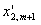

  </td>
  <td width=35 valign=top style='width:26.45pt;border:none;border-right:solid windowtext 1.0pt;
  padding:0mm 1.4pt 0mm 1.4pt'>
  
…

  </td>
  <td width=48 valign=top style='width:36.0pt;border:none;border-right:solid windowtext 1.0pt;
  padding:0mm 1.4pt 0mm 1.4pt'>
  

  </td>
  <td width=25 valign=top style='width:18.95pt;border:none;border-right:solid windowtext 1.0pt;
  padding:0mm 1.4pt 0mm 1.4pt'>
  
…

  </td>
  <td width=42 valign=top style='width:31.25pt;border:none;border-right:solid windowtext 1.0pt;
  padding:0mm 1.4pt 0mm 1.4pt'>
  
0

  </td>
  <td width=32 valign=top style='width:23.7pt;border:none;border-right:solid windowtext 1.0pt;
  padding:0mm 1.4pt 0mm 1.4pt'>
  
…

  </td>
  <td width=44 valign=top style='width:32.95pt;border:none;padding:0mm 1.4pt 0mm 1.4pt'>
  

  </td>
 </tr>
 <tr>
  <td width=35 valign=top style='width:26.5pt;border:none;border-right:solid windowtext 1.0pt;
  padding:0mm 1.4pt 0mm 1.4pt'>
  

  </td>
  <td width=37 valign=top style='width:27.55pt;border:none;border-right:solid windowtext 1.0pt;
  padding:0mm 1.4pt 0mm 1.4pt'>
  

  </td>
  <td width=37 valign=top style='width:27.45pt;border:none;padding:0mm 1.4pt 0mm 1.4pt'>
  

  </td>
  <td width=42 valign=top style='width:31.85pt;border-top:none;border-left:
  double windowtext 2.25pt;border-bottom:none;border-right:solid windowtext 1.0pt;
  padding:0mm 1.4pt 0mm 1.4pt'>
  

  </td>
  <td width=37 valign=top style='width:27.45pt;border:none;border-right:solid windowtext 1.0pt;
  padding:0mm 1.4pt 0mm 1.4pt'>
  

  </td>
  <td width=33 valign=top style='width:24.5pt;border:none;border-right:solid windowtext 1.0pt;
  padding:0mm 1.4pt 0mm 1.4pt'>
  

  </td>
  <td width=28 valign=top style='width:21.3pt;border:none;border-right:solid windowtext 1.0pt;
  padding:0mm 1.4pt 0mm 1.4pt'>
  

  </td>
  <td width=41 valign=top style='width:30.55pt;border:none;border-right:solid windowtext 1.0pt;
  padding:0mm 1.4pt 0mm 1.4pt'>
  

  </td>
  <td width=30 valign=top style='width:22.7pt;border:none;border-right:solid windowtext 1.0pt;
  padding:0mm 1.4pt 0mm 1.4pt'>
  

  </td>
  <td width=44 valign=top style='width:33.25pt;border:none;border-right:solid windowtext 1.0pt;
  padding:0mm 1.4pt 0mm 1.4pt'>
  

  </td>
  <td width=56 valign=top style='width:42.35pt;border:none;border-right:solid windowtext 1.0pt;
  padding:0mm 1.4pt 0mm 1.4pt'>
  

  </td>
  <td width=35 valign=top style='width:26.45pt;border:none;border-right:solid windowtext 1.0pt;
  padding:0mm 1.4pt 0mm 1.4pt'>
  

  </td>
  <td width=48 valign=top style='width:36.0pt;border:none;border-right:solid windowtext 1.0pt;
  padding:0mm 1.4pt 0mm 1.4pt'>
  

  </td>
  <td width=25 valign=top style='width:18.95pt;border:none;border-right:solid windowtext 1.0pt;
  padding:0mm 1.4pt 0mm 1.4pt'>
  

  </td>
  <td width=42 valign=top style='width:31.25pt;border:none;border-right:solid windowtext 1.0pt;
  padding:0mm 1.4pt 0mm 1.4pt'>
  

  </td>
  <td width=32 valign=top style='width:23.7pt;border:none;border-right:solid windowtext 1.0pt;
  padding:0mm 1.4pt 0mm 1.4pt'>
  

  </td>
  <td width=44 valign=top style='width:32.95pt;border:none;padding:0mm 1.4pt 0mm 1.4pt'>
  

  </td>
 </tr>
 <tr>
  <td width=35 valign=top style='width:26.5pt;border:none;border-right:solid windowtext 1.0pt;
  padding:0mm 1.4pt 0mm 1.4pt'>
  

  </td>
  <td width=37 valign=top style='width:27.55pt;border:none;border-right:solid windowtext 1.0pt;
  padding:0mm 1.4pt 0mm 1.4pt'>
  

  </td>
  <td width=37 valign=top style='width:27.45pt;border:none;padding:0mm 1.4pt 0mm 1.4pt'>
  

  </td>
  <td width=42 valign=top style='width:31.85pt;border-top:none;border-left:
  double windowtext 2.25pt;border-bottom:none;border-right:solid windowtext 1.0pt;
  padding:0mm 1.4pt 0mm 1.4pt'>
  

  </td>
  <td width=37 valign=top style='width:27.45pt;border:none;border-right:solid windowtext 1.0pt;
  padding:0mm 1.4pt 0mm 1.4pt'>
  
0

  </td>
  <td width=33 valign=top style='width:24.5pt;border:none;border-right:solid windowtext 1.0pt;
  padding:0mm 1.4pt 0mm 1.4pt'>
  
0

  </td>
  <td width=28 valign=top style='width:21.3pt;border:none;border-right:solid windowtext 1.0pt;
  padding:0mm 1.4pt 0mm 1.4pt'>
  
…

  </td>
  <td width=41 valign=top style='width:30.55pt;border:none;border-right:solid windowtext 1.0pt;
  padding:0mm 1.4pt 0mm 1.4pt'>
  
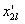

  </td>
  <td width=30 valign=top style='width:22.7pt;border:none;border-right:solid windowtext 1.0pt;
  padding:0mm 1.4pt 0mm 1.4pt'>
  
…

  </td>
  <td width=44 valign=top style='width:33.25pt;border:none;border-right:solid windowtext 1.0pt;
  padding:0mm 1.4pt 0mm 1.4pt'>
  
0

  </td>
  <td width=56 valign=top style='width:42.35pt;border:none;border-right:solid windowtext 1.0pt;
  padding:0mm 1.4pt 0mm 1.4pt'>
  

  </td>
  <td width=35 valign=top style='width:26.45pt;border:none;border-right:solid windowtext 1.0pt;
  padding:0mm 1.4pt 0mm 1.4pt'>
  
…

  </td>
  <td width=48 valign=top style='width:36.0pt;border:none;border-right:solid windowtext 1.0pt;
  padding:0mm 1.4pt 0mm 1.4pt'>
  

  </td>
  <td width=25 valign=top style='width:18.95pt;border:none;border-right:solid windowtext 1.0pt;
  padding:0mm 1.4pt 0mm 1.4pt'>
  
…

  </td>
  <td width=42 valign=top style='width:31.25pt;border:none;border-right:solid windowtext 1.0pt;
  padding:0mm 1.4pt 0mm 1.4pt'>
  
1

  </td>
  <td width=32 valign=top style='width:23.7pt;border:none;border-right:solid windowtext 1.0pt;
  padding:0mm 1.4pt 0mm 1.4pt'>
  
…

  </td>
  <td width=44 valign=top style='width:32.95pt;border:none;padding:0mm 1.4pt 0mm 1.4pt'>
  

  </td>
 </tr>
 <tr>
  <td width=35 valign=top style='width:26.5pt;border:none;border-right:solid windowtext 1.0pt;
  padding:0mm 1.4pt 0mm 1.4pt'>
  

  </td>
  <td width=37 valign=top style='width:27.55pt;border:none;border-right:solid windowtext 1.0pt;
  padding:0mm 1.4pt 0mm 1.4pt'>
  

  </td>
  <td width=37 valign=top style='width:27.45pt;border:none;padding:0mm 1.4pt 0mm 1.4pt'>
  

  </td>
  <td width=42 valign=top style='width:31.85pt;border-top:none;border-left:
  double windowtext 2.25pt;border-bottom:none;border-right:solid windowtext 1.0pt;
  padding:0mm 1.4pt 0mm 1.4pt'>
  

  </td>
  <td width=37 valign=top style='width:27.45pt;border:none;border-right:solid windowtext 1.0pt;
  padding:0mm 1.4pt 0mm 1.4pt'>
  

  </td>
  <td width=33 valign=top style='width:24.5pt;border:none;border-right:solid windowtext 1.0pt;
  padding:0mm 1.4pt 0mm 1.4pt'>
  

  </td>
  <td width=28 valign=top style='width:21.3pt;border:none;border-right:solid windowtext 1.0pt;
  padding:0mm 1.4pt 0mm 1.4pt'>
  

  </td>
  <td width=41 valign=top style='width:30.55pt;border:none;border-right:solid windowtext 1.0pt;
  padding:0mm 1.4pt 0mm 1.4pt'>
  

  </td>
  <td width=30 valign=top style='width:22.7pt;border:none;border-right:solid windowtext 1.0pt;
  padding:0mm 1.4pt 0mm 1.4pt'>
  

  </td>
  <td width=44 valign=top style='width:33.25pt;border:none;border-right:solid windowtext 1.0pt;
  padding:0mm 1.4pt 0mm 1.4pt'>
  

  </td>
  <td width=56 valign=top style='width:42.35pt;border:none;border-right:solid windowtext 1.0pt;
  padding:0mm 1.4pt 0mm 1.4pt'>
  

  </td>
  <td width=35 valign=top style='width:26.45pt;border:none;border-right:solid windowtext 1.0pt;
  padding:0mm 1.4pt 0mm 1.4pt'>
  

  </td>
  <td width=48 valign=top style='width:36.0pt;border:none;border-right:solid windowtext 1.0pt;
  padding:0mm 1.4pt 0mm 1.4pt'>
  

  </td>
  <td width=25 valign=top style='width:18.95pt;border:none;border-right:solid windowtext 1.0pt;
  padding:0mm 1.4pt 0mm 1.4pt'>
  

  </td>
  <td width=42 valign=top style='width:31.25pt;border:none;border-right:solid windowtext 1.0pt;
  padding:0mm 1.4pt 0mm 1.4pt'>
  

  </td>
  <td width=32 valign=top style='width:23.7pt;border:none;border-right:solid windowtext 1.0pt;
  padding:0mm 1.4pt 0mm 1.4pt'>
  

  </td>
  <td width=44 valign=top style='width:32.95pt;border:none;padding:0mm 1.4pt 0mm 1.4pt'>
  

  </td>
 </tr>
 <tr>
  <td width=35 valign=top style='width:26.5pt;border-top:none;border-left:none;
  border-bottom:solid windowtext 1.0pt;border-right:solid windowtext 1.0pt;
  padding:0mm 1.4pt 0mm 1.4pt'>
  

  </td>
  <td width=37 valign=top style='width:27.55pt;border-top:none;border-left:
  none;border-bottom:solid windowtext 1.0pt;border-right:solid windowtext 1.0pt;
  padding:0mm 1.4pt 0mm 1.4pt'>
  

  </td>
  <td width=37 valign=top style='width:27.45pt;border:none;border-bottom:solid windowtext 1.0pt;
  padding:0mm 1.4pt 0mm 1.4pt'>
  

  </td>
  <td width=42 valign=top style='width:31.85pt;border-top:none;border-left:
  double windowtext 2.25pt;border-bottom:solid windowtext 1.0pt;border-right:
  solid windowtext 1.0pt;padding:0mm 1.4pt 0mm 1.4pt'>
  
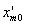

  </td>
  <td width=37 valign=top style='width:27.45pt;border-top:none;border-left:
  none;border-bottom:solid windowtext 1.0pt;border-right:solid windowtext 1.0pt;
  padding:0mm 1.4pt 0mm 1.4pt'>
  
0

  </td>
  <td width=33 valign=top style='width:24.5pt;border-top:none;border-left:none;
  border-bottom:solid windowtext 1.0pt;border-right:solid windowtext 1.0pt;
  padding:0mm 1.4pt 0mm 1.4pt'>
  
0

  </td>
  <td width=28 valign=top style='width:21.3pt;border-top:none;border-left:none;
  border-bottom:solid windowtext 1.0pt;border-right:solid windowtext 1.0pt;
  padding:0mm 1.4pt 0mm 1.4pt'>
  
…

  </td>
  <td width=41 valign=top style='width:30.55pt;border-top:none;border-left:
  none;border-bottom:solid windowtext 1.0pt;border-right:solid windowtext 1.0pt;
  padding:0mm 1.4pt 0mm 1.4pt'>
  

  </td>
  <td width=30 valign=top style='width:22.7pt;border-top:none;border-left:none;
  border-bottom:solid windowtext 1.0pt;border-right:solid windowtext 1.0pt;
  padding:0mm 1.4pt 0mm 1.4pt'>
  
…

  </td>
  <td width=44 valign=top style='width:33.25pt;border-top:none;border-left:
  none;border-bottom:solid windowtext 1.0pt;border-right:solid windowtext 1.0pt;
  padding:0mm 1.4pt 0mm 1.4pt'>
  
1

  </td>
  <td width=56 valign=top style='width:42.35pt;border-top:none;border-left:
  none;border-bottom:solid windowtext 1.0pt;border-right:solid windowtext 1.0pt;
  padding:0mm 1.4pt 0mm 1.4pt'>
  

  </td>
  <td width=35 valign=top style='width:26.45pt;border-top:none;border-left:
  none;border-bottom:solid windowtext 1.0pt;border-right:solid windowtext 1.0pt;
  padding:0mm 1.4pt 0mm 1.4pt'>
  
…

  </td>
  <td width=48 valign=top style='width:36.0pt;border-top:none;border-left:none;
  border-bottom:solid windowtext 1.0pt;border-right:solid windowtext 1.0pt;
  padding:0mm 1.4pt 0mm 1.4pt'>
  

  </td>
  <td width=25 valign=top style='width:18.95pt;border-top:none;border-left:
  none;border-bottom:solid windowtext 1.0pt;border-right:solid windowtext 1.0pt;
  padding:0mm 1.4pt 0mm 1.4pt'>
  
…

  </td>
  <td width=42 valign=top style='width:31.25pt;border-top:none;border-left:
  none;border-bottom:solid windowtext 1.0pt;border-right:solid windowtext 1.0pt;
  padding:0mm 1.4pt 0mm 1.4pt'>
  
0

  </td>
  <td width=32 valign=top style='width:23.7pt;border-top:none;border-left:none;
  border-bottom:solid windowtext 1.0pt;border-right:solid windowtext 1.0pt;
  padding:0mm 1.4pt 0mm 1.4pt'>
  
…

  </td>
  <td width=44 valign=top style='width:32.95pt;border:none;border-bottom:solid windowtext 1.0pt;
  padding:0mm 1.4pt 0mm 1.4pt'>
  

  </td>
 </tr>
 <tr>
  <td width=35 valign=top style='width:26.5pt;border-top:none;border-left:none;
  border-bottom:solid windowtext 1.5pt;border-right:solid windowtext 1.0pt;
  padding:0mm 1.4pt 0mm 1.4pt'>
  

  </td>
  <td width=37 valign=top style='width:27.55pt;border-top:none;border-left:
  none;border-bottom:solid windowtext 1.5pt;border-right:solid windowtext 1.0pt;
  padding:0mm 1.4pt 0mm 1.4pt'>
  
&nbsp;
  

  </td>
  <td width=37 valign=top style='width:27.45pt;border:none;border-bottom:solid windowtext 1.5pt;
  padding:0mm 1.4pt 0mm 1.4pt'>
  
&nbsp;
  

  </td>
  <td width=42 valign=top style='width:31.85pt;border-top:none;border-left:
  double windowtext 2.25pt;border-bottom:solid windowtext 1.5pt;border-right:
  solid windowtext 1.0pt;padding:0mm 1.4pt 0mm 1.4pt'>
  

  </td>
  <td width=37 valign=top style='width:27.45pt;border-top:none;border-left:
  none;border-bottom:solid windowtext 1.5pt;border-right:solid windowtext 1.0pt;
  padding:0mm 1.4pt 0mm 1.4pt'>
  
0

  </td>
  <td width=33 valign=top style='width:24.5pt;border-top:none;border-left:none;
  border-bottom:solid windowtext 1.5pt;border-right:solid windowtext 1.0pt;
  padding:0mm 1.4pt 0mm 1.4pt'>
  
0

  </td>
  <td width=28 valign=top style='width:21.3pt;border-top:none;border-left:none;
  border-bottom:solid windowtext 1.5pt;border-right:solid windowtext 1.0pt;
  padding:0mm 1.4pt 0mm 1.4pt'>
  
…

  </td>
  <td width=41 valign=top style='width:30.55pt;border-top:none;border-left:
  none;border-bottom:solid windowtext 1.5pt;border-right:solid windowtext 1.0pt;
  padding:0mm 1.4pt 0mm 1.4pt'>
  

  </td>
  <td width=30 valign=top style='width:22.7pt;border-top:none;border-left:none;
  border-bottom:solid windowtext 1.5pt;border-right:solid windowtext 1.0pt;
  padding:0mm 1.4pt 0mm 1.4pt'>
  
…

  </td>
  <td width=44 valign=top style='width:33.25pt;border-top:none;border-left:
  none;border-bottom:solid windowtext 1.5pt;border-right:solid windowtext 1.0pt;
  padding:0mm 1.4pt 0mm 1.4pt'>
  
0

  </td>
  <td width=56 valign=top style='width:42.35pt;border-top:none;border-left:
  none;border-bottom:solid windowtext 1.5pt;border-right:solid windowtext 1.0pt;
  padding:0mm 1.4pt 0mm 1.4pt'>
  

  </td>
  <td width=35 valign=top style='width:26.45pt;border-top:none;border-left:
  none;border-bottom:solid windowtext 1.5pt;border-right:solid windowtext 1.0pt;
  padding:0mm 1.4pt 0mm 1.4pt'>
  
…

  </td>
  <td width=48 valign=top style='width:36.0pt;border-top:none;border-left:none;
  border-bottom:solid windowtext 1.5pt;border-right:solid windowtext 1.0pt;
  padding:0mm 1.4pt 0mm 1.4pt'>
  

  </td>
  <td width=25 valign=top style='width:18.95pt;border-top:none;border-left:
  none;border-bottom:solid windowtext 1.5pt;border-right:solid windowtext 1.0pt;
  padding:0mm 1.4pt 0mm 1.4pt'>
  
…

  </td>
  <td width=42 valign=top style='width:31.25pt;border-top:none;border-left:
  none;border-bottom:solid windowtext 1.5pt;border-right:solid windowtext 1.0pt;
  padding:0mm 1.4pt 0mm 1.4pt'>
  
0

  </td>
  <td width=32 valign=top style='width:23.7pt;border-top:none;border-left:none;
  border-bottom:solid windowtext 1.5pt;border-right:solid windowtext 1.0pt;
  padding:0mm 1.4pt 0mm 1.4pt'>
  
…

  </td>
  <td width=44 valign=top style='width:32.95pt;border:none;border-bottom:solid windowtext 1.5pt;
  padding:0mm 1.4pt 0mm 1.4pt'>
  

  </td>
 </tr>
</table>

&nbsp; 假设矩阵<i>A</i>不包含一个阶单位矩阵.这时可采用下面的人工基底法：

引进人工变量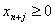()将线性规划问题的系统扩大为：

极小化

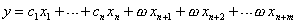

满足条件

和，其中为一未定的大的正数（不必指定的数值）.矢量形成扩大系统的一个基底（人工基底）.

对扩大了的问题，第一个可行解为

相应的目标函数值为.由于基底组成一个单位矩阵，所以

&nbsp; ()

列表如下：

表&nbsp;&nbsp;&nbsp;&nbsp;
3

<table class=MsoNormalTable border=1 cellspacing=0 cellpadding=0
 style='border-collapse:collapse;border:none'>
 <tr>
  <td width=40 valign=top style='width:29.75pt;border-top:solid windowtext 1.5pt;
  border-left:none;border-bottom:none;border-right:solid windowtext 1.0pt;
  padding:0mm 1.4pt 0mm 1.4pt'>
  

  </td>
  <td width=46 valign=top style='width:34.4pt;border-top:solid windowtext 1.5pt;
  border-left:none;border-bottom:none;border-right:solid windowtext 1.0pt;
  padding:0mm 1.4pt 0mm 1.4pt'>
  
基底

  </td>
  <td width=33 valign=top style='width:25.1pt;border:none;border-top:solid windowtext 1.5pt;
  padding:0mm 1.4pt 0mm 1.4pt'>
  

  </td>
  <td width=67 valign=top style='width:50.2pt;border-top:solid 1.5pt;
  border-left:double 2.25pt;border-bottom:solid 1.0pt;border-right:solid 1.0pt;
  border-color:windowtext;padding:0mm 1.4pt 0mm 1.4pt'>
  
&nbsp;
  

  </td>
  <td width=49 valign=top style='width:37.05pt;border-top:solid windowtext 1.5pt;
  border-left:none;border-bottom:solid windowtext 1.0pt;border-right:solid windowtext 1.0pt;
  padding:0mm 1.4pt 0mm 1.4pt'>
  

  </td>
  <td width=57 valign=top style='width:42.55pt;border-top:solid windowtext 1.5pt;
  border-left:none;border-bottom:solid windowtext 1.0pt;border-right:solid windowtext 1.0pt;
  padding:0mm 1.4pt 0mm 1.4pt'>
  

  </td>
  <td width=28 valign=top style='width:20.8pt;border-top:solid windowtext 1.5pt;
  border-left:none;border-bottom:solid windowtext 1.0pt;border-right:solid windowtext 1.0pt;
  padding:0mm 1.4pt 0mm 1.4pt'>
  
…

  </td>
  <td width=50 valign=top style='width:37.65pt;border-top:solid windowtext 1.5pt;
  border-left:none;border-bottom:solid windowtext 1.0pt;border-right:solid windowtext 1.0pt;
  padding:0mm 1.4pt 0mm 1.4pt'>
  

  </td>
  <td width=33 valign=top style='width:25.1pt;border-top:solid windowtext 1.5pt;
  border-left:none;border-bottom:solid windowtext 1.0pt;border-right:solid windowtext 1.0pt;
  padding:0mm 1.4pt 0mm 1.4pt'>
  
…

  </td>
  <td width=50 valign=top style='width:37.65pt;border-top:solid windowtext 1.5pt;
  border-left:none;border-bottom:solid windowtext 1.0pt;border-right:double windowtext 2.25pt;
  padding:0mm 1.4pt 0mm 1.4pt'>
  

  </td>
  <td width=33 valign=top style='width:25.1pt;border-top:solid windowtext 1.5pt;
  border-left:none;border-bottom:solid windowtext 1.0pt;border-right:solid windowtext 1.0pt;
  padding:0mm 1.4pt 0mm 1.4pt'>
  

  </td>
  <td width=33 valign=top style='width:25.1pt;border-top:solid windowtext 1.5pt;
  border-left:none;border-bottom:solid windowtext 1.0pt;border-right:solid windowtext 1.0pt;
  padding:0mm 1.4pt 0mm 1.4pt'>
  
…

  </td>
  <td width=33 valign=top style='width:25.1pt;border-top:solid windowtext 1.5pt;
  border-left:none;border-bottom:solid windowtext 1.0pt;border-right:solid windowtext 1.0pt;
  padding:0mm 1.4pt 0mm 1.4pt'>
  

  </td>
  <td width=33 valign=top style='width:25.1pt;border-top:solid windowtext 1.5pt;
  border-left:none;border-bottom:solid windowtext 1.0pt;border-right:solid windowtext 1.0pt;
  padding:0mm 1.4pt 0mm 1.4pt'>
  
…

  </td>
  <td width=50 valign=top style='width:37.65pt;border-top:solid windowtext 1.5pt;
  border-left:none;border-bottom:solid windowtext 1.0pt;border-right:none;
  padding:0mm 1.4pt 0mm 1.4pt'>
  

  </td>
 </tr>
 <tr>
  <td width=40 valign=top style='width:29.75pt;border-top:none;border-left:
  none;border-bottom:solid windowtext 1.0pt;border-right:solid windowtext 1.0pt;
  padding:0mm 1.4pt 0mm 1.4pt'>
  
&nbsp;
  

  </td>
  <td width=46 valign=top style='width:34.4pt;border-top:none;border-left:none;
  border-bottom:solid windowtext 1.0pt;border-right:solid windowtext 1.0pt;
  padding:0mm 1.4pt 0mm 1.4pt'>
  
&nbsp;
  

  </td>
  <td width=33 valign=top style='width:25.1pt;border:none;border-bottom:solid windowtext 1.0pt;
  padding:0mm 1.4pt 0mm 1.4pt'>
  
&nbsp;
  

  </td>
  <td width=67 valign=top style='width:50.2pt;border-top:none;border-left:double windowtext 2.25pt;
  border-bottom:solid windowtext 1.0pt;border-right:solid windowtext 1.0pt;
  padding:0mm 1.4pt 0mm 1.4pt'>
  
&nbsp;

  </td>
  <td width=49 valign=top style='width:37.05pt;border-top:none;border-left:
  none;border-bottom:solid windowtext 1.0pt;border-right:solid windowtext 1.0pt;
  padding:0mm 1.4pt 0mm 1.4pt'>
  

  </td>
  <td width=57 valign=top style='width:42.55pt;border-top:none;border-left:
  none;border-bottom:solid windowtext 1.0pt;border-right:solid windowtext 1.0pt;
  padding:0mm 1.4pt 0mm 1.4pt'>
  

  </td>
  <td width=28 valign=top style='width:20.8pt;border-top:none;border-left:none;
  border-bottom:solid windowtext 1.0pt;border-right:solid windowtext 1.0pt;
  padding:0mm 1.4pt 0mm 1.4pt'>
  
…

  </td>
  <td width=50 valign=top style='width:37.65pt;border-top:none;border-left:
  none;border-bottom:solid windowtext 1.0pt;border-right:solid windowtext 1.0pt;
  padding:0mm 1.4pt 0mm 1.4pt'>
  

  </td>
  <td width=33 valign=top style='width:25.1pt;border-top:none;border-left:none;
  border-bottom:solid windowtext 1.0pt;border-right:solid windowtext 1.0pt;
  padding:0mm 1.4pt 0mm 1.4pt'>
  
…

  </td>
  <td width=50 valign=top style='width:37.65pt;border-top:none;border-left:
  none;border-bottom:solid windowtext 1.0pt;border-right:double windowtext 2.25pt;
  padding:0mm 1.4pt 0mm 1.4pt'>
  

  </td>
  <td width=33 valign=top style='width:25.1pt;border-top:none;border-left:none;
  border-bottom:solid windowtext 1.0pt;border-right:solid windowtext 1.0pt;
  padding:0mm 1.4pt 0mm 1.4pt'>
  

  </td>
  <td width=33 valign=top style='width:25.1pt;border-top:none;border-left:none;
  border-bottom:solid windowtext 1.0pt;border-right:solid windowtext 1.0pt;
  padding:0mm 1.4pt 0mm 1.4pt'>
  
…

  </td>
  <td width=33 valign=top style='width:25.1pt;border-top:none;border-left:none;
  border-bottom:solid windowtext 1.0pt;border-right:solid windowtext 1.0pt;
  padding:0mm 1.4pt 0mm 1.4pt'>
  

  </td>
  <td width=33 valign=top style='width:25.1pt;border-top:none;border-left:none;
  border-bottom:solid windowtext 1.0pt;border-right:solid windowtext 1.0pt;
  padding:0mm 1.4pt 0mm 1.4pt'>
  
…

  </td>
  <td width=50 valign=top style='width:37.65pt;border:none;border-bottom:solid windowtext 1.0pt;
  padding:0mm 1.4pt 0mm 1.4pt'>
  

  </td>
 </tr>
 <tr>
  <td width=40 valign=top style='width:29.75pt;border:none;border-right:solid windowtext 1.0pt;
  padding:0mm 1.4pt 0mm 1.4pt'>
  
1

  </td>
  <td width=46 valign=top style='width:34.4pt;border:none;border-right:solid windowtext 1.0pt;
  padding:0mm 1.4pt 0mm 1.4pt'>
  

  </td>
  <td width=33 valign=top style='width:25.1pt;border:none;padding:0mm 1.4pt 0mm 1.4pt'>
  

  </td>
  <td width=67 valign=top style='width:50.2pt;border-top:none;border-left:double windowtext 2.25pt;
  border-bottom:none;border-right:solid windowtext 1.0pt;padding:0mm 1.4pt 0mm 1.4pt'>
  

  </td>
  <td width=49 valign=top style='width:37.05pt;border:none;border-right:solid windowtext 1.0pt;
  padding:0mm 1.4pt 0mm 1.4pt'>
  

  </td>
  <td width=57 valign=top style='width:42.55pt;border:none;border-right:solid windowtext 1.0pt;
  padding:0mm 1.4pt 0mm 1.4pt'>
  

  </td>
  <td width=28 valign=top style='width:20.8pt;border:none;border-right:solid windowtext 1.0pt;
  padding:0mm 1.4pt 0mm 1.4pt'>
  
…

  </td>
  <td width=50 valign=top style='width:37.65pt;border:none;border-right:solid windowtext 1.0pt;
  padding:0mm 1.4pt 0mm 1.4pt'>
  

  </td>
  <td width=33 valign=top style='width:25.1pt;border:none;border-right:solid windowtext 1.0pt;
  padding:0mm 1.4pt 0mm 1.4pt'>
  
…

  </td>
  <td width=50 valign=top style='width:37.65pt;border:none;border-right:double windowtext 2.25pt;
  padding:0mm 1.4pt 0mm 1.4pt'>
  

  </td>
  <td width=33 valign=top style='width:25.1pt;border:none;border-right:solid windowtext 1.0pt;
  padding:0mm 1.4pt 0mm 1.4pt'>
  
1

  </td>
  <td width=33 valign=top style='width:25.1pt;border:none;border-right:solid windowtext 1.0pt;
  padding:0mm 1.4pt 0mm 1.4pt'>
  
…

  </td>
  <td width=33 valign=top style='width:25.1pt;border:none;border-right:solid windowtext 1.0pt;
  padding:0mm 1.4pt 0mm 1.4pt'>
  
0

  </td>
  <td width=33 valign=top style='width:25.1pt;border:none;border-right:solid windowtext 1.0pt;
  padding:0mm 1.4pt 0mm 1.4pt'>
  
…

  </td>
  <td width=50 valign=top style='width:37.65pt;border:none;padding:0mm 1.4pt 0mm 1.4pt'>
  
0

  </td>
 </tr>
 <tr>
  <td width=40 valign=top style='width:29.75pt;border:none;border-right:solid windowtext 1.0pt;
  padding:0mm 1.4pt 0mm 1.4pt'>
  
2

  </td>
  <td width=46 valign=top style='width:34.4pt;border:none;border-right:solid windowtext 1.0pt;
  padding:0mm 1.4pt 0mm 1.4pt'>
  

  </td>
  <td width=33 valign=top style='width:25.1pt;border:none;padding:0mm 1.4pt 0mm 1.4pt'>
  

  </td>
  <td width=67 valign=top style='width:50.2pt;border-top:none;border-left:double windowtext 2.25pt;
  border-bottom:none;border-right:solid windowtext 1.0pt;padding:0mm 1.4pt 0mm 1.4pt'>
  

  </td>
  <td width=49 valign=top style='width:37.05pt;border:none;border-right:solid windowtext 1.0pt;
  padding:0mm 1.4pt 0mm 1.4pt'>
  

  </td>
  <td width=57 valign=top style='width:42.55pt;border:none;border-right:solid windowtext 1.0pt;
  padding:0mm 1.4pt 0mm 1.4pt'>
  

  </td>
  <td width=28 valign=top style='width:20.8pt;border:none;border-right:solid windowtext 1.0pt;
  padding:0mm 1.4pt 0mm 1.4pt'>
  
…

  </td>
  <td width=50 valign=top style='width:37.65pt;border:none;border-right:solid windowtext 1.0pt;
  padding:0mm 1.4pt 0mm 1.4pt'>
  

  </td>
  <td width=33 valign=top style='width:25.1pt;border:none;border-right:solid windowtext 1.0pt;
  padding:0mm 1.4pt 0mm 1.4pt'>
  
…

  </td>
  <td width=50 valign=top style='width:37.65pt;border:none;border-right:double windowtext 2.25pt;
  padding:0mm 1.4pt 0mm 1.4pt'>
  

  </td>
  <td width=33 valign=top style='width:25.1pt;border:none;border-right:solid windowtext 1.0pt;
  padding:0mm 1.4pt 0mm 1.4pt'>
  
0

  </td>
  <td width=33 valign=top style='width:25.1pt;border:none;border-right:solid windowtext 1.0pt;
  padding:0mm 1.4pt 0mm 1.4pt'>
  
…

  </td>
  <td width=33 valign=top style='width:25.1pt;border:none;border-right:solid windowtext 1.0pt;
  padding:0mm 1.4pt 0mm 1.4pt'>
  
0

  </td>
  <td width=33 valign=top style='width:25.1pt;border:none;border-right:solid windowtext 1.0pt;
  padding:0mm 1.4pt 0mm 1.4pt'>
  
…

  </td>
  <td width=50 valign=top style='width:37.65pt;border:none;padding:0mm 1.4pt 0mm 1.4pt'>
  
0

  </td>
 </tr>
 <tr>
  <td width=40 valign=top style='width:29.75pt;border:none;border-right:solid windowtext 1.0pt;
  padding:0mm 1.4pt 0mm 1.4pt'>
  

  </td>
  <td width=46 valign=top style='width:34.4pt;border:none;border-right:solid windowtext 1.0pt;
  padding:0mm 1.4pt 0mm 1.4pt'>
  

  </td>
  <td width=33 valign=top style='width:25.1pt;border:none;padding:0mm 1.4pt 0mm 1.4pt'>
  

  </td>
  <td width=67 valign=top style='width:50.2pt;border-top:none;border-left:double windowtext 2.25pt;
  border-bottom:none;border-right:solid windowtext 1.0pt;padding:0mm 1.4pt 0mm 1.4pt'>
  

  </td>
  <td width=49 valign=top style='width:37.05pt;border:none;border-right:solid windowtext 1.0pt;
  padding:0mm 1.4pt 0mm 1.4pt'>
  

  </td>
  <td width=57 valign=top style='width:42.55pt;border:none;border-right:solid windowtext 1.0pt;
  padding:0mm 1.4pt 0mm 1.4pt'>
  

  </td>
  <td width=28 valign=top style='width:20.8pt;border:none;border-right:solid windowtext 1.0pt;
  padding:0mm 1.4pt 0mm 1.4pt'>
  

  </td>
  <td width=50 valign=top style='width:37.65pt;border:none;border-right:solid windowtext 1.0pt;
  padding:0mm 1.4pt 0mm 1.4pt'>
  

  </td>
  <td width=33 valign=top style='width:25.1pt;border:none;border-right:solid windowtext 1.0pt;
  padding:0mm 1.4pt 0mm 1.4pt'>
  

  </td>
  <td width=50 valign=top style='width:37.65pt;border:none;border-right:double windowtext 2.25pt;
  padding:0mm 1.4pt 0mm 1.4pt'>
  

  </td>
  <td width=33 valign=top style='width:25.1pt;border:none;border-right:solid windowtext 1.0pt;
  padding:0mm 1.4pt 0mm 1.4pt'>
  

  </td>
  <td width=33 valign=top style='width:25.1pt;border:none;border-right:solid windowtext 1.0pt;
  padding:0mm 1.4pt 0mm 1.4pt'>
  

  </td>
  <td width=33 valign=top style='width:25.1pt;border:none;border-right:solid windowtext 1.0pt;
  padding:0mm 1.4pt 0mm 1.4pt'>
  

  </td>
  <td width=33 valign=top style='width:25.1pt;border:none;border-right:solid windowtext 1.0pt;
  padding:0mm 1.4pt 0mm 1.4pt'>
  

  </td>
  <td width=50 valign=top style='width:37.65pt;border:none;padding:0mm 1.4pt 0mm 1.4pt'>
  

  </td>
 </tr>
 <tr>
  <td width=40 valign=top style='width:29.75pt;border:none;border-right:solid windowtext 1.0pt;
  padding:0mm 1.4pt 0mm 1.4pt'>
  

  </td>
  <td width=46 valign=top style='width:34.4pt;border:none;border-right:solid windowtext 1.0pt;
  padding:0mm 1.4pt 0mm 1.4pt'>
  

  </td>
  <td width=33 valign=top style='width:25.1pt;border:none;padding:0mm 1.4pt 0mm 1.4pt'>
  

  </td>
  <td width=67 valign=top style='width:50.2pt;border-top:none;border-left:double windowtext 2.25pt;
  border-bottom:none;border-right:solid windowtext 1.0pt;padding:0mm 1.4pt 0mm 1.4pt'>
  

  </td>
  <td width=49 valign=top style='width:37.05pt;border:none;border-right:solid windowtext 1.0pt;
  padding:0mm 1.4pt 0mm 1.4pt'>
  

  </td>
  <td width=57 valign=top style='width:42.55pt;border:none;border-right:solid windowtext 1.0pt;
  padding:0mm 1.4pt 0mm 1.4pt'>
  
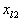

  </td>
  <td width=28 valign=top style='width:20.8pt;border:none;border-right:solid windowtext 1.0pt;
  padding:0mm 1.4pt 0mm 1.4pt'>
  
…

  </td>
  <td width=50 valign=top style='width:37.65pt;border:none;border-right:solid windowtext 1.0pt;
  padding:0mm 1.4pt 0mm 1.4pt'>
  

  </td>
  <td width=33 valign=top style='width:25.1pt;border:none;border-right:solid windowtext 1.0pt;
  padding:0mm 1.4pt 0mm 1.4pt'>
  
…

  </td>
  <td width=50 valign=top style='width:37.65pt;border:none;border-right:double windowtext 2.25pt;
  padding:0mm 1.4pt 0mm 1.4pt'>
  

  </td>
  <td width=33 valign=top style='width:25.1pt;border:none;border-right:solid windowtext 1.0pt;
  padding:0mm 1.4pt 0mm 1.4pt'>
  
0

  </td>
  <td width=33 valign=top style='width:25.1pt;border:none;border-right:solid windowtext 1.0pt;
  padding:0mm 1.4pt 0mm 1.4pt'>
  
…

  </td>
  <td width=33 valign=top style='width:25.1pt;border:none;border-right:solid windowtext 1.0pt;
  padding:0mm 1.4pt 0mm 1.4pt'>
  
1

  </td>
  <td width=33 valign=top style='width:25.1pt;border:none;border-right:solid windowtext 1.0pt;
  padding:0mm 1.4pt 0mm 1.4pt'>
  
…

  </td>
  <td width=50 valign=top style='width:37.65pt;border:none;padding:0mm 1.4pt 0mm 1.4pt'>
  
0

  </td>
 </tr>
 <tr>
  <td width=40 valign=top style='width:29.75pt;border:none;border-right:solid windowtext 1.0pt;
  padding:0mm 1.4pt 0mm 1.4pt'>
  

  </td>
  <td width=46 valign=top style='width:34.4pt;border:none;border-right:solid windowtext 1.0pt;
  padding:0mm 1.4pt 0mm 1.4pt'>
  

  </td>
  <td width=33 valign=top style='width:25.1pt;border:none;padding:0mm 1.4pt 0mm 1.4pt'>
  

  </td>
  <td width=67 valign=top style='width:50.2pt;border-top:none;border-left:double windowtext 2.25pt;
  border-bottom:none;border-right:solid windowtext 1.0pt;padding:0mm 1.4pt 0mm 1.4pt'>
  

  </td>
  <td width=49 valign=top style='width:37.05pt;border:none;border-right:solid windowtext 1.0pt;
  padding:0mm 1.4pt 0mm 1.4pt'>
  

  </td>
  <td width=57 valign=top style='width:42.55pt;border:none;border-right:solid windowtext 1.0pt;
  padding:0mm 1.4pt 0mm 1.4pt'>
  

  </td>
  <td width=28 valign=top style='width:20.8pt;border:none;border-right:solid windowtext 1.0pt;
  padding:0mm 1.4pt 0mm 1.4pt'>
  

  </td>
  <td width=50 valign=top style='width:37.65pt;border:none;border-right:solid windowtext 1.0pt;
  padding:0mm 1.4pt 0mm 1.4pt'>
  

  </td>
  <td width=33 valign=top style='width:25.1pt;border:none;border-right:solid windowtext 1.0pt;
  padding:0mm 1.4pt 0mm 1.4pt'>
  

  </td>
  <td width=50 valign=top style='width:37.65pt;border:none;border-right:double windowtext 2.25pt;
  padding:0mm 1.4pt 0mm 1.4pt'>
  

  </td>
  <td width=33 valign=top style='width:25.1pt;border:none;border-right:solid windowtext 1.0pt;
  padding:0mm 1.4pt 0mm 1.4pt'>
  

  </td>
  <td width=33 valign=top style='width:25.1pt;border:none;border-right:solid windowtext 1.0pt;
  padding:0mm 1.4pt 0mm 1.4pt'>
  

  </td>
  <td width=33 valign=top style='width:25.1pt;border:none;border-right:solid windowtext 1.0pt;
  padding:0mm 1.4pt 0mm 1.4pt'>
  

  </td>
  <td width=33 valign=top style='width:25.1pt;border:none;border-right:solid windowtext 1.0pt;
  padding:0mm 1.4pt 0mm 1.4pt'>
  

  </td>
  <td width=50 valign=top style='width:37.65pt;border:none;padding:0mm 1.4pt 0mm 1.4pt'>
  

  </td>
 </tr>
 <tr>
  <td width=40 valign=top style='width:29.75pt;border-top:none;border-left:
  none;border-bottom:solid windowtext 1.0pt;border-right:solid windowtext 1.0pt;
  padding:0mm 1.4pt 0mm 1.4pt'>
  

  </td>
  <td width=46 valign=top style='width:34.4pt;border-top:none;border-left:none;
  border-bottom:solid windowtext 1.0pt;border-right:solid windowtext 1.0pt;
  padding:0mm 1.4pt 0mm 1.4pt'>
  

  </td>
  <td width=33 valign=top style='width:25.1pt;border:none;border-bottom:solid windowtext 1.0pt;
  padding:0mm 1.4pt 0mm 1.4pt'>
  

  </td>
  <td width=67 valign=top style='width:50.2pt;border-top:none;border-left:double windowtext 2.25pt;
  border-bottom:solid windowtext 1.0pt;border-right:solid windowtext 1.0pt;
  padding:0mm 1.4pt 0mm 1.4pt'>
  

  </td>
  <td width=49 valign=top style='width:37.05pt;border-top:none;border-left:
  none;border-bottom:solid windowtext 1.0pt;border-right:solid windowtext 1.0pt;
  padding:0mm 1.4pt 0mm 1.4pt'>
  

  </td>
  <td width=57 valign=top style='width:42.55pt;border-top:none;border-left:
  none;border-bottom:solid windowtext 1.0pt;border-right:solid windowtext 1.0pt;
  padding:0mm 1.4pt 0mm 1.4pt'>
  

  </td>
  <td width=28 valign=top style='width:20.8pt;border-top:none;border-left:none;
  border-bottom:solid windowtext 1.0pt;border-right:solid windowtext 1.0pt;
  padding:0mm 1.4pt 0mm 1.4pt'>
  
…

  </td>
  <td width=50 valign=top style='width:37.65pt;border-top:none;border-left:
  none;border-bottom:solid windowtext 1.0pt;border-right:solid windowtext 1.0pt;
  padding:0mm 1.4pt 0mm 1.4pt'>
  

  </td>
  <td width=33 valign=top style='width:25.1pt;border-top:none;border-left:none;
  border-bottom:solid windowtext 1.0pt;border-right:solid windowtext 1.0pt;
  padding:0mm 1.4pt 0mm 1.4pt'>
  
…

  </td>
  <td width=50 valign=top style='width:37.65pt;border-top:none;border-left:
  none;border-bottom:solid windowtext 1.0pt;border-right:double windowtext 2.25pt;
  padding:0mm 1.4pt 0mm 1.4pt'>
  

  </td>
  <td width=33 valign=top style='width:25.1pt;border-top:none;border-left:none;
  border-bottom:solid windowtext 1.0pt;border-right:solid windowtext 1.0pt;
  padding:0mm 1.4pt 0mm 1.4pt'>
  
0

  </td>
  <td width=33 valign=top style='width:25.1pt;border-top:none;border-left:none;
  border-bottom:solid windowtext 1.0pt;border-right:solid windowtext 1.0pt;
  padding:0mm 1.4pt 0mm 1.4pt'>
  
…

  </td>
  <td width=33 valign=top style='width:25.1pt;border-top:none;border-left:none;
  border-bottom:solid windowtext 1.0pt;border-right:solid windowtext 1.0pt;
  padding:0mm 1.4pt 0mm 1.4pt'>
  
0

  </td>
  <td width=33 valign=top style='width:25.1pt;border-top:none;border-left:none;
  border-bottom:solid windowtext 1.0pt;border-right:solid windowtext 1.0pt;
  padding:0mm 1.4pt 0mm 1.4pt'>
  
…

  </td>
  <td width=50 valign=top style='width:37.65pt;border:none;border-bottom:solid windowtext 1.0pt;
  padding:0mm 1.4pt 0mm 1.4pt'>
  
1

  </td>
 </tr>
 <tr>
  <td width=40 valign=top style='width:29.75pt;border-top:none;border-left:
  none;border-bottom:solid windowtext 1.5pt;border-right:solid windowtext 1.0pt;
  padding:0mm 1.4pt 0mm 1.4pt'>
  

  </td>
  <td width=46 valign=top style='width:34.4pt;border-top:none;border-left:none;
  border-bottom:solid windowtext 1.5pt;border-right:solid windowtext 1.0pt;
  padding:0mm 1.4pt 0mm 1.4pt'>
  
&nbsp;
  

  </td>
  <td width=33 valign=top style='width:25.1pt;border:none;border-bottom:solid windowtext 1.5pt;
  padding:0mm 1.4pt 0mm 1.4pt'>
  
&nbsp;
  

  </td>
  <td width=67 valign=top style='width:50.2pt;border-top:none;border-left:double windowtext 2.25pt;
  border-bottom:solid windowtext 1.5pt;border-right:solid windowtext 1.0pt;
  padding:0mm 1.4pt 0mm 1.4pt'>
  
0

  

  </td>
  <td width=49 valign=top style='width:37.05pt;border-top:none;border-left:
  none;border-bottom:solid windowtext 1.5pt;border-right:solid windowtext 1.0pt;
  padding:0mm 1.4pt 0mm 1.4pt'>
  
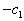

  

  </td>
  <td width=57 valign=top style='width:42.55pt;border-top:none;border-left:
  none;border-bottom:solid windowtext 1.5pt;border-right:solid windowtext 1.0pt;
  padding:0mm 1.4pt 0mm 1.4pt'>
  

  

  </td>
  <td width=28 valign=top style='width:20.8pt;border-top:none;border-left:none;
  border-bottom:solid windowtext 1.5pt;border-right:solid windowtext 1.0pt;
  padding:0mm 1.4pt 0mm 1.4pt'>
  
…

  
…

  </td>
  <td width=50 valign=top style='width:37.65pt;border-top:none;border-left:
  none;border-bottom:solid windowtext 1.5pt;border-right:solid windowtext 1.0pt;
  padding:0mm 1.4pt 0mm 1.4pt'>
  

  

  </td>
  <td width=33 valign=top style='width:25.1pt;border-top:none;border-left:none;
  border-bottom:solid windowtext 1.5pt;border-right:solid windowtext 1.0pt;
  padding:0mm 1.4pt 0mm 1.4pt'>
  
&nbsp;
  

  </td>
  <td width=50 valign=top style='width:37.65pt;border-top:none;border-left:
  none;border-bottom:solid windowtext 1.5pt;border-right:double windowtext 2.25pt;
  padding:0mm 1.4pt 0mm 1.4pt'>
  

  

  </td>
  <td width=33 valign=top style='width:25.1pt;border-top:none;border-left:none;
  border-bottom:solid windowtext 1.5pt;border-right:solid windowtext 1.0pt;
  padding:0mm 1.4pt 0mm 1.4pt'>
  
0

  
0

  </td>
  <td width=33 valign=top style='width:25.1pt;border-top:none;border-left:none;
  border-bottom:solid windowtext 1.5pt;border-right:solid windowtext 1.0pt;
  padding:0mm 1.4pt 0mm 1.4pt'>
  
…

  
…

  </td>
  <td width=33 valign=top style='width:25.1pt;border-top:none;border-left:none;
  border-bottom:solid windowtext 1.5pt;border-right:solid windowtext 1.0pt;
  padding:0mm 1.4pt 0mm 1.4pt'>
  
0

  
0

  </td>
  <td width=33 valign=top style='width:25.1pt;border-top:none;border-left:none;
  border-bottom:solid windowtext 1.5pt;border-right:solid windowtext 1.0pt;
  padding:0mm 1.4pt 0mm 1.4pt'>
  
…

  
…

  </td>
  <td width=50 valign=top style='width:37.65pt;border:none;border-bottom:solid windowtext 1.5pt;
  padding:0mm 1.4pt 0mm 1.4pt'>
  
0

  
0

  </td>
 </tr>
</table>

除了将和第行的最大正数相对应的矢量引进基底以外，表3和表1一样处理.第行的元素也用通常的主元素消去法公式加以变换.一旦将一人工矢量从基底消去，就不再进入基底，所以没有必要去变换表中最后的列.继续进行上述迭代直到所有人工矢量都从基底消去，或者第行没有正的元素存在.

如果原来的问题包含一些单位矢量，那末这些矢量可以和必要的人工矢量一起作为初始基底，这样可以减少迭代次数.

例1&nbsp; 极大化&nbsp;&nbsp;&nbsp;&nbsp;&nbsp;&nbsp;&nbsp;&nbsp;&nbsp;&nbsp;&nbsp;&nbsp;&nbsp;

满足条件

和&nbsp;&nbsp;&nbsp;&nbsp;&nbsp;&nbsp;&nbsp;&nbsp;&nbsp;&nbsp;&nbsp;&nbsp;&nbsp;&nbsp;&nbsp;&nbsp;&nbsp;&nbsp;&nbsp;&nbsp;&nbsp;&nbsp;&nbsp;&nbsp;&nbsp;&nbsp;

解&nbsp; 把上述问题改为极小化 .

由于给定系统包含一单位矢量，因此只需要两个人工矢量和，与一起作为初始基底.第一个解（表4）为，相应的目标函数值等于.的计算可由和矢量的内积得到.例如

因为()的极大元素为5，所以将矢量引进基底.相应的，故人工矢量从基底消去，用主元素消去公式变换表4中第1步的所有元素，相应的目标函数值为，新解为，.引进基底，从基底消去.在第3步，由于所有的而且，得到原来问题的一个可行解

表&nbsp;&nbsp;&nbsp; 4

第1步

<table class=MsoNormalTable border=1 cellspacing=0 cellpadding=0
 style='border-collapse:collapse;border:none'>
 <tr>
  <td width=56 rowspan=2 valign=top style='width:41.65pt;border-top:solid windowtext 1.5pt;
  border-left:none;border-bottom:solid windowtext 1.0pt;border-right:solid windowtext 1.0pt;
  padding:0mm 1.4pt 0mm 1.4pt'>
  

  </td>
  <td width=56 rowspan=2 valign=top style='width:41.65pt;border-top:solid windowtext 1.5pt;
  border-left:none;border-bottom:solid windowtext 1.0pt;border-right:solid windowtext 1.0pt;
  padding:0mm 1.4pt 0mm 1.4pt'>
  
基底

  </td>
  <td width=56 rowspan=2 valign=top style='width:41.65pt;border-top:solid windowtext 1.5pt;
  border-left:none;border-bottom:solid windowtext 1.0pt;border-right:none;
  padding:0mm 1.4pt 0mm 1.4pt'>
  

  </td>
  <td width=70 rowspan=2 valign=top style='width:52.15pt;border-top:solid 1.5pt;
  border-left:double 2.25pt;border-bottom:solid 1.0pt;border-right:solid 1.0pt;
  border-color:windowtext;padding:0mm 1.4pt 0mm 1.4pt'>
  

  </td>
  <td width=67 valign=top style='width:50.2pt;border-top:solid windowtext 1.5pt;
  border-left:none;border-bottom:solid windowtext 1.0pt;border-right:solid windowtext 1.0pt;
  padding:0mm 1.4pt 0mm 1.4pt'>
  
-1

  </td>
  <td width=67 valign=top style='width:50.2pt;border-top:solid windowtext 1.5pt;
  border-left:none;border-bottom:solid windowtext 1.0pt;border-right:solid windowtext 1.0pt;
  padding:0mm 1.4pt 0mm 1.4pt'>
  
-2

  </td>
  <td width=67 valign=top style='width:50.2pt;border-top:solid windowtext 1.5pt;
  border-left:none;border-bottom:solid windowtext 1.0pt;border-right:solid windowtext 1.0pt;
  padding:0mm 1.4pt 0mm 1.4pt'>
  
-3

  </td>
  <td width=67 valign=top style='width:50.2pt;border-top:solid windowtext 1.5pt;
  border-left:none;border-bottom:solid windowtext 1.0pt;border-right:none;
  padding:0mm 1.4pt 0mm 1.4pt'>
  
1

  </td>
  <td width=67 valign=top style='width:50.2pt;border-top:solid 1.5pt;
  border-left:double 2.25pt;border-bottom:solid 1.0pt;border-right:solid 1.0pt;
  border-color:windowtext;padding:0mm 1.4pt 0mm 1.4pt'>
  

  </td>
  <td width=67 valign=top style='width:50.2pt;border-top:solid windowtext 1.5pt;
  border-left:none;border-bottom:solid windowtext 1.0pt;border-right:none;
  padding:0mm 1.4pt 0mm 1.4pt'>
  

  </td>
 </tr>
 <tr>
  <td width=67 valign=top style='width:50.2pt;border-top:none;border-left:none;
  border-bottom:solid windowtext 1.0pt;border-right:solid windowtext 1.0pt;
  padding:0mm 1.4pt 0mm 1.4pt'>
  

  </td>
  <td width=67 valign=top style='width:50.2pt;border-top:none;border-left:none;
  border-bottom:solid windowtext 1.0pt;border-right:solid windowtext 1.0pt;
  padding:0mm 1.4pt 0mm 1.4pt'>
  

  </td>
  <td width=67 valign=top style='width:50.2pt;border-top:none;border-left:none;
  border-bottom:solid windowtext 1.0pt;border-right:solid windowtext 1.0pt;
  padding:0mm 1.4pt 0mm 1.4pt'>
  

  </td>
  <td width=67 valign=top style='width:50.2pt;border:none;border-bottom:solid windowtext 1.0pt;
  padding:0mm 1.4pt 0mm 1.4pt'>
  

  </td>
  <td width=67 valign=top style='width:50.2pt;border-top:none;border-left:double windowtext 2.25pt;
  border-bottom:solid windowtext 1.0pt;border-right:solid windowtext 1.0pt;
  padding:0mm 1.4pt 0mm 1.4pt'>
  

  </td>
  <td width=67 valign=top style='width:50.2pt;border:none;border-bottom:solid windowtext 1.0pt;
  padding:0mm 1.4pt 0mm 1.4pt'>
  

  </td>
 </tr>
 <tr>
  <td width=56 valign=top style='width:41.65pt;border-top:none;border-left:
  none;border-bottom:solid windowtext 1.0pt;border-right:solid windowtext 1.0pt;
  padding:0mm 1.4pt 0mm 1.4pt'>
  
1

  
2

  
3

  </td>
  <td width=56 valign=top style='width:41.65pt;border-top:none;border-left:
  none;border-bottom:solid windowtext 1.0pt;border-right:solid windowtext 1.0pt;
  padding:0mm 1.4pt 0mm 1.4pt'>
  

  

  

  </td>
  <td width=56 valign=top style='width:41.65pt;border:none;border-bottom:solid windowtext 1.0pt;
  padding:0mm 1.4pt 0mm 1.4pt'>
  

  

  
1

  </td>
  <td width=70 valign=top style='width:52.15pt;border-top:none;border-left:
  double windowtext 2.25pt;border-bottom:solid windowtext 1.0pt;border-right:
  solid windowtext 1.0pt;padding:0mm 1.4pt 0mm 1.4pt'>
  
15

  
20

  
10

  </td>
  <td width=67 valign=top style='width:50.2pt;border-top:none;border-left:none;
  border-bottom:solid windowtext 1.0pt;border-right:solid windowtext 1.0pt;
  padding:0mm 1.4pt 0mm 1.4pt'>
  
1

  
2

  
1

  </td>
  <td width=67 valign=top style='width:50.2pt;border-top:none;border-left:none;
  border-bottom:solid windowtext 1.0pt;border-right:solid windowtext 1.0pt;
  padding:0mm 1.4pt 0mm 1.4pt'>
  
2

  
1

  
2

  </td>
  <td width=67 valign=top style='width:50.2pt;border-top:none;border-left:none;
  border-bottom:solid windowtext 1.0pt;border-right:solid windowtext 1.0pt;
  padding:0mm 1.4pt 0mm 1.4pt'>
  
3

  

  
1

  </td>
  <td width=67 valign=top style='width:50.2pt;border:none;border-bottom:solid windowtext 1.0pt;
  padding:0mm 1.4pt 0mm 1.4pt'>
  
0

  
0

  
1

  </td>
  <td width=67 valign=top style='width:50.2pt;border-top:none;border-left:double windowtext 2.25pt;
  border-bottom:solid windowtext 1.0pt;border-right:solid windowtext 1.0pt;
  padding:0mm 1.4pt 0mm 1.4pt'>
  
1

  
0

  
0

  </td>
  <td width=67 valign=top style='width:50.2pt;border:none;border-bottom:solid windowtext 1.0pt;
  padding:0mm 1.4pt 0mm 1.4pt'>
  
0

  
1

  
1

  </td>
 </tr>
 <tr>
  <td width=56 valign=top style='width:41.65pt;border-top:none;border-left:
  none;border-bottom:solid windowtext 1.5pt;border-right:solid windowtext 1.0pt;
  padding:0mm 1.4pt 0mm 1.4pt'>
  
4

  
5

  </td>
  <td width=56 valign=top style='width:41.65pt;border-top:none;border-left:
  none;border-bottom:solid windowtext 1.5pt;border-right:solid windowtext 1.0pt;
  padding:0mm 1.4pt 0mm 1.4pt'>
  
&nbsp;
  

  </td>
  <td width=56 valign=top style='width:41.65pt;border:none;border-bottom:solid windowtext 1.5pt;
  padding:0mm 1.4pt 0mm 1.4pt'>
  
&nbsp;
  

  </td>
  <td width=70 valign=top style='width:52.15pt;border-top:none;border-left:
  double windowtext 2.25pt;border-bottom:solid windowtext 1.5pt;border-right:
  solid windowtext 1.0pt;padding:0mm 1.4pt 0mm 1.4pt'>
  
10

  
35

  </td>
  <td width=67 valign=top style='width:50.2pt;border-top:none;border-left:none;
  border-bottom:solid windowtext 1.5pt;border-right:solid windowtext 1.0pt;
  padding:0mm 1.4pt 0mm 1.4pt'>
  
2

  
3

  </td>
  <td width=67 valign=top style='width:50.2pt;border-top:none;border-left:none;
  border-bottom:solid windowtext 1.5pt;border-right:solid windowtext 1.0pt;
  padding:0mm 1.4pt 0mm 1.4pt'>
  
4

  
3

  </td>
  <td width=67 valign=top style='width:50.2pt;border-top:none;border-left:none;
  border-bottom:solid windowtext 1.5pt;border-right:solid windowtext 1.0pt;
  padding:0mm 1.4pt 0mm 1.4pt'>
  
4

  
8

  </td>
  <td width=67 valign=top style='width:50.2pt;border:none;border-bottom:solid windowtext 1.5pt;
  padding:0mm 1.4pt 0mm 1.4pt'>
  
0

  
0

  </td>
  <td width=67 valign=top style='width:50.2pt;border-top:none;border-left:double windowtext 2.25pt;
  border-bottom:solid windowtext 1.5pt;border-right:solid windowtext 1.0pt;
  padding:0mm 1.4pt 0mm 1.4pt'>
  
0

  
0

  </td>
  <td width=67 valign=top style='width:50.2pt;border:none;border-bottom:solid windowtext 1.5pt;
  padding:0mm 1.4pt 0mm 1.4pt'>
  
0

  
0

  </td>
 </tr>
</table>

第2步

<table class=MsoNormalTable border=1 cellspacing=0 cellpadding=0
 style='border-collapse:collapse;border:none'>
 <tr>
  <td width=69 valign=top style='width:52.05pt;border-top:solid windowtext 1.5pt;
  border-left:none;border-bottom:none;border-right:solid windowtext 1.0pt;
  padding:0mm 1.4pt 0mm 1.4pt'>
  

  </td>
  <td width=69 valign=top style='width:52.05pt;border:none;border-top:solid windowtext 1.5pt;
  padding:0mm 1.4pt 0mm 1.4pt'>
  

  </td>
  <td width=81 valign=top style='width:60.45pt;border-top:solid windowtext 1.5pt;
  border-left:double windowtext 2.25pt;border-bottom:none;border-right:solid windowtext 1.0pt;
  padding:0mm 1.4pt 0mm 1.4pt'>
  
3

  </td>
  <td width=84 valign=top style='width:62.75pt;border-top:solid windowtext 1.5pt;
  border-left:none;border-bottom:none;border-right:solid windowtext 1.0pt;
  padding:0mm 1.4pt 0mm 1.4pt'>
  

  </td>
  <td width=84 valign=top style='width:62.75pt;border-top:solid windowtext 1.5pt;
  border-left:none;border-bottom:none;border-right:solid windowtext 1.0pt;
  padding:0mm 1.4pt 0mm 1.4pt'>
  

  </td>
  <td width=84 valign=top style='width:62.75pt;border-top:solid windowtext 1.5pt;
  border-left:none;border-bottom:none;border-right:solid windowtext 1.0pt;
  padding:0mm 1.4pt 0mm 1.4pt'>
  
0

  </td>
  <td width=84 valign=top style='width:62.75pt;border-top:solid windowtext 1.5pt;
  border-left:none;border-bottom:none;border-right:double windowtext 2.25pt;
  padding:0mm 1.4pt 0mm 1.4pt'>
  
0

  </td>
  <td width=84 valign=top style='width:62.75pt;border:none;border-top:solid windowtext 1.5pt;
  padding:0mm 1.4pt 0mm 1.4pt'>
  
1

  </td>
 </tr>
 <tr>
  <td width=69 valign=top style='width:52.05pt;border:none;border-right:solid windowtext 1.0pt;
  padding:0mm 1.4pt 0mm 1.4pt'>
  

  </td>
  <td width=69 valign=top style='width:52.05pt;border:none;padding:0mm 1.4pt 0mm 1.4pt'>
  
-3

  </td>
  <td width=81 valign=top style='width:60.45pt;border-top:none;border-left:
  double windowtext 2.25pt;border-bottom:none;border-right:solid windowtext 1.0pt;
  padding:0mm 1.4pt 0mm 1.4pt'>
  
4

  </td>
  <td width=84 valign=top style='width:62.75pt;border:none;border-right:solid windowtext 1.0pt;
  padding:0mm 1.4pt 0mm 1.4pt'>
  

  </td>
  <td width=84 valign=top style='width:62.75pt;border:none;border-right:solid windowtext 1.0pt;
  padding:0mm 1.4pt 0mm 1.4pt'>
  

  </td>
  <td width=84 valign=top style='width:62.75pt;border:none;border-right:solid windowtext 1.0pt;
  padding:0mm 1.4pt 0mm 1.4pt'>
  
1

  </td>
  <td width=84 valign=top style='width:62.75pt;border:none;border-right:double windowtext 2.25pt;
  padding:0mm 1.4pt 0mm 1.4pt'>
  
0

  </td>
  <td width=84 valign=top style='width:62.75pt;border:none;padding:0mm 1.4pt 0mm 1.4pt'>
  
0

  </td>
 </tr>
 <tr>
  <td width=69 valign=top style='width:52.05pt;border:none;border-right:solid windowtext 1.0pt;
  padding:0mm 1.4pt 0mm 1.4pt'>
  

  </td>
  <td width=69 valign=top style='width:52.05pt;border:none;padding:0mm 1.4pt 0mm 1.4pt'>
  
1

  </td>
  <td width=81 valign=top style='width:60.45pt;border-top:none;border-left:
  double windowtext 2.25pt;border-bottom:none;border-right:solid windowtext 1.0pt;
  padding:0mm 1.4pt 0mm 1.4pt'>
  
6

  </td>
  <td width=84 valign=top style='width:62.75pt;border:none;border-right:solid windowtext 1.0pt;
  padding:0mm 1.4pt 0mm 1.4pt'>
  

  </td>
  <td width=84 valign=top style='width:62.75pt;border:none;border-right:solid windowtext 1.0pt;
  padding:0mm 1.4pt 0mm 1.4pt'>
  

  </td>
  <td width=84 valign=top style='width:62.75pt;border:none;border-right:solid windowtext 1.0pt;
  padding:0mm 1.4pt 0mm 1.4pt'>
  
0

  </td>
  <td width=84 valign=top style='width:62.75pt;border:none;border-right:double windowtext 2.25pt;
  padding:0mm 1.4pt 0mm 1.4pt'>
  
1

  </td>
  <td width=84 valign=top style='width:62.75pt;border:none;padding:0mm 1.4pt 0mm 1.4pt'>
  
0

  </td>
 </tr>
 <tr>
  <td width=69 valign=top style='width:52.05pt;border-top:solid windowtext 1.0pt;
  border-left:none;border-bottom:none;border-right:solid windowtext 1.0pt;
  padding:0mm 1.4pt 0mm 1.4pt'>
  
&nbsp;
  

  </td>
  <td width=69 valign=top style='width:52.05pt;border:none;border-top:solid windowtext 1.0pt;
  padding:0mm 1.4pt 0mm 1.4pt'>
  
&nbsp;
  

  </td>
  <td width=81 valign=top style='width:60.45pt;border-top:solid windowtext 1.0pt;
  border-left:double windowtext 2.25pt;border-bottom:none;border-right:solid windowtext 1.0pt;
  padding:0mm 1.4pt 0mm 1.4pt'>
  
-6

  </td>
  <td width=84 valign=top style='width:62.75pt;border-top:solid windowtext 1.0pt;
  border-left:none;border-bottom:none;border-right:solid windowtext 1.0pt;
  padding:0mm 1.4pt 0mm 1.4pt'>
  

  </td>
  <td width=84 valign=top style='width:62.75pt;border-top:solid windowtext 1.0pt;
  border-left:none;border-bottom:none;border-right:solid windowtext 1.0pt;
  padding:0mm 1.4pt 0mm 1.4pt'>
  
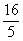

  </td>
  <td width=84 valign=top style='width:62.75pt;border-top:solid windowtext 1.0pt;
  border-left:none;border-bottom:none;border-right:solid windowtext 1.0pt;
  padding:0mm 1.4pt 0mm 1.4pt'>
  
0

  </td>
  <td width=84 valign=top style='width:62.75pt;border-top:solid windowtext 1.0pt;
  border-left:none;border-bottom:none;border-right:double windowtext 2.25pt;
  padding:0mm 1.4pt 0mm 1.4pt'>
  
0

  </td>
  <td width=84 valign=top style='width:62.75pt;border:none;border-top:solid windowtext 1.0pt;
  padding:0mm 1.4pt 0mm 1.4pt'>
  
0

  </td>
 </tr>
 <tr>
  <td width=69 valign=top style='width:52.05pt;border-top:none;border-left:
  none;border-bottom:solid windowtext 1.5pt;border-right:solid windowtext 1.0pt;
  padding:0mm 1.4pt 0mm 1.4pt'>
  
&nbsp;
  

  </td>
  <td width=69 valign=top style='width:52.05pt;border:none;border-bottom:solid windowtext 1.5pt;
  padding:0mm 1.4pt 0mm 1.4pt'>
  
&nbsp;
  

  </td>
  <td width=81 valign=top style='width:60.45pt;border-top:none;border-left:
  double windowtext 2.25pt;border-bottom:solid windowtext 1.5pt;border-right:
  solid windowtext 1.0pt;padding:0mm 1.4pt 0mm 1.4pt'>
  
3

  </td>
  <td width=84 valign=top style='width:62.75pt;border-top:none;border-left:
  none;border-bottom:solid windowtext 1.5pt;border-right:solid windowtext 1.0pt;
  padding:0mm 1.4pt 0mm 1.4pt'>
  

  </td>
  <td width=84 valign=top style='width:62.75pt;border-top:none;border-left:
  none;border-bottom:solid windowtext 1.5pt;border-right:solid windowtext 1.0pt;
  padding:0mm 1.4pt 0mm 1.4pt'>
  

  </td>
  <td width=84 valign=top style='width:62.75pt;border-top:none;border-left:
  none;border-bottom:solid windowtext 1.5pt;border-right:solid windowtext 1.0pt;
  padding:0mm 1.4pt 0mm 1.4pt'>
  
0

  </td>
  <td width=84 valign=top style='width:62.75pt;border-top:none;border-left:
  none;border-bottom:solid windowtext 1.5pt;border-right:double windowtext 2.25pt;
  padding:0mm 1.4pt 0mm 1.4pt'>
  
0

  </td>
  <td width=84 valign=top style='width:62.75pt;border:none;border-bottom:solid windowtext 1.5pt;
  padding:0mm 1.4pt 0mm 1.4pt'>
  
0

  </td>
 </tr>
</table>

第3步

<table class=MsoNormalTable border=1 cellspacing=0 cellpadding=0
 style='border-collapse:collapse;border:none'>
 <tr>
  <td width=79 valign=top style='width:59.5pt;border-top:solid windowtext 1.5pt;
  border-left:none;border-bottom:none;border-right:solid windowtext 1.0pt;
  padding:0mm 1.4pt 0mm 1.4pt'>
  

  </td>
  <td width=79 valign=top style='width:59.5pt;border:none;border-top:solid windowtext 1.5pt;
  padding:0mm 1.4pt 0mm 1.4pt'>
  
-2

  </td>
  <td width=94 valign=top style='width:70.65pt;border-top:solid windowtext 1.5pt;
  border-left:double windowtext 2.25pt;border-bottom:none;border-right:solid windowtext 1.0pt;
  padding:0mm 1.4pt 0mm 1.4pt'>
  

  </td>
  <td width=100 valign=top style='width:75.3pt;border-top:solid windowtext 1.5pt;
  border-left:none;border-bottom:none;border-right:solid windowtext 1.0pt;
  padding:0mm 1.4pt 0mm 1.4pt'>
  

  </td>
  <td width=100 valign=top style='width:75.3pt;border-top:solid windowtext 1.5pt;
  border-left:none;border-bottom:none;border-right:solid windowtext 1.0pt;
  padding:0mm 1.4pt 0mm 1.4pt'>
  
1

  </td>
  <td width=100 valign=top style='width:75.3pt;border-top:solid windowtext 1.5pt;
  border-left:none;border-bottom:none;border-right:solid windowtext 1.0pt;
  padding:0mm 1.4pt 0mm 1.4pt'>
  
0

  </td>
  <td width=84 valign=top style='width:62.75pt;border:none;border-top:solid windowtext 1.5pt;
  padding:0mm 1.4pt 0mm 1.4pt'>
  
0

  </td>
 </tr>
 <tr>
  <td width=79 valign=top style='width:59.5pt;border:none;border-right:solid windowtext 1.0pt;
  padding:0mm 1.4pt 0mm 1.4pt'>
  

  </td>
  <td width=79 valign=top style='width:59.5pt;border:none;padding:0mm 1.4pt 0mm 1.4pt'>
  
-3

  </td>
  <td width=94 valign=top style='width:70.65pt;border-top:none;border-left:
  double windowtext 2.25pt;border-bottom:none;border-right:solid windowtext 1.0pt;
  padding:0mm 1.4pt 0mm 1.4pt'>
  

  </td>
  <td width=100 valign=top style='width:75.3pt;border:none;border-right:solid windowtext 1.0pt;
  padding:0mm 1.4pt 0mm 1.4pt'>
  

  </td>
  <td width=100 valign=top style='width:75.3pt;border:none;border-right:solid windowtext 1.0pt;
  padding:0mm 1.4pt 0mm 1.4pt'>
  
0

  </td>
  <td width=100 valign=top style='width:75.3pt;border:none;border-right:solid windowtext 1.0pt;
  padding:0mm 1.4pt 0mm 1.4pt'>
  
1

  </td>
  <td width=84 valign=top style='width:62.75pt;border:none;padding:0mm 1.4pt 0mm 1.4pt'>
  
0

  </td>
 </tr>
 <tr style='height:37.8pt'>
  <td width=79 valign=top style='width:59.5pt;border:none;border-right:solid windowtext 1.0pt;
  padding:0mm 1.4pt 0mm 1.4pt;height:37.8pt'>
  

  </td>
  <td width=79 valign=top style='width:59.5pt;border:none;padding:0mm 1.4pt 0mm 1.4pt;
  height:37.8pt'>
  
1

  </td>
  <td width=94 valign=top style='width:70.65pt;border-top:none;border-left:
  double windowtext 2.25pt;border-bottom:none;border-right:solid windowtext 1.0pt;
  padding:0mm 1.4pt 0mm 1.4pt;height:37.8pt'>
  

  </td>
  <td width=100 valign=top style='width:75.3pt;border:none;border-right:solid windowtext 1.0pt;
  padding:0mm 1.4pt 0mm 1.4pt;height:37.8pt'>
  

  </td>
  <td width=100 valign=top style='width:75.3pt;border:none;border-right:solid windowtext 1.0pt;
  padding:0mm 1.4pt 0mm 1.4pt;height:37.8pt'>
  
0

  </td>
  <td width=100 valign=top style='width:75.3pt;border:none;border-right:solid windowtext 1.0pt;
  padding:0mm 1.4pt 0mm 1.4pt;height:37.8pt'>
  
0

  </td>
  <td width=84 valign=top style='width:62.75pt;border:none;padding:0mm 1.4pt 0mm 1.4pt;
  height:37.8pt'>
  
1

  </td>
 </tr>
 <tr>
  <td width=79 valign=top style='width:59.5pt;border-top:solid windowtext 1.0pt;
  border-left:none;border-bottom:none;border-right:solid windowtext 1.0pt;
  padding:0mm 1.4pt 0mm 1.4pt'>
  
&nbsp;
  

  </td>
  <td width=79 valign=top style='width:59.5pt;border:none;border-top:solid windowtext 1.0pt;
  padding:0mm 1.4pt 0mm 1.4pt'>
  
&nbsp;
  

  </td>
  <td width=94 valign=top style='width:70.65pt;border-top:solid windowtext 1.0pt;
  border-left:double windowtext 2.25pt;border-bottom:none;border-right:solid windowtext 1.0pt;
  padding:0mm 1.4pt 0mm 1.4pt'>
  

  </td>
  <td width=100 valign=top style='width:75.3pt;border-top:solid windowtext 1.0pt;
  border-left:none;border-bottom:none;border-right:solid windowtext 1.0pt;
  padding:0mm 1.4pt 0mm 1.4pt'>
  

  </td>
  <td width=100 valign=top style='width:75.3pt;border-top:solid windowtext 1.0pt;
  border-left:none;border-bottom:none;border-right:solid windowtext 1.0pt;
  padding:0mm 1.4pt 0mm 1.4pt'>
  
0

  </td>
  <td width=100 valign=top style='width:75.3pt;border-top:solid windowtext 1.0pt;
  border-left:none;border-bottom:none;border-right:solid windowtext 1.0pt;
  padding:0mm 1.4pt 0mm 1.4pt'>
  
0

  </td>
  <td width=84 valign=top style='width:62.75pt;border:none;border-top:solid windowtext 1.0pt;
  padding:0mm 1.4pt 0mm 1.4pt'>
  
0

  </td>
 </tr>
 <tr style='height:25.5pt'>
  <td width=79 valign=top style='width:59.5pt;border-top:none;border-left:none;
  border-bottom:solid windowtext 1.5pt;border-right:solid windowtext 1.0pt;
  padding:0mm 1.4pt 0mm 1.4pt;height:25.5pt'>
  
&nbsp;
  

  </td>
  <td width=79 valign=top style='width:59.5pt;border:none;border-bottom:solid windowtext 1.5pt;
  padding:0mm 1.4pt 0mm 1.4pt;height:25.5pt'>
  
&nbsp;
  

  </td>
  <td width=94 valign=top style='width:70.65pt;border-top:none;border-left:
  double windowtext 2.25pt;border-bottom:solid windowtext 1.5pt;border-right:
  solid windowtext 1.0pt;padding:0mm 1.4pt 0mm 1.4pt;height:25.5pt'>
  
0

  </td>
  <td width=100 valign=top style='width:75.3pt;border-top:none;border-left:
  none;border-bottom:solid windowtext 1.5pt;border-right:solid windowtext 1.0pt;
  padding:0mm 1.4pt 0mm 1.4pt;height:25.5pt'>
  
0

  </td>
  <td width=100 valign=top style='width:75.3pt;border-top:none;border-left:
  none;border-bottom:solid windowtext 1.5pt;border-right:solid windowtext 1.0pt;
  padding:0mm 1.4pt 0mm 1.4pt;height:25.5pt'>
  
0

  </td>
  <td width=100 valign=top style='width:75.3pt;border-top:none;border-left:
  none;border-bottom:solid windowtext 1.5pt;border-right:solid windowtext 1.0pt;
  padding:0mm 1.4pt 0mm 1.4pt;height:25.5pt'>
  
0

  </td>
  <td width=84 valign=top style='width:62.75pt;border:none;border-bottom:solid windowtext 1.5pt;
  padding:0mm 1.4pt 0mm 1.4pt;height:25.5pt'>
  
0

  </td>
 </tr>
</table>

第4步

<table class=MsoNormalTable border=1 cellspacing=0 cellpadding=0
 style='border-collapse:collapse;border:none'>
 <tr>
  <td width=79 valign=top style='width:59.5pt;border-top:solid windowtext 1.5pt;
  border-left:none;border-bottom:none;border-right:solid windowtext 1.0pt;
  padding:0mm 1.4pt 0mm 1.4pt'>
  

  </td>
  <td width=79 valign=top style='width:59.5pt;border-top:solid windowtext 1.5pt;
  border-left:none;border-bottom:none;border-right:solid windowtext 1.0pt;
  padding:0mm 1.4pt 0mm 1.4pt'>
  
-2

  </td>
  <td width=94 valign=top style='width:70.65pt;border-top:solid windowtext 1.5pt;
  border-left:none;border-bottom:none;border-right:solid windowtext 1.0pt;
  padding:0mm 1.4pt 0mm 1.4pt'>
  

  </td>
  <td width=100 valign=top style='width:75.3pt;border-top:solid windowtext 1.5pt;
  border-left:none;border-bottom:none;border-right:solid windowtext 1.0pt;
  padding:0mm 1.4pt 0mm 1.4pt'>
  
0

  </td>
  <td width=100 valign=top style='width:75.3pt;border-top:solid windowtext 1.5pt;
  border-left:none;border-bottom:none;border-right:solid windowtext 1.0pt;
  padding:0mm 1.4pt 0mm 1.4pt'>
  
1

  </td>
  <td width=100 valign=top style='width:75.3pt;border-top:solid windowtext 1.5pt;
  border-left:none;border-bottom:none;border-right:solid windowtext 1.0pt;
  padding:0mm 1.4pt 0mm 1.4pt'>
  
0

  </td>
  <td width=84 valign=top style='width:62.75pt;border:none;border-top:solid windowtext 1.5pt;
  padding:0mm 1.4pt 0mm 1.4pt'>
  

  </td>
 </tr>
 <tr>
  <td width=79 valign=top style='width:59.5pt;border:none;border-right:solid windowtext 1.0pt;
  padding:0mm 1.4pt 0mm 1.4pt'>
  

  </td>
  <td width=79 valign=top style='width:59.5pt;border:none;border-right:solid windowtext 1.0pt;
  padding:0mm 1.4pt 0mm 1.4pt'>
  
-3

  </td>
  <td width=94 valign=top style='width:70.65pt;border:none;border-right:solid windowtext 1.0pt;
  padding:0mm 1.4pt 0mm 1.4pt'>
  

  </td>
  <td width=100 valign=top style='width:75.3pt;border:none;border-right:solid windowtext 1.0pt;
  padding:0mm 1.4pt 0mm 1.4pt'>
  
0

  </td>
  <td width=100 valign=top style='width:75.3pt;border:none;border-right:solid windowtext 1.0pt;
  padding:0mm 1.4pt 0mm 1.4pt'>
  
0

  </td>
  <td width=100 valign=top style='width:75.3pt;border:none;border-right:solid windowtext 1.0pt;
  padding:0mm 1.4pt 0mm 1.4pt'>
  
1

  </td>
  <td width=84 valign=top style='width:62.75pt;border:none;padding:0mm 1.4pt 0mm 1.4pt'>
  

  </td>
 </tr>
 <tr>
  <td width=79 valign=top style='width:59.5pt;border:none;border-right:solid windowtext 1.0pt;
  padding:0mm 1.4pt 0mm 1.4pt'>
  

  </td>
  <td width=79 valign=top style='width:59.5pt;border:none;border-right:solid windowtext 1.0pt;
  padding:0mm 1.4pt 0mm 1.4pt'>
  
-1

  </td>
  <td width=94 valign=top style='width:70.65pt;border:none;border-right:solid windowtext 1.0pt;
  padding:0mm 1.4pt 0mm 1.4pt'>
  

  </td>
  <td width=100 valign=top style='width:75.3pt;border:none;border-right:solid windowtext 1.0pt;
  padding:0mm 1.4pt 0mm 1.4pt'>
  
1

  </td>
  <td width=100 valign=top style='width:75.3pt;border:none;border-right:solid windowtext 1.0pt;
  padding:0mm 1.4pt 0mm 1.4pt'>
  
0

  </td>
  <td width=100 valign=top style='width:75.3pt;border:none;border-right:solid windowtext 1.0pt;
  padding:0mm 1.4pt 0mm 1.4pt'>
  
0

  </td>
  <td width=84 valign=top style='width:62.75pt;border:none;padding:0mm 1.4pt 0mm 1.4pt'>
  

  </td>
 </tr>
 <tr style='height:26.0pt'>
  <td width=79 valign=top style='width:59.5pt;border-top:solid windowtext 1.0pt;
  border-left:none;border-bottom:solid windowtext 1.5pt;border-right:solid windowtext 1.0pt;
  padding:0mm 1.4pt 0mm 1.4pt;height:26.0pt'>
  
&nbsp;
  

  </td>
  <td width=79 valign=top style='width:59.5pt;border-top:solid windowtext 1.0pt;
  border-left:none;border-bottom:solid windowtext 1.5pt;border-right:solid windowtext 1.0pt;
  padding:0mm 1.4pt 0mm 1.4pt;height:26.0pt'>
  
&nbsp;
  

  </td>
  <td width=94 valign=top style='width:70.65pt;border-top:solid windowtext 1.0pt;
  border-left:none;border-bottom:solid windowtext 1.5pt;border-right:solid windowtext 1.0pt;
  padding:0mm 1.4pt 0mm 1.4pt;height:26.0pt'>
  
-15

  </td>
  <td width=100 valign=top style='width:75.3pt;border-top:solid windowtext 1.0pt;
  border-left:none;border-bottom:solid windowtext 1.5pt;border-right:solid windowtext 1.0pt;
  padding:0mm 1.4pt 0mm 1.4pt;height:26.0pt'>
  
0

  </td>
  <td width=100 valign=top style='width:75.3pt;border-top:solid windowtext 1.0pt;
  border-left:none;border-bottom:solid windowtext 1.5pt;border-right:solid windowtext 1.0pt;
  padding:0mm 1.4pt 0mm 1.4pt;height:26.0pt'>
  
0

  </td>
  <td width=100 valign=top style='width:75.3pt;border-top:solid windowtext 1.0pt;
  border-left:none;border-bottom:solid windowtext 1.5pt;border-right:solid windowtext 1.0pt;
  padding:0mm 1.4pt 0mm 1.4pt;height:26.0pt'>
  
0

  </td>
  <td width=84 valign=top style='width:62.75pt;border-top:solid windowtext 1.0pt;
  border-left:none;border-bottom:solid windowtext 1.5pt;border-right:none;
  padding:0mm 1.4pt 0mm 1.4pt;height:26.0pt'>
  
-1

  </td>
 </tr>
</table>

相应的目标函数值等于.第4步得到一极小可行解

而，且目标函数的值等于-15.所以所要求的目标函数的值为+15.

[改进的单纯形法]&nbsp; 单纯形法和改进的单纯形法的主要区别在于单纯形法用消去公式变换单纯形表中的所有元素，而改进的单纯形法只要用同样的公式变换基底的逆矩阵的元素，一般来说改进的单纯形法计算量比原单纯形法的计算量小.

为了便于使用改进的单纯形法，引进两个新变量（称为“多余”变量）和如下：

将一般的线性规划问题(4)～(6)改为等价问题：极大化

满足条件&nbsp;&nbsp;&nbsp;&nbsp;&nbsp;&nbsp;&nbsp;&nbsp;&nbsp;&nbsp;&nbsp;&nbsp;&nbsp;&nbsp;&nbsp;&nbsp;&nbsp;&nbsp;&nbsp;&nbsp;&nbsp;&nbsp;&nbsp;&nbsp;&nbsp;&nbsp;&nbsp;&nbsp;&nbsp;&nbsp;
&nbsp;&nbsp;&nbsp;&nbsp;&nbsp;&nbsp;&nbsp;&nbsp;&nbsp;&nbsp;&nbsp;&nbsp;&nbsp;&nbsp;&nbsp;&nbsp;&nbsp;&nbsp;&nbsp;&nbsp;&nbsp;&nbsp;&nbsp;&nbsp;&nbsp;&nbsp;&nbsp;&nbsp;&nbsp;&nbsp;&nbsp;&nbsp;&nbsp;(7)

<pre style='text-align:right;line-height:16.0pt' align=right>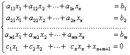&nbsp;&nbsp;&nbsp;&nbsp;&nbsp;&nbsp;&nbsp;&nbsp;&nbsp;&nbsp;&nbsp;&nbsp;&nbsp;&nbsp;&nbsp;&nbsp;&nbsp;&nbsp;&nbsp; (8)</pre><pre
style='text-align:right;line-height:16.0pt' align=right>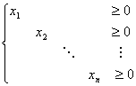&nbsp;&nbsp;&nbsp;&nbsp;&nbsp;&nbsp;&nbsp;&nbsp;&nbsp;&nbsp;&nbsp;&nbsp;&nbsp;&nbsp;&nbsp;&nbsp;&nbsp;&nbsp;&nbsp;&nbsp;&nbsp;&nbsp;&nbsp;&nbsp; &nbsp;&nbsp;&nbsp;&nbsp;&nbsp;&nbsp;&nbsp;&nbsp;&nbsp;&nbsp;&nbsp;&nbsp;&nbsp;&nbsp;(9)</pre>

并且假设所有的.

再定义“多余方程”：

其中

<pre style='text-align:right;line-height:16.0pt' align=right>&nbsp;&nbsp;&nbsp;&nbsp;&nbsp;&nbsp;&nbsp;&nbsp;&nbsp;&nbsp;&nbsp;&nbsp;&nbsp;&nbsp;&nbsp;&nbsp;&nbsp;&nbsp;&nbsp;&nbsp;&nbsp; (10)</pre>

引进人工变量，命，那末可将改进的问题(7)～(9)改写为极大化

<pre style='text-align:right;line-height:16.0pt' align=right>&nbsp;&nbsp;&nbsp;&nbsp;&nbsp;&nbsp;&nbsp;&nbsp;&nbsp;&nbsp;&nbsp;&nbsp;&nbsp;&nbsp;&nbsp;&nbsp;&nbsp;&nbsp;&nbsp;&nbsp;&nbsp;&nbsp;&nbsp;&nbsp;&nbsp;&nbsp;&nbsp;&nbsp;&nbsp;&nbsp;&nbsp;&nbsp;&nbsp;&nbsp;&nbsp;&nbsp;&nbsp;&nbsp;&nbsp;&nbsp;&nbsp; (11)</pre>

满足条件

<pre style='text-align:right;line-height:16.0pt' align=right>&nbsp;&nbsp;&nbsp;&nbsp;&nbsp;&nbsp;&nbsp;&nbsp; (12)</pre><pre
style='text-align:right;line-height:16.0pt' align=right>&nbsp;&nbsp;&nbsp;&nbsp;&nbsp;&nbsp;&nbsp;&nbsp;&nbsp;&nbsp;&nbsp;&nbsp;&nbsp;&nbsp;&nbsp;&nbsp;&nbsp;&nbsp;&nbsp;&nbsp;&nbsp;&nbsp;&nbsp;&nbsp;&nbsp;&nbsp;&nbsp;&nbsp;&nbsp;&nbsp;&nbsp;&nbsp; (13)</pre>

由(10)和(12)有

由于，显然不能是正的.

改进的单纯形法就是通过解改进的线性规划问题(11)～(13)来得到一般的线性规划问题(4)～(6)的解.

从(12)中分离出所需要的系数并排成矩阵如下：

将的诸列矢量记为.

命为矩阵

的前行和列表示初始基底<i>B</i>的逆矩阵.命表示<i>U</i>的第<i>i</i>个行矢量，表示<i>U</i>的变换后的第<i>i</i>个行矢量.

将矩阵<i>U</i>和初始解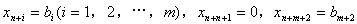排成如表5中初始表的形式.计算步骤如下：

第一阶段&nbsp; 在解中有正值的人工变量时：

(1)&nbsp; 如果，则计算

并进行(2).

如果，则进行第二阶段(1).

表&nbsp;&nbsp; &nbsp;5

<table class=MsoNormalTable border=1 cellspacing=0 cellpadding=0
 style='border-collapse:collapse;border:none'>
 <tr>
  <td width=35 valign=top style='width:26.5pt;border-top:solid windowtext 1.5pt;
  border-left:none;border-bottom:solid windowtext 1.0pt;border-right:solid windowtext 1.0pt;
  padding:0mm 1.4pt 0mm 1.4pt'>
  
&nbsp;
  

  </td>
  <td width=50 valign=top style='width:37.65pt;border-top:solid windowtext 1.5pt;
  border-left:none;border-bottom:solid windowtext 1.0pt;border-right:solid windowtext 1.0pt;
  padding:0mm 1.4pt 0mm 1.4pt'>
  

  </td>
  <td width=84 valign=top style='width:62.75pt;border-top:solid windowtext 1.5pt;
  border-left:none;border-bottom:solid windowtext 1.0pt;border-right:solid windowtext 1.0pt;
  padding:0mm 1.4pt 0mm 1.4pt'>
  
解中变量

  
的标号

  </td>
  <td width=100 valign=top style='width:75.3pt;border-top:solid windowtext 1.5pt;
  border-left:none;border-bottom:solid windowtext 1.0pt;border-right:solid windowtext 1.0pt;
  padding:0mm 1.4pt 0mm 1.4pt'>
  
变量的值

  </td>
  <td width=301 colspan=2 valign=top style='width:225.9pt;border-top:solid windowtext 1.5pt;
  border-left:none;border-bottom:solid windowtext 1.0pt;border-right:solid windowtext 1.0pt;
  padding:0mm 1.4pt 0mm 1.4pt'>
  
矩阵<i>U</i>

  </td>
  <td width=67 valign=top style='width:50.2pt;border-top:solid windowtext 1.5pt;
  border-left:none;border-bottom:solid windowtext 1.0pt;border-right:none;
  padding:0mm 1.4pt 0mm 1.4pt'>
  

  </td>
 </tr>
 <tr>
  <td width=35 valign=top style='width:26.5pt;border:none;border-right:solid windowtext 1.0pt;
  padding:0mm 1.4pt 0mm 1.4pt'>
  
初

  
始

  
表

  </td>
  <td width=50 valign=top style='width:37.65pt;border-top:none;border-left:
  none;border-bottom:solid windowtext 1.0pt;border-right:solid windowtext 1.0pt;
  padding:0mm 1.4pt 0mm 1.4pt'>
  
1

  
2

  

  

  

  

  </td>
  <td width=84 valign=top style='width:62.75pt;border-top:none;border-left:
  none;border-bottom:solid windowtext 1.0pt;border-right:solid windowtext 1.0pt;
  padding:0mm 1.4pt 0mm 1.4pt'>
  

  

  

  

  

  

  </td>
  <td width=100 valign=top style='width:75.3pt;border-top:none;border-left:
  none;border-bottom:solid windowtext 1.0pt;border-right:solid windowtext 1.0pt;
  padding:0mm 1.4pt 0mm 1.4pt'>
  

  

  

  

  

  

  </td>
  <td width=218 valign=top style='width:163.15pt;border-top:none;border-left:
  none;border-bottom:solid windowtext 1.0pt;border-right:solid windowtext 1.0pt;
  padding:0mm 1.4pt 0mm 1.4pt'>
  

  </td>
  <td width=84 valign=top style='width:62.75pt;border-top:none;border-left:
  none;border-bottom:solid windowtext 1.0pt;border-right:solid windowtext 1.0pt;
  padding:0mm 1.4pt 0mm 1.4pt'>
  

  </td>
  <td width=67 valign=top style='width:50.2pt;border:none;border-bottom:solid windowtext 1.0pt;
  padding:0mm 1.4pt 0mm 1.4pt'>
  

  

  

  

  

  

  </td>
 </tr>
 <tr>
  <td width=35 valign=top style='width:26.5pt;border:none;border-right:solid windowtext 1.0pt;
  padding:0mm 1.4pt 0mm 1.4pt'>
  
&nbsp;
  

  </td>
  <td width=50 valign=top style='width:37.65pt;border-top:none;border-left:
  none;border-bottom:solid windowtext 1.0pt;border-right:solid windowtext 1.0pt;
  padding:0mm 1.4pt 0mm 1.4pt'>
  

  

  </td>
  <td width=84 valign=top style='width:62.75pt;border-top:none;border-left:
  none;border-bottom:solid windowtext 1.0pt;border-right:solid windowtext 1.0pt;
  padding:0mm 1.4pt 0mm 1.4pt'>
  

  

  </td>
  <td width=100 valign=top style='width:75.3pt;border-top:none;border-left:
  none;border-bottom:solid windowtext 1.0pt;border-right:solid windowtext 1.0pt;
  padding:0mm 1.4pt 0mm 1.4pt'>
  

  

  </td>
  <td width=218 valign=top style='width:163.15pt;border-top:none;border-left:
  none;border-bottom:solid windowtext 1.0pt;border-right:solid windowtext 1.0pt;
  padding:0mm 1.4pt 0mm 1.4pt'>
  

  </td>
  <td width=84 valign=top style='width:62.75pt;border-top:none;border-left:
  none;border-bottom:solid windowtext 1.0pt;border-right:solid windowtext 1.0pt;
  padding:0mm 1.4pt 0mm 1.4pt'>
  

  </td>
  <td width=67 valign=top style='width:50.2pt;border:none;border-bottom:solid windowtext 1.0pt;
  padding:0mm 1.4pt 0mm 1.4pt'>
  

  

  </td>
 </tr>
 <tr>
  <td width=35 valign=top style='width:26.5pt;border-top:solid windowtext 1.0pt;
  border-left:none;border-bottom:none;border-right:solid windowtext 1.0pt;
  padding:0mm 1.4pt 0mm 1.4pt'>
  
变

  
&nbsp;换

  </td>
  <td width=50 valign=top style='width:37.65pt;border-top:none;border-left:
  none;border-bottom:solid windowtext 1.0pt;border-right:solid windowtext 1.0pt;
  padding:0mm 1.4pt 0mm 1.4pt'>
  
1

  
2

  

  

  

  

  </td>
  <td width=84 valign=top style='width:62.75pt;border-top:none;border-left:
  none;border-bottom:solid windowtext 1.0pt;border-right:solid windowtext 1.0pt;
  padding:0mm 1.4pt 0mm 1.4pt'>
  

  

  

  

  

  

  </td>
  <td width=100 valign=top style='width:75.3pt;border-top:none;border-left:
  none;border-bottom:solid windowtext 1.0pt;border-right:solid windowtext 1.0pt;
  padding:0mm 1.4pt 0mm 1.4pt'>
  

  

  

  

  

  

  </td>
  <td width=218 valign=top style='width:163.15pt;border-top:none;border-left:
  none;border-bottom:solid windowtext 1.0pt;border-right:solid windowtext 1.0pt;
  padding:0mm 1.4pt 0mm 1.4pt'>
  

  </td>
  <td width=84 valign=top style='width:62.75pt;border-top:none;border-left:
  none;border-bottom:solid windowtext 1.0pt;border-right:solid windowtext 1.0pt;
  padding:0mm 1.4pt 0mm 1.4pt'>
  

  </td>
  <td width=67 valign=top style='width:50.2pt;border:none;border-bottom:solid windowtext 1.0pt;
  padding:0mm 1.4pt 0mm 1.4pt'>
  
&nbsp;
  

  </td>
 </tr>
 <tr>
  <td width=35 valign=top style='width:26.5pt;border-top:none;border-left:none;
  border-bottom:solid windowtext 1.5pt;border-right:solid windowtext 1.0pt;
  padding:0mm 1.4pt 0mm 1.4pt'>
  
表

  </td>
  <td width=50 valign=top style='width:37.65pt;border-top:none;border-left:
  none;border-bottom:solid windowtext 1.5pt;border-right:solid windowtext 1.0pt;
  padding:0mm 1.4pt 0mm 1.4pt'>
  

  

  </td>
  <td width=84 valign=top style='width:62.75pt;border-top:none;border-left:
  none;border-bottom:solid windowtext 1.5pt;border-right:solid windowtext 1.0pt;
  padding:0mm 1.4pt 0mm 1.4pt'>
  

  

  </td>
  <td width=100 valign=top style='width:75.3pt;border-top:none;border-left:
  none;border-bottom:solid windowtext 1.5pt;border-right:solid windowtext 1.0pt;
  padding:0mm 1.4pt 0mm 1.4pt'>
  

  

  </td>
  <td width=218 valign=top style='width:163.15pt;border-top:none;border-left:
  none;border-bottom:solid windowtext 1.5pt;border-right:solid windowtext 1.0pt;
  padding:0mm 1.4pt 0mm 1.4pt'>
  

  

  </td>
  <td width=84 valign=top style='width:62.75pt;border-top:none;border-left:
  none;border-bottom:solid windowtext 1.5pt;border-right:solid windowtext 1.0pt;
  padding:0mm 1.4pt 0mm 1.4pt'>
  

  </td>
  <td width=67 valign=top style='width:50.2pt;border:none;border-bottom:solid windowtext 1.5pt;
  padding:0mm 1.4pt 0mm 1.4pt'>
  
&nbsp;
  

  </td>
 </tr>
</table>

(2)如果所有的，那末达到它的极大值，因此问题(7)～(9)不存在可行解.

若至少有一 ，则将对应于

的变量引入解中.若有几个等于极小值，则选择标号最小的.

(3)计算

把对应于

&nbsp;&nbsp; ()

的变量从解中消去.若有几个对应于极小值，则选择标号最小的.

(4)基本可行解中变量的新值由公式

&nbsp; 

&nbsp;

得到.矩阵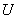的新元素由变换

&nbsp; 

&nbsp;&nbsp;&nbsp;&nbsp;&nbsp;&nbsp;&nbsp;&nbsp;&nbsp;&nbsp;&nbsp;&nbsp;&nbsp;&nbsp;&nbsp;&nbsp;&nbsp;&nbsp;&nbsp;&nbsp;&nbsp;&nbsp;&nbsp;&nbsp;&nbsp;&nbsp;&nbsp;&nbsp;&nbsp;&nbsp;&nbsp;

得到.在这个变换下的第和列不变.

重复以上步骤，直到确定没有可行解存在或者.如果，则进行第二阶段.

第二阶段&nbsp; 在解中无正值的人工变量时：

(1)&nbsp; 此时.计算

&nbsp;()

(2)&nbsp; 如果所有的，那末达到它的极大值，相应的基本可行解是最优解. 是要极小化的目标函数的真值.

如果至少有一个，则将对应于

的变量引入解中.若有几个对应于极小值，则选择标号最小的.

(3)&nbsp; 计算

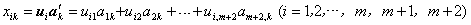

把对应于

&nbsp;&nbsp; ()

的变量从解中消去.若有几个对应于极小值，则选择标号最小的.如果所有的，那末得到一解其对应的目标函数值可以任意大.

(4)&nbsp; 变量的新值由公式

得到.矩阵<i>U</i>的新元素由变换

得到.

重复以上步骤直到确定一个最优解其对应的目标函数值是有限的或者是无限的.

(11)～(13)的初始解和以上步骤可以按表5所安排的计算步骤实现.

注意，若矩阵<i>A</i>的某一列是单位矢量且其对应的价格系数为零（例如某些松驰矢量），则该矢量可作为基底矢量，这样可以避免使用全人工基底减少迭代次数.

例2&nbsp; 极大化

满足条件

和&nbsp;&nbsp;&nbsp;&nbsp;&nbsp;&nbsp;&nbsp;&nbsp;&nbsp;&nbsp;&nbsp;&nbsp;&nbsp;&nbsp;&nbsp;&nbsp;&nbsp;&nbsp;&nbsp;&nbsp;&nbsp;&nbsp;&nbsp;&nbsp;&nbsp;&nbsp;&nbsp;&nbsp;&nbsp;&nbsp;

解&nbsp; 这里.相应的极小化问题的目标函数为

上述问题的全人工基底的改进单纯形法为：极大化满足条件

第4行的前面四个变量的系数等于原来要极小化的目标函数的表达式中的相应的，第5个方程的变量的系数和方程的右端常数项由公式(10)得到.

矩阵和分别为

初始表和相继的迭代过程如表6所示.

表&nbsp;&nbsp;&nbsp;&nbsp;
6

<table class=MsoNormalTable border=1 cellspacing=0 cellpadding=0
 style='border-collapse:collapse;border:none'>
 <tr>
  <td width=35 valign=top style='width:26.5pt;border-top:solid windowtext 1.5pt;
  border-left:none;border-bottom:solid windowtext 1.0pt;border-right:solid windowtext 1.0pt;
  padding:0mm 1.4pt 0mm 1.4pt'>
  
&nbsp;
  

  </td>
  <td width=33 valign=top style='width:25.1pt;border-top:solid windowtext 1.5pt;
  border-left:none;border-bottom:solid windowtext 1.0pt;border-right:solid windowtext 1.0pt;
  padding:0mm 1.4pt 0mm 1.4pt'>
  

  </td>
  <td width=84 valign=top style='width:62.75pt;border-top:solid windowtext 1.5pt;
  border-left:none;border-bottom:solid windowtext 1.0pt;border-right:double windowtext 2.25pt;
  padding:0mm 1.4pt 0mm 1.4pt'>
  
解中变量

  
的标号

  </td>
  <td width=50 valign=top style='width:37.65pt;border-top:solid windowtext 1.5pt;
  border-left:none;border-bottom:solid windowtext 1.0pt;border-right:solid windowtext 1.0pt;
  padding:0mm 1.4pt 0mm 1.4pt'>
  
变量的值

  </td>
  <td width=159 colspan=2 valign=top style='width:119.4pt;border:solid windowtext 1.0pt;
  border-left:none;padding:0mm 1.4pt 0mm 1.4pt'>
  
矩阵

  </td>
  <td width=58 valign=top style='width:43.75pt;border:solid windowtext 1.0pt;
  border-left:none;padding:0mm 1.4pt 0mm 1.4pt'>
  
&nbsp;

  </td>
  <td width=218 valign=top style='width:163.15pt;border:solid windowtext 1.0pt;
  border-left:none;padding:0mm 1.4pt 0mm 1.4pt'>
  
第一阶段

  </td>
 </tr>
 <tr>
  <td width=35 rowspan=2 valign=top style='width:26.5pt;border-top:none;
  border-left:none;border-bottom:solid windowtext 1.0pt;border-right:solid windowtext 1.0pt;
  padding:0mm 1.4pt 0mm 1.4pt'>
  
初

  
始

  
表

  </td>
  <td width=33 valign=top style='width:25.1pt;border-top:none;border-left:none;
  border-bottom:solid windowtext 1.0pt;border-right:solid windowtext 1.0pt;
  padding:0mm 1.4pt 0mm 1.4pt'>
  
1

  
2

  
3

  </td>
  <td width=84 valign=top style='width:62.75pt;border-top:none;border-left:
  none;border-bottom:solid windowtext 1.0pt;border-right:double windowtext 2.25pt;
  padding:0mm 1.4pt 0mm 1.4pt'>
  
5

  
6

  
7

  </td>
  <td width=50 valign=top style='width:37.65pt;border-top:none;border-left:
  none;border-bottom:solid windowtext 1.0pt;border-right:solid windowtext 1.0pt;
  padding:0mm 1.4pt 0mm 1.4pt'>
  
15

  
20

  
10

  </td>
  <td width=111 valign=top style='width:83.4pt;border-top:none;border-left:
  none;border-bottom:solid windowtext 1.0pt;border-right:solid windowtext 1.0pt;
  padding:0mm 1.4pt 0mm 1.4pt'>
  

  </td>
  <td width=48 valign=top style='width:36.0pt;border-top:none;border-left:none;
  border-bottom:solid windowtext 1.0pt;border-right:solid windowtext 1.0pt;
  padding:0mm 1.4pt 0mm 1.4pt'>
  

  </td>
  <td width=58 valign=top style='width:43.75pt;border-top:none;border-left:
  none;border-bottom:solid windowtext 1.0pt;border-right:solid windowtext 1.0pt;
  padding:0mm 1.4pt 0mm 1.4pt'>
  
3

  

  
1

  </td>
  <td width=218 valign=top style='width:163.15pt;border:none;padding:0mm 1.4pt 0mm 1.4pt'>
  
&nbsp;

  
&nbsp;

  </td>
 </tr>
 <tr>
  <td width=33 valign=top style='width:25.1pt;border-top:none;border-left:none;
  border-bottom:solid windowtext 1.0pt;border-right:solid windowtext 1.0pt;
  padding:0mm 1.4pt 0mm 1.4pt'>
  
4

  
5

  </td>
  <td width=84 valign=top style='width:62.75pt;border-top:none;border-left:
  none;border-bottom:solid windowtext 1.0pt;border-right:double windowtext 2.25pt;
  padding:0mm 1.4pt 0mm 1.4pt'>
  
8

  
9

  </td>
  <td width=50 valign=top style='width:37.65pt;border-top:none;border-left:
  none;border-bottom:solid windowtext 1.0pt;border-right:solid windowtext 1.0pt;
  padding:0mm 1.4pt 0mm 1.4pt'>
  
0

  
-45

  </td>
  <td width=111 valign=top style='width:83.4pt;border-top:none;border-left:
  none;border-bottom:solid windowtext 1.0pt;border-right:solid windowtext 1.0pt;
  padding:0mm 1.4pt 0mm 1.4pt'>
  

  </td>
  <td width=48 valign=top style='width:36.0pt;border-top:none;border-left:none;
  border-bottom:solid windowtext 1.0pt;border-right:solid windowtext 1.0pt;
  padding:0mm 1.4pt 0mm 1.4pt'>
  

  </td>
  <td width=58 valign=top style='width:43.75pt;border-top:none;border-left:
  none;border-bottom:solid windowtext 1.0pt;border-right:solid windowtext 1.0pt;
  padding:0mm 1.4pt 0mm 1.4pt'>
  

  </td>
  <td width=218 valign=top style='width:163.15pt;border:none;padding:0mm 1.4pt 0mm 1.4pt'>
  
&nbsp;
  

  </td>
 </tr>
 <tr>
  <td width=35 rowspan=2 valign=top style='width:26.5pt;border-top:none;
  border-left:none;border-bottom:solid windowtext 1.0pt;border-right:solid windowtext 1.0pt;
  padding:0mm 1.4pt 0mm 1.4pt'>
  
第

  
1

  
次

  
迭

  
代

  </td>
  <td width=33 valign=top style='width:25.1pt;border-top:none;border-left:none;
  border-bottom:solid windowtext 1.0pt;border-right:solid windowtext 1.0pt;
  padding:0mm 1.4pt 0mm 1.4pt'>
  
1

  
2

  
3

  </td>
  <td width=84 valign=top style='width:62.75pt;border-top:none;border-left:
  none;border-bottom:solid windowtext 1.0pt;border-right:double windowtext 2.25pt;
  padding:0mm 1.4pt 0mm 1.4pt'>
  
5

  
3

  
7

  </td>
  <td width=50 valign=top style='width:37.65pt;border-top:none;border-left:
  none;border-bottom:solid windowtext 1.0pt;border-right:solid windowtext 1.0pt;
  padding:0mm 1.4pt 0mm 1.4pt'>
  
3

  
4

  
6

  </td>
  <td width=111 valign=top style='width:83.4pt;border-top:none;border-left:
  none;border-bottom:solid windowtext 1.0pt;border-right:solid windowtext 1.0pt;
  padding:0mm 1.4pt 0mm 1.4pt'>
  

  </td>
  <td width=48 valign=top style='width:36.0pt;border-top:none;border-left:none;
  border-bottom:solid windowtext 1.0pt;border-right:solid windowtext 1.0pt;
  padding:0mm 1.4pt 0mm 1.4pt'>
  
0&nbsp; 0

  
0&nbsp; 0

  
0&nbsp; 0

  </td>
  <td width=58 valign=top style='width:43.75pt;border-top:none;border-left:
  none;border-bottom:solid windowtext 1.0pt;border-right:solid windowtext 1.0pt;
  padding:0mm 1.4pt 0mm 1.4pt'>
  

  

  

  </td>
  <td width=218 rowspan=2 valign=top style='width:163.15pt;border:none;
  border-bottom:solid windowtext 1.0pt;padding:0mm 1.4pt 0mm 1.4pt'>
  
&nbsp;

  
&nbsp;

  </td>
 </tr>
 <tr>
  <td width=33 valign=top style='width:25.1pt;border-top:none;border-left:none;
  border-bottom:solid windowtext 1.0pt;border-right:solid windowtext 1.0pt;
  padding:0mm 1.4pt 0mm 1.4pt'>
  
4

  
5

  </td>
  <td width=84 valign=top style='width:62.75pt;border-top:none;border-left:
  none;border-bottom:solid windowtext 1.0pt;border-right:double windowtext 2.25pt;
  padding:0mm 1.4pt 0mm 1.4pt'>
  
8

  
9

  </td>
  <td width=50 valign=top style='width:37.65pt;border-top:none;border-left:
  none;border-bottom:solid windowtext 1.0pt;border-right:solid windowtext 1.0pt;
  padding:0mm 1.4pt 0mm 1.4pt'>
  

  </td>
  <td width=111 valign=top style='width:83.4pt;border-top:none;border-left:
  none;border-bottom:solid windowtext 1.0pt;border-right:solid windowtext 1.0pt;
  padding:0mm 1.4pt 0mm 1.4pt'>
  

  </td>
  <td width=48 valign=top style='width:36.0pt;border-top:none;border-left:none;
  border-bottom:solid windowtext 1.0pt;border-right:solid windowtext 1.0pt;
  padding:0mm 1.4pt 0mm 1.4pt'>
  
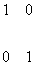

  </td>
  <td width=58 valign=top style='width:43.75pt;border-top:none;border-left:
  none;border-bottom:solid windowtext 1.0pt;border-right:solid windowtext 1.0pt;
  padding:0mm 1.4pt 0mm 1.4pt'>
  

  </td>
 </tr>
 <tr>
  <td width=35 rowspan=2 valign=top style='width:26.5pt;border:none;border-right:
  solid windowtext 1.0pt;padding:0mm 1.4pt 0mm 1.4pt'>
  
第

  
2

  
次

  
迭

  
代

  </td>
  <td width=33 valign=top style='width:25.1pt;border-top:none;border-left:none;
  border-bottom:solid windowtext 1.0pt;border-right:solid windowtext 1.0pt;
  padding:0mm 1.4pt 0mm 1.4pt'>
  
1

  
2

  
3

  </td>
  <td width=84 valign=top style='width:62.75pt;border-top:none;border-left:
  none;border-bottom:solid windowtext 1.0pt;border-right:double windowtext 2.25pt;
  padding:0mm 1.4pt 0mm 1.4pt'>
  
2

  
3

  
7

  </td>
  <td width=50 valign=top style='width:37.65pt;border-top:none;border-left:
  none;border-bottom:solid windowtext 1.0pt;border-right:solid windowtext 1.0pt;
  padding:0mm 1.4pt 0mm 1.4pt'>
  

  </td>
  <td width=111 valign=top style='width:83.4pt;border-top:none;border-left:
  none;border-bottom:solid windowtext 1.0pt;border-right:solid windowtext 1.0pt;
  padding:0mm 1.4pt 0mm 1.4pt'>
  

  </td>
  <td width=48 valign=top style='width:36.0pt;border-top:none;border-left:none;
  border-bottom:solid windowtext 1.0pt;border-right:solid windowtext 1.0pt;
  padding:0mm 1.4pt 0mm 1.4pt'>
  
0&nbsp; 0

  
0&nbsp; 0

  
0&nbsp; 0

  </td>
  <td width=58 valign=top style='width:43.75pt;border-top:none;border-left:
  none;border-bottom:solid windowtext 1.0pt;border-right:solid windowtext 1.0pt;
  padding:0mm 1.4pt 0mm 1.4pt'>
  
0

  
0

  

  </td>
  <td width=218 valign=top style='width:163.15pt;border:none;padding:0mm 1.4pt 0mm 1.4pt'>
  
&nbsp;

  
&nbsp;

  </td>
 </tr>
 <tr style='mso-row-'>
  <td width=33 valign=top style='width:25.1pt;border-top:none;border-left:none;
  border-bottom:solid windowtext 1.0pt;border-right:solid windowtext 1.0pt;
  padding:0mm 1.4pt 0mm 1.4pt'>
  
4

  
5

  </td>
  <td width=84 valign=top style='width:62.75pt;border-top:none;border-left:
  none;border-bottom:solid windowtext 1.0pt;border-right:double windowtext 2.25pt;
  padding:0mm 1.4pt 0mm 1.4pt'>
  
8

  
9

  </td>
  <td width=50 valign=top style='width:37.65pt;border-top:none;border-left:
  none;border-bottom:solid windowtext 1.0pt;border-right:solid windowtext 1.0pt;
  padding:0mm 1.4pt 0mm 1.4pt'>
  
+15

  

  </td>
  <td width=111 valign=top style='width:83.4pt;border-top:none;border-left:
  none;border-bottom:solid windowtext 1.0pt;border-right:solid windowtext 1.0pt;
  padding:0mm 1.4pt 0mm 1.4pt'>
  

  </td>
  <td width=48 valign=top style='width:36.0pt;border-top:none;border-left:none;
  border-bottom:solid windowtext 1.0pt;border-right:solid windowtext 1.0pt;
  padding:0mm 1.4pt 0mm 1.4pt'>
  

  </td>
  <td width=58 valign=top style='width:43.75pt;border-top:none;border-left:
  none;border-bottom:solid windowtext 1.0pt;border-right:solid windowtext 1.0pt;
  padding:0mm 1.4pt 0mm 1.4pt'>
  

  </td>
  <td style='border:none;border-bottom:solid windowtext 1.0pt' width=218>
&nbsp;</td>
 </tr>
 <tr>
  <td width=35 rowspan=2 valign=top style='width:26.5pt;border-top:solid windowtext 1.0pt;
  border-left:none;border-bottom:none;border-right:solid windowtext 1.0pt;
  padding:0mm 1.4pt 0mm 1.4pt'>
  
第

  
3

  
次

  
迭

  
代

  </td>
  <td width=33 valign=top style='width:25.1pt;border:none;border-right:solid windowtext 1.0pt;
  padding:0mm 1.4pt 0mm 1.4pt'>
  
1

  
2

  
3

  </td>
  <td width=84 valign=top style='width:62.75pt;border:none;border-right:double windowtext 2.25pt;
  padding:0mm 1.4pt 0mm 1.4pt'>
  
2

  
3

  
7

  </td>
  <td width=50 valign=top style='width:37.65pt;border:none;border-right:solid windowtext 1.0pt;
  padding:0mm 1.4pt 0mm 1.4pt'>
  

  </td>
  <td width=111 valign=top style='width:83.4pt;border-top:none;border-left:
  none;border-bottom:solid windowtext 1.0pt;border-right:solid windowtext 1.0pt;
  padding:0mm 1.4pt 0mm 1.4pt'>
  

  </td>
  <td width=48 valign=top style='width:36.0pt;border-top:none;border-left:none;
  border-bottom:solid windowtext 1.0pt;border-right:solid windowtext 1.0pt;
  padding:0mm 1.4pt 0mm 1.4pt'>
  
0&nbsp; 0

  
0&nbsp; 0

  
0&nbsp; 0

  </td>
  <td width=58 valign=top style='width:43.75pt;border-top:none;border-left:
  none;border-bottom:solid windowtext 1.0pt;border-right:solid windowtext 1.0pt;
  padding:0mm 1.4pt 0mm 1.4pt'>
  

  </td>
  <td width=218 valign=top style='width:163.15pt;border:none;padding:0mm 1.4pt 0mm 1.4pt'>
  
&nbsp;

  
&nbsp;

  </td>
 </tr>
 <tr>
  <td width=33 valign=top style='width:25.1pt;border:solid windowtext 1.0pt;
  border-left:none;padding:0mm 1.4pt 0mm 1.4pt'>
  
4

  
5

  </td>
  <td width=84 valign=top style='width:62.75pt;border-top:solid windowtext 1.0pt;
  border-left:none;border-bottom:solid windowtext 1.0pt;border-right:double windowtext 2.25pt;
  padding:0mm 1.4pt 0mm 1.4pt'>
  
8

  
9

  </td>
  <td width=50 valign=top style='width:37.65pt;border:solid windowtext 1.0pt;
  border-left:none;padding:0mm 1.4pt 0mm 1.4pt'>
  
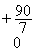

  </td>
  <td width=111 valign=top style='width:83.4pt;border-top:none;border-left:
  none;border-bottom:solid windowtext 1.0pt;border-right:solid windowtext 1.0pt;
  padding:0mm 1.4pt 0mm 1.4pt'>
  
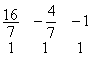

  </td>
  <td width=48 valign=top style='width:36.0pt;border-top:none;border-left:none;
  border-bottom:solid windowtext 1.0pt;border-right:solid windowtext 1.0pt;
  padding:0mm 1.4pt 0mm 1.4pt'>
  

  </td>
  <td width=58 valign=top style='width:43.75pt;border-top:none;border-left:
  none;border-bottom:solid windowtext 1.0pt;border-right:solid windowtext 1.0pt;
  padding:0mm 1.4pt 0mm 1.4pt'>
  
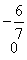

  </td>
  <td width=218 valign=top style='width:163.15pt;border:none;padding:0mm 1.4pt 0mm 1.4pt'>
  
&nbsp;

  </td>
 </tr>
 <tr>
  <td width=35 rowspan=2 valign=top style='width:26.5pt;border-top:solid windowtext 1.0pt;
  border-left:none;border-bottom:solid windowtext 1.5pt;border-right:solid windowtext 1.0pt;
  padding:0mm 1.4pt 0mm 1.4pt'>
  
第

  
4

  
次

  
迭

  
代

  </td>
  <td width=33 valign=top style='width:25.1pt;border:none;border-right:solid windowtext 1.0pt;
  padding:0mm 1.4pt 0mm 1.4pt'>
  
1

  
2

  
3

  </td>
  <td width=84 valign=top style='width:62.75pt;border:none;border-right:double windowtext 2.25pt;
  padding:0mm 1.4pt 0mm 1.4pt'>
  
2

  
3

  
1

  </td>
  <td width=50 valign=top style='width:37.65pt;border:none;border-right:solid windowtext 1.0pt;
  padding:0mm 1.4pt 0mm 1.4pt'>
  

  </td>
  <td width=111 valign=top style='width:83.4pt;border-top:none;border-left:
  none;border-bottom:solid windowtext 1.0pt;border-right:solid windowtext 1.0pt;
  padding:0mm 1.4pt 0mm 1.4pt'>
  

  </td>
  <td width=48 valign=top style='width:36.0pt;border-top:none;border-left:none;
  border-bottom:solid windowtext 1.0pt;border-right:solid windowtext 1.0pt;
  padding:0mm 1.4pt 0mm 1.4pt'>
  
0&nbsp; 0

  
0&nbsp; 0

  
0&nbsp; 0

  </td>
  <td width=58 valign=top style='width:43.75pt;border-top:none;border-left:
  none;border-bottom:solid windowtext 1.0pt;border-right:solid windowtext 1.0pt;
  padding:0mm 1.4pt 0mm 1.4pt'>
  
&nbsp;
  

  </td>
  <td width=218 valign=top style='width:163.15pt;border:none;border-top:solid windowtext 1.0pt;
  padding:0mm 1.4pt 0mm 1.4pt'>
  
&nbsp;&nbsp; 所有的&nbsp; 

  
&nbsp;最优解

  
&nbsp;

  </td>
 </tr>
 <tr>
  <td width=33 valign=top style='width:25.1pt;border-top:solid windowtext 1.0pt;
  border-left:none;border-bottom:solid windowtext 1.5pt;border-right:solid windowtext 1.0pt;
  padding:0mm 1.4pt 0mm 1.4pt'>
  

  </td>
  <td width=84 valign=top style='width:62.75pt;border-top:solid windowtext 1.0pt;
  border-left:none;border-bottom:solid windowtext 1.5pt;border-right:double windowtext 2.25pt;
  padding:0mm 1.4pt 0mm 1.4pt'>
  

  </td>
  <td width=50 valign=top style='width:37.65pt;border-top:solid windowtext 1.0pt;
  border-left:none;border-bottom:solid windowtext 1.5pt;border-right:solid windowtext 1.0pt;
  padding:0mm 1.4pt 0mm 1.4pt'>
  

  </td>
  <td width=111 valign=top style='width:83.4pt;border-top:none;border-left:
  none;border-bottom:solid windowtext 1.0pt;border-right:solid windowtext 1.0pt;
  padding:0mm 1.4pt 0mm 1.4pt'>
  

  </td>
  <td width=48 valign=top style='width:36.0pt;border-top:none;border-left:none;
  border-bottom:solid windowtext 1.0pt;border-right:solid windowtext 1.0pt;
  padding:0mm 1.4pt 0mm 1.4pt'>
  

  </td>
  <td width=58 valign=top style='width:43.75pt;border-top:none;border-left:
  none;border-bottom:solid windowtext 1.0pt;border-right:solid windowtext 1.0pt;
  padding:0mm 1.4pt 0mm 1.4pt'>
  
&nbsp;
  

  </td>
  <td width=218 valign=top style='width:163.15pt;border:none;border-bottom:
  solid windowtext 1.5pt;padding:0mm 1.4pt 0mm 1.4pt'>
  
&nbsp;目标函数的值：

  </td>
 </tr>
</table>

[拉格朗日乘数法]&nbsp; （见第五章§3，十）将条件极值问题化为无条件极值问题后可以利用§2和§3无条件极值问题的解法求解.

[惩罚函数法（SUMT方法）]

&nbsp; 外点法（SUMT方法之一）&nbsp; 考虑一般形式的条件极值问题

<pre style='text-align:right;line-height:16.0pt' align=right>&nbsp;&nbsp;&nbsp;&nbsp;&nbsp;&nbsp;&nbsp;&nbsp;&nbsp;&nbsp;&nbsp;&nbsp;&nbsp;&nbsp;&nbsp;&nbsp;&nbsp;&nbsp;&nbsp;&nbsp;&nbsp;&nbsp;&nbsp;&nbsp;&nbsp;&nbsp;&nbsp;&nbsp;&nbsp;&nbsp;&nbsp;&nbsp;&nbsp;&nbsp;&nbsp;&nbsp; (14)</pre>

其中

而为定义在上的连续函数.其迭代程序如下：

(1)&nbsp; 选取（例如取），预先给定的允许误差为，令.

(2)&nbsp; 求无条件极值问题的最优解：

其中

(3)&nbsp; 若存在某，满足

则取（例如或5），令，进行(2)；否则就得到条件极值问题(14)的最优解的近似解.

&nbsp; 内点法（SUMT方法之二）&nbsp; 考虑一般形式的条件极值问题

<pre style='text-align:right;line-height:16.0pt' align=right>&nbsp;&nbsp;&nbsp;&nbsp;&nbsp;&nbsp; &nbsp;&nbsp;&nbsp;&nbsp;&nbsp;&nbsp;&nbsp;&nbsp;&nbsp;&nbsp;&nbsp;&nbsp;&nbsp;&nbsp;&nbsp;&nbsp;&nbsp;&nbsp;&nbsp;&nbsp;&nbsp;&nbsp;&nbsp;&nbsp;(15)</pre>

其中

且

(表示空集)，而为定义在上的具有一阶连续偏导数的函数，其迭代程序如下：

(1)&nbsp; 选取（例如取），预先给定的允许误差为.

(2)&nbsp; 求的内点，令.

(3)&nbsp; 以作为初始点，对在保持可行性的情况下，使用求解无条件极值问题的方法求解：

其中

或

(4)&nbsp; 当取时，检验是否满足判别准则：

而当取时，检验是否满足判别准则：

若满足判别准则，则得到条件极值问题(15)的最优解的近似解；否则，取（例如或5），令，进行(3).

附：内点求法

设

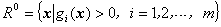

其中是定义在集合上的连续函数.

所谓求内点就是求出一点，其迭代程序如下：

(1)&nbsp; 任取一点 ，及数（例如），令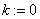.

(2)&nbsp; 求出集合及：

(3)&nbsp; 若，则得到内点，否则，进行(4).

(4)&nbsp; 在保持对集合的可行性的情况下极小化，即

其中

&nbsp;&nbsp;&nbsp; (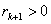)

设为上述问题的最优解的近似解.

(5)&nbsp; 取（例如，或5），令，进行(2).

