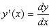
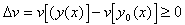

<b>§</b><b>5&nbsp; </b><b>变 分 法</b>

一.泛函的变分与泛函的极值

[类函数与曲线的邻域]&nbsp; 有连续导数的函数称为类函数，有阶连续导数的函数称为类函数.

曲线的邻域是指在整个区间内满足不等式

的一切可能的曲线，这时称曲线与曲线有零级接近度.如果此外还满足不等式：，则称曲线与曲线有一级接近度，其中.

[泛函]&nbsp; 如果对某一类函数中的每个函数，有一个的值与之对应，那末变量称为依赖于函数的泛函，记作.

[函数的变分]&nbsp; 所谓泛函的变量的变分是指两个函数间的差：，其中是与属于同一函数类的某一函数.

[泛函的变分]&nbsp; 如果泛函的改变量

可以表为如下的形式

其中对来说是线性的，且当时，，那末称为泛函的变分，记作.并有

[泛函的极值]若泛函在与接近的任一曲线上的值不小于，即时，则泛函在曲线上达到极小值.类似地可以定义极大值.

如果具有变分的泛函在上达到极小（极大）值,则在上有

泛函的极值问题就是寻求函数，使泛函的值达到最小（或最大）.

对于依赖于多个未知函数的泛函

<i>v</i>[<i>y</i>1(<i>x</i>), <i>y</i>2(<i>x</i>),
&frac14; ,<i>y</i>n(<i>x</i>)]

和依赖于多变量的一个或多个函数的泛函

<i>v</i>[<i>z</i>(<i>x</i>1,<i>x</i>2,
&frac14; ,<i>x</i>n)]

或&nbsp;&nbsp;&nbsp;&nbsp;&nbsp;
<i>v</i>[<i>z</i>1(<i>x</i>1,<i>x</i>2,
&frac14; ,<i>x</i>n),
<i>z</i>2(<i>x</i>1,<i>x</i>2, &frac14; ,<i>x</i>n),
&frac14; ,<i>z</i>n(<i>x</i>1,<i>x</i>2,
&frac14; ,<i>x</i>n)]

有类似的说法.

