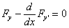
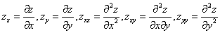

二.不动边界的泛函的极值·欧拉方程

欧拉方程是泛函极值的必要条件，但不是充分的.在处理实际泛函极值问题时，一般不去考虑充分条件，而是从实际问题的性质出发，间接地判断泛函极值的存在性，直接利用欧拉方程来求出极值曲线.

&nbsp;
假设<i>F</i>是二阶可微分的，函数<i>y</i>(<i>x</i>)是属于<i>C</i>2类的函数，并满足边界条件

<i>y</i>(<i>x</i>0)=<i>y</i>0,&nbsp;&nbsp;
<i>y</i>(<i>x</i>1)=<i>y</i>1

极值曲线<i>y</i>(<i>x</i>)必须满足下面的微分方程（欧拉方程）

或

这是二阶微分方程，它的通解含有两个任意常数，由两个边界条件来确定.因此是一个两点边值问题.

1°&nbsp; 欧拉方程的可积类型

<table class=MsoNormalTable border=1 cellspacing=0 cellpadding=0
 style='border-collapse:collapse;border:none'>
 <tr>
  <td width=327 valign=top style='width:245.4pt;border:solid windowtext 1.0pt;
  border-left:none;padding:0mm 5.4pt 0mm 5.4pt'>
  
被&nbsp; 积&nbsp; 函&nbsp; 数&nbsp; <i>F</i>

  </td>
  <td width=320 valign=top style='width:240.0pt;border-top:solid windowtext 1.0pt;
  border-left:none;border-bottom:solid windowtext 1.0pt;border-right:none;
  padding:0mm 5.4pt 0mm 5.4pt'>
  
欧&nbsp; 拉&nbsp; 方&nbsp; 程

  </td>
 </tr>
 <tr>
  <td width=327 valign=top style='width:245.4pt;border-top:none;border-left:
  none;border-bottom:solid windowtext 1.0pt;border-right:solid windowtext 1.0pt;
  padding:0mm 5.4pt 0mm 5.4pt'>
  
<i>F</i>不依赖于:&nbsp;&nbsp;&nbsp;&nbsp;&nbsp;&nbsp;&nbsp;
  

  </td>
  <td width=320 valign=top style='width:240.0pt;border:none;border-bottom:solid windowtext 1.0pt;
  padding:0mm 5.4pt 0mm 5.4pt'>
  
&nbsp;&nbsp;&nbsp;
  

  </td>
 </tr>
 <tr>
  <td width=327 valign=top style='width:245.4pt;border-top:none;border-left:
  none;border-bottom:solid windowtext 1.0pt;border-right:solid windowtext 1.0pt;
  padding:0mm 5.4pt 0mm 5.4pt'>
  
<i>F</i>关于是线性的:

  
&nbsp;&nbsp;&nbsp;
  

  </td>
  <td width=320 valign=top style='width:240.0pt;border:none;border-bottom:solid windowtext 1.0pt;
  padding:0mm 5.4pt 0mm 5.4pt'>
  
&nbsp;&nbsp;&nbsp;
  

  </td>
 </tr>
 <tr>
  <td width=327 valign=top style='width:245.4pt;border-top:none;border-left:
  none;border-bottom:solid windowtext 1.0pt;border-right:solid windowtext 1.0pt;
  padding:0mm 5.4pt 0mm 5.4pt'>
  
<i>F</i>只依赖于:

  </td>
  <td width=320 valign=top style='width:240.0pt;border:none;border-bottom:solid windowtext 1.0pt;
  padding:0mm 5.4pt 0mm 5.4pt'>
  
&nbsp;&nbsp;&nbsp;
  

  </td>
 </tr>
 <tr>
  <td width=327 valign=top style='width:245.4pt;border-top:none;border-left:
  none;border-bottom:solid windowtext 1.0pt;border-right:solid windowtext 1.0pt;
  padding:0mm 5.4pt 0mm 5.4pt'>
  
<i>F</i>依赖于<i>x</i>和:&nbsp;&nbsp;&nbsp;&nbsp;&nbsp;
  

  </td>
  <td width=320 valign=top style='width:240.0pt;border:none;border-bottom:solid windowtext 1.0pt;
  padding:0mm 5.4pt 0mm 5.4pt'>
  
&nbsp;&nbsp;&nbsp;
  

  </td>
 </tr>
 <tr>
  <td width=327 valign=top style='width:245.4pt;border-top:none;border-left:
  none;border-bottom:solid windowtext 1.0pt;border-right:solid windowtext 1.0pt;
  padding:0mm 5.4pt 0mm 5.4pt'>
  
<i>F</i>只依赖于<i>y</i>和:&nbsp;&nbsp;&nbsp;
  

  </td>
  <td width=320 valign=top style='width:240.0pt;border:none;border-bottom:solid windowtext 1.0pt;
  padding:0mm 5.4pt 0mm 5.4pt'>
  
&nbsp;&nbsp;&nbsp;
  

  </td>
 </tr>
</table>

2°&nbsp; 极坐标系中的欧拉方程

<table class=MsoNormalTable border=1 cellspacing=0 cellpadding=0
 style='border-collapse:collapse;border:none'>
 <tr>
  <td width=327 valign=top style='width:245.4pt;border:solid windowtext 1.0pt;
  border-left:none;padding:0mm 5.4pt 0mm 5.4pt'>
  
泛&nbsp;&nbsp;&nbsp;&nbsp;&nbsp;&nbsp;&nbsp; 函

  </td>
  <td width=320 valign=top style='width:240.0pt;border-top:solid windowtext 1.0pt;
  border-left:none;border-bottom:solid windowtext 1.0pt;border-right:none;
  padding:0mm 5.4pt 0mm 5.4pt'>
  
欧&nbsp; 拉&nbsp; 方&nbsp; 程

  </td>
 </tr>
 <tr>
  <td width=327 valign=top style='width:245.4pt;border-top:none;border-left:
  none;border-bottom:solid windowtext 1.0pt;border-right:solid windowtext 1.0pt;
  padding:0mm 5.4pt 0mm 5.4pt'>
  
&nbsp;&nbsp;&nbsp;
  

  </td>
  <td width=320 valign=top style='width:240.0pt;border:none;border-bottom:solid windowtext 1.0pt;
  padding:0mm 5.4pt 0mm 5.4pt'>
  
&nbsp;&nbsp;&nbsp;
  

  </td>
 </tr>
 <tr>
  <td width=327 valign=top style='width:245.4pt;border-top:none;border-left:
  none;border-bottom:solid windowtext 1.0pt;border-right:solid windowtext 1.0pt;
  padding:0mm 5.4pt 0mm 5.4pt'>
  
&nbsp;&nbsp;&nbsp;
  

  </td>
  <td width=320 valign=top style='width:240.0pt;border:none;border-bottom:solid windowtext 1.0pt;
  padding:0mm 5.4pt 0mm 5.4pt'>
  
&nbsp;&nbsp;&nbsp;
  

  </td>
 </tr>
</table>

&nbsp;&nbsp;&nbsp;
&nbsp;&nbsp;设函数

满足2<i>n</i>个边界条件：

欧拉方程为

假定其中出现的函数<i>yi</i>都是连续的，函数属于<i>C</i>2类，这个二阶微分方程组在空间中确定一族含有2<i>n</i>个参数的积分曲线，2<i>n</i>个参数应当由上面的2<i>n</i>个边界条件确定.

&nbsp; 假定<i>F</i>是<i>n</i>+2阶可微分的，函数<i>y</i>(<i>x</i>)属于<i>C</i>2<i>n</i>类，边界条件为

欧拉方程为

这个方程的通解含有2<i>n</i>个任意常数，这些常数一般可以由上面的2<i>n</i>个边界条件确定.

[多重积分的极值] 

1°&nbsp; 型的泛函

假定函数<i>F</i>是三阶可微的，函数是二阶可微的，函数在区域<i>D</i>的边界<i>C</i>上的值是给定的，欧拉方程为

式中.这是一个二阶偏微分方程.

2°&nbsp; 型的泛函

欧拉方程为

式中

3°&nbsp; 型的泛函

欧拉方程为

式中&nbsp;&nbsp;&nbsp; 

[用参数表示的泛函的极值]&nbsp; 考虑形如

的泛函，其中积分号下的函数不明显地含有自变量<i>t</i>，而且是对于及的一次齐次函数，即

那末不管对参数<i>t</i>作任何替换，积分的形式总不改变.对于参数<i>t</i>的任何选择，函数及应满足两个欧拉方程的方程组:

这些方程不明显地含有参数本身.但两个欧拉方程不是独立的，其中一个可由另一个推出.要想找出极值曲线，只要从两个欧拉方程中拿出一个来，把它跟确定参数的那个方程一起求积分.例如，若选择曲线弧长<i>s</i>作为参数，确定参数的方程为.

