

三.可动边界的泛函的极值

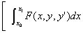型泛函的可动边界问题

&nbsp;&nbsp; &nbsp;&nbsp;1°&nbsp; 若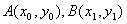两端点分别在曲线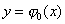和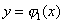上变动，则使泛函达到极值的函数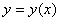，除必须满足欧拉方程

外，其端点还必须满足所谓横截条件

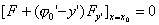

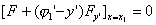

2°&nbsp; 若两点所在曲线以隐函数形式给出：

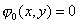

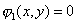

其中有连续的偏导数，且

,&nbsp;&nbsp;&nbsp; 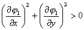

则横截条件为

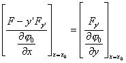

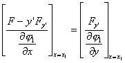

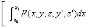型泛函的可动边界问题

&nbsp;1°&nbsp; 若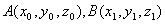两端点分别在曲线

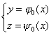&nbsp; 和&nbsp;
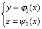

上变动，则使泛函达到极值的函数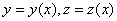，除必须满足欧拉方程

&nbsp; 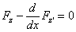

外，其端点还必须满足横截条件

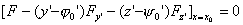

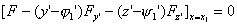

2°&nbsp; 若分别在曲面

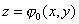&nbsp; 和&nbsp; 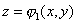

上变动，则横截条件为

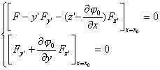

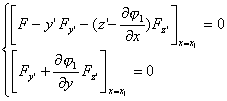

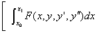型泛函的可动边界问题

1°&nbsp; 若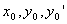之间满足关系

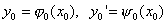

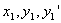之间满足关系

则使泛函达到极值的函数，除必须满足欧拉方程

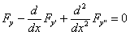

外，其端点还必须满足横截条件

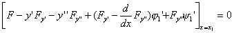

2°&nbsp; 如果满足关系式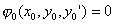,满足关系式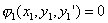，则横截条件为

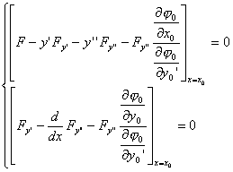&nbsp;&nbsp;&nbsp;&nbsp;&nbsp; 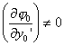

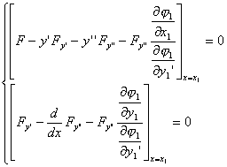&nbsp;&nbsp;&nbsp;&nbsp;&nbsp; 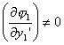

