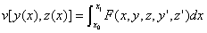
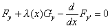
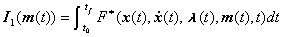
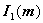
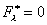
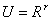

四.条件极值问题

[拉格朗日乘数法]&nbsp; 现考虑最简单的条件极值问题：求两个函数及，使泛函

达到极值，且满足附加条件

及固定端点的边界条件

（端点()及()显然应满足附加条件）.

这个问题的解法与第五章§3所介绍的关于多变量函数的条件极值的拉格朗日乘数法相仿.作辅助函数

式中是<i>x</i>的一个待定函数，把上述条件极值问题化为以为被积函数的泛函

的无条件极值问题，这样就得到欧拉方程

或

将欧拉方程和约束方程一起消去及一个待求函数（例如<i>z</i>），于是得到含一个函数的二阶微分方程，它积分的两个任意常数由两个边界条件确定.

[等周问题] 在使积分

等于已知常数<i>a</i>和满足边界条件

的一切曲线中，确定这样一条曲线，使泛函

达到极值.这个问题称为等周问题.解法如下：

构造辅助函数

式中是一个待定常数，把上述条件极值问题化为以<i>H</i>为被积函数的泛函

的无条件极值问题，这样就得到欧拉方程

这个方程的通积分含有三个任意常数，即两个积分常数及常数.这些常数由两个边界条件及等周条件确定.但要注意只有当所得曲线不是等周条件中的积分

的极值曲线时才是等周问题的解答.

[连续动态系统的最佳控制] 设控制系统的状态方程为

<pre style='text-align:right;line-height:12.0pt' align=right>&nbsp;&nbsp;&nbsp;&nbsp;&nbsp;&nbsp;&nbsp;&nbsp;&nbsp;&nbsp;&nbsp;&nbsp;&nbsp;&nbsp;&nbsp;&nbsp;&nbsp;&nbsp;&nbsp;&nbsp;&nbsp;&nbsp;&nbsp;&nbsp;&nbsp;&nbsp;&nbsp;&nbsp;&nbsp;&nbsp;&nbsp;&nbsp;&nbsp;&nbsp;&nbsp;&nbsp;&nbsp;&nbsp; (1)</pre>

式中<b><i>x</i></b>是一个<i>n</i>维的状态矢量，<b><i>m</i></b>是<i>r</i>维的控制矢量，<b><i>f</i></b>是一个可微分的<i>n</i>维矢函数，初始条件为

<pre style='text-align:right;line-height:12.0pt' align=right>&nbsp;&nbsp;&nbsp;&nbsp;&nbsp;&nbsp;&nbsp;&nbsp;&nbsp;&nbsp;&nbsp;&nbsp;&nbsp;&nbsp;&nbsp;&nbsp;&nbsp;&nbsp;&nbsp;&nbsp;&nbsp;&nbsp;&nbsp;&nbsp;&nbsp;&nbsp;&nbsp;&nbsp;&nbsp;&nbsp;&nbsp;&nbsp;&nbsp;&nbsp;&nbsp;&nbsp;&nbsp;&nbsp;&nbsp;&nbsp;&nbsp; (2)</pre>

系统的性能指标为

<pre style='text-align:right;line-height:12.0pt' align=right>&nbsp;&nbsp;&nbsp;&nbsp;&nbsp;&nbsp;&nbsp;&nbsp;&nbsp;&nbsp;&nbsp;&nbsp;&nbsp;&nbsp;&nbsp;&nbsp;&nbsp;&nbsp;&nbsp;&nbsp;&nbsp;&nbsp;&nbsp;&nbsp;&nbsp;&nbsp;&nbsp; (3)</pre>

最优控制的目的是要求确定控制矢量在满足约束条件(1),(2)下，使性能指标(3)取极小值.这是一个条件极值问题.

作辅助函数

式中 为拉格朗日乘数因子，是一个<i>n</i>维列矢量.问题化为泛函

的无条件极值问题，由此得到,,和使泛函取取极值所要满足的必要条件：

(i)&nbsp;&nbsp;&nbsp;&nbsp;&nbsp;&nbsp;&nbsp;&nbsp;&nbsp;&nbsp;&nbsp;&nbsp;
(i)&nbsp;&nbsp;&nbsp;&nbsp;&nbsp;&nbsp;&nbsp;&nbsp;&nbsp;&nbsp;&nbsp;&nbsp;&nbsp;
&nbsp;&nbsp;&nbsp;&nbsp;&nbsp;&nbsp;&nbsp;&nbsp;&nbsp;&nbsp;&nbsp;&nbsp;&nbsp;&nbsp;&nbsp;&nbsp;&nbsp;&nbsp;&nbsp;(控制方程)

(ii)&nbsp;&nbsp;&nbsp;&nbsp;&nbsp;&nbsp;&nbsp;&nbsp;&nbsp;&nbsp;
(ii)&nbsp;&nbsp;&nbsp;&nbsp;&nbsp;&nbsp;&nbsp;&nbsp;&nbsp;&nbsp;&nbsp; &nbsp;&nbsp;&nbsp;&nbsp;&nbsp;&nbsp;&nbsp;&nbsp;&nbsp;&nbsp;&nbsp;&nbsp;&nbsp;&nbsp;&nbsp;&nbsp;&nbsp;&nbsp;&nbsp;(状态方程)

(iii)&nbsp;&nbsp;&nbsp;&nbsp;&nbsp;&nbsp;&nbsp;&nbsp;&nbsp;
(iii)&nbsp;&nbsp;&nbsp;&nbsp;&nbsp;&nbsp;&nbsp;&nbsp;&nbsp;&nbsp; &nbsp;&nbsp;&nbsp;&nbsp;&nbsp;&nbsp;&nbsp;&nbsp;&nbsp;&nbsp;&nbsp;&nbsp;&nbsp;(欧拉方程)

(iv)&nbsp;&nbsp;&nbsp;&nbsp;&nbsp;&nbsp;&nbsp;&nbsp;
(iv)&nbsp;&nbsp;&nbsp;&nbsp;&nbsp;&nbsp;&nbsp;&nbsp;&nbsp; &nbsp;&nbsp;&nbsp;&nbsp;&nbsp;&nbsp;&nbsp;&nbsp;&nbsp;&nbsp;&nbsp;&nbsp;&nbsp;&nbsp;&nbsp;(横截条件)

式中是定义在区间[]上的任意矢函数.这样就把问题归结为求解常微分方程组的两点边值问题,这种问题的解析解仅在特殊情形才存在，由于所得到的欧拉微分方程通常是非线性的，一般采用“试凑法”求解.

说明&nbsp;&nbsp; 利用变分法进行控制系统的最优设计时，一般对控制矢量都不加限制,即只考虑控制矢量所属的控制域或者是开集，但在实际问题中，<i>U</i>常为有界集，而且最佳控制的值会出现在<i>U</i>的边界上，这是利用变分法进行控制系统的最优控制时除遇到两点边值问题外的另一个困难.

