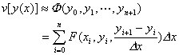
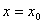

五.变分问题的直接方法

[欧拉有限差分法]&nbsp; 考虑泛函

的极值，边界条件为

其步骤如下：

(1)&nbsp;&nbsp;&nbsp;&nbsp;
(1)&nbsp;&nbsp;&nbsp;&nbsp;&nbsp; 将积分区间分成<i>n</i>+1等份（图18.11）,分点为

又.这时

式中

(2)&nbsp;&nbsp;&nbsp;&nbsp;
(2)&nbsp;&nbsp;&nbsp;&nbsp;&nbsp; 选取使函数达到极值，也就是由方程组

来确定.如果从这个方程组难于确定时，也可用本章§2,§3的方法.于是可以用所得到的折线表示变分问题的近似解.

区间[<i>a</i>,<i>b</i>]分得愈细所得近似解就愈精确.

[里兹法]&nbsp; 考虑泛函

的极值，边界条件为

其步骤如下：

(1)&nbsp;&nbsp;&nbsp;&nbsp;
(1)&nbsp;&nbsp;&nbsp;&nbsp;&nbsp; 选择一适当的函数序列（称为坐标函数）：

构造函数

式中为待定常数.将的近似值代入泛函的表达式，则

(2)&nbsp;&nbsp;&nbsp;&nbsp;
(2)&nbsp;&nbsp;&nbsp;&nbsp;&nbsp; 选取,使函数达到极值，也就是由方程组

来确定.如果从这个方程组难于确定时，也可用本章§2,§3的方法.于是可以得到变分问题的近似解.

当<i>n</i>越大时所得近似解就愈精确.

里兹方法也适用于泛函和依赖于多个函数的泛函.

例&nbsp;
求泛函

的极值，其中积分域<i>D</i>为椭圆.

解&nbsp; 
只取一个坐标函数<i>xy</i>，则得

, 

这时从

得到

而极值问题的近似解为

[康特罗维奇法]&nbsp; 考虑泛函

<pre style='text-align:right;line-height:12.0pt' align=right>&nbsp;&nbsp;&nbsp;&nbsp;&nbsp;&nbsp;&nbsp;&nbsp;&nbsp;&nbsp;&nbsp;&nbsp;&nbsp;&nbsp;&nbsp;&nbsp; (1)</pre>

的极值，它展布在由二曲线,和二直线所围成的区域<i>D</i>上(图18.12).设在区域<i>D</i>的边界上函数的值<i>z</i>(<i>x</i>, <i>y</i>)已经给出.其步骤如下：

(1)&nbsp;&nbsp;&nbsp;&nbsp;
(1)&nbsp;&nbsp;&nbsp;&nbsp;&nbsp; 选取坐标函数序列：

构造函数

式中是待定函数.将<i>z</i>(<i>x</i>, <i>y</i>)的近似表达式

代入(1)式得

即

(2)&nbsp;&nbsp;&nbsp;&nbsp;
(2)&nbsp;&nbsp;&nbsp;&nbsp;&nbsp; 选取函数使泛函达到极值，也就是由欧拉方程

来确定.而任意常数的选取是使在直线和上满足所给的边界条件.于是可以得到变分问题的近似解.

康特罗维奇法也适用于其他形式的泛函.

说明&nbsp;&nbsp; 一般说来，用同样的坐标函数以及相同的项数<i>m</i>，康特罗维奇法比里兹法精确.因为以变量为系数的函数类

较之以常数为系数的函数类

更为广阔.

