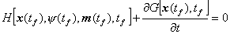
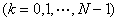

<b>§</b><b>6&nbsp; </b><b>最小（大）值原理</b>

[连续系统的最小（大）值原理] 考虑一控制系统其状态方程为

<pre style='text-align:right' align=right>&nbsp;&nbsp;&nbsp;&nbsp;&nbsp;&nbsp;&nbsp;&nbsp;&nbsp;&nbsp;&nbsp;&nbsp;&nbsp;&nbsp;&nbsp;&nbsp;&nbsp;&nbsp;&nbsp;&nbsp;&nbsp;&nbsp;&nbsp;&nbsp;&nbsp;&nbsp;&nbsp;&nbsp;&nbsp;&nbsp;&nbsp;&nbsp;&nbsp;&nbsp;&nbsp;&nbsp; (1)</pre>

并满足初始条件

<pre style='text-align:right' align=right>&nbsp;&nbsp;&nbsp;&nbsp;&nbsp;&nbsp;&nbsp;&nbsp;&nbsp;&nbsp;&nbsp;&nbsp;&nbsp;&nbsp;&nbsp;&nbsp;&nbsp;&nbsp;&nbsp;&nbsp;&nbsp;&nbsp;&nbsp;&nbsp;&nbsp;&nbsp;&nbsp;&nbsp;&nbsp;&nbsp;&nbsp;&nbsp;&nbsp;&nbsp;&nbsp;&nbsp;&nbsp;&nbsp; (2)</pre>

至于终止状态则或者是自由的，或者是满足目标集

<pre style='text-align:right' align=right>&nbsp;&nbsp;&nbsp;&nbsp;&nbsp;&nbsp;&nbsp;&nbsp;&nbsp;&nbsp;&nbsp;&nbsp;&nbsp;&nbsp;&nbsp;&nbsp;&nbsp;&nbsp;&nbsp;&nbsp;&nbsp;&nbsp;&nbsp;&nbsp;&nbsp;&nbsp;&nbsp;&nbsp;&nbsp;&nbsp;&nbsp;&nbsp;&nbsp;&nbsp;&nbsp;&nbsp; (3)</pre>

性能指标为

<pre style='text-align:right' align=right>&nbsp;&nbsp;&nbsp;&nbsp;&nbsp;&nbsp;&nbsp;&nbsp;&nbsp;&nbsp;&nbsp;&nbsp;&nbsp;&nbsp;&nbsp;&nbsp;&nbsp;&nbsp;&nbsp;&nbsp;&nbsp;&nbsp;&nbsp; (4)</pre>

式中<b><i>x</i></b>和<b><i>m</i></b>分别是状态矢量和控制矢量：

是<i>n</i>维矢函数，<b><i>R</i></b>是<i>m</i>维矢函数。

假设,,<i>G</i>(<b><i>x</i></b>,<i>t</i>),<b><i>R</i></b>(<b><i>x</i></b>,<i>t</i>)都是其变元的连续函数，对<b><i>x</i></b>连续可微，并且有界。

假设控制矢量<b><i>m</i></b>(<i>t</i>)是容许控制，即满足下列条件：

(i)&nbsp;&nbsp;&nbsp;&nbsp;&nbsp;&nbsp;&nbsp;&nbsp;&nbsp;&nbsp;&nbsp;&nbsp;
(i)&nbsp;&nbsp;&nbsp;&nbsp;&nbsp;&nbsp;&nbsp;&nbsp;&nbsp;&nbsp;&nbsp;&nbsp;&nbsp;
<b><i>m</i></b>(<i>t</i>)是在闭区间[<i>t</i>0,
<i>tf</i>]上的分段连续函数（即只有有限个第一类间断点，在间断点处，假定是左连续的）；

(ii)&nbsp;&nbsp;&nbsp;&nbsp;&nbsp;&nbsp;&nbsp;&nbsp;&nbsp;&nbsp;
(ii)&nbsp;&nbsp;&nbsp;&nbsp;&nbsp;&nbsp;&nbsp;&nbsp;&nbsp;&nbsp;&nbsp; <b><i>m</i></b>(<i>t</i>)在端点<i>t</i>0, <i>tf</i>处是连续的；

(iii)&nbsp;&nbsp;&nbsp;&nbsp;&nbsp;&nbsp;&nbsp;&nbsp;&nbsp;
(iii)&nbsp;&nbsp;&nbsp;&nbsp;&nbsp;&nbsp;&nbsp;&nbsp;&nbsp;&nbsp; <b><i></i></b>这里<i>U</i>是<i>R r</i>中的有界闭集。

问题的提法&nbsp; 假设上面的(1),(2),(3),(4)式均已给定，要求从容许控制中求出一个控制，它使系统(1)满足初始条件(2)的轨线，在终止时刻<i>tf</i>时达到目标集(3)，并使性能指标(4)取极小值（或极大值）。

为此引进协态变量（相对于状态变量而言）。

它满足微分方程组

<pre style='text-align:right' align=right>&nbsp;&nbsp;&nbsp;&nbsp;&nbsp;&nbsp;&nbsp;&nbsp;&nbsp;&nbsp;&nbsp;&nbsp;&nbsp;&nbsp;&nbsp; (5)</pre>

作辅助函数

<pre style='text-align:right' align=right>&nbsp;&nbsp;&nbsp;&nbsp;&nbsp;&nbsp;&nbsp;&nbsp;&nbsp;&nbsp;&nbsp;&nbsp;&nbsp;&nbsp;&nbsp;&nbsp;&nbsp;&nbsp;&nbsp;&nbsp;&nbsp;&nbsp;&nbsp;&nbsp; (6)</pre>

称为系统(1)的哈密顿函数。这时可把方程组(1)和(5)表示为下面的形式：

<pre style='text-align:right' align=right>&nbsp;&nbsp;&nbsp;&nbsp;&nbsp;&nbsp;&nbsp;&nbsp;&nbsp;&nbsp;&nbsp;&nbsp;&nbsp;&nbsp;&nbsp;&nbsp;&nbsp;&nbsp;&nbsp;&nbsp;&nbsp;&nbsp;&nbsp;&nbsp; (7)</pre>

称为哈密顿方程组或正则方程组。则有

最小值原理&nbsp; 如果是上面所提问题的最优控制，,是正则方程组(7)对应于的最优轨线和最优协态变量，则有

于是可按下列步骤求解：

(1)&nbsp; 写出哈密顿函数和正则方程组。

(2)&nbsp; 对求哈密顿函数的最小值，找出关系式：

<pre style='text-align:right' align=right>&nbsp;&nbsp;&nbsp;&nbsp;&nbsp;&nbsp;&nbsp;&nbsp;&nbsp;&nbsp;&nbsp;&nbsp;&nbsp;&nbsp;&nbsp;&nbsp;&nbsp;&nbsp;&nbsp;&nbsp;&nbsp;&nbsp;&nbsp;&nbsp;&nbsp;&nbsp;&nbsp; （8）</pre>

(3)&nbsp; 把关系式(8)代入正则方程组，根据下述边界条件，对正则方程组求解两点边值问题，即可求出最优轨线和最优协态变量：

(i)&nbsp; 假设方程组(1)已给初始条件和终止条件(目标集)，则正则方程组(7)的边界条件为：

, 

(ii)&nbsp; 假设是给定的，没有给定目标集(3)，即是自由的，则正则方程组(7)的边界条件为：

,

其中是性能指标(4)中的第一项。若，这时边界条件变为

,

(iii)&nbsp; 假设是给定的，而终止状态满足目标集

并假定是维的，其中，则正则方程组(7)的边界条件为

,

其中是一个维待定的常值列矢量。以上共有个边界条件。

其次，假定不固定，而是自由的。这时相当于边界条件中多了一个独立参数，因此要补充一个关系式。对于边界条件为(i)，(ii)的情形，补充的关系式为

对于边界条件为(iii)的情形，补充的关系式为

(4)&nbsp; 将求出的,代入关系式(8)，就可求得最优控制。

以上步骤也可根据问题的性质，灵活应用。

对最大值原理有类似的说法。

说明&nbsp; 最小(大)值原理描述控制系统最佳性的必要条件，它给出一个确定最优控制的方法。这一原理是由古典变分法引伸出来的。它可以推出变分法中熟知的一切必要条件，但是，它与古典变分法相比较，这一原理的主要优越性在于，它适用于任何集合，特别它包含是有界闭集的情形，而古典变方法只适用于为开集或的情形，因此这可以说是控制域类的扩充。但它和变分法一样都遇到两点边值问题的困难。

[离散系统的最小(大)值原理]&nbsp; 考虑一离散型控制系统(图18。13)其状态方程为

<pre style='text-align:right' align=right>&nbsp;&nbsp;&nbsp;&nbsp;&nbsp;&nbsp; &nbsp;&nbsp;&nbsp;&nbsp;&nbsp;&nbsp;&nbsp;&nbsp;&nbsp;&nbsp;&nbsp;&nbsp;&nbsp;&nbsp;&nbsp;&nbsp;&nbsp;&nbsp;&nbsp;(1)</pre>

并满足初始条件

<pre style='text-align:right' align=right>&nbsp;&nbsp;&nbsp;&nbsp;&nbsp;&nbsp;&nbsp;&nbsp;&nbsp;&nbsp;&nbsp;&nbsp;&nbsp;&nbsp;&nbsp;&nbsp;&nbsp;&nbsp;&nbsp;&nbsp;&nbsp;&nbsp;&nbsp;&nbsp;&nbsp;&nbsp;&nbsp;&nbsp;&nbsp;&nbsp;&nbsp;&nbsp;&nbsp;&nbsp;&nbsp; (2)</pre>

终止状态是自由的，性能指标为

<pre style='text-align:right' align=right>&nbsp;&nbsp;&nbsp;&nbsp;&nbsp;&nbsp;&nbsp;&nbsp;&nbsp;&nbsp;&nbsp;&nbsp;&nbsp;&nbsp;&nbsp;&nbsp;&nbsp;&nbsp;&nbsp;&nbsp;&nbsp;&nbsp;&nbsp;&nbsp;&nbsp;&nbsp;&nbsp;&nbsp; (3)</pre>

式中,分别为系统对应于时刻的状态矢量和控制矢量，他们分别是维和维矢量。

问题的提法&nbsp; 寻求个控制矢量满足初始条件(2)，使性能指标取极小(大)值。

处理方法和连续情形相仿。引进的协态变量，它是维列矢量。构造哈密顿函数

<pre>&nbsp;&nbsp;&nbsp;&nbsp;&nbsp;&nbsp;&nbsp;&nbsp;&nbsp;&nbsp;&nbsp;&nbsp;&nbsp;&nbsp;&nbsp;&nbsp;&nbsp;&nbsp;&nbsp;&nbsp;&nbsp;&nbsp;&nbsp;&nbsp; </pre><pre style='text-align:right'
align=right>&nbsp;&nbsp;&nbsp;&nbsp;&nbsp;&nbsp;&nbsp;&nbsp;&nbsp;&nbsp;&nbsp;&nbsp;&nbsp;&nbsp;&nbsp;&nbsp;&nbsp;&nbsp;&nbsp;&nbsp;&nbsp;&nbsp;&nbsp;&nbsp;&nbsp;(4)</pre>

这时有正则方程组

<pre style='text-align:right' align=right>,即 &nbsp;&nbsp;&nbsp;&nbsp;&nbsp;&nbsp;&nbsp;&nbsp;&nbsp;&nbsp;&nbsp;&nbsp;&nbsp;&nbsp;&nbsp;&nbsp;&nbsp;(5)</pre><pre style='text-align:right' align=right>,即&nbsp;&nbsp;&nbsp;&nbsp;&nbsp;&nbsp;&nbsp;&nbsp;&nbsp;&nbsp;&nbsp;&nbsp;&nbsp;&nbsp;&nbsp;&nbsp;&nbsp;&nbsp;&nbsp;&nbsp; (6)</pre>

离散型的最小值原理&nbsp; 设为最优控制，为相应的最优轨线，为相应的最优协态变量，则它们满足正则方程(5)，(6)和下列条件下之一：

(i)&nbsp; ,即

(ii) &nbsp;

同时，满足边界条件(若是预先给定的，则不要这条件)

&nbsp;(当时，)

于是可按下列步骤求解：

(1)&nbsp;&nbsp;&nbsp;&nbsp;
(1)&nbsp; 写出哈密顿函数(4)和正则方程(5)，(6)。

(2)&nbsp;&nbsp;&nbsp;&nbsp;
(2)&nbsp; 固定，,对哈密顿函数应用最小值原理的条件(i)或(ii)，求出关系式

<pre style='text-align:right' align=right>&nbsp;&nbsp;&nbsp;&nbsp;&nbsp;&nbsp;&nbsp;&nbsp;&nbsp;&nbsp;&nbsp;&nbsp;&nbsp;&nbsp;&nbsp;&nbsp;&nbsp;&nbsp;&nbsp;&nbsp;&nbsp;&nbsp; (7)</pre>

(3)&nbsp;&nbsp;&nbsp;&nbsp;
(3)&nbsp; 将关系式(7)代入正则方程组(5)，(6)中，并利用条件

,

把问题化为解方程组的两点边值问题。由此可以求出和。

(4)&nbsp;&nbsp;&nbsp;&nbsp;
(4)&nbsp; 将求出的，代入(7)，就得到最优控制。

说明&nbsp; 离散系统的最小(大)值原理除某些特殊情形外不存在。参考G。S。G。Beveridge and
R。S。Schechter, <i>Opiimization: Theory and Practice</i><i>。</i> 1970, Mc
Graw-Hill, Inc。, 第257－258页。

