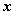
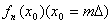
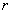
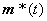
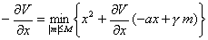
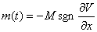

<b>§</b><b>7</b><b>&nbsp; </b><b>动 态 规 划</b>

[最优化原则]&nbsp; 一个过程的最优策略具有以下性质，即无论其初始状态和初始决策如何，其今后各决策对以第一个决策所形成的状态作为初始状态的过程而言，必须构成最优策略。

[多阶段决策过程]&nbsp; 命为状态矢量，描述物理系统在任何时刻的状态，设状态向量是维列矢量。对阶段决策过程：系统的状态先由变换，从变到，得到一个输出或效益，然后由变换从变到，得到一个输出或效益最后由变换从变到，得到一个输出或效益，问题是选择一个阶段策略

使总效率

为最大。阶段过程的最大总效益显然只是初始状态与阶段长度的函数，用表示

决定的策略称为最优策略或最优控制策略。

最优化原则描述了最优控制策略的基本性质，它是建立在不变嵌入原则的基本概念上的。这个概念表示解一个特殊的最优决策问题时，可以把原来的问题嵌入一类较容易解的类似问题之中。对多阶段决策过程就可以将原来的多阶段最优化问题以解一单个阶段决策序列的问题来代替，这无疑是比较容易处理的。

根据最优化原则，阶段决策过程的总效益可以写成

上式右端的第一项是初始效益，而第二项则代表最后个阶段的最大效益。那末最大总效益为

这个方程对都成立。但当时最大效益为

显然，应用基本原则，那末阶段决策过程就变为一个个单阶段决策过程的序列，因此使这个最优化问题可以在系统的迭代方式下得到解决。

[离散动态系统的最优控制]&nbsp; 设有一离散动态系统，其状态差分方程为

&nbsp;&nbsp;&nbsp;

初始条件为

其中为维状态矢量，为维控制矢量，为维矢函数。假定和满足约束条件<i>C </i>: <i>m</i>维矢函数的每个分量小于或等于零。系统的性能指标（或目标函数）为

问题是要决定一个控制序列，当将及相应的代入目标函数时使达到最小（或最大）值。

这是一个<i>N</i>阶段决策过程(图18。14)，目标函数的最小值必为初始状态和阶段长

度<i>N</i>的函数，如果把它记作则

根据最优化原则可将上式写成

式中

这是一个函数方程，可以递推求解，每次都是求一个的最优解，其求解步骤如下：

(1)&nbsp;&nbsp;&nbsp;&nbsp;
(1)&nbsp;&nbsp;&nbsp;&nbsp;&nbsp;&nbsp;&nbsp;&nbsp;&nbsp;&nbsp;&nbsp;&nbsp;&nbsp;
令

(2)&nbsp;&nbsp;&nbsp;&nbsp;
(2)&nbsp;&nbsp;&nbsp;&nbsp;&nbsp;&nbsp;&nbsp;&nbsp;&nbsp;&nbsp;&nbsp;&nbsp;&nbsp;
对任一个，由

式中,求出使的右端取最小值的则

(3)&nbsp;&nbsp;&nbsp;&nbsp;
(3)&nbsp;&nbsp;&nbsp;&nbsp;&nbsp;&nbsp;&nbsp;&nbsp;&nbsp;&nbsp;&nbsp;&nbsp;&nbsp;
对任一个，由

式中&nbsp;&nbsp;&nbsp;&nbsp;&nbsp;&nbsp;&nbsp;&nbsp;

求出使上式右端取最小值的,则

(4)&nbsp;&nbsp;&nbsp;&nbsp;
(4)&nbsp;&nbsp;&nbsp;&nbsp;&nbsp;&nbsp;&nbsp;&nbsp;&nbsp;&nbsp;&nbsp;&nbsp;&nbsp;
一般地，如果已经算出，则对任一,

由

式中 ,可求出使上式的右端为极小的，由此得

(5)&nbsp;&nbsp;&nbsp;&nbsp;
(5)&nbsp;&nbsp;&nbsp;&nbsp;&nbsp;&nbsp;&nbsp;&nbsp;&nbsp;&nbsp;&nbsp;&nbsp;&nbsp;
重复步骤(4),由一直算到为止。这样，便可算出最优策略和目标函数的最优值。

[分配问题]&nbsp; 设有一定数量的某种资源可用于<i>n</i>种生产，如以数量应用于第<i>i</i>种生产，则相应的收入为，问应如何分配此资源于这<i>n</i>种生产使总收入最大？

问题的数学模型是

求满足

且使

取最大值。

这是一个规划问题，当都是线性函数时，它是个线性规划问题，否则它是一个非线性规划问题。当<i>n</i>比较大时，具体求解是比较麻烦的。

对问题进行动态处理。令表示以数量<i>x</i>分配于前<i>k</i>种生产所得到的最大总收入，利用最优化原则，得

当函数有某些特性时，例如都是线性函数或凸函数，则可不太困难地求出的表达式，但当比较复杂时，是需从上面的递推公式利用计算机对不同的<i>x</i>值与<i>k</i>值将逐步算出。由于当<i>x</i>在连续变动时不可能对所有的<i>x</i>求出，可以令,然后对每个在所有这些点上算出的值，并且在计算时上式中的也只取这些值。因此便成为

其中。在具体问题中的大小应根据最优解所要求的精确度、计算机的容量、容许计算的时间与各方面的经验而定。

由上面的递推关系式，先求出。然后递推出直至。从中决定最优决策;从决定出从决定直至，则,即为所求的最优分配量，是相应的最大总收入。

这种做法可以看作是将一个连续模型用离散模型代替。

[连续型的动态规划方法]&nbsp; 以下考虑连续动态系统的最优控制。

设有一由矢量微分方程

描述的阶控制过程，其中是一个维状态矢量，是维控制矢量，是一个可微维矢函数，始终条件为

目标函数为

其中是一个可微数量函数。

这里的问题是：寻求控制量和对应的状态矢量目标函数取最小值(或最大值)。

命&nbsp;&nbsp;&nbsp;&nbsp;&nbsp;&nbsp;&nbsp;&nbsp;&nbsp;&nbsp;&nbsp;&nbsp;&nbsp;&nbsp;&nbsp;&nbsp;&nbsp;&nbsp;&nbsp;&nbsp;&nbsp;

其中在区间上变换，极小是对所有取的。应用最优化原则得到函数方程

当时，函数方程变为

从此得出下列两个微分方程

<pre>&nbsp;&nbsp;&nbsp;&nbsp;&nbsp;&nbsp;&nbsp;&nbsp;&nbsp;&nbsp;&nbsp;&nbsp;&nbsp;&nbsp;&nbsp;&nbsp;&nbsp;&nbsp;&nbsp;&nbsp;&nbsp;&nbsp;&nbsp;&nbsp;&nbsp;&nbsp;&nbsp;&nbsp;&nbsp;&nbsp;&nbsp; </pre>

由此可以决定最优控制矢量。

例&nbsp; 考虑由

描述的一阶控制过程，其中和为正常数，控制信号受条件

约束，决定使目标函数

为极小的最优控制信号。

解&nbsp; 命&nbsp;&nbsp;&nbsp;&nbsp;&nbsp;&nbsp;&nbsp;&nbsp;&nbsp;&nbsp;&nbsp;&nbsp;&nbsp;&nbsp;&nbsp;&nbsp;&nbsp;&nbsp;&nbsp;&nbsp;&nbsp;&nbsp;

那末函数方程为

如果&nbsp;&nbsp;&nbsp;&nbsp;&nbsp;&nbsp;&nbsp;&nbsp;&nbsp;&nbsp;&nbsp;&nbsp;&nbsp;&nbsp;&nbsp;&nbsp;&nbsp;&nbsp;&nbsp;&nbsp;&nbsp;&nbsp;&nbsp;&nbsp;&nbsp;&nbsp;&nbsp;&nbsp;&nbsp;&nbsp;

即最优控制按的符号切换于和之间，则从函数方程可知花括号中的函数是极小的。因为

所以由下面的偏微分方程的解来决定：

这可用数值方程求解。

说明&nbsp; 动态规划的函数方程方法提供了一个获得最优化问题的解的计算方法，它不依赖于偏微分方程的解，因此克服了两点边值问题的困难，但对高维多阶段决策过程，计算中需要很大的存贮量，因此在各种情况下，还需要利用各种不同的最优化技巧(如§1~§4的直接方法和数值方法)以及各种不同的计算方法(如降维法)，甚至有时需要用观察或猜测来得到函数方程的解。

