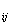
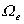

第十九章&nbsp;&nbsp;&nbsp;&nbsp;&nbsp;&nbsp;&nbsp;&nbsp;&nbsp;&nbsp;&nbsp;&nbsp;&nbsp;&nbsp;&nbsp;&nbsp;&nbsp;&nbsp;&nbsp;&nbsp;&nbsp;&nbsp;&nbsp;&nbsp;&nbsp;&nbsp;&nbsp;&nbsp;&nbsp;&nbsp;&nbsp;&nbsp;&nbsp;&nbsp;&nbsp;&nbsp;&nbsp;&nbsp;
<b>第十九章</b><b>&nbsp;&nbsp;&nbsp;&nbsp;&nbsp;&nbsp;&nbsp;&nbsp;
</b><b>有限元法</b>

有限元法是一套求解微分方程的系统化数值计算方法，它比传统解法具有理论完整可靠，物理意义直观明确，解题效能强等优点.特别是由于这种方法适应性强，形式单纯、规范，所以近年来在电子计算机的配合下，已推广应用到很多工程技术部门和某些科学领域.

本章是从应用的角度来介绍有限元法的基本知识，首先通过典型的位移法阐述有限元法的一般原理与解算过程，然后叙述了剖分单元的技巧，最后介绍与有限元法有关的弹性力学问题.

&nbsp; 本章常用符号规定如下(括号内为力学术语或释例):

&nbsp;&nbsp;&nbsp;
<i>Ω</i>,表示区域及其边界.

&nbsp;&nbsp;&nbsp;
表示区域<i>Ω</i>的单元及其边界.

<i>&nbsp;&nbsp;&nbsp;
</i>表示单元的第<i>i</i>个顶点，简记作节点<i>i</i>.

&nbsp;&nbsp;&nbsp;
<b><i></i></b>&nbsp;表示系数(刚度)矩阵.

&nbsp;&nbsp;&nbsp;
()表示单元的系数(刚度)矩阵.

&nbsp;&nbsp;&nbsp;
(<i>x</i><i>，y</i><i>，z</i>)表示总体的直角坐标.

&nbsp;&nbsp;&nbsp;
(）表示单元的局部坐标.

&nbsp;&nbsp;&nbsp;
(<i></i><i>，</i><i>，</i>），（<i></i><i>，</i><i>，</i><i>，</i>）等表示单元的自然坐标.

<i>&nbsp;&nbsp;&nbsp;
</i>(<i>x</i><i>，y</i><i>，</i>)表示节点<i>i</i>的直角坐标.

&nbsp;&nbsp;&nbsp;
(<i>u</i><i>，v</i><i>，w</i>）表示一组待定函数（分别为沿<i>x</i><i>，y</i><i>，z</i>方向的位移分量），其列矢量表示为<b><i>u</i></b> .

&nbsp;&nbsp;&nbsp;
(<i>u</i><i>，v</i><i>，w</i>)表示（<i>u</i><i>，v</i><i>，w</i>）在单元上的插值函数，其列矢量表示为<b><i>u</i></b><b></b><b>.</b>

&nbsp;&nbsp;&nbsp; (<i>u</i><i>，v</i><i>，w</i>）表示节点<i>i</i>的函数（位移）值.

&nbsp;&nbsp;&nbsp;
{<i>u</i><i>，v</i><i>，w</i>}表示节点<i>i</i>的一组参数值，即函数直到某阶导数在节点<i>i</i> 上的值按一定次序排成的

列矢量{<b><i>u</i></b>}.例如

&nbsp;&nbsp;&nbsp;
{<b><i>u</i></b>}= {<i>u</i><i>，v</i><i>，w</i>}=（<i>u </i><i>，u</i><i>， u </i><i>，u </i><i>，v </i><i>，v</i><i>， v </i><i>，v </i><i>，w </i><i>，w</i><i>， w </i><i>，w</i>） 式中<i>τ</i>表示转置.

&nbsp;&nbsp;&nbsp;
{<i>u</i><i>，v</i><i>，w</i>}<i></i>表示{<i>u</i><i>，v</i><i>，w</i>}按单元的节点序号排成的列矢量，表示为{<b><i>u</i></b>}<i></i>.

&nbsp;&nbsp;&nbsp;
等表示单元的型函数.

&nbsp;&nbsp;&nbsp; {<i>R</i>}表示<i>n</i>次多项式中含变量<i>x</i><i>，y</i><i>，z</i>各项按一定次序排成的列矢量，并以表示其中第<i>k</i>个分量.例如二元二次多项式

&nbsp;&nbsp;&nbsp;&nbsp; 

&nbsp;&nbsp;&nbsp; {}表示<i>n</i>次多项式中各项相应的系数排成的列矢量，并以表示其中第<i>k</i>个分量.例如对于{}，

{}=

&nbsp;&nbsp;&nbsp; {<i>f</i><i>，g</i><i>，h</i>}表示与节点参数相对应的一组已知函数及其导数在节点<i>i</i> 上的值排成的列矢量.

&nbsp;&nbsp;&nbsp; {<i>f</i><i>，g</i><i>，h</i>}表示{<i>f</i><i>，g</i><i>，h</i>}按单元的节点序号排成的列矢量.

&nbsp;&nbsp;&nbsp;
,或放在定义或公式之后表示其中函数<i>u</i>，<i>v</i><i>，w</i>，变量<i>x</i><i>，y</i><i>，z</i>或下标<i>i</i><i>，j</i><i>，k</i>作循环替换后，该定义或公式仍然成立.

<i>x</i>=<i>x</i>-<i>xj</i>，,

&nbsp;&nbsp;&nbsp;
表示积分（一维，二维或三维）.

&nbsp;&nbsp;&nbsp; diag<i>Φ</i>表示对角线分块矩阵

（<i>Φ</i>为矩阵，0表示其余元素为0）

<b>§</b><b>1&nbsp; </b><b>一般原理与解算步骤</b>

&nbsp;一、变分原理与有限元法

&nbsp;&nbsp;&nbsp;
许多物理、力学问题既可以化为微分方程的定解问题，也可以归结为变分问题，即某物理量的极值问题.相应的变分原理（如能量原理）指出两种问题是等价的.对于前者可采用差分法近似求解；对于后者可采用一种直接解法（能量法）.两种方法各有利弊.有限元法正是吸取它们的特点而发展起来的一种新解法.

&nbsp;&nbsp;&nbsp;
在变分问题中，物理量一般可表示为待定函数（如位移函数，温度分布）及其导数的积分式.对其积分区域<i>Ω</i>，可仿照差分法的离散化办法（依一定方式划分网格并取节点）把它划分为有限个子区域.（在这里正由于积分表达式代替了定解问题的微分表达式，其区域的划分比差分法中网格的划分要灵活得多）如可取单元为三角形、四边形、四面体、甚至是曲边的）.待定函数及其导数在子区域的某些节点上的数值，称为节点参数值，显然它是待定的.这些节点的选取也比差分法自由.另一方面，再参考直接解法的逼近方式（一般取一类解析函数的线性组合作为近似解，其系数是待定的），而采用在各个内解析的插值函数（一般取多项式，其次数视计算的精度而定，其系数基本上由节点参数值来确定）来逼近.只要适当扩大节点参数值的范围，一般就能满足对插值函数的光滑性与精度的要求.这一点又比直接解法中选取满足一定边界条件的解析函数类来得自由而易于实现.

总之，有限元法是以变分原理为基础吸取差分格式的思想而发展起来的一种有效的数值解法，它把求解无限自由度的待定函数归结为求解有限个自由度（<i>Ω</i>中待定节点参数值的总个数）的待定值问题.具有按一定分布形式的节点及其一定类型的节点参数值的子区域称为单元.

