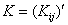

二、在弹性力学问题上的应用（位移法）

&nbsp;&nbsp;&nbsp;
弹性体<i>Ω</i>在荷载<b><i>f</i></b>（作用于<i>Ω</i>内的体力），<b><i>q</i></b>（作用于边界上的面力）等作用下引起小变形，其变形能可表示为

式中{<i>ε</i>}，{<i>σ</i>}分别表示应变、应力各分量排成的列矢量（§5），它们与位移<b><i>u</i></b>的线性关系形式上可写成

{<i>ε</i>}=<i>B<b>u</b></i>&nbsp;&nbsp;&nbsp; {<i>σ</i>}=<i>DB<b>u</b></i>

<i>B</i>是微分算子矩阵，<i>D</i>是与弹性系数<i>E</i>,<i></i>有关的对称矩阵，视问题的性质而定.于是，弹性体的总势能即变形能与外力势能之和，为<b><i>u</i></b>的二次泛函：

最小势能原理指出，对满足边界上一定约束条件的所有位移中，以保持力的平衡状态的位移所造成的总势能达到最小值.利用矩阵<i>D</i>的对称性，可知位移函数<b><i>u</i></b>就是变分方程

的解,把<i>Ω</i>划分为有限个单元，其节点<i>i</i>的参数值为{<b><i>u</i></b>}，并假定在上<b><i>u</i></b>（各分量）的插值函数可表示为同类型的多项式：

<pre style='text-align:right' align=right>&nbsp;&nbsp;&nbsp;&nbsp;&nbsp;&nbsp;&nbsp;&nbsp;&nbsp;&nbsp; &nbsp;&nbsp;&nbsp;&nbsp;&nbsp;&nbsp;&nbsp;&nbsp;&nbsp;&nbsp;&nbsp;&nbsp;&nbsp;&nbsp;&nbsp;&nbsp;&nbsp;&nbsp;&nbsp;&nbsp;&nbsp;&nbsp;&nbsp;&nbsp;&nbsp;&nbsp;&nbsp;&nbsp;&nbsp;&nbsp;&nbsp; &nbsp;&nbsp;（1）</pre>

它称为位移模式，式中表示对单元的各节点求和，为坐标变量的多项式，随单元的形状与插值的方式而定（即§2~§4中所列的各种型函数），而对角线分块矩阵的行、列数与<i>u</i>的分量个数有关，例如，对空间问题

为33<i>r</i>（<i>r</i>表示每个分量的节点参数值的个数）矩阵.

&nbsp;&nbsp;&nbsp;
把（1）代入，得

&nbsp;&nbsp; &nbsp;

<pre>&nbsp;&nbsp;&nbsp;&nbsp;&nbsp;&nbsp;&nbsp;&nbsp;&nbsp;&nbsp;&nbsp;&nbsp;&nbsp;&nbsp;&nbsp;&nbsp;&nbsp;&nbsp;&nbsp; </pre><pre style='text-align:right'
align=right>&nbsp;&nbsp;&nbsp;&nbsp;&nbsp;&nbsp;&nbsp;&nbsp;&nbsp;&nbsp;&nbsp;&nbsp;&nbsp;&nbsp;&nbsp;&nbsp;&nbsp;&nbsp;&nbsp;&nbsp;&nbsp;&nbsp;&nbsp;&nbsp;&nbsp;&nbsp;&nbsp;&nbsp;&nbsp;&nbsp;&nbsp;&nbsp;&nbsp;&nbsp;&nbsp;&nbsp;&nbsp;&nbsp;&nbsp;&nbsp;(2)</pre>

设

<pre style='text-align:right' align=right>&nbsp;&nbsp;&nbsp;&nbsp;&nbsp;&nbsp;&nbsp;&nbsp;&nbsp;&nbsp;&nbsp; &nbsp;&nbsp;&nbsp;&nbsp;&nbsp;&nbsp;&nbsp;&nbsp;&nbsp;&nbsp;&nbsp;&nbsp;&nbsp;&nbsp;&nbsp; &nbsp;&nbsp;&nbsp;(3)</pre><pre
style='text-align:right' align=right>&nbsp;&nbsp;&nbsp;&nbsp;&nbsp;&nbsp;&nbsp;&nbsp;&nbsp;&nbsp;&nbsp;&nbsp;&nbsp;&nbsp;&nbsp;&nbsp;&nbsp;&nbsp;&nbsp;&nbsp;&nbsp;&nbsp;&nbsp;&nbsp;&nbsp;&nbsp;&nbsp;&nbsp;&nbsp;&nbsp;&nbsp;&nbsp; &nbsp;&nbsp;&nbsp;&nbsp;&nbsp;&nbsp;&nbsp;&nbsp; &nbsp;&nbsp;&nbsp;&nbsp;&nbsp;&nbsp;&nbsp;&nbsp;&nbsp;&nbsp;&nbsp;&nbsp;&nbsp;&nbsp;&nbsp;&nbsp;&nbsp;&nbsp;&nbsp;&nbsp;&nbsp;&nbsp; &nbsp;(4)</pre><pre
style='text-align:right' align=right>&nbsp;&nbsp;&nbsp;&nbsp;&nbsp;&nbsp;&nbsp;&nbsp;&nbsp;&nbsp;&nbsp;&nbsp;&nbsp;&nbsp;&nbsp;&nbsp;&nbsp;&nbsp;&nbsp;&nbsp;&nbsp; &nbsp;&nbsp;&nbsp;&nbsp;&nbsp;&nbsp;&nbsp;&nbsp;&nbsp;&nbsp;&nbsp;&nbsp;&nbsp;&nbsp;&nbsp;&nbsp;&nbsp;&nbsp;&nbsp;&nbsp;&nbsp;&nbsp; &nbsp;&nbsp;(5)</pre><pre
style='text-align:right' align=right>&nbsp;&nbsp;&nbsp;&nbsp;&nbsp;&nbsp;&nbsp;&nbsp;&nbsp;&nbsp;&nbsp; &nbsp;&nbsp;&nbsp;&nbsp;&nbsp;&nbsp;&nbsp;&nbsp; &nbsp;&nbsp;&nbsp;&nbsp;&nbsp;&nbsp;&nbsp;&nbsp;&nbsp;(6) </pre>

式中表示对所有含节点<i>i</i>的单元求和.表示对所有含<i>i</i><i>，j</i>两个节点的单元求和，当<i>i</i><i>，j</i>两个节点不在同一个单元时，；<i>j</i> 也可取<i>i</i>，这时=；其余情况，可能对一个或几个单元求和，视区域划分方式而定.

&nbsp;&nbsp;&nbsp;
这些系数的力学意义是很明显的：表示在位移模式（1）的假定下，由于节点<i>j</i>(包括<i>i</i>节点本身)具有位移、转动等等变形值通过弹性体单元的作用而在节点<i>i</i>产生的反力<a href="#None"
name="_ftnref1" title="">*</a>.就是通常所谓单元的刚度矩阵；虽然包括<i>i</i><i>、j</i>两个节点的单元个数有各种可能，但依定义(4)可知，就是由于节点<i>j</i>的变形值而引起节点<i>i</i>上的反力.对于整个区域的节点<i>j</i>（实际上只有与节点<i>i</i>邻近的几个节点）求和，就得出由于变形而产生节点<i>i</i>上的总反力.同样，(5)(6)右端的积分分别表示体力、面力等外荷载按位移模式(1)通过单元而分配给第<i>i</i>节点的相应的外力*，简称为在单元上荷载的等价节点力，而其和则是整个区域荷载分配给节点<i>i</i>的总外力.从(2)提出得到

<pre style='text-align:right' align=right>&nbsp;&nbsp;&nbsp;&nbsp;&nbsp;&nbsp;&nbsp;&nbsp;&nbsp;&nbsp;&nbsp;&nbsp;&nbsp;&nbsp;&nbsp;&nbsp;&nbsp;&nbsp;&nbsp;&nbsp;&nbsp;&nbsp;&nbsp;&nbsp; (7)</pre>

除了在给定位移的部分边界(在这部分就不给定面力<b><i>q</i></b>)上有关的节点参数值(其变分已等于零!)外，由于各个变分的相互独立性，圆括号内各分量(变分为零的部分除外)都应等于零.这正反映出处于平衡状态时，任一非约束节点的反力与外力之和等于零,亦即力在各节点应取得平衡这一客观事实.

&nbsp;&nbsp;&nbsp;
最后，按整个区域的节点编号,依序排列待定的节点参数值,除去已加约束的那一部分，从而构成一个总的节点参数值列矢量,对,也划掉相应的行、列,从而构成总的系数矩阵,即所谓总刚度矩阵(撇号表示已做划行、划列的处理)与右端列矢量,于是(7)可写成

由于定义(3)与<i>D</i>的对称性，单元的，而依(4),，即,把其中第<i>m</i>行、第<i>m</i>列划掉后也是对称的，因此，经过划行、划列处理的<i>K</i>是对称的;当区域细分后,大量的第<i>j</i>节点与第<i>i</i>节点不在同一个单元上，则大量的,这表明<i>K</i>是稀疏的.这种对称性与稀疏性正是改进计算方法与提高解题速度的主要根据.

 

 

<a href="#None" name="_ftn1" title="">*</a> 反力与外力在这里都是指广义的,即包括弯矩、扭矩等,与节点参数值中的转角、扭矩等广义位移相对应.

