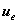
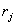
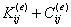

三、有限元解法的主要步骤

&nbsp;&nbsp;&nbsp;
(1)
确定变分方程或虚功泛函方程&nbsp; §5介绍了弹性力学问题位移法中常用的虚功泛函方程的表达式,应用时要明确哪些是待定的位移函数.例如空间问题有三个位移分量是待定函数,平面问题有二个,薄板弯曲或柱体扭转问题只有一个等等.如果不取位移而取内力分布为待定函数,则应根据最小势能原理建立相应的变分方程.对于其他的微分方程定解问题(例如特征值问题,热导问题),则应参照§5末的论述,乘上待定解的变分并利用格林公式把方程改造成为正定的泛函形式,从而把问题归结为等价的变分问题,作为应用有限元解法的出发点.

&nbsp;&nbsp;&nbsp;
在虚功泛函方程中,主要是确定微分算子矩阵<i>B</i>、弹性系数矩阵<i>D</i>以及各种荷载分布(包括体力、面力、线力与集中点力),以便列出有关的积分表达式.

&nbsp;&nbsp;&nbsp;
(2)
选择单元并划分区域&nbsp; 首先要根据区域形状与计算精度选定单元的形态,并用网格把区域划分为大小不一的单元组合.对于应力集中或变化大的部分,网格要划得密些,变化小的部分可疏些,此外还可以利用问题的对称性把定解区域缩小或退化为低维的情况,以减少节点数与计算量.另一方面,对于不均匀的介质,在系数间断或断裂的地方要放置网格,使在每单元内介质系数保持光滑性;而对集中线力、点力以及检测的地方,则要放置节点,以突出其作用.

&nbsp;&nbsp;&nbsp;
其次,要按问题对解的光滑性要求,安排单元的节点与节点参数值.一般地说,对空间或平面问题用基本单元较简便,也可用等参数单元,使其边界能适当接近区域的弯曲边界,以减少边界的扰动误差;对薄板弯曲问题一般应取§4所介绍的拟协调单元.总之,要妥善处理好减少总自由度(即节点参数值总个数)与提高计算精度这一对矛盾,做到既减少计算量,又保证解的收敛性.

&nbsp;&nbsp;&nbsp;
对单元形状除了§2,§3提出的要求外,还要注意其顶点不能作为相邻单元边上的内点,而且网格要尽量规则些,以减少计算量.

&nbsp;&nbsp;&nbsp;
最后,参考§2~§4,确定同节点参数值对应的型函数与位移模式,对复杂的单元还可以利用待定系数法直接把多项式的系数作为广义节点参数进行单元分析.

(3) 单元分析&nbsp; 以插值多项式代替原待定函数,每个单元的总势能二次泛函就离散化为节点参数值的二次函数,也就是把原变分方程离散化为的代数方程组,其系数矩阵就是单元的刚度矩阵.这工作是问题离散化的关键,因为整个区域的总势能可以近似地看作各单元总势能之和,显然它也随着离散化为总节点参数值的二次函数.因此,单元分析的主要内容就是根据单元的几何与力学信息计算其系数(刚度)矩阵与等价函数值(节点力)等,为了程序标准化,其节点序号应统一取局部的.

刚度矩阵的元素依(2),(3)式的定义实际上是<i></i>×<i></i>的系数块,其中就是第<i>i</i>节点参数值的个数.例如对于空间问题,可取等参数单元,这时<i>B</i>为6×3的一阶偏微分算子矩阵(见()式),,diag为3×3的对角线分块矩阵,于是

为3×6矩阵，而<i>D</i>为6×6的弹性系数矩阵(见(31)式).代入(3)式不难得出3×3的系数块

&nbsp;&nbsp; &nbsp;&nbsp;&nbsp;&nbsp;&nbsp;&nbsp;&nbsp;&nbsp;&nbsp;&nbsp;&nbsp;&nbsp;(<i>k,m</i>=1,2,3)

其中

&nbsp;&nbsp;&nbsp;&nbsp;&nbsp;&nbsp;&nbsp;&nbsp;&nbsp;&nbsp;&nbsp;&nbsp;&nbsp;&nbsp;

只要把(1,2,3)与(<i>x,y,z</i>)同时作循环代换就可得出其他的.显然单元刚度矩阵是对称的,因为.注意,对薄板弯曲问题,由于取拟协调单元，各节点参数值个数不一定等同(见§4).对此情况待定函数只有一个挠度,diag=为1×矩阵,而<i>B</i>改为3×1二阶偏微分算子矩阵,于是是×3的矩阵,以节点<i>i</i>,<i>j</i>的型函数代入(3)式也可得系数块的积分公式.例如,节点<i>i</i>,<i>j</i>的型函数为,,这时=3,=1而按相应的<i>B</i>,<i>D</i>公式则有

式中

这是3×1的系数块,型函数一经确定就可以代入而求出积分值.如果以插值多项式系数为广义节点参数,则单元的各个型函数要全部改为多项式的各项求出的积分值不是系数块而是整个单元的广义系数矩阵与等价节点力等,对此,还得按§4所述,经过变换转到上述的形式才能依(4),(5),(6)式求和.

对体力<b><i>f</i></b>，面力<b><i>q</i></b>同样可按(5),(6)式求出它们的等价节点力.如果在某线段<i>S</i>或某点<i>P</i>上作用有线力分布<i>p</i>(s)或集中力<i>Q</i>,则要补上相应的等价节点力:

以上的这些数值积分都可以通过标准化程序来计算(参看附录).但要注意,其中型函数多取局部坐标,而微分运算又是对整体坐标系(<i>x,y,z</i>),因此在求积前必须通过坐标变换把它们化为局部坐标系的统一表达式(参看§2~§4).此外,在求单元的各项积分值时,节点序号一般可取局部的;但在参加总体合成时,各单元节点的局部序号都必须改成总体的统一标号,因为在(4),(5),(6)的和式中,<i>i</i>,<i>j</i>只能是各节点的总体标号.

（4） 边界条件的处理与总体合成&nbsp;&nbsp;&nbsp; 前一段只考虑纯荷载支承的情况,如果在部分边界给定弹性支承与几何约束,在参加总体合成之前还要进行必要的处理.实际上,正是这些条件才保证系数矩阵的正定性与解的唯一性.

假定在空间问题中<i>Ω</i>的部分边界取弹性支承,其弹性耦合系数为3×3的正定矩阵,而对另一部分边界给定位移值.这样,在变分方程(2)中多出一式

而少了面力<b><i>q</i></b>沿的积分项，因为在上<b><i>q</i></b>对总势能已无贡献,由于空间问题中,,因此对弹性支承部分应把系数块改为，其中

至于约束条件则应对系数矩阵作划行划列的处理,其原理如下：

假定区域剖分后落在上的节点的总体标号为,,…,,依约束条件,(<i>n</i>=1,2,…,).从(2)式可以看出,关于这个节点的变分方程已自然满足,不必列出.这样就把(7)式的系数矩阵划去第,,…,行的系数块(<i>n</i>=1,2,…,）或相应的3行;再把已知的位移值代入(7）式中的部分而移到方程的右边,这样又划去第，，…，列的系数块或相应的3列.经过补块与划行划列处理后的系数矩阵仍然对称,而方程组(7)即可具体列式为

&nbsp; 

其中仍按(5)计算,而(6)式应改为

对薄板弯曲问题，边界条件处理较为复杂，但原理一样.

如果还有热效应，则可根据问题的性质把热当量荷载作为体力的一部分加到单元的等价节点力中去.

经过这些处理,再按(4),(5),(6)等式求和就可得出关于全部节点参数值的线性方程组,总体合成就算结束.它同单元分析一样,也可以用标准化程序来实现.

（5） 方程组的数值求解&nbsp;&nbsp; 方程组的系数矩阵一般是正定的,这就保证了解的唯一性.此外,它还有对称性与稀疏性,只要适当调整节点标号可以使非零的系数集中在矩阵主对角线的附近形成“带状矩阵”,利用这些性质可以大大节省求解的计算量与存储量.对这类型线性方程组的数值解法主要有两类,即迭代法与直接法.

最后,还要对计算成果进行综合与分析.例如根据解出的参数位移值求出单元或节点的应力分布,画图列表进行分析等等.

