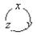

<b>§</b><b>2&nbsp;&nbsp; </b><b>基本单元与线性插值</b>

一、&nbsp; 一、&nbsp;&nbsp;&nbsp;&nbsp;&nbsp;&nbsp;&nbsp; 基本单元与型函数

&nbsp;&nbsp; 基本单元就是指边界平直的子区域，仅取其顶点作节点，并且只用待定函数值作为节点参数值。常用的几何形状是

一维的直线段（二节点）。

二维的三边形（三节点），四边形（四节点）。

三维的四面体（四节点），六面体（八节点）。

在这类单元上，插值函数是线性、双线性或三线性的多项式，即对各个坐标变量<i>x</i>,<i>y</i>或<i>z</i>来说都是一次的。

为明确起见,本节以<i>P</i>表示坐标为的变点,而以<i>Pi</i>表示节点。设单元有<i>p</i>个节点,其局部序号为,局部坐标为,而相应的整体直角坐标取作。这些坐标系都取右手系。

如果在基本单元内同样有<i>p</i>个多项式满足条件：

（i)&nbsp;&nbsp;&nbsp;&nbsp;&nbsp;&nbsp;&nbsp;&nbsp;&nbsp;&nbsp;&nbsp;&nbsp;&nbsp;
（i)&nbsp;&nbsp;&nbsp;&nbsp;&nbsp;&nbsp;&nbsp;&nbsp;&nbsp;&nbsp;&nbsp;&nbsp;&nbsp;&nbsp;&nbsp;&nbsp;&nbsp;&nbsp;&nbsp;
<i>p</i>个多项式之和恒等于1，即

<pre style='text-align:right;line-height:12.0pt' align=right>&nbsp;&nbsp;&nbsp;&nbsp;&nbsp;&nbsp;&nbsp;&nbsp;&nbsp;&nbsp; &nbsp;&nbsp;&nbsp;&nbsp;&nbsp;&nbsp;&nbsp;&nbsp; &nbsp;&nbsp;&nbsp;&nbsp;&nbsp;&nbsp;&nbsp; &nbsp;&nbsp;&nbsp;&nbsp;&nbsp;&nbsp;&nbsp;（8）</pre>

（ii)&nbsp;&nbsp;&nbsp;&nbsp;&nbsp;&nbsp;&nbsp;&nbsp;&nbsp;&nbsp;&nbsp;&nbsp;
（ii)&nbsp;&nbsp;&nbsp;&nbsp;&nbsp;&nbsp;&nbsp;&nbsp;&nbsp;&nbsp;&nbsp;&nbsp;&nbsp;&nbsp;&nbsp;
任一在节点取值1，在其余<i>p</i>-1个节点取值0，即

<pre style='text-align:right' align=right>&nbsp;&nbsp;&nbsp;&nbsp;&nbsp;&nbsp; &nbsp;&nbsp;&nbsp;&nbsp;&nbsp;&nbsp;&nbsp;&nbsp; &nbsp;&nbsp;&nbsp;&nbsp;&nbsp;&nbsp;&nbsp;&nbsp;&nbsp;（9）</pre>

则称为该单元的型函数。可以写成或的函数。

基本单元的型函数存在而且是线性（包括双线性、三线性）的。因此对于线性的插值函数，包括(看作坐标本身的线性函数)可表示为

<pre style='text-align:right' align=right>&nbsp;&nbsp; &nbsp;&nbsp;&nbsp;&nbsp;&nbsp;&nbsp;&nbsp;&nbsp;&nbsp;&nbsp;&nbsp;&nbsp;&nbsp;&nbsp;&nbsp;&nbsp;&nbsp;&nbsp;&nbsp;（10）</pre><pre style='text-align:
right' align=right>&nbsp;&nbsp; &nbsp;&nbsp;&nbsp;&nbsp;&nbsp;&nbsp;&nbsp;&nbsp;&nbsp;&nbsp;&nbsp;&nbsp;&nbsp;&nbsp;&nbsp;&nbsp;&nbsp; &nbsp;&nbsp;&nbsp;&nbsp;&nbsp;（11）</pre>
