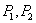
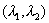
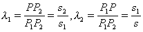
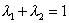
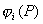
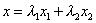
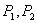
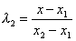
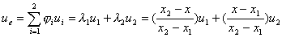
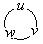

二、直线段单元

&nbsp;[距离坐标]&nbsp; 设直线段二端点为,则线段上任一点<i>P</i>的距离坐标定义为

显然端点的距离坐标分别为(1,0),(0,1),且有

[型函数]&nbsp;&nbsp;&nbsp; 距离坐标(<i>i</i>=1,2)本身可取作型函数。它们与直角坐标之间的关系依(11)为
 
&nbsp;&nbsp;&nbsp;&nbsp;&nbsp;&nbsp;&nbsp;&nbsp;&nbsp;&nbsp;&nbsp;&nbsp;&nbsp;&nbsp;&nbsp;
&nbsp;&nbsp;&nbsp;

[坐标变换]&nbsp;&nbsp; 由于<i>P</i>在直线段上,所以坐标变量只有一个独立,假定取<i>x</i>;同样其距离坐标也只有一个独立,假定取。从上二式得

&nbsp;[线性插值函数]

&nbsp; 

