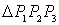
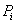

三、三边形单元

[面积坐标]&nbsp; 设三边形的顶点为,则三边形的任一点<i>P</i>的面积坐标定义为

&nbsp;&nbsp;&nbsp;
(<i>i</i>=1,2,3)

式中表示<i>P</i>与的对边构成的的面积,<i>A</i>为的面积，而分别表示<i>P</i>，到的距离。显然的面积坐标分别为(1,0,0),(0,1,0),(0,0,1),且有

[型函数] &nbsp;&nbsp;就是面积坐标,它们与直角坐标之间的线性关系式为

&nbsp; 

[坐标变换及其雅可比式]&nbsp;&nbsp; 由于<i>P</i>在平面上,所以只有两个坐标变量独立,假定取<i>x</i>,<i>y</i>;同样,面积坐标只有两个独立,假定取。从上二式可得

式中，

其绝对值等于单元面积<i>A</i>即。

雅可比式(即变换矩阵的行列式)为

逆变换矩阵为

&nbsp;[线性插值函数]

&nbsp;&nbsp;&nbsp;&nbsp; 

利用的循环性，以<i>x</i>,<i>y</i>为变量的型函数可写成

