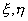

四、四边形单元

[双三次插值(协调板元)]&nbsp; 二元双三次插值多项式共有个系数,其一般形式可写成

只要在每个顶点给定节点参数值就可以唯一确定这些系数.

考虑局部坐标(<i>ξ</i>,<i>η</i>)中的单位矩阵,对一维单元的三次插值的型函数表达式作适当的组合,不难看出其型函数依序可写成

容易证明,它们满足如下的条件:

(i)&nbsp;&nbsp;&nbsp;&nbsp;&nbsp;&nbsp;&nbsp;
(i)&nbsp; &nbsp;&nbsp;在顶点<i>i</i>上等于1.

(ii)&nbsp;&nbsp;&nbsp;&nbsp;&nbsp;
(ii)&nbsp; 其余函数及其一阶与混合二阶导数在各节点上都等于零.

(iii)&nbsp;&nbsp;&nbsp;&nbsp;
(iii)&nbsp; 

于是在局部坐标系中,插值多项式可写成

注意,在两坐标系中,节点参数值之间的变换应取

而型函数相应地有如下关系

&nbsp;&nbsp;&nbsp;&nbsp;&nbsp;&nbsp;&nbsp;&nbsp;&nbsp;&nbsp;&nbsp;&nbsp;&nbsp;&nbsp;&nbsp;&nbsp;
&nbsp;&nbsp;&nbsp;&nbsp;&nbsp;&nbsp;&nbsp;&nbsp;(<i>i</i>=1,2,3,4)

这种单元是协调单元.

[不完全的双三次插值]&nbsp; 节点参数值取,共有十二个插值条件,因此要唯一确定插值多项式,必须对它加以限制.一般是从上述的完全双三次多项式中去掉后面高次项,即等四项,而仍保持对称性.注意,这种插值函数虽然少了四个高次项,但仍然包含完全的三次多项式,只是由于混合导数不取作节点值,在两单元之间沿边界法向导数就无法保证其连续性。尽管如此，它还满足分片检验的收敛准则，因此可以作为板元的挠度模式.

利用待定系数法,可以求出与局部坐标()相应的型函数为

&nbsp;&nbsp;&nbsp;&nbsp;&nbsp;&nbsp;&nbsp;&nbsp;&nbsp;&nbsp;

在局部坐标系中,插值多项式可写成

