

五、四面体单元

[体积坐标]&nbsp; 设四面体顶点为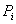(<i>i</i>=1,2,3,4),则四面体的任一点<i>P</i>的体积坐标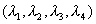定义为

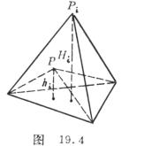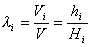&nbsp;&nbsp;&nbsp;&nbsp;&nbsp;
(<i>i</i>=1,2,3,4)

式中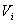表示<i>P</i>与所对的底面三角形构成四面体的体积,<i>V</i>为四面体单元的体积,而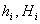分别表示<i>P</i>,到底面的距离。显然,的体积坐标除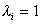外,其余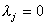且有

<pre style='text-align:right' align=right>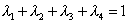&nbsp;&nbsp;&nbsp;&nbsp;&nbsp;  &nbsp;&nbsp;&nbsp;&nbsp;&nbsp;&nbsp;&nbsp; &nbsp;&nbsp;&nbsp;&nbsp;&nbsp;&nbsp;&nbsp;&nbsp;&nbsp;&nbsp;(12)</pre>

[型函数]&nbsp;&nbsp;&nbsp; 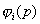就是体积坐标(<i>i</i>=1,2,3,4),它们与直角坐标之间的线性关系式为

<pre style='text-align:right' align=right>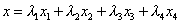&nbsp;&nbsp;&nbsp;&nbsp;&nbsp;&nbsp;  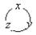&nbsp; &nbsp;&nbsp;&nbsp;&nbsp;&nbsp;&nbsp;&nbsp;&nbsp;&nbsp;&nbsp;&nbsp;&nbsp;&nbsp;&nbsp; &nbsp;&nbsp;&nbsp;&nbsp;&nbsp;(13)</pre>

[坐标变换及其雅可比式]&nbsp;&nbsp; 假定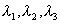为独立变量,则由上(12),(13)得

&nbsp;&nbsp;&nbsp;&nbsp;&nbsp;&nbsp;&nbsp;&nbsp;&nbsp;
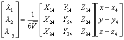

式中

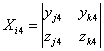，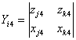，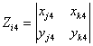&nbsp;&nbsp;&nbsp;&nbsp;&nbsp;&nbsp;&nbsp;&nbsp;&nbsp;&nbsp;&nbsp;&nbsp;&nbsp; 

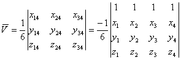

其绝对值等于单元体积<i>V</i>即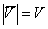。

雅可比式（即变换矩阵的行列式）为

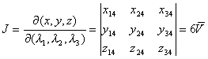

逆变换矩阵为

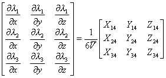

&nbsp;[线性插值函数]

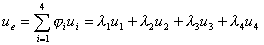&nbsp; 

由(12),(13)可直接求得

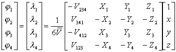

等式右端系数矩阵各元素可循环定义如下：

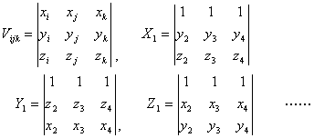&nbsp;&nbsp;&nbsp;&nbsp;&nbsp;

实际上不难看出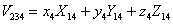，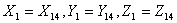,…，只不过这里用三阶行列式代替<i>Xi4</i>等二阶行列式，便于循环定义,结果还是一致的。

