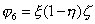
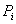
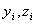

六、&nbsp; 六、&nbsp;&nbsp;&nbsp;&nbsp;&nbsp;&nbsp;&nbsp; 六面体单元

&nbsp;&nbsp;&nbsp; [三向距离坐标]&nbsp;&nbsp; 设六面体的顶点为(<i>i</i>=1,2,…,8)(图19.5)。利用双向距离坐标,先把四边形变换到局部坐标系(<i>ξ</i>,<i>η</i>,<i>ζ</i>)的坐标面<i>ζ</i>=0上的单位正方形(0≤<i>ξ</i>≤1,0≤<i>η</i>≤1);再在线段上定义距离坐标,并取作(1-<i>ζ</i>,<i>ζ</i>), 的<i>ζ</i>分别为0与1。现在又对四边形利用双向距离坐标,把它变换到坐标面<i>ζ</i>=1上的单位正方形(0≤<i>ξ</i>≤1,0≤<i>η</i>≤1)。这就在四边形与分别同<i>ζ</i>=0与<i>ζ</i>=1上的单位正方形各点间建立一一对应。最后把上下四边形具同样局部坐标(<i>ξ</i>,<i>η</i>)的点联成线段,并沿方向(由下而上)定义距离坐标(1-<i>ζ</i>,<i>ζ</i>)。于是该线段上任意一点<i>P</i>的局部坐标可取为(<i>ξ</i>,<i>η</i>,<i>ζ</i>)。这样,直角坐标系中的任意六面体单元与局部坐标系中的单位立方体(0≤<i>ξ</i>≤1,0≤<i>η</i>≤1,0≤<i>ζ</i>≤1)之间就建立了一一对应。

[型函数]&nbsp;&nbsp;&nbsp; 对于单位立方体，利用节点的对称性得出型函数为 

&nbsp;&nbsp;&nbsp;&nbsp;&nbsp; 

&nbsp;&nbsp;&nbsp;
&nbsp;&nbsp;&nbsp;&nbsp; 

&nbsp;&nbsp;&nbsp;&nbsp;&nbsp;&nbsp; &nbsp;&nbsp;&nbsp;&nbsp;&nbsp; 

&nbsp;&nbsp;&nbsp;&nbsp;&nbsp;&nbsp;&nbsp;&nbsp;&nbsp;&nbsp;&nbsp;&nbsp;&nbsp;&nbsp;&nbsp;&nbsp;
&nbsp;&nbsp;&nbsp;&nbsp;&nbsp; &nbsp;&nbsp;&nbsp;&nbsp;

由于顶点的局部坐标取值为1或0,可统一写成

（<i>i</i>=1,2,…,8）

它是三线性的,即对<i>ξ</i>或<i>η</i>或<i>ζ</i>都是线性的。

[坐标变换及其雅可比式]

&nbsp;&nbsp; 

同一样,它是三线性的。这表明六面体的棱边应是直线段。

雅可比式（即变换矩阵的行列式）为

式中

变换矩阵也可写成

从上式看出变换矩阵各行关于<i>ξ</i>,<i>η</i>,<i>ζ</i>的二次项系数是相同的,记

对也有相应的记号,则变换矩阵可写成

其行列式是<i>ξ</i>,<i>η</i>,<i>ζ</i>的四次多项式,而且各项的系数为零。

[三线性插值函数]

