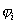

七、&nbsp; 七、&nbsp;&nbsp;&nbsp;&nbsp;&nbsp;&nbsp;&nbsp; 三棱柱单元

[局部坐标]&nbsp;&nbsp; 上、下底三角形可利用面积坐标,而沿高度方向则利用距离坐标来构成局部坐标。设<i>ξ</i>,<i>η</i>取其第二、三面积坐标,<i>ζ</i>取第二距离坐标,于是直角坐标系中的三棱柱与局部坐标系中的单位三棱柱(上下底是腰为1的等腰直角三角形,高为1,见图19.6)之间建立一一对应。

[型函数]

&nbsp;&nbsp;&nbsp;&nbsp;

&nbsp;&nbsp;&nbsp;&nbsp;&nbsp;&nbsp;&nbsp;&nbsp;&nbsp;&nbsp;&nbsp;&nbsp;

&nbsp;&nbsp;&nbsp;&nbsp;&nbsp;&nbsp;&nbsp;&nbsp;&nbsp;&nbsp;&nbsp;&nbsp;

由于顶点的局部坐标取值为1或0,可统一写成

(<i>i</i>=1,2,…,6）

[坐标变换及其雅可比式]

<table cellspacing=0 cellpadding=0 hspace=0 vspace=0 align=left>
 <tr>
  <td valign=top align=left style='padding-top:0mm;padding-right:9.0pt;
  padding-bottom:0mm;padding-left:9.0pt'>
  

  
&nbsp; 

  

  </td>
 </tr>
</table>

变换矩阵为

雅可比式为

式中&nbsp;&nbsp;&nbsp;&nbsp;&nbsp;&nbsp;&nbsp;&nbsp;&nbsp;&nbsp;

其余的可类似定义。

