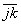

<b>§</b><b>3&nbsp; </b><b>等参数单元与高次插值</b>

一、&nbsp; 一、&nbsp;&nbsp;&nbsp;&nbsp;&nbsp;&nbsp;&nbsp; 等参数单元

如果单元具有如下特性：

（i)&nbsp;&nbsp;&nbsp;&nbsp;&nbsp;&nbsp;&nbsp;&nbsp;&nbsp;&nbsp;&nbsp;&nbsp;&nbsp;
（i)&nbsp;&nbsp;&nbsp;&nbsp;&nbsp;&nbsp;&nbsp; 每个待定函数(例如<i>u</i>)在节点上只有一个参数值(即);当把节点的坐标值(例如)看作坐标变量(例如<i>x</i>)在节点的参数值时,单元上每个待定函数与坐标变量的节点参数值具有相同的个数,即节点个数<i>p</i>。

（ii)&nbsp;&nbsp;&nbsp;&nbsp;&nbsp;&nbsp;&nbsp;&nbsp;&nbsp;&nbsp;&nbsp;&nbsp;
（ii)&nbsp;&nbsp;&nbsp; 单元上变点<i>P</i>的坐标与插值函数的各分量同节点参数值之间的线性关系,具有统一的模式：

<pre style='text-align:right' align=right>&nbsp;&nbsp;&nbsp;&nbsp;&nbsp;&nbsp;&nbsp;&nbsp;&nbsp; &nbsp;&nbsp;&nbsp;&nbsp;&nbsp;&nbsp;&nbsp;&nbsp;&nbsp;&nbsp;&nbsp;&nbsp;&nbsp;&nbsp;&nbsp;&nbsp;&nbsp;&nbsp;&nbsp;&nbsp; &nbsp;&nbsp;&nbsp;&nbsp;（14）</pre>

则称它为等参数单元。式中是以局部坐标为变量的型函数,（*）表示变点<i>P</i>的坐标或插值函数的各分量,表示对应的节点参数值。基本单元是等参数单元中最简单的一类(只有顶点是节点)。

如果节点不只取在顶点处,从型函数的定义与构成可知的次数就会增加,插值函数的次数也相应增加。反过来,为了提高精度要对待定函数作高次插值,单元的节点也不能只取在顶点。总之,等参数单元适用于高次插值,其关键仍然是型函数的构成,单元转化为规则形状也不一定通过度量比坐标来实现,其节点的局部坐标只要选得使型函数表达式简洁就好了。至于局部坐标与直角坐标间的对应关系则可利用上述模式得出。等参数单元常用类型有六节点三边形,九、十节点三边形,八、九节点四边形,十节点四面体,二十节点四面体,十五节点五面体,二十节点六面体等单元。

为了使公式统一,对三边形、四面体,需要简化节点记号:首先同基本单元一样,只在单元顶点局部编号<i>i</i>=1，2，…，<i>p</i>,并直接以<i>i</i>表示单元的顶点,以表示端点为,的线段中点,与则分别表示线段上靠近与的三分点,以表示△的形心(重心),而以<i>O</i>表示单元的形心。在单元分析时,它们都不另外编号。此外,为缩短篇幅,对等参数单元,只列出型函数的表达式,其余部分可仿照§2计算。

