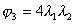
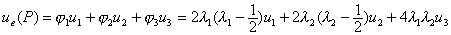

二、多节点线元上的插值 

[三节点线元]&nbsp; 在直线段上取其中点为另一节点,它的距离坐标为。相应的型函数是二次的：

&nbsp;&nbsp;&nbsp;&nbsp;&nbsp;&nbsp;&nbsp;&nbsp;&nbsp;
&nbsp;&nbsp;&nbsp;&nbsp;&nbsp;&nbsp;&nbsp;&nbsp;&nbsp;&nbsp; 

插值函数为

用原直角坐标，插值函数又可写成

它就是<i>u</i>(<i>x</i>)的二次拉格朗日插值多项式,式中。

[四节点线元]&nbsp; 在直线段上取三分点为另二节点,,其距离坐标分别为,,相应的型函数是三次的：

&nbsp;&nbsp;&nbsp;&nbsp;&nbsp;&nbsp;&nbsp;&nbsp;&nbsp;&nbsp;&nbsp;&nbsp;&nbsp;

&nbsp;&nbsp;&nbsp;&nbsp;&nbsp;&nbsp;&nbsp;&nbsp;&nbsp;&nbsp;&nbsp;&nbsp;&nbsp;

用原直角坐标可得三次拉格朗日插值多项式<i>u</i>(<i>x</i>)：

式中&nbsp;&nbsp;&nbsp;&nbsp;&nbsp;&nbsp;&nbsp;&nbsp; &nbsp;&nbsp;&nbsp;&nbsp;&nbsp;&nbsp;&nbsp;&nbsp;&nbsp;&nbsp;&nbsp;&nbsp;&nbsp;

