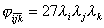

四、&nbsp; 四、&nbsp;&nbsp;&nbsp;&nbsp;&nbsp;&nbsp;&nbsp; 空间等参数单元的型函数

[十节点四面体]&nbsp; 十节点包括四面体的四个顶点和六个棱边的中点(图19.10)。选取体积坐标,其型函数为

&nbsp;&nbsp;&nbsp;&nbsp;&nbsp;&nbsp;&nbsp;&nbsp;&nbsp;&nbsp;
（<i>i</i>=1,2,3,4）

&nbsp;&nbsp;&nbsp;&nbsp;&nbsp;&nbsp;&nbsp;&nbsp;&nbsp;&nbsp;&nbsp;&nbsp;&nbsp;&nbsp;
（<i>i</i>≠<i>j</i>）

[二十节点四面体]&nbsp; 二十节点包括四面体的四个顶点,六个棱边的三分点(等共12个),以及四个边界面的形心(如等共4个)(图19.11)。其型函数为：

&nbsp;&nbsp;&nbsp;&nbsp;&nbsp;&nbsp;&nbsp;&nbsp; （<i>i</i>=1,2,3,4）

&nbsp;&nbsp;&nbsp;&nbsp;&nbsp;&nbsp;&nbsp;&nbsp;&nbsp;&nbsp;
（<i>i</i>≠<i>j</i>）

&nbsp;&nbsp;&nbsp;&nbsp;&nbsp;&nbsp;&nbsp;&nbsp;&nbsp;&nbsp;&nbsp;&nbsp;&nbsp;&nbsp;&nbsp;
(<i>i</i>≠<i>j</i>≠<i>k</i>） 

&nbsp;[十五节点五面体]&nbsp; 十五节点包括五面体的六个顶点,三个棱的中点以及上、下底六个边的中点(图19.12)

其型函数为

&nbsp;&nbsp;&nbsp;&nbsp;&nbsp;&nbsp;&nbsp;&nbsp;&nbsp;&nbsp;&nbsp;&nbsp;&nbsp;&nbsp;&nbsp;&nbsp;&nbsp;&nbsp;&nbsp;&nbsp;
(<i>j</i>表示三棱边中点)

&nbsp;&nbsp;&nbsp; 

&nbsp;[二十节点六面体]&nbsp;&nbsp; 二十节点包括六面体的八个顶点和十二个棱边的中点(图19.13)。其型函数为

&nbsp; (<i>i</i>=1,2,…,8)

