

五、等参数单元的特点

综合上述，可知等参数单元具有以下特点：

1°&nbsp;&nbsp;&nbsp;&nbsp;&nbsp;&nbsp;
1°&nbsp;&nbsp;&nbsp;&nbsp;&nbsp;&nbsp; 采用等参数单元较之基本单元效果更好:它不但可以增加插值的次数,以提高计算精度,而且还使得单元形状能够适应边界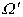弯曲的特性。因为在构造型函数时,我们把局部坐标系中有规则的几何单元作为模型,再给定二者节点之间的对应关系,求出型函数后,才通过模式(14)得到二坐标系之间的关系。在整个过程都不考虑单元的边界形状,但从这些关系式看出单元的边界一般可取代数曲线或曲面。

例如,十节点三边形的边界(某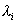=0)可以是三次曲线。十节点四面体、十五节点五面体或二十节点六面体的棱边(某二局部坐标已定)都是二次曲线,其侧面则是由两族二次代数曲线织成的曲面。其形状完全由节点的位置或坐标（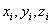）来确定。如果节点选成共线或共面,从模式(14)不难证明这些曲线退化为直线或平面曲线。因此在划分等参数单元时,<i>Ω</i>的弯曲边界邻近的某些节点可以适当布置使单元与<i>Ω</i>的边界较好地拟合,以减少边界扰动误差。但在区域内部,节点还是选得使侧面较平直为好（甚至尽可能与直角坐标方向一致）,这样可简化坐标变换及其雅可比式,以减少计算量与误差积累。

2°&nbsp;&nbsp;&nbsp;&nbsp;&nbsp;&nbsp;
2°&nbsp;&nbsp;&nbsp;&nbsp;&nbsp;&nbsp; 完全的<i>m</i>元<i>n</i>次多项式或<i>m</i>+1元<i>n</i>次齐次多项式的项数为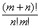这公式对于判定相容条件是否满足,<i>n</i>次插值是否完全,以及边界上节点的合理分布都很有用。例如,上述平面等参数单元坐标变换在边界上都是相容的;十节点、二十节点四面体的二、三次插值是完全的,单元之间沿边界侧面也是相容的。至于其他单元,在对插值函数形式加些限制（例如要求双二次）后也是相容的。

3°&nbsp;&nbsp;&nbsp;&nbsp;&nbsp;&nbsp;
3°&nbsp;&nbsp;&nbsp;&nbsp;&nbsp;&nbsp; 由模式（14）可知,等参数单元之间的坐标变换的相容性与插值函数的连续性是等价的。如果边界上节点参数值的个数与插值多项式的项数相等,那末两相邻单元的插值函数在公共边界上的值通常可由其公共的节点参数值所唯一确定,连续性就得到保证。同理,公共边界上坐标的参数表达式也完全由其节点的坐标值所确定,从而使它们的坐标变换在边界上是保持相容。例如,从二十节点六面体的型函数可以看出其插值多项式包括<i>ξ</i>,<i>η</i>,<i>ζ</i>三次多项式的17项（即20项中不出现等三项）再补上三个四次项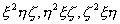,对于任一侧面（例如<i>ζ</i>=1）,插值函数（对<i>ξ</i>,<i>η</i>）是双二次的共8项,与该侧面的节点（参数值）数相等。因此,只要相邻单元取同样的插值模式,相容性条件就得到满足。注意,增加节点（参数值）个数只能在一定程度上使插值多项式的次数提高,而无法解决其导数沿公共边界保持连续的问题.对这类问题就不宜采用等参数单元,而应改用协调单元.

4°&nbsp;&nbsp;&nbsp;&nbsp;&nbsp;&nbsp;
4°&nbsp;&nbsp;&nbsp;&nbsp;&nbsp;&nbsp; 从九、十节点三边形单元的型函数的构成可以看出,如不对插值函数加以限制,它并不是唯一的,例如,对于十五节点五面体或二十节点六面体,三个平行的平面<i>ζ</i>=<i>ζ</i>+1=<i>ζ</i>-1=0可通过所有的节点。这表示对原型函数{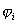}加上<i>ζ</i>的三次项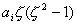,只要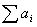=0它还是一组型函数。二十节点六面体单元对插值多项式的限制已如3o所述（即除去三次多项式中的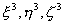三项,而在十五个四次项中只补上三项:）,在这样限制（即对每个坐标变量都是二次的）下,型函数才是唯一的（例如,由于<i>ζ</i>的三次项不出现,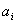只能取零）。同样,在十五节点五面体单元的型函数表达式中,,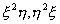等五个三次项并不出现,在这样条件下,型函数也是唯一的。

5°&nbsp;&nbsp;&nbsp;&nbsp;&nbsp;&nbsp;
5°&nbsp;&nbsp;&nbsp;&nbsp;&nbsp;&nbsp;
不完全的高次插值对解的收敛性一般是不利的。但是,同九节点三边形一样,上述的二十节点六面体与十五节点五面体单元的插值对二次多项式是准确的（因为它们只在三次以上各项作调整）。

