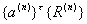
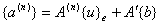
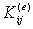
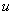

<b>§</b><b>4&nbsp; </b><b>拟协调单元</b>

一、&nbsp; 一、&nbsp;&nbsp;&nbsp;&nbsp;&nbsp;&nbsp;&nbsp; 协调问题与拟协调单元

等参数单元有一个缺点，就是节点与插值次数无论如何增加，各单元之间都只能保证插值函数本身的连续性，这对于积分式仅含待定函数及其一阶导数的变分问题（例如空间弹性力学问题，其变形能中应变是位移的一阶偏导数）来说是适用的，但是对于包含高阶导数的变分问题（例如杆、板的弯曲问题，其变形能积分就含有待定的挠度函数的二阶偏导数），对插值函数往往要求在整个区域有一阶的连续性。而这类所谓协调问题，等参数单元是无法解决的。这种光滑性的要求当然要首先在节点上反映出来，也就是说，单元的节点参数值应当包含待定函数的有关导数值。这一类单元可统称为拟协调单元。

[型函数]&nbsp; 假定在某个单元上有<i>p</i>个节点，其局部编号为<i>i</i>=1,2,…,<i>p</i>。先考虑待定函数<i>u</i>=<i>u</i>(<i>x</i>,<i>y</i>,<i>z</i>)及其一阶偏导数在节点<i>i</i>的参数值

每一节点参数值个数<i>r</i>=4。于是每个单元共有4<i>p</i>个节点参数值。如果插值函数为三元<i>n</i>次多项式，则其项数或各项系数一般有个，显然次数<i>n</i>必须满足

<a href="#None" name="_ftnref1" title="">*</a>

这时对应于各节点参数值，可定义型函数为如下的4<i>p</i>个<i>n</i>次多项式(<i>i</i>=1,2,…,<i>p</i>) :

（i）（i）在节点<i>i</i>

（ii）（ii）在其余<i>p</i>-1个节点<i>j</i>≠<i>i</i>，上述十六个函数即及其一阶偏导数都等于零。

（iii）（iii）

如果能把这些型函数构造出来，那末<i>u</i>的插值多项式就可以表示为

如果待定函数是（<i>u</i>,<i>v</i>,<i>w</i>），其他条件同前，则其插值函数（）可表示为

或用矢量表示

&nbsp;&nbsp;&nbsp;&nbsp;&nbsp;&nbsp; 

[待定系数法]&nbsp; 待定系数法是从4<i>p</i>个节点参数值直接解出插值多项式的各项系数。一般地说，完全的<i>n</i>次多项式系数{}的个数<i>N</i>=会大于4<i>p</i>，需要对多项式补加<i>N</i>-4<i>p</i>个条件才能唯一地确定这些系数。最简单的方式是象§3中那样，限制多项式的形式（例如限制多项式为三<i>k</i>次多项式，即对<i>x</i>、<i>y</i>或<i>z</i>都是<i>k</i>次的，系数的个数就减为）或除去某些高次项（即令相应的系数为零）使得系数个数为4<i>p</i>，假定经过限制后的插值多项式改写为

从4<i>p</i>个节点参数值可得4<i>p</i>个方程

&nbsp;&nbsp;
（<i>i</i>=1,2,…,<i>p</i>）

式中等分别表示由多项式各项（项数为4<i>p</i>）及其偏导数在节点<i>i</i>的数值所构成的列矢量。把这单元的全部节点参数值排成列矢量，并以<i>U</i>表示上式右端<i>p</i>个4×4<i>p</i>的系数矩阵依序排列所构成的4<i>p</i>×4<i>p</i>的系数矩阵，则4<i>p</i>个方程可简写为

从此可解出各项的系数

<pre style='text-align:right' align=right>&nbsp;&nbsp;&nbsp;&nbsp;&nbsp;&nbsp;&nbsp;&nbsp;&nbsp;&nbsp;&nbsp;&nbsp;&nbsp;&nbsp;&nbsp;&nbsp;&nbsp;&nbsp;&nbsp;&nbsp;&nbsp;&nbsp;&nbsp;&nbsp;&nbsp;&nbsp;&nbsp;&nbsp;&nbsp;&nbsp;&nbsp;&nbsp;&nbsp;&nbsp;&nbsp;&nbsp; (15)</pre>

可以看出，在同样的限制下，型函数的各项系数实际上就是中一个分量取1，其余分量取零的解。

另一种方式是对插值函数一般表达式

按光滑性要求或物理条件附加一定的约束，并假定这些约束可表示为<i>N</i>-4<i>p</i>个关于的线性方程

<pre style='text-align:right' align=right>&nbsp;&nbsp;&nbsp;&nbsp;&nbsp;&nbsp;&nbsp;&nbsp;&nbsp;&nbsp;&nbsp;&nbsp;&nbsp;&nbsp;&nbsp;&nbsp;&nbsp;&nbsp;&nbsp;&nbsp;&nbsp;&nbsp;&nbsp;&nbsp;&nbsp;&nbsp; &nbsp;&nbsp;&nbsp;&nbsp;&nbsp;&nbsp;&nbsp;&nbsp;&nbsp;&nbsp;&nbsp;&nbsp;&nbsp;(16)</pre>

式中<i>Q</i>为（<i>N</i>-4<i>p</i>）×<i>N</i>的系数矩阵。对于这完全的<i>n</i>次插值多项式，同样可从4<i>p</i>个节点参数值得出如下4<i>p</i>个方程

<pre style='text-align:right' align=right>&nbsp;&nbsp;&nbsp;&nbsp;&nbsp;&nbsp;&nbsp;&nbsp;&nbsp;&nbsp;&nbsp;&nbsp;&nbsp;&nbsp;&nbsp;&nbsp;&nbsp;&nbsp;&nbsp;&nbsp;&nbsp;&nbsp;&nbsp;&nbsp;&nbsp;&nbsp;&nbsp; &nbsp;&nbsp;&nbsp;&nbsp;&nbsp;&nbsp;&nbsp;&nbsp;&nbsp;(17)</pre>

式中表示4<i>p</i>×<i>N</i>的系数矩阵，只要选取约束条件适当<a
href="bword://None" name="_ftnref2" title="">*</a>，一般解联立方程组（16）（17）可得

&nbsp;&nbsp; ,

把<i>N</i>×<i>N</i>矩阵<i>G</i>分成前4<i>p</i>列与后（<i>N</i>-4<i>p</i>）列二子矩阵：<i>G</i>=[]。则

(15)(15)或(17)表示<i>u</i>的节点参数值与插值多项式的系数之间的对应关系，对待定函数<i>v</i>，<i>w</i>也有类似的关系式。如果写成矢量形式，则插值多项式为

<pre style='text-align:right' align=right>&nbsp;&nbsp;&nbsp;&nbsp;&nbsp;&nbsp; &nbsp;&nbsp;&nbsp;&nbsp;&nbsp;&nbsp;&nbsp;&nbsp;&nbsp;&nbsp;&nbsp; &nbsp;&nbsp;&nbsp;&nbsp;&nbsp;&nbsp;&nbsp;&nbsp;&nbsp;(18)</pre>

[广义节点参数]&nbsp; 如果直接用插值多项式(18)代替(1)式作单元分析,则变分方程(2)应改为

&nbsp;&nbsp;&nbsp; 式中各项{<i>R</i>}相当于型函数,而系数{<i>a</i>}起着节点参数值的作用,称为单元的广义节点参数.在上式和号后的单元系数矩阵与等价外力也是广义的,分别记作

于是有

式中<i>A</i>为(15)中的矩阵.对于插值多项式也有类似结果.

[节点参数值的变换]&nbsp; 节点参数值中含有偏导数,它们在直角坐标系和局部坐标系中的数值是不同的.例如,直角坐标系中的节点参数值

在局部坐标系中为

<pre style='text-align:right' align=right>&nbsp;&nbsp;&nbsp;&nbsp;&nbsp; &nbsp;&nbsp;&nbsp;&nbsp;&nbsp;&nbsp;&nbsp;&nbsp;&nbsp;&nbsp;&nbsp;&nbsp;&nbsp; &nbsp;&nbsp;&nbsp;&nbsp;&nbsp;(20)</pre>

式中四阶矩阵右下标<i>i</i>表示在节点<i>i</i>的值.反之

记局部坐标系中的型函数为,直角坐标系中的型函数为,从表达式

可知它们具有如下的线性关系

<pre style='text-align:right' align=right>&nbsp;&nbsp;&nbsp;&nbsp;&nbsp;&nbsp;&nbsp; &nbsp;&nbsp;&nbsp;&nbsp;&nbsp;&nbsp;&nbsp;&nbsp;&nbsp;&nbsp;&nbsp;&nbsp;&nbsp;&nbsp;&nbsp;&nbsp;&nbsp;&nbsp;&nbsp;&nbsp;&nbsp;&nbsp;&nbsp;&nbsp;&nbsp; &nbsp;&nbsp;&nbsp;(21)</pre>

实际上,凡是包含微分运算的部分,例如在的积分式中包含微分运算的矩阵<i>B</i>,边界的方向导数等等,在坐标变换下都要作相应的变换.

 

 

<a href="#None" name="_ftn1" title="">*</a> 对一或二的情况应改为或.如果规定为双次多项式,则取等等.

<a href="#None" name="_ftn2" title="">*</a> 注意,附加的约束应当结合单元的剖分来选定:有的约束对某种单元并不适用.例如,对三边形板元作三次插值,如果在三个顶点取函数及其一阶偏导数为节点参数值,则,于是,即需加一个条件.为了收敛性,要包含完全的二次多项式,而由于对称性,一般可令与二系数相等,但这种约束对于平行坐标轴的等腰直角三角形单元,可以论证相应的矩阵是奇异的.

