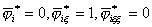

二、&nbsp; 二、&nbsp;&nbsp;&nbsp;&nbsp;&nbsp;&nbsp;&nbsp; 一维单元的高次插值

[三次插值]&nbsp; 一元三次多项式有四项,其系数一般可由四个节点参数值来确定。现在取线段二端点为节点1,2,待定函数及其导数的节点值为节点参数值共四个,即

&nbsp;&nbsp;&nbsp;&nbsp;&nbsp;&nbsp;&nbsp;
(<i>i=</i>1,2)

取距离坐标()的为局部坐标,这样线元二端点的坐标分别为<i>=</i>0, <i>=</i>1.定义满足如下条件的三次多项式为型函数:

(i)&nbsp;&nbsp;&nbsp;&nbsp;&nbsp;&nbsp;&nbsp;
(i)&nbsp; 在节点<i>i</i>上&nbsp;&nbsp;&nbsp;&nbsp;&nbsp;&nbsp;&nbsp;&nbsp;&nbsp;&nbsp;&nbsp;&nbsp;&nbsp;&nbsp;

(ii)&nbsp;&nbsp;&nbsp;&nbsp;&nbsp;
(ii)在节点<i>j</i>(≠<i>i</i>)上&nbsp;&nbsp;&nbsp;&nbsp;&nbsp;&nbsp;&nbsp;&nbsp;&nbsp;

(iii)&nbsp;&nbsp;&nbsp;&nbsp;
(iii)

利用距离坐标的对称性从这些条件可分别定出

&nbsp; 

于是在局部坐标系中,插值多项式可表示为

如果要在直角坐标系中表示,可用坐标变换

<pre style='text-align:right' align=right>&nbsp;&nbsp;&nbsp;&nbsp;&nbsp; &nbsp;&nbsp;&nbsp;&nbsp;&nbsp;&nbsp;&nbsp;&nbsp;&nbsp;&nbsp;&nbsp;&nbsp;&nbsp;&nbsp;&nbsp;&nbsp;&nbsp;&nbsp;&nbsp;&nbsp;&nbsp;&nbsp; &nbsp;&nbsp;&nbsp;&nbsp;&nbsp;&nbsp;&nbsp;(22)</pre><pre>&nbsp;&nbsp;&nbsp;&nbsp;&nbsp;&nbsp;&nbsp;&nbsp;&nbsp;&nbsp;&nbsp;&nbsp;&nbsp;&nbsp;&nbsp;&nbsp;&nbsp;&nbsp;&nbsp;&nbsp;&nbsp;&nbsp;&nbsp;&nbsp;&nbsp;&nbsp;&nbsp;&nbsp;&nbsp;&nbsp;&nbsp;&nbsp;&nbsp;&nbsp;&nbsp;&nbsp;&nbsp;&nbsp; </pre>

代入上式并展开就得如下的埃尔米特三次插值多项式

[五次插值]&nbsp; 一元五次多项式有六项,其系数一般可由六个节点参数值来确定.现在取待定函数及其一、二阶导数的节点值为节点参数值,即

&nbsp;&nbsp;
（<i>i=</i>1,2）

同样取距离坐标()的为局部坐标,并定义满足如下条件的五次多项式为型函数:

(i)&nbsp;&nbsp;&nbsp;&nbsp;&nbsp;&nbsp;&nbsp;&nbsp;&nbsp;
(i)&nbsp; 在节点<i>i</i>上

&nbsp;&nbsp;&nbsp;
(ii)&nbsp; 在节点<i>j</i>(≠<i>i</i>)上及其一、二阶导数都等于零.

&nbsp;&nbsp;&nbsp;
(iii)&nbsp; &nbsp;

从这些条件并利用距离坐标的对称性可分别定出

于是在局部坐标系中,插值多项式可表示为

如果要在直角坐标系中表示 ,同样可用坐标变换(22)代入并展开就得出如下埃尔米特五次多项式

式中在前出现因子就是由于导数在不同的坐标系中具有如下关系:

[型函数与待定系数法]&nbsp; 以上述五次插值多项式为例.写出五次插值函数的一般形式

式中六个待定系数可由六个边界条件

&nbsp;&nbsp;&nbsp;&nbsp;&nbsp;&nbsp; (<i>i=</i>1,2)

来确定,它可归结为一组关于的线性方程,其常数项就是这些节点参数值.

型函数不过是取单位矢量的特殊插值函数.例如在局部坐标中,取

则六个边界条件可表示为

<pre>&nbsp;&nbsp;&nbsp;&nbsp;&nbsp;&nbsp;&nbsp;&nbsp;&nbsp;&nbsp;&nbsp;&nbsp;&nbsp;&nbsp;&nbsp;&nbsp;&nbsp;&nbsp;&nbsp;&nbsp;&nbsp;&nbsp;&nbsp;&nbsp;&nbsp; </pre><pre>&nbsp;&nbsp;&nbsp;&nbsp;&nbsp;&nbsp;&nbsp;&nbsp;&nbsp;&nbsp;&nbsp;&nbsp;&nbsp;&nbsp;&nbsp;&nbsp;&nbsp;&nbsp;&nbsp;&nbsp;&nbsp;&nbsp;&nbsp;&nbsp;&nbsp;</pre>

由此解得

于是这个特殊的插值函数可写成

即上一小段的型函数,在局部坐标系中的其余型函数也可同样求出.

对一维的情况,用待定系数法求型函数是比较容易的.但对二维的情况,特别是对于不完全的高次插值,常常因为限制条件的补充使得型函数的定义与构成不那末简单.为了避免型函数的直接构成,可采用广义节点参数的办法.

