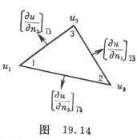
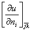
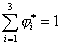
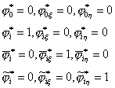

三、&nbsp; 三、&nbsp;&nbsp;&nbsp;&nbsp;&nbsp;&nbsp;&nbsp; 三边形单元的高次插值

局部坐标系取面积坐标,并令()=(),型函数的定义与构成只在局部坐标系中进行。

[二次插值]&nbsp; 二元()二次多项式或三元()二次齐次式共六项.因此需要六个节点参数值才能做到完全的二次插值.除了在三角形的顶点给函数值外,可以在三个边中点给定其法向导数值,这里表示在边=0上的外法向(图19.14).

这是最简单的拟协调板元,在六个节点各取一参数值,其型函数在局部坐标系中可定义如下:

设有六个函数与满足条件:

(i)&nbsp;&nbsp;&nbsp;&nbsp;&nbsp;&nbsp;&nbsp;
(i)&nbsp; &nbsp;&nbsp;在顶点<i>i</i>上=1, =0,(<i>i</i>=1,2,3)

在边=0的中点上

(ii)&nbsp;&nbsp;&nbsp;&nbsp;&nbsp;
(ii)&nbsp; 在其余有关节点上, ,的外法向导数都等于零.

(iii)&nbsp;&nbsp;&nbsp;&nbsp;
(iii)&nbsp; 

现在先来求在各边外法向导数的表达式.由于取()=(),而

式中表示边=0的线段长,即二顶点<i>j</i>,<i>k</i>的距离

从§2三边形单元的逆变换矩阵可得在各边的外法向导数值

&nbsp;&nbsp; 

式中<i>A</i>为三角形面积.例如,在=0边上

同理

其中表示到底边的高度.结果可统一写成

有了(23)就不难导出这几个型函数.例如,对由条件(i),(ii)可写成

式中是待定系数.令,再由于在三边的中点都等于零,可得

从而可联立解出

利用面积坐标的循环性可得.对于同样很容易得出其表达式,结果型函数及插值函数可统一写成

&nbsp;&nbsp;
&nbsp;&nbsp;&nbsp;&nbsp;&nbsp;&nbsp;&nbsp;&nbsp;&nbsp; &nbsp;&nbsp;&nbsp;(<i>i</i>=1,2,3)

显然,这种插值函数的导数沿单元的公共边界的连续性是无法保证的,但由于它能通过所谓分片检验的收敛准则<a href="#None"
name="_ftnref1" title="">*</a>,因而可以作为非协调板元的位移(挠度)模式.

注意,由于这些节点参数值的定义与坐标系无关,因此上述的型函数在局部的面积坐标和整体的直角坐标系中是一致的,即&nbsp;&nbsp;
(<i>i</i>=1,2,3).

[三次插值]&nbsp; 三次的二元()多项式或三元()的齐次式共十项,因此需要十个节点参数值,才能做到完全的三次插值,对每个顶点<i>i</i>(<i>i</i>=1,2,3),取节点参数值为,共九个,其余一个或取在形心<i>O</i>的函数值,或改为一个限制条件.对后一情况,可采用同九节点等参数单元一样的限制(§3),即要求对于三元二次齐次多项式是完全的,对于()的齐次式

这条件可表示为系数的线性方程

<pre style='text-align:right' align=right>&nbsp;&nbsp;&nbsp;&nbsp;&nbsp;&nbsp; &nbsp;&nbsp;&nbsp;&nbsp;&nbsp;&nbsp;&nbsp;&nbsp;&nbsp;&nbsp;&nbsp;&nbsp;&nbsp;&nbsp;&nbsp;&nbsp; &nbsp;&nbsp;&nbsp;&nbsp;&nbsp;&nbsp;&nbsp;&nbsp;&nbsp;&nbsp;&nbsp;&nbsp;&nbsp;&nbsp; &nbsp;&nbsp;&nbsp;&nbsp;(24)</pre>

对十节点参数值的情况,可定义型函数(<i>i</i>=1,2,3)如下:

&nbsp;&nbsp;&nbsp;
(i)&nbsp; 在形心<i>O</i>上&nbsp;&nbsp;&nbsp; &nbsp;&nbsp;&nbsp;&nbsp;&nbsp;&nbsp;&nbsp;&nbsp;&nbsp;&nbsp;&nbsp;(<i>i</i>=1,2,3)

&nbsp;&nbsp;&nbsp;
(ii)&nbsp; 在节点<i>i</i>上

<pre style='margin-left:36.0pt;text-indent:-18.0pt'>&nbsp;&nbsp;&nbsp;&nbsp;&nbsp;&nbsp;&nbsp;&nbsp;&nbsp;&nbsp;&nbsp;&nbsp;&nbsp;&nbsp;&nbsp;&nbsp;&nbsp;&nbsp; &nbsp;&nbsp;&nbsp;&nbsp;&nbsp;&nbsp;&nbsp;&nbsp;&nbsp;&nbsp;&nbsp;&nbsp;&nbsp;&nbsp;&nbsp;&nbsp; &nbsp;&nbsp;&nbsp;&nbsp;&nbsp;&nbsp;&nbsp;&nbsp;&nbsp;&nbsp;&nbsp;&nbsp;&nbsp;&nbsp;&nbsp;&nbsp;&nbsp;&nbsp;&nbsp;&nbsp;&nbsp;&nbsp;&nbsp;&nbsp;&nbsp;&nbsp;&nbsp;</pre>

&nbsp;&nbsp;&nbsp;
(iii)&nbsp; 在其余节点<i>j</i>(≠<i>i</i>)上,
及其一阶偏导数都等于零.

&nbsp;&nbsp;&nbsp;
(iv)&nbsp; 

&nbsp;&nbsp;&nbsp;
利用待定系数法可得局部坐标的型函数

<pre>&nbsp;&nbsp;&nbsp;&nbsp;&nbsp;&nbsp;&nbsp;&nbsp;&nbsp;&nbsp;&nbsp;&nbsp;&nbsp;&nbsp;&nbsp;&nbsp;&nbsp;&nbsp;&nbsp;&nbsp;&nbsp;&nbsp; </pre>

&nbsp;&nbsp;&nbsp; 

<i>u</i>的插值多项式可写成

转到直角坐标系,由于节点参数值不变,再按(21)式(二维情况)可得其型函数

<pre>&nbsp;&nbsp;&nbsp;&nbsp;&nbsp;&nbsp;&nbsp;&nbsp;&nbsp;&nbsp;&nbsp;&nbsp;&nbsp;&nbsp;&nbsp;&nbsp;&nbsp;&nbsp;&nbsp;&nbsp;&nbsp;&nbsp;&nbsp;&nbsp;&nbsp;&nbsp;&nbsp;&nbsp;&nbsp;&nbsp;&nbsp;&nbsp;&nbsp;&nbsp; </pre>

(<i>i</i>=1,2,3)

对九节点参数值加限制的情况,把形心节点与去掉,型函数定义可照搬.至于其构成则可仿照九节点等参数单元那样办法,对上述每个型函数补加一项,再要求满足限制条件(24),从而定出<i>a</i> .结果,可得出九个型函数

&nbsp;&nbsp;&nbsp;&nbsp;&nbsp;&nbsp;&nbsp;

它们与直角坐标的型函数之间的关系以及插值多项式的表达式同前一情况一样,只要去掉就行了.

注意,这两种单元都不是协调的,虽然它们适用于平面弹性问题,但要作为板元还需要满足分片检验收敛的准则.因此,对九节点的三边形单元还要加上所谓平行三角剖分(即区域内各单元的三边都平行于三个固定的方向)的限制.才能作为板元.当然这种限制还可以放松到只要在<i>Ω的</i>各子区域作平行三角剖分就行了.

[五次插值]&nbsp; 完全的二元五次多项式或三元五次齐次式共有个系数,因此需要对单元给出21个插值条件.首先在每个顶点给定直到二阶导数的节点参数值:

&nbsp;&nbsp;&nbsp;&nbsp;&nbsp;&nbsp;&nbsp;
(<i>i</i>=1,2,3)

共18个,其余三个条件可分别在三边上给定,使得插值函数的导数在单元之间保持连续.在边界上插值多项式的外法向导数一般是四次多项式,应由五个独立的条件来唯一确定,而节点参数值对它仅提供与在两端的数值,即只有四个独立的条件.为了在单元之间保持连续性,可对各边的加以限制.一般限制的方式有二种:

(i)&nbsp;&nbsp;&nbsp;&nbsp;&nbsp;&nbsp;&nbsp;
(i)&nbsp; &nbsp;&nbsp;要求在边界为三次多项式,即其四次项的系数等于零.

(ii)&nbsp;&nbsp;&nbsp;&nbsp;&nbsp;
(ii)&nbsp; 在边界中点的值为一 节点参数值(图19.16).

这样就在三边上得出三个方程,连同原18个方程就可以唯一确定插值多项式.下面介绍在面积坐标系中的广义节点参数法.

设()的五次齐次项排列如下:

<pre>&nbsp;&nbsp;&nbsp;&nbsp;&nbsp;&nbsp;&nbsp;&nbsp;&nbsp;&nbsp;&nbsp;&nbsp;&nbsp;&nbsp;&nbsp;&nbsp;&nbsp;&nbsp;&nbsp;&nbsp;&nbsp;&nbsp;&nbsp;&nbsp;&nbsp;&nbsp;&nbsp;&nbsp;&nbsp;&nbsp;&nbsp; </pre>

相应的系数为

<pre>&nbsp;&nbsp;&nbsp;&nbsp;&nbsp;&nbsp;&nbsp;&nbsp;&nbsp;&nbsp;&nbsp;&nbsp;&nbsp;&nbsp;&nbsp;&nbsp;&nbsp;&nbsp;&nbsp;&nbsp;&nbsp;&nbsp;&nbsp;&nbsp;&nbsp;&nbsp;&nbsp;&nbsp;&nbsp;&nbsp;&nbsp; </pre>

而插值多项式为

<pre>&nbsp;&nbsp;&nbsp;&nbsp;&nbsp;&nbsp;&nbsp;&nbsp;&nbsp;&nbsp;&nbsp;&nbsp;&nbsp;&nbsp;&nbsp;&nbsp;&nbsp;&nbsp;&nbsp;&nbsp;&nbsp;&nbsp;&nbsp;&nbsp;&nbsp;&nbsp;&nbsp;&nbsp;&nbsp;&nbsp;&nbsp; </pre>

利用公式(23)对求边的外法向导数,可得

<pre>&nbsp;&nbsp;&nbsp;&nbsp;&nbsp;&nbsp;&nbsp;&nbsp;&nbsp;&nbsp;&nbsp;&nbsp;&nbsp;&nbsp;&nbsp;&nbsp;&nbsp;&nbsp;&nbsp;&nbsp;&nbsp;&nbsp; </pre>

依方式(i),以代入上式并要项的系数为零,则得

式中

考虑其余二边=0,=0的限制,同理可得另二方程,经过简化,三个方程可写成如下形式

<pre>&nbsp;&nbsp;&nbsp;&nbsp;&nbsp;&nbsp;&nbsp;&nbsp;&nbsp;&nbsp;&nbsp;&nbsp;&nbsp;&nbsp;&nbsp;&nbsp;&nbsp;&nbsp;&nbsp;&nbsp;&nbsp;&nbsp;&nbsp; </pre>

式中 

<pre>&nbsp;&nbsp;&nbsp;&nbsp;&nbsp;&nbsp;&nbsp;&nbsp;&nbsp;&nbsp;&nbsp;&nbsp;&nbsp;&nbsp;&nbsp;&nbsp;&nbsp;&nbsp;&nbsp;&nbsp;&nbsp;&nbsp;&nbsp;&nbsp; </pre>

对于方式(ii),则可令.代入上述的表达式可得它在中点的值;在其他二边界中点的值可同样得到.结果三个中点节点的参数值与系数之间的关系可写成

&nbsp; 

按(16),(17)的记号不难列出相应的3×21矩阵<i>Q</i>,而与18节点参数值相应的18×21矩阵则可写成

式中为6×6矩阵:

&nbsp;&nbsp;&nbsp;

由于其逆矩阵

&nbsp;&nbsp;&nbsp;

的后三行对任一方式都容易得到:先解出再代入后三式就可解出.于是得到完全五次多项式系数与等的线性关系:

左端就是广义节点参数,但对方式(ii)右端的{<i>b</i>}还不是节点参数值,它们要改为在三边中点的值.从(25)可知对<i>G</i>后三列还得分别乘上因子

&nbsp;&nbsp;&nbsp;
注意,这时两种坐标系的节点参数值的变换已不是(20),而要改为

<pre>&nbsp;&nbsp;&nbsp;&nbsp;&nbsp;&nbsp;&nbsp;&nbsp;&nbsp;&nbsp;&nbsp;&nbsp;&nbsp;&nbsp;&nbsp;&nbsp;&nbsp;&nbsp;&nbsp;&nbsp;&nbsp;&nbsp;&nbsp;&nbsp;&nbsp;&nbsp; </pre>

中点的外法向导数与坐标系无关.

 

 

<a href="#None" name="_ftn1" title="">*</a> 如果在任何单元片（由若干相邻单元所组成）上，用某种插值函数进行有限元解法能得出常“应变”状态的解，则称这种插值函数能通过分片检验，而收敛性得到保证。对薄板弯曲问题，如果在任一单元片的边界上给定对应于完全二次多项式的边界条件，而用某种插值函数求解的结果，得出挠度，则称它能通过分片检验。 
 
 

